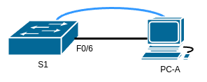

# Домашнее задание №1 «Базовая настройка коммутатора»

## Топология



## Таблица адресации

| Устройство | Интерфейс | IP-адрес / префикс |
| ---------- | --------- | ------------------ |
| S1         | VLAN1     | 192.168.1.2/24     |
| PC-A       | NIC       | 192.168.1.10/24    |

## Задачи

* Часть 1. Проверить конфигурацию коммутатора по умолчанию.
* Часть 2. Создать сеть и настроить основные параметры устройства.
  * Настроить базовые параметры коммутатора.
  * Настроить IP-адрес для ПК.
* Часть 3. Проверить сетевые подключения.
  * Отобразить конфигурацию устройства.
  * Протестировать сквозное соединение, отправив эхо-запрос.
  * Протестировать возможность удалённого управления с помощью Telnet.

## Общие сведения/сценарий

В ходе данной лабораторной работы необходимо построить простую топологию,
используя Ethernet-кабель локальной сети, и получить доступ к коммутатору Cisco,
через консольное подключение и методы удалённого доступа. Перед настройкой
базовых параметров коммутатора нужно проверить настройки коммутатора по
умолчанию. В число таких основных параметров коммутации входят:

* имя устройства;
* описание интерфейса;
* локальные пароли;
* объявление дня (MOTD);
* IP-адрес;
* статический MAC-адрес.

Необходимо также показать использование IP-адреса управления для удалённого
управления коммутатором. Топология включает один коммутатор и один узел с
использованием только портов Ethernet и консольных портов.

## Часть 1. Создание сети и проверка настроек коммутатора по умолчанию

Настроим топологию сети и проверим настройку коммутатора по умолчанию.

### Шаг 1. Создание сети

Для моделирования сети будем использовать ПО Cisco Packet Tracer 8.1.1. Создадим
новую конфигурацию, используя следующие ресурсы:

* 1 коммутатор (Cisco 2960 с ПО Cisco IOS версии 15.2(2) с образом lanbasek9 или
  аналогичная модель);
* 1 ПК (под управлением Windows с программой эмуляции терминала, например, Tera Term);
* 1 консольный кабель для настройки устройства на базе Cisco IOS через консольный
  порт;
* 1 кабель Ethernet, как показано в топологии.

#### a. Соединение устройств

Соединим устройства консольным кабелем согласно топологии. Кабель Ethernet
пока подключать не будем.

#### b. Консольное подключение к коммутатору

Установим консольное подключение к коммутатору с компьютера PC-A с помощью
программы эмуляции терминала.

**Вопрос:** Почему нужно использовать консольное подключение для первоначальной
настройки коммутатора?

**Ответ:** потому что "свежий" коммутатор не содержит никаких настроек, в том
числе сетевых. Также для того, чтобы задать пароли для защиты коммутатора.

**Вопрос:** Почему нельзя подключиться к коммутатору через Telnet или SSH?

**Ответ:** потому что коммутатору ещё не назначен IP-адрес.

### Шаг 2. Проверка настроек коммутатора по умолчанию

На данном этапе проверим такие параметры коммутатора по умолчанию, как текущие
настройки, данные IOS, свойства интерфейса, сведения о VLAN и флеш-память.
Все команды IOS коммутатора будем выполнять из привилегированного режима.
Доступ к нему ограничим с помощью пароля, чтобы предотвратить
неавторизованное использование устройства.
К привилегированному набору команд относятся команды пользовательского режима,
а также команда **configure**, при помощи которой выполняется доступ к остальным
командным режимам. Для входы в привилегированный режим EXEC будем использовать команду
**enable**.

#### a. Проверка файла конфигурации

Откроем консольное подключение к коммутатору и удостоверимся, что файл конфигурации
пустой (настроенных паролей или IP-адресов в конфигурации быть не должно).
с помощью команды **show running-config** привилегированного режима EXEC.
Если конфигурационный файл был предварительно сохранен, его нужно удалить и
перезагрузить коммутатор.

<details>
<summary>Вывод текущего файла настроек</summary>

```text
Switch>enable
Switch#show running-config
Building configuration...

Current configuration : 1080 bytes
!
version 15.0
no service timestamps log datetime msec
no service timestamps debug datetime msec
no service password-encryption
!
hostname Switch
!
!
!
!
!
!
spanning-tree mode pvst
spanning-tree extend system-id
!
interface FastEthernet0/1
!
interface FastEthernet0/2
!
interface FastEthernet0/3
!
interface FastEthernet0/4
!
interface FastEthernet0/5
!
interface FastEthernet0/6
!
interface FastEthernet0/7
!
interface FastEthernet0/8
!
interface FastEthernet0/9
!
interface FastEthernet0/10
!
interface FastEthernet0/11
!
interface FastEthernet0/12
!
interface FastEthernet0/13
!
interface FastEthernet0/14
!
interface FastEthernet0/15
!
interface FastEthernet0/16
!
interface FastEthernet0/17
!
interface FastEthernet0/18
!
interface FastEthernet0/19
!
interface FastEthernet0/20
!
interface FastEthernet0/21
!
interface FastEthernet0/22
!
interface FastEthernet0/23
!
interface FastEthernet0/24
!
interface GigabitEthernet0/1
!
interface GigabitEthernet0/2
!
interface Vlan1
 no ip address
 shutdown
!
!
!
!
line con 0
!
line vty 0 4
 login
line vty 5 15
 login
!
!
!
!
end


Switch#
```

</details>

#### b. Текущий файл running configuration

| Вопрос                                                            | Ответ |
| ----------------------------------------------------------------- | ----- |
| Сколько интерфейсов FastEthernet имеется на коммутаторе 2960?     | 24    |
| Сколько интерфейсов Gigabit Ethernet имеется на коммутаторе 2960? | 2     |
| Каков диапазон значений, отображаемых в vty-линиях?               | 0-15  |

#### c. Файл загрузочной конфигурации

файл загрузочной конфигурации (startup configuration), содержится в энергонезависимом
ОЗУ (NVRAM). Для вывода воспользуемся командой **show startup-config**.

```text
Switch#show startup-config
startup-config is not present
Switch#
```

**Вопрос:** почему появляется это сообщение?

**Ответ:** потому что по умолчанию в коммутаторе отсутствует файл загрузочной
конфигурации. Для сохранения текущей конфигурации в памяти NVRAM можно
воспользоваться командой привилегированного режима EXEC **copy running-config
startup config** или её устаревшим аналогом **write memory**.

#### d. Характеристики SVI для VLAN 1

Состояние виртуального интерфейса VLAN 1 SVI можно посмотреть в файле конфигурации,
командой **show interfaces vlan 1**, а также при
наведении курсора мыши на коммутатор в CPT.

Фрагмент текущей конфигурации для VLAN 1:

```text
interface Vlan1
 no ip address
 shutdown
```

<details>
<summary>show interfaces vlan 1</summary>

```text
Switch#show interfaces vlan 1
Vlan1 is administratively down, line protocol is down
  Hardware is CPU Interface, address is 0001.976d.a50b (bia 0001.976d.a50b)
  MTU 1500 bytes, BW 100000 Kbit, DLY 1000000 usec,
     reliability 255/255, txload 1/255, rxload 1/255
  Encapsulation ARPA, loopback not set
  ARP type: ARPA, ARP Timeout 04:00:00
  Last input 21:40:21, output never, output hang never
  Last clearing of "show interface" counters never
  Input queue: 0/75/0/0 (size/max/drops/flushes); Total output drops: 0
  Queueing strategy: fifo
  Output queue: 0/40 (size/max)
  5 minute input rate 0 bits/sec, 0 packets/sec
  5 minute output rate 0 bits/sec, 0 packets/sec
     1682 packets input, 530955 bytes, 0 no buffer
     Received 0 broadcasts (0 IP multicast)
     0 runts, 0 giants, 0 throttles
     0 input errors, 0 CRC, 0 frame, 0 overrun, 0 ignored
     563859 packets output, 0 bytes, 0 underruns
     0 output errors, 23 interface resets
     0 output buffer failures, 0 output buffers swapped out
```

</details>

| Вопрос                                                          | Ответ          |
| --------------------------------------------------------------- | -------------- |
| Назначен ли IP-адрес сети VLAN 1?                               | нет            |
| Какой MAC-адрес имеет SVI? Возможны различные варианты ответов. | 0001.976d.a50b |
| Данный интерфейс включен?                                       | нет            |

#### e. IP-свойства интерфейса SVI сети VLAN 1

IP-свойства SVI интерфейса VLAN 1 можно вывести командой
**show ip interface Vlan 1**:

```text
Switch#show ip interface Vlan 1
Vlan1 is administratively down, line protocol is down
  Internet protocol processing disabled
```

**Вопрос:** какие выходные данные вы видите?

**Ответ:** состояние интерфейса (поднят/выключен), подключён ли кабель,
назначен ли IP-адрес.

#### f. Подключение кабеля Ethernet

Подсоединим кабель Ethernet компьютера PC-A к порту 6 на коммутаторе. Дождёмся
согласования параметров скорости и дуплекса между коммутатором и ПК.

**Вопрос:** какие выходные данные вы видите?

**Ответ:** появились сообщения о том, что включился сетевой интерфейс и поднялась
связь.

```text
Switch#
%LINK-5-CHANGED: Interface FastEthernet0/6, changed state to up

%LINEPROTO-5-UPDOWN: Line protocol on Interface FastEthernet0/6, changed state to up
```

Изучим IP-свойства интерфейса SVI сети VLAN 1:

```text
Switch#show ip interface Vlan 1
Vlan1 is administratively down, line protocol is down
  Internet protocol processing disabled
```

VLAN 1 по-прежнему выключен, хотя сам FastEthernet 0/6 поднят:

<details>
<summary>show interfaces FastEthernet 0/6</summary>

```text
Switch#show interfaces FastEthernet 0/6
FastEthernet0/6 is up, line protocol is up (connected)
  Hardware is Lance, address is 0060.2fb7.a206 (bia 0060.2fb7.a206)
 BW 100000 Kbit, DLY 1000 usec,
     reliability 255/255, txload 1/255, rxload 1/255
  Encapsulation ARPA, loopback not set
  Keepalive set (10 sec)
  Full-duplex, 100Mb/s
  input flow-control is off, output flow-control is off
  ARP type: ARPA, ARP Timeout 04:00:00
  Last input 00:00:08, output 00:00:05, output hang never
  Last clearing of "show interface" counters never
  Input queue: 0/75/0/0 (size/max/drops/flushes); Total output drops: 0
  Queueing strategy: fifo
  Output queue :0/40 (size/max)
  5 minute input rate 0 bits/sec, 0 packets/sec
  5 minute output rate 0 bits/sec, 0 packets/sec
     956 packets input, 193351 bytes, 0 no buffer
     Received 956 broadcasts, 0 runts, 0 giants, 0 throttles
     0 input errors, 0 CRC, 0 frame, 0 overrun, 0 ignored, 0 abort
     0 watchdog, 0 multicast, 0 pause input
     0 input packets with dribble condition detected
     2357 packets output, 263570 bytes, 0 underruns
     0 output errors, 0 collisions, 10 interface resets
     0 babbles, 0 late collision, 0 deferred
     0 lost carrier, 0 no carrier
     0 output buffer failures, 0 output buffers swapped out
```

</details>

#### g. Сведения о версии ОС Cisco IOS на коммутаторе

Посмотреть сведения об операционной системе Cisco IOS и о самом коммутаторе
можно командой **show version**:

<details>
<summary>show version</summary>

```text
Switch#show version 
Cisco IOS Software, C2960 Software (C2960-LANBASEK9-M), Version 15.0(2)SE4, RELEASE SOFTWARE (fc1)
Technical Support: http://www.cisco.com/techsupport
Copyright (c) 1986-2013 by Cisco Systems, Inc.
Compiled Wed 26-Jun-13 02:49 by mnguyen

ROM: Bootstrap program is C2960 boot loader
BOOTLDR: C2960 Boot Loader (C2960-HBOOT-M) Version 12.2(25r)FX, RELEASE SOFTWARE (fc4)

Switch uptime is 39 minutes
System returned to ROM by power-on
System image file is "flash:c2960-lanbasek9-mz.150-2.SE4.bin"


This product contains cryptographic features and is subject to United
States and local country laws governing import, export, transfer and
use. Delivery of Cisco cryptographic products does not imply
third-party authority to import, export, distribute or use encryption.
Importers, exporters, distributors and users are responsible for
compliance with U.S. and local country laws. By using this product you
agree to comply with applicable laws and regulations. If you are unable
to comply with U.S. and local laws, return this product immediately.

A summary of U.S. laws governing Cisco cryptographic products may be found at:
http://www.cisco.com/wwl/export/crypto/tool/stqrg.html

If you require further assistance please contact us by sending email to
export@cisco.com.

cisco WS-C2960-24TT-L (PowerPC405) processor (revision B0) with 65536K bytes of memory.
Processor board ID FOC1010X104
Last reset from power-on
1 Virtual Ethernet interface
24 FastEthernet interfaces
2 Gigabit Ethernet interfaces
The password-recovery mechanism is enabled.

64K bytes of flash-simulated non-volatile configuration memory.
Base ethernet MAC Address       : 00:01:97:6D:A5:0B
Motherboard assembly number     : 73-10390-03
Power supply part number        : 341-0097-02
Motherboard serial number       : FOC10093R12
Power supply serial number      : AZS1007032H
Model revision number           : B0
Motherboard revision number     : B0
Model number                    : WS-C2960-24TT-L
System serial number            : FOC1010X104
Top Assembly Part Number        : 800-27221-02
Top Assembly Revision Number    : A0
Version ID                      : V02
CLEI Code Number                : COM3L00BRA
Hardware Board Revision Number  : 0x01


Switch Ports Model              SW Version            SW Image
------ ----- -----              ----------            ----------
*    1 26    WS-C2960-24TT-L    15.0(2)SE4            C2960-LANBASEK9-M


Configuration register is 0xF
```

</details>

| Вопрос                                                         | Ответ |
| -------------------------------------------------------------- | ----- |
| Под управлением какой версии ОС Cisco IOS работает коммутатор? | 15.0(2)SE4 |
| Как называется файл образа системы? | c2960-lanbasek9-mz.150-2.SE4.bin |

#### h. Свойства по умолчанию интерфейса FastEthernet к компьютеру PC-A

Для просмотра свойства по умолчанию интерфейса, к которому подключён компьютер
PC-A, воспользуемся командой **show interface f0/6**:

<details>
<summary>show interface f0/6</summary>

```text
Switch#show interface f0/6
FastEthernet0/6 is up, line protocol is up (connected)
  Hardware is Lance, address is 0060.2fb7.a206 (bia 0060.2fb7.a206)
 BW 100000 Kbit, DLY 1000 usec,
     reliability 255/255, txload 1/255, rxload 1/255
  Encapsulation ARPA, loopback not set
  Keepalive set (10 sec)
  Full-duplex, 100Mb/s
  input flow-control is off, output flow-control is off
  ARP type: ARPA, ARP Timeout 04:00:00
  Last input 00:00:08, output 00:00:05, output hang never
  Last clearing of "show interface" counters never
  Input queue: 0/75/0/0 (size/max/drops/flushes); Total output drops: 0
  Queueing strategy: fifo
  Output queue :0/40 (size/max)
  5 minute input rate 0 bits/sec, 0 packets/sec
  5 minute output rate 0 bits/sec, 0 packets/sec
     956 packets input, 193351 bytes, 0 no buffer
     Received 956 broadcasts, 0 runts, 0 giants, 0 throttles
     0 input errors, 0 CRC, 0 frame, 0 overrun, 0 ignored, 0 abort
     0 watchdog, 0 multicast, 0 pause input
     0 input packets with dribble condition detected
     2357 packets output, 263570 bytes, 0 underruns
     0 output errors, 0 collisions, 10 interface resets
     0 babbles, 0 late collision, 0 deferred
     0 lost carrier, 0 no carrier
     0 output buffer failures, 0 output buffers swapped out
```

</details>

**Вопрос:** интерфейс включен или выключен?

**Ответ:** включен.

**Вопрос:** Что нужно сделать, чтобы включить интерфейс?

**Ответ:** подсоединить к нему сетевой кабель.

**Вопрос:** Какой MAC-адрес у интерфейса?

**Ответ:** 0060.2fb7.a206

**Вопрос:** Какие настройки скорости и дуплекса заданы в интерфейсе?

**Ответ:** полный дуплекс, 100 Мбит/с

#### i. Сведения о флеш-памяти

Для просмотра информации о флеш0памяти коммутаторы выполним команды
**show flash** и **dir flash**:

```text
Switch#show flash
Directory of flash:/

    1  -rw-     4670455          <no date>  2960-lanbasek9-mz.150-2.SE4.bin

64016384 bytes total (59345929 bytes free)
```

```text
Switch#dir flash
Directory of flash:/

    1  -rw-     4670455          <no date>  2960-lanbasek9-mz.150-2.SE4.bin

64016384 bytes total (59345929 bytes free)
```

Вывод команд одинаков.

**Вопрос:** какое имя присвоено образу Cisco IOS?

**Ответ:** 2960-lanbasek9-mz.150-2.SE4.bin

## Часть 2. Настройка базовых параметров сетевых устройств

Во второй части настроим основные параметры коммутатора и компьютера.

### Шаг 1. Настройка базовых параметров коммутатора

#### a. Установка базовых параметров

Отключим трансляцию доменных имён в IP-адреса (чтобы ошибочно введённые команды
не висели долго), присвоим имя коммутатору, зададим пароль и сообщение дня
(баннер). Для этого в режиме глобальной конфигурации выполним следующие команды:

```text
no ip domain-lookup
hostname S1
service password-encryption
enable secret class
banner motd #
Unauthorized access is strictly prohibited. #
```

Вывод команд:

```text
Switch>enable
Switch#configure terminal
Enter configuration commands, one per line.  End with CNTL/Z.
Switch(config)#no ip domain-lookup
Switch(config)#hostname S1
S1(config)#service password-encryption
S1(config)#enable secret class
S1(config)#banner motd #
Enter TEXT message.  End with the character '#'.
Unauthorized access is strictly prohibited. #

S1(config)#
```

#### b. Установка IP-адреса интерфейса SVI на коммутаторе

Для удалённого управления коммутатором необходимо назначить IP-адрес интерфейсу
SVI. Согласно конфигурации по умолчанию коммутатором можно управлять через VLAN
1.

Чтобы настроить SVI на коммутаторе, выполним следующие действия:

* введём команду **interface vlan 1** в режиме глобальной конфигурации;
* назначим адрес IPv4 с помощью команды конфигурации интерфейса
**ip address IP-адрес, маска подсети**;
* включим виртуальный интерфейс с помощью команды конфигурации интерфейса
  **no shutdown**.

Вывод команд:

```text
S1(config)#interface vlan 1
S1(config-if)#ip address 192.168.1.2 255.255.255.0
S1(config-if)#no shutdown

S1(config-if)#
%LINK-5-CHANGED: Interface Vlan1, changed state to up

%LINEPROTO-5-UPDOWN: Line protocol on Interface Vlan1, changed state to up

S1(config-if)#
```

#### c. Ограничение доступа через консольный порт

Конфигурация по умолчанию разрешает все консольные подключения без пароля.
Ограничим доступ через порт консоли с помощью пароля. Используем пароль **cisco**.
Также, чтобы консольные сообщения не прерывали выполнение команд, установим
параметр **logging synchronous**.

```text
S1(config)# line con 0
S1(config-line)# logging synchronous
```

Вывод команд:

```text
S1(config)#line con 0
S1(config-line)#password cisco
S1(config-line)#login
S1(config-line)#logging synchronous
S1(config-line)#end
S1#
%SYS-5-CONFIG_I: Configured from console by console

S1#
```

#### d. Настройка каналов виртуального соединения

Чтобы коммутатор разрешил доступ через Telnet необходимо задать пароль для каналов
виртуального соединения (виртуальных терминалов VTY). Настроим аналогично
консольному порту:

```text
S1#configure terminal
Enter configuration commands, one per line.  End with CNTL/Z.
S1(config)#line vty 0 15
S1(config-line)#password cisco
S1(config-line)#login
S1(config-line)#end
S1#
%SYS-5-CONFIG_I: Configured from console by console

S1#
```

**Вопрос:** для чего нужна команда **login**?

**Ответ:** для того, чтобы разрешить вход с паролем по настраиваемому порту/терминалу.

### Шаг 2. Настройка IP-адреса на компьютере PC-A

Назначим компьютеру IP-адрес и маску подсети в соответствии с таблицей адресации.
При работе с физическим компьютером выполним следующие действия:

* перейдём в Панель управления. (Control Panel);
* в представлении «Категория» выберем «Просмотр состояния сети и задач»;
* щёлкнем Изменение параметров адаптера на левой панели;
* щёлкнем правой кнопкой мыши интерфейс Ethernet и выберем «Свойства»;
* выберем Протокол Интернета версии 4 (TCP/IPv4) > Свойства;
* выберем Использовать следующий IP-адрес, введём IP-адрес и маску подсети,
  нажмём ОК.

Для Cisco Packet Tracer действия по настройке будут несколько иные:

* щёлкнем на компьютер PC-A;
* выберем вкладку Desktop;
* щёлкнем IP Configuration;
* в полях ввода IPv4 Address и Subnet Mask зададим IP-адрес и сетевую маску.


## Часть 3. Проверка сетевых подключений

В третьей части лабораторной работы проверим и задокументируем конфигурацию
коммутатора, протестируем сквозное соединение между компьютером PC-A и
коммутатором S1, а также проверим возможность удаленного управления коммутатором.

### Шаг 1. Отображение конфигурации коммутатора

Используем консольное подключение на компьютере PC-A для отображения и проверки
конфигурации коммутатора. Команда **show run** позволяет постранично отобразить
всю текущую конфигурацию. Для пролистывания используем клавишу пробела.

#### a. Текущий файл конфигурации

<details>
<summary>Вывод команды <strong>show run</strong></summary>

```text
Unauthorized access is strictly prohibited. 

User Access Verification

Password: 

S1>enable
Password: 
S1#show run
Building configuration...

Current configuration : 1318 bytes
!
version 15.0
no service timestamps log datetime msec
no service timestamps debug datetime msec
service password-encryption
!
hostname S1
!
enable secret 5 $1$mERr$9cTjUIEqNGurQiFU.ZeCi1
!
!
!
no ip domain-lookup
!
!
!
spanning-tree mode pvst
spanning-tree extend system-id
!
interface FastEthernet0/1
!
interface FastEthernet0/2
!
interface FastEthernet0/3
!
interface FastEthernet0/4
!
interface FastEthernet0/5
!
interface FastEthernet0/6
!
interface FastEthernet0/7
!
interface FastEthernet0/8
!
interface FastEthernet0/9
!
interface FastEthernet0/10
!
interface FastEthernet0/11
!
interface FastEthernet0/12
!
interface FastEthernet0/13
!
interface FastEthernet0/14
!
interface FastEthernet0/15
!
interface FastEthernet0/16
!
interface FastEthernet0/17
!
interface FastEthernet0/18
!
interface FastEthernet0/19
!
interface FastEthernet0/20
!
interface FastEthernet0/21
!
interface FastEthernet0/22
!
interface FastEthernet0/23
!
interface FastEthernet0/24
!
interface GigabitEthernet0/1
!
interface GigabitEthernet0/2
!
interface Vlan1
 ip address 192.168.1.2 255.255.255.0
!
banner motd ^C
Unauthorized access is strictly prohibited. ^C
!
!
!
line con 0
 password 7 0822455D0A16
 logging synchronous
 login
!
line vty 0 4
 password 7 0822455D0A16
 login
line vty 5 15
 password 7 0822455D0A16
 login
!
!
!
!
end


S1#
```

</details>

#### b. Параметры VLAN 1

Проверим параметры VLAN 1:

```text
S1#show interface vlan 1
Vlan1 is up, line protocol is up
  Hardware is CPU Interface, address is 0001.976d.a50b (bia 0001.976d.a50b)
  Internet address is 192.168.1.2/24
  MTU 1500 bytes, BW 100000 Kbit, DLY 1000000 usec,
     reliability 255/255, txload 1/255, rxload 1/255
  Encapsulation ARPA, loopback not set
  ARP type: ARPA, ARP Timeout 04:00:00
  Last input 21:40:21, output never, output hang never
  Last clearing of "show interface" counters never
  Input queue: 0/75/0/0 (size/max/drops/flushes); Total output drops: 0
  Queueing strategy: fifo
  Output queue: 0/40 (size/max)
  5 minute input rate 0 bits/sec, 0 packets/sec
  5 minute output rate 0 bits/sec, 0 packets/sec
     1682 packets input, 530955 bytes, 0 no buffer
     Received 0 broadcasts (0 IP multicast)
     0 runts, 0 giants, 0 throttles
     0 input errors, 0 CRC, 0 frame, 0 overrun, 0 ignored
     563859 packets output, 0 bytes, 0 underruns
     0 output errors, 23 interface resets
     0 output buffer failures, 0 output buffers swapped out
```

**Вопрос:** какова полоса пропускания этого интерфейса?

**Ответ:** 100000 Kbit/s или 100 Мбит/с

### Шаг 2. Проверка сквозного соединения

Протестируем сквозное соединение, отправив эхо-запрос.

#### a. Проверка связи PC-A - PC-A

В командной строке компьютера PC-A с помощью утилиты ping проверим связь сначала
с локальным адресом PC-A:

<samp>C:\> **ping 192.168.1.10**</samp>

```text
C:\>ping 192.168.1.10

Pinging 192.168.1.10 with 32 bytes of data:

Reply from 192.168.1.10: bytes=32 time=5ms TTL=128
Reply from 192.168.1.10: bytes=32 time<1ms TTL=128
Reply from 192.168.1.10: bytes=32 time=3ms TTL=128
Reply from 192.168.1.10: bytes=32 time=3ms TTL=128

Ping statistics for 192.168.1.10:
    Packets: Sent = 4, Received = 4, Lost = 0 (0% loss),
Approximate round trip times in milli-seconds:
    Minimum = 0ms, Maximum = 5ms, Average = 2ms

C:\>
```

#### b. Проверка связи PC-A - S1

Из командной строки компьютера PC-A отправим эхо-запрос на административный адрес
интерфейса SVI коммутатора S1.

<samp>C:\> **ping 192.168.1.2**</samp>

Поскольку компьютеру PC-A нужно преобразовать МАС-адрес коммутатора S1 с помощью
ARP, время ожидания передачи первого пакета может истечь. Если эхо-запрос не
удаётся, необходимо найти и устранить неполадки базовых настроек устройства.
Проверить как физические кабели, так и логическую адресацию.

Вывод команды **ping 192.168.1.2**:

```text
C:\>ping 192.168.1.2

Pinging 192.168.1.2 with 32 bytes of data:

Request timed out.
Reply from 192.168.1.2: bytes=32 time<1ms TTL=255
Reply from 192.168.1.2: bytes=32 time<1ms TTL=255
Reply from 192.168.1.2: bytes=32 time<1ms TTL=255

Ping statistics for 192.168.1.2:
    Packets: Sent = 4, Received = 3, Lost = 1 (25% loss),
Approximate round trip times in milli-seconds:
    Minimum = 0ms, Maximum = 0ms, Average = 0ms

C:\>
```

Видим, что действительно, из-за временных затрат на разрешение адреса по протоколу
ARP, первый эхо запрос истёк.

### Шаг 3. Проверка удалённого управления коммутатором S1

В этой лабораторной работе устройства PC-A и S1 расположены рядом. В реальной
производственной сети коммутатор может находиться в коммутационном шкафу на
последнем этаже, в то время как административный компьютер находится на первом
этаже. На данном этапе мы будем использовать Telnet для удаленного доступа к
коммутатору S1 через его административный адрес SVI.

Telnet — это не безопасный протокол, вся информация, включая пароли и команды,
отправляется через сеанс в незашифрованном виде. Сейчас мы воспользуемся им для
проверки удалённого доступа. В последующих лабораторных работах для удалённого
доступа к сетевым устройствам мы будем использовать более безопасный протокол
SSH.

Последовательность команд для проверки удалённого соединения:

* открыть Tera Term или другую программу эмуляции терминала с поддержкой Telnet;
* выбрать сервер Telnet и указать адрес управления SVI для подключения к S1.
  Пароль: **cisco**;
* после ввода пароля **cisco** мы окажемся в командной строке пользовательского
  режима. Для перехода в исполнительский режим EXEC введём команду **enable** и
  используем секретный пароль **class**;
* сохраним конфигурацию;
* чтобы завершить сеанс Telnet, введём **exit**.

Лог сеанса:

```text
C:\>telnet 192.168.1.2
Trying 192.168.1.2 ...Open
Unauthorized access is strictly prohibited. 


User Access Verification

Password: 
S1>enable
Password: 
S1#copy running-config startup-config 
Destination filename [startup-config]? 
Building configuration...
[OK]
S1#exit

[Connection to 192.168.1.2 closed by foreign host]
C:\>
```

## Вопросы для повторения

1. Зачем необходимо настраивать пароль VTY для коммутатора?
2. Что нужно сделать, чтобы пароли не отправлялись в незашифрованном виде?

**Ответы:**

1. Чтобы предотвратить несанкционированный доступ по протоколам Telnet и SSH.
2. Использовать подключение по протоколу SSH. Также полезно включить шифрование
   паролей в конфиге командой **service password encryption**.
