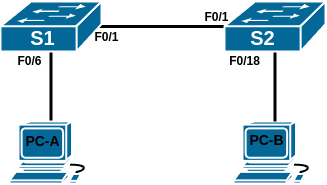
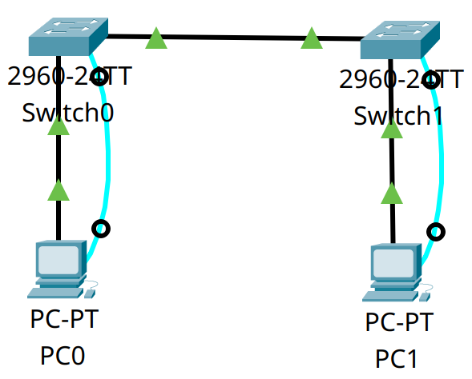
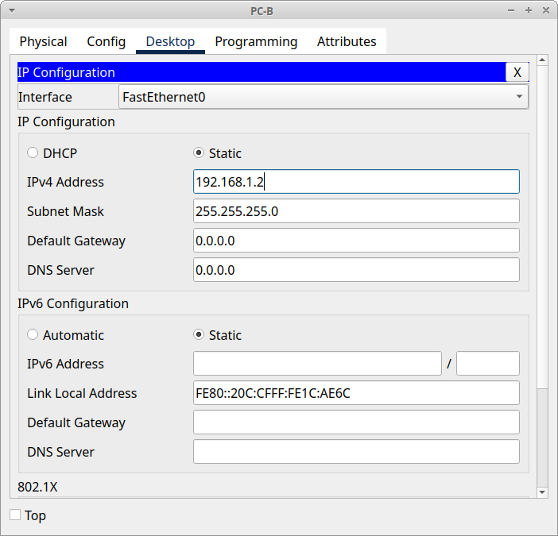
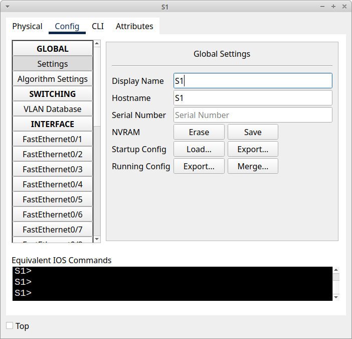

# Домашнее задание №2 «Просмотр таблицы MAC-адресов коммутатора»

## Топология



## Таблица адресации

| Устройство | Интерфейс | IP-адрес     | Маска подсети |
| ---------- | --------- | ------------ | ------------- |
| S1         | VLAN1     | 192.168.1.11 | 255.255.255.0 |
| S2         | VLAN1     | 192.168.1.12 | 255.255.255.0 |
| PC-A       | NIC       | 192.168.1.1  | 255.255.255.0 |
| PC-B       | NIC       | 192.168.1.2  | 255.255.255.0 |

## Цели

* Часть 1. Создать и настроить сеть.
* Часть 2. Изучить таблицу MAC-адресов коммутатора.

## Общие сведения/сценарий

В большинстве современных локальных сетей для соединения компьютеров между собой
и передачи данных используются коммутаторы. В сети Ethernet коммутаторы отправляют
кадры Ethernet на узловые устройства, которые идентифицируются по МАС-адресам
сетевых плат. Понимание функционала коммутатора и того, как он осуществляет
передачу данных по сети особенно важно для сетевых администраторов.

Коммутатор локальной сети на уровне 2 (канальном) предназначен для доставки
кадров Ethernet узловым устройствам, идентифицируемым по МАС-адресам сетевых плат.
Он записывает МАС-адреса узлов, отображаемые в сети, и сопоставляет их с
собственными портами. Этот процесс называется созданием таблицы МАС-адресов.
Получив кадр от ПК, коммутатор изучает МАС-адреса источника и назначения кадра.
MAC-адрес источника регистрируется и сопоставляется с портом коммутатора, от
которого он был получен. Затем по таблице MAC-адресов определяется МАС-адрес
назначения. Если MAC-адрес назначения известен, кадр пересылается через
соответствующий порт коммутатора, связанный с этим MAC-адресом. Если MAC-адрес
неизвестен, то кадр отправляется по широковещательной рассылке через все порты
коммутатора, кроме того, через который он был получен.

В ходе данной лабораторной работы необходимо построить топологию, состоящую из
двух коммутаторов, соединённых транком. Произвести настройку базовых параметров
(имена устройств, IP-адреса, пароли). Затем отправить эхо-запросы различным
устройствам и посмотреть, как два коммутатора строят свои таблицы МАС-адресов.

## Часть 1. Создание и настройка сети

Для моделирования сети будем использовать ПО Cisco Packet Tracer 8.1.1. Создадим
новую конфигурацию, используя следующие ресурсы:

* 2 коммутатора (Cisco 2960 с ПО Cisco IOS версии 15.2(2) с образом lanbasek9 или
  аналогичные модели);
* 2 ПК (под управлением Windows с программой эмуляции терминала, например, Tera Term);
* консольные кабели для настройки устройств Cisco IOS через консольные
  порты;
* кабели Ethernet, расположенные в соответствии с топологией.

**Примечание.** Интерфейсы Fast Ethernet на коммутаторах Cisco 2960 определяют
тип подключения автоматически, поэтому между коммутаторами S1 и S2 можно
использовать прямой кабель Ethernet. При использовании коммутатора Cisco другой
модели может потребоваться перекрёстный кабель Ethernet.

### Шаг 1. Создание сети

Соединим устройства согласно топологии. Дополнительно к Ethernet кабелям соединим
коммутаторы и ПК консольными кабелями (для настройки базовых параметров коммутаторов).



### Шаг 2. Настройка узлов ПК

Сменим отображаемые имена на PC-A и PC-B. Зададим сетевые адреса согласно таблице
адресации.




### Шаг 3. Инициализация коммутаторов

Для того, чтобы убедиться, что коммутаторы не содержат никаких предыдущих настроек,
выполним их инициализацию и перезагрузку.

Для удаления загрузочной конфигурации служит команда **erase startup-config**
привилегированного режима EXEC, а для перезагрузки устройства команда **reload**.

<details>
<summary>Вывод команд на первом коммутаторе:</summary>

```text
Switch>
Switch>enable
Switch#erase startup-config
Erasing the nvram filesystem will remove all configuration files! Continue? [confirm]
[OK]
Erase of nvram: complete
%SYS-7-NV_BLOCK_INIT: Initialized the geometry of nvram
Switch#
Switch#reload
Proceed with reload? [confirm]
C2960 Boot Loader (C2960-HBOOT-M) Version 12.2(25r)FX, RELEASE SOFTWARE (fc4)
Cisco WS-C2960-24TT (RC32300) processor (revision C0) with 21039K bytes of memory.
2960-24TT starting...
Base ethernet MAC Address: 0001.971E.EE32
Xmodem file system is available.
Initializing Flash...
flashfs[0]: 1 files, 0 directories
flashfs[0]: 0 orphaned files, 0 orphaned directories
flashfs[0]: Total bytes: 64016384
flashfs[0]: Bytes used: 4670455
flashfs[0]: Bytes available: 59345929
flashfs[0]: flashfs fsck took 1 seconds.
...done Initializing Flash.

Boot Sector Filesystem (bs:) installed, fsid: 3
Parameter Block Filesystem (pb:) installed, fsid: 4


Loading "flash:/2960-lanbasek9-mz.150-2.SE4.bin"...
########################################################################## [OK]
Smart Init is enabled
smart init is sizing iomem
                  TYPE      MEMORY_REQ
                TOTAL:      0x00000000
Rounded IOMEM up to: 0Mb.
Using 6 percent iomem. [0Mb/512Mb]

              Restricted Rights Legend
Use, duplication, or disclosure by the Government is
subject to restrictions as set forth in subparagraph
(c) of the Commercial Computer Software - Restricted
Rights clause at FAR sec. 52.227-19 and subparagraph
(c) (1) (ii) of the Rights in Technical Data and Computer
Software clause at DFARS sec. 252.227-7013.
           cisco Systems, Inc.
           170 West Tasman Drive
           San Jose, California 95134-1706
Cisco IOS Software, C2960 Software (C2960-LANBASEK9-M), Version 15.0(2)SE4, RELEASE SOFTWARE (fc1)
Technical Support: http://www.cisco.com/techsupport
Copyright (c) 1986-2013 by Cisco Systems, Inc.
Compiled Wed 26-Jun-13 02:49 by mnguyen
Initializing flashfs...
fsck: Disable shadow buffering due to heap fragmentation.
flashfs[2]: 2 files, 1 directories
flashfs[2]: 0 orphaned files, 0 orphaned directories
flashfs[2]: Total bytes: 32514048
flashfs[2]: Bytes used: 11952128
flashfs[2]: Bytes available: 20561920
flashfs[2]: flashfs fsck took 2 seconds.
flashfs[2]: Initialization complete....done Initializing flashfs.
Checking for Bootloader upgrade..
Boot Loader upgrade not required (Stage 2)
POST: CPU MIC register Tests : Begin
POST: CPU MIC register Tests : End, Status Passed
POST: PortASIC Memory Tests : Begin
POST: PortASIC Memory Tests : End, Status Passed
POST: CPU MIC interface Loopback Tests : Begin
POST: CPU MIC interface Loopback Tests : End, Status Passed
POST: PortASIC RingLoopback Tests : Begin
POST: PortASIC RingLoopback Tests : End, Status Passed
POST: PortASIC CAM Subsystem Tests : Begin
POST: PortASIC CAM Subsystem Tests : End, Status Passed
POST: PortASIC Port Loopback Tests : Begin
POST: PortASIC Port Loopback Tests : End, Status Passed
Waiting for Port download...Complete

This product contains cryptographic features and is subject to United
States and local country laws governing import, export, transfer and
use. Delivery of Cisco cryptographic products does not imply
third-party authority to import, export, distribute or use encryption.
Importers, exporters, distributors and users are responsible for
compliance with U.S. and local country laws. By using this product you
agree to comply with applicable laws and regulations. If you are unable
to comply with U.S. and local laws, return this product immediately.
A summary of U.S. laws governing Cisco cryptographic products may be found at:
http://www.cisco.com/wwl/export/crypto/tool/stqrg.html
If you require further assistance please contact us by sending email to
export@cisco.com.
cisco WS-C2960-24TT-L (PowerPC405) processor (revision B0) with 65536K bytes of memory.
Processor board ID FOC1010X104
Last reset from power-on
1 Virtual Ethernet interface
24 FastEthernet interfaces
2 Gigabit Ethernet interfaces
The password-recovery mechanism is enabled.
64K bytes of flash-simulated non-volatile configuration memory.
Base ethernet MAC Address       : 00:01:97:1E:EE:32
Motherboard assembly number     : 73-10390-03
Power supply part number        : 341-0097-02
Motherboard serial number       : FOC10093R12
Power supply serial number      : AZS1007032H
Model revision number           : B0
Motherboard revision number     : B0
Model number                    : WS-C2960-24TT-L
System serial number            : FOC1010X104
Top Assembly Part Number        : 800-27221-02
Top Assembly Revision Number    : A0
Version ID                      : V02
CLEI Code Number                : COM3L00BRA
Hardware Board Revision Number  : 0x01

Switch Ports Model              SW Version            SW Image
------ ----- -----              ----------            ----------
*    1 26    WS-C2960-24TT-L    15.0(2)SE4            C2960-LANBASEK9-M

Cisco IOS Software, C2960 Software (C2960-LANBASEK9-M), Version 15.0(2)SE4, RELEASE SOFTWARE (fc1)
Technical Support: http://www.cisco.com/techsupport
Copyright (c) 1986-2013 by Cisco Systems, Inc.
Compiled Wed 26-Jun-13 02:49 by mnguyen


Press RETURN to get started!


%LINK-5-CHANGED: Interface FastEthernet0/1, changed state to up

%LINEPROTO-5-UPDOWN: Line protocol on Interface FastEthernet0/1, changed state to up

%LINK-5-CHANGED: Interface FastEthernet0/6, changed state to up

%LINEPROTO-5-UPDOWN: Line protocol on Interface FastEthernet0/6, changed state to up
```

</details>

<details>
<summary>Вывод команд на втором коммутаторе:</summary>

```text
Switch>
Switch>enable
Switch#erase startup-config
Erasing the nvram filesystem will remove all configuration files! Continue? [confirm]
[OK]
Erase of nvram: complete
%SYS-7-NV_BLOCK_INIT: Initialized the geometry of nvram
Switch#
Switch#reload
Proceed with reload? [confirm]
C2960 Boot Loader (C2960-HBOOT-M) Version 12.2(25r)FX, RELEASE SOFTWARE (fc4)
Cisco WS-C2960-24TT (RC32300) processor (revision C0) with 21039K bytes of memory.
2960-24TT starting...
Base ethernet MAC Address: 0001.6431.7790
Xmodem file system is available.
Initializing Flash...
flashfs[0]: 1 files, 0 directories
flashfs[0]: 0 orphaned files, 0 orphaned directories
flashfs[0]: Total bytes: 64016384
flashfs[0]: Bytes used: 4670455
flashfs[0]: Bytes available: 59345929
flashfs[0]: flashfs fsck took 1 seconds.
...done Initializing Flash.

Boot Sector Filesystem (bs:) installed, fsid: 3
Parameter Block Filesystem (pb:) installed, fsid: 4


Loading "flash:/2960-lanbasek9-mz.150-2.SE4.bin"...
########################################################################## [OK]
Smart Init is enabled
smart init is sizing iomem
                  TYPE      MEMORY_REQ
                TOTAL:      0x00000000
Rounded IOMEM up to: 0Mb.
Using 6 percent iomem. [0Mb/512Mb]

              Restricted Rights Legend
Use, duplication, or disclosure by the Government is
subject to restrictions as set forth in subparagraph
(c) of the Commercial Computer Software - Restricted
Rights clause at FAR sec. 52.227-19 and subparagraph
(c) (1) (ii) of the Rights in Technical Data and Computer
Software clause at DFARS sec. 252.227-7013.
           cisco Systems, Inc.
           170 West Tasman Drive
           San Jose, California 95134-1706
Cisco IOS Software, C2960 Software (C2960-LANBASEK9-M), Version 15.0(2)SE4, RELEASE SOFTWARE (fc1)
Technical Support: http://www.cisco.com/techsupport
Copyright (c) 1986-2013 by Cisco Systems, Inc.
Compiled Wed 26-Jun-13 02:49 by mnguyen
Initializing flashfs...
fsck: Disable shadow buffering due to heap fragmentation.
flashfs[2]: 2 files, 1 directories
flashfs[2]: 0 orphaned files, 0 orphaned directories
flashfs[2]: Total bytes: 32514048
flashfs[2]: Bytes used: 11952128
flashfs[2]: Bytes available: 20561920
flashfs[2]: flashfs fsck took 2 seconds.
flashfs[2]: Initialization complete....done Initializing flashfs.
Checking for Bootloader upgrade..
Boot Loader upgrade not required (Stage 2)
POST: CPU MIC register Tests : Begin
POST: CPU MIC register Tests : End, Status Passed
POST: PortASIC Memory Tests : Begin
POST: PortASIC Memory Tests : End, Status Passed
POST: CPU MIC interface Loopback Tests : Begin
POST: CPU MIC interface Loopback Tests : End, Status Passed
POST: PortASIC RingLoopback Tests : Begin
POST: PortASIC RingLoopback Tests : End, Status Passed
POST: PortASIC CAM Subsystem Tests : Begin
POST: PortASIC CAM Subsystem Tests : End, Status Passed
POST: PortASIC Port Loopback Tests : Begin
POST: PortASIC Port Loopback Tests : End, Status Passed
Waiting for Port download...Complete

This product contains cryptographic features and is subject to United
States and local country laws governing import, export, transfer and
use. Delivery of Cisco cryptographic products does not imply
third-party authority to import, export, distribute or use encryption.
Importers, exporters, distributors and users are responsible for
compliance with U.S. and local country laws. By using this product you
agree to comply with applicable laws and regulations. If you are unable
to comply with U.S. and local laws, return this product immediately.
A summary of U.S. laws governing Cisco cryptographic products may be found at:
http://www.cisco.com/wwl/export/crypto/tool/stqrg.html
If you require further assistance please contact us by sending email to
export@cisco.com.
cisco WS-C2960-24TT-L (PowerPC405) processor (revision B0) with 65536K bytes of memory.
Processor board ID FOC1010X104
Last reset from power-on
1 Virtual Ethernet interface
24 FastEthernet interfaces
2 Gigabit Ethernet interfaces
The password-recovery mechanism is enabled.
64K bytes of flash-simulated non-volatile configuration memory.
Base ethernet MAC Address       : 00:01:64:31:77:90
Motherboard assembly number     : 73-10390-03
Power supply part number        : 341-0097-02
Motherboard serial number       : FOC10093R12
Power supply serial number      : AZS1007032H
Model revision number           : B0
Motherboard revision number     : B0
Model number                    : WS-C2960-24TT-L
System serial number            : FOC1010X104
Top Assembly Part Number        : 800-27221-02
Top Assembly Revision Number    : A0
Version ID                      : V02
CLEI Code Number                : COM3L00BRA
Hardware Board Revision Number  : 0x01

Switch Ports Model              SW Version            SW Image
------ ----- -----              ----------            ----------
*    1 26    WS-C2960-24TT-L    15.0(2)SE4            C2960-LANBASEK9-M

Cisco IOS Software, C2960 Software (C2960-LANBASEK9-M), Version 15.0(2)SE4, RELEASE SOFTWARE (fc1)
Technical Support: http://www.cisco.com/techsupport
Copyright (c) 1986-2013 by Cisco Systems, Inc.
Compiled Wed 26-Jun-13 02:49 by mnguyen


Press RETURN to get started!


%LINK-5-CHANGED: Interface FastEthernet0/1, changed state to up

%LINEPROTO-5-UPDOWN: Line protocol on Interface FastEthernet0/1, changed state to up

%LINK-5-CHANGED: Interface FastEthernet0/18, changed state to up

%LINEPROTO-5-UPDOWN: Line protocol on Interface FastEthernet0/18, changed state to up
```

</details>

### Шаг 4. Настройка базовых параметров коммутаторов

Выполним настройку базовых параметров каждого коммутатора.

#### a. Установка имён устройств

Зададим имена устройства в соответствии с топологией командой **hostname**.

Первый коммутатор:

```text
Switch>
Switch>enable
Switch#configure terminal
Enter configuration commands, one per line.  End with CNTL/Z.
Switch(config)#hostname S1
S1(config)#end
S1#
%SYS-5-CONFIG_I: Configured from console by console

S1#
```

Второй коммутатор:

```text
Switch>
Switch>enable
Switch#configure terminal
Enter configuration commands, one per line.  End with CNTL/Z.
Switch(config)#hostname S2
S2(config)#end
S2#
%SYS-5-CONFIG_I: Configured from console by console

S2#
```

Также для удобства зададим отображаемые имена (в топологии CPT): щёлкнем по
коммутатору, вкладка **Config**, поле **Display Name**.



Аналогичную операцию проделаем для второго коммутатора (S2).

#### b. Настройка IP-адресов

Настроим IP-адреса на коммутаторах, как указано в таблице адресации.

В конфигурации по умолчанию на коммутаторе создан один виртуальный интерфейс
(SVI), которому можно присвоить IP-адрес: VLAN 1.

Чтобы настроить SVI на коммутаторе, выполним следующие действия:

* введём команду **interface vlan 1** в режиме глобальной конфигурации;
* назначим адрес IPv4 с помощью команды конфигурации интерфейса
**ip address IP-адрес, маска подсети**;
* включим виртуальный интерфейс с помощью команды конфигурации интерфейса
  **no shutdown**.

Коммутатор S1:

```text
S1#
S1#configure terminal
Enter configuration commands, one per line.  End with CNTL/Z.
S1(config)#interface vlan 1
S1(config-if)#ip address 192.168.1.11 255.255.255.0
S1(config-if)#no shutdown

S1(config-if)#
%LINK-5-CHANGED: Interface Vlan1, changed state to up

%LINEPROTO-5-UPDOWN: Line protocol on Interface Vlan1, changed state to up

S1(config-if)#end
S1#
%SYS-5-CONFIG_I: Configured from console by console

S1#
```

Коммутатор S2:

```text
S2#
S2#configure terminal
Enter configuration commands, one per line.  End with CNTL/Z.
S2(config)#interface vlan 1
S2(config-if)#ip address 192.168.1.12 255.255.255.0
S2(config-if)#no shutdown

S2(config-if)#
%LINK-5-CHANGED: Interface Vlan1, changed state to up

%LINEPROTO-5-UPDOWN: Line protocol on Interface Vlan1, changed state to up

S2(config-if)#end
S2#
%SYS-5-CONFIG_I: Configured from console by console

S2#
```

#### с. Установка паролей консоли и VTY

Конфигурация по умолчанию разрешает все консольные подключения без пароля.
Ограничим доступ через порт консоли с помощью пароля. Используем пароль **cisco**.
Также, чтобы консольные сообщения не прерывали выполнение команд, установим
параметр **logging synchronous**. Затем для защиты подключения через SSH/Telnet
установим пароль для VTY.

Коммутатор S1:

```text
S1#
S1#configure terminal
Enter configuration commands, one per line.  End with CNTL/Z.
S1(config)#line console 0
S1(config-line)#password cisco
S1(config-line)#login
S1(config-line)#logging synchronous
S1(config-line)#exit
S1(config)#line vty 0 15
S1(config-line)#password cisco
S1(config-line)#login
S1(config-line)#logging synchronous
S1(config-line)#end
S1#
%SYS-5-CONFIG_I: Configured from console by console

S1#
```

Коммутатор S2:

```text
S2#
S2#configure terminal
Enter configuration commands, one per line.  End with CNTL/Z.
S2(config)#line console 0
S2(config-line)#password cisco
S2(config-line)#login
S2(config-line)#logging synchronous
S2(config-line)#exit
S2(config)#line vty 0 15
S2(config-line)#password cisco
S2(config-line)#login
S2(config-line)#logging synchronous
S2(config-line)#end
S2#
%SYS-5-CONFIG_I: Configured from console by console

S2#
```

#### d. Установка пароля привилегированного режима

Защитим доступ к привилегированному режиму EXEC с помощью пароля **class**.

Коммутатор S1:

```text
S1#
S1#configure terminal
Enter configuration commands, one per line.  End with CNTL/Z.
S1(config)#enable secret class
S1(config)#exit
S1#
%SYS-5-CONFIG_I: Configured from console by console

S1#
```

Коммутатор S2:

```text
S2#
S2#configure terminal
Enter configuration commands, one per line.  End with CNTL/Z.
S2(config)#enable secret class
S2(config)#exit
S2#
%SYS-5-CONFIG_I: Configured from console by console

S2#
```

#### e. MOTD и шифрование паролей

Установим баннер:

```text
S1#
S1#configure terminal
Enter configuration commands, one per line.  End with CNTL/Z.
S1(config)#banner motd # Unauthorized access is strictly prohibited. #
S1(config)#end
S1#
%SYS-5-CONFIG_I: Configured from console by console

S1#
```

```text
S2#
S2#configure terminal
Enter configuration commands, one per line.  End with CNTL/Z.
S2(config)#banner motd # Unauthorized access is strictly prohibited. #
S2(config)#end
S2#
%SYS-5-CONFIG_I: Configured from console by console

S2#
```

Включим шифрование паролей в файлах конфигурации:

```text
S1#
S1#configure terminal
Enter configuration commands, one per line.  End with CNTL/Z.
S1(config)#service password-encryption
S1(config)#exit
S1#
%SYS-5-CONFIG_I: Configured from console by console

S1#
```

```text
S2#
S2#configure terminal
Enter configuration commands, one per line.  End with CNTL/Z.
S2(config)#service password-encryption
S2(config)#exit
S2#
%SYS-5-CONFIG_I: Configured from console by console

S2#
```

## Часть 2. Изучение таблицы МАС-адресов коммутатора

Как только между сетевыми устройствами начинается передача данных, коммутатор
выясняет МАС-адреса и строит таблицу.

### Шаг 1. Определение МАС-адресов сетевых устройств

Выведем MAC-адреса компьютеров и коммутаторов.

#### a. Просмотр MAC-адресов компьютеров

Откроем командную строку на PC-A и PC-B и введём команду **ipconfig /all**:

<details>
<summary>PC-A:</summary>

```text
Cisco Packet Tracer PC Command Line 1.0
C:\>
C:\>ipconfig /all

FastEthernet0 Connection:(default port)

   Connection-specific DNS Suffix..: 
   Physical Address................: 0001.9780.AD9C
   Link-local IPv6 Address.........: FE80::201:97FF:FE80:AD9C
   IPv6 Address....................: ::
   IPv4 Address....................: 192.168.1.1
   Subnet Mask.....................: 255.255.255.0
   Default Gateway.................: ::
                                     0.0.0.0
   DHCP Servers....................: 0.0.0.0
   DHCPv6 IAID.....................: 
   DHCPv6 Client DUID..............: 00-01-00-01-67-0C-3B-11-00-01-97-80-AD-9C
   DNS Servers.....................: ::
                                     0.0.0.0

Bluetooth Connection:

   Connection-specific DNS Suffix..: 
   Physical Address................: 0050.0F13.310E
   Link-local IPv6 Address.........: ::
   IPv6 Address....................: ::
   IPv4 Address....................: 0.0.0.0
   Subnet Mask.....................: 0.0.0.0
   Default Gateway.................: ::
                                     0.0.0.0
   DHCP Servers....................: 0.0.0.0
   DHCPv6 IAID.....................: 
   DHCPv6 Client DUID..............: 00-01-00-01-67-0C-3B-11-00-01-97-80-AD-9C
   DNS Servers.....................: ::
                                     0.0.0.0


C:\>
```

</details>

<details>
<summary>PC-B:</summary>

```text
Cisco Packet Tracer PC Command Line 1.0
C:\>
C:\>ipconfig /all

FastEthernet0 Connection:(default port)

   Connection-specific DNS Suffix..: 
   Physical Address................: 000C.CF1C.AE6C
   Link-local IPv6 Address.........: FE80::20C:CFFF:FE1C:AE6C
   IPv6 Address....................: ::
   IPv4 Address....................: 192.168.1.2
   Subnet Mask.....................: 255.255.255.0
   Default Gateway.................: ::
                                     0.0.0.0
   DHCP Servers....................: 0.0.0.0
   DHCPv6 IAID.....................: 
   DHCPv6 Client DUID..............: 00-01-00-01-5B-AA-83-5D-00-0C-CF-1C-AE-6C
   DNS Servers.....................: ::
                                     0.0.0.0

Bluetooth Connection:

   Connection-specific DNS Suffix..: 
   Physical Address................: 0002.17BE.9DD3
   Link-local IPv6 Address.........: ::
   IPv6 Address....................: ::
   IPv4 Address....................: 0.0.0.0
   Subnet Mask.....................: 0.0.0.0
   Default Gateway.................: ::
                                     0.0.0.0
   DHCP Servers....................: 0.0.0.0
   DHCPv6 IAID.....................: 
   DHCPv6 Client DUID..............: 00-01-00-01-5B-AA-83-5D-00-0C-CF-1C-AE-6C
   DNS Servers.....................: ::
                                     0.0.0.0


C:\>
```

</details>

**Вопрос:** назовите физические адреса адаптера Ethernet.

**Ответ:**

* MAC-адрес компьютера PC-A: 0001.9780.AD9C
* MAC-адрес компьютера PC-B: 000C.CF1C.AE6C

#### b. Просмотр MAC-адресов коммутаторов

Подключимся к коммутаторам S1 и S2 через консоль и введём команду
**show interface F0/1** на каждом коммутаторе.

Адреса оборудования показаны во второй строке выходных данных команды (или
зашитый адрес - bia).

<details>
<summary>Коммутатор S1</summary>

```text
S1>
S1>show interface F0/1
FastEthernet0/1 is up, line protocol is up (connected)
  Hardware is Lance, address is 0001.64b1.6301 (bia 0001.64b1.6301)
 BW 100000 Kbit, DLY 1000 usec,
     reliability 255/255, txload 1/255, rxload 1/255
  Encapsulation ARPA, loopback not set
  Keepalive set (10 sec)
  Full-duplex, 100Mb/s
  input flow-control is off, output flow-control is off
  ARP type: ARPA, ARP Timeout 04:00:00
  Last input 00:00:08, output 00:00:05, output hang never
  Last clearing of "show interface" counters never
  Input queue: 0/75/0/0 (size/max/drops/flushes); Total output drops: 0
  Queueing strategy: fifo
  Output queue :0/40 (size/max)
  5 minute input rate 0 bits/sec, 0 packets/sec
  5 minute output rate 0 bits/sec, 0 packets/sec
     956 packets input, 193351 bytes, 0 no buffer
     Received 956 broadcasts, 0 runts, 0 giants, 0 throttles
     0 input errors, 0 CRC, 0 frame, 0 overrun, 0 ignored, 0 abort
     0 watchdog, 0 multicast, 0 pause input
     0 input packets with dribble condition detected
     2357 packets output, 263570 bytes, 0 underruns
     0 output errors, 0 collisions, 10 interface resets
     0 babbles, 0 late collision, 0 deferred
     0 lost carrier, 0 no carrier
     0 output buffer failures, 0 output buffers swapped out

S1>
```

</details>

<details>
<summary>Коммутатор S2</summary>

```text
S2>
S2>show interface F0/1
FastEthernet0/1 is up, line protocol is up (connected)
  Hardware is Lance, address is 0001.426c.7d01 (bia 0001.426c.7d01)
 BW 100000 Kbit, DLY 1000 usec,
     reliability 255/255, txload 1/255, rxload 1/255
  Encapsulation ARPA, loopback not set
  Keepalive set (10 sec)
  Full-duplex, 100Mb/s
  input flow-control is off, output flow-control is off
  ARP type: ARPA, ARP Timeout 04:00:00
  Last input 00:00:08, output 00:00:05, output hang never
  Last clearing of "show interface" counters never
  Input queue: 0/75/0/0 (size/max/drops/flushes); Total output drops: 0
  Queueing strategy: fifo
  Output queue :0/40 (size/max)
  5 minute input rate 0 bits/sec, 0 packets/sec
  5 minute output rate 0 bits/sec, 0 packets/sec
     956 packets input, 193351 bytes, 0 no buffer
     Received 956 broadcasts, 0 runts, 0 giants, 0 throttles
     0 input errors, 0 CRC, 0 frame, 0 overrun, 0 ignored, 0 abort
     0 watchdog, 0 multicast, 0 pause input
     0 input packets with dribble condition detected
     2357 packets output, 263570 bytes, 0 underruns
     0 output errors, 0 collisions, 10 interface resets
     0 babbles, 0 late collision, 0 deferred
     0 lost carrier, 0 no carrier
     0 output buffer failures, 0 output buffers swapped out

S2>
```

</details>

* МАС-адрес коммутатора S1 Fast Ethernet 0/1: 0001.64b1.6301
* МАС-адрес коммутатора S2 Fast Ethernet 0/1: 0001.426c.7d01

### Шаг 2. Просмотр таблицы МАС-адресов коммутатора

Подключимся к коммутатору S2 через консоль и выведем таблицу МАС-адресов до и
после тестирования сетевой связи с помощью эхо-запросов.

#### a. Подключение к коммутатору

Подключимся к коммутатору S2 через консоль и войдём в привилегированный режим
EXEC.

```text
S2>
S2>enable
Password: 
S2#
```

#### b. Печать таблицы MAC-адресов

Даже если сетевая коммуникация в сети не происходила (т.е. если команда ping не
отправлялась), коммутатор может узнать МАС-адреса при подключении к ПК и другим
коммутаторам.

В привилегированном режиме EXEC введём команду **show mac address-table**:

```text
S2#show mac address-table
          Mac Address Table
-------------------------------------------

Vlan    Mac Address       Type        Ports
----    -----------       --------    -----

   1    0001.64b1.6301    DYNAMIC     Fa0/1
```

Если в таблице встретятся МАС-адреса сопоставленные с центральным процессором,
то в данной работе их можно игнорировать.

**Вопрос:** записаны ли в таблице МАС-адресов какие-либо МАС-адреса?

**Ответ:** да.

**Вопрос:** какие МАС-адреса записаны в таблице??

**Ответ:** 0001.64b1.6301

**Вопрос:** с какими портами коммутатора они сопоставлены и каким устройствам
принадлежат?

**Ответ:** с портом F0/1 и устройством (коммутатором) S1.

**Вопрос:** если мы не записали МАС-адреса сетевых устройств в шаге 1, как можно
определить, каким устройствам принадлежат МАС-адреса, используя только выходные
данные команды show mac address-table?

**Ответ:** по номеру порта, к которому подключено устройство с тем или иным
MAC-адресом.

**Вопрос:** работает ли это решение в любой ситуации?

**Ответ:** нет. Решение не будет работать если несколько MAC-адресов связаны с
одним и тем же портом. Это может произойти, когда коммутаторы подключены к
другим коммутаторам и записывают все MAC-адреса устройств, подключённых к
другому коммутатору.

### Шаг 3. Очистка и повторное отображение таблицы МАС-адресов

#### a. Очистка таблицы MAC-адресов

Очистим таблицу MAC-адресов коммутатора S2 командой
**clear mac address-table dynamic**:

```text
S2#
S2#clear mac address-table dynamic
S2#
```

#### b. Вывод таблицы MAC-адресов

Сразу после очистки напечатаем таблицу:

```text
S2#
S2#show mac address-table
          Mac Address Table
-------------------------------------------

Vlan    Mac Address       Type        Ports
----    -----------       --------    -----

S2#
```

**Вопрос:** указаны ли в таблице МАС-адресов адреса для VLAN 1?

**Ответ:** нет.

**Вопрос:** указаны ли другие МАС-адреса?

**Ответ:** нет.

Через 10 секунд повторно введём команду **show mac address-table**:

```text
S2#
S2#show mac address-table
          Mac Address Table
-------------------------------------------

Vlan    Mac Address       Type        Ports
----    -----------       --------    -----

   1    0001.64b1.6301    DYNAMIC     Fa0/1
S2#
```

**Вопрос:** появились ли в таблице МАС-адресов новые адреса?

**Ответ:** да, тот же MAC-адрес коммутатора S1, что и ранее.

### Шаг 4. Отправка эхо-запросов и просмотр таблицы MAC-адресов

Посмотрим, как изменится таблица MAC-адресов коммутатора S2 после отправки
эхо-запросов с компьютера PC-B на различные устройства в сети.

#### a. Просмотр таблицы MAC-адресов на компьютере PC-B

На компьютере PC-B откроем командную строку и напечатаем таблицу MAC-адресов
(кеш ARP запросов) командой **arp -a**:

```text
Cisco Packet Tracer PC Command Line 1.0
C:\>
C:\>arp -a
No ARP Entries Found
C:\>
```

**Вопрос:** не считая адресов многоадресной и широковещательной рассылки,
сколько пар IP- и МАС-адресов устройств было получено через протокол ARP?

**Ответ:** ни одного. Кеш ARP-запросов пуст.

#### b. Отправка эхо-запросов

Из командной строки PC-B отправим эхо-запросы на компьютер PC-A, а также
коммутаторы S1 и S2 (используя команду **ping**).

Пингуем компьютер PC-A:

```text
C:\>ping 192.168.1.1

Pinging 192.168.1.1 with 32 bytes of data:

Reply from 192.168.1.1: bytes=32 time<1ms TTL=128
Reply from 192.168.1.1: bytes=32 time<1ms TTL=128
Reply from 192.168.1.1: bytes=32 time<1ms TTL=128
Reply from 192.168.1.1: bytes=32 time<1ms TTL=128

Ping statistics for 192.168.1.1:
    Packets: Sent = 4, Received = 4, Lost = 0 (0% loss),
Approximate round trip times in milli-seconds:
    Minimum = 0ms, Maximum = 0ms, Average = 0ms
```

Пингуем коммутатор S1:

```text
C:\>ping 192.168.1.11

Pinging 192.168.1.11 with 32 bytes of data:

Request timed out.
Reply from 192.168.1.11: bytes=32 time<1ms TTL=255
Reply from 192.168.1.11: bytes=32 time<1ms TTL=255
Reply from 192.168.1.11: bytes=32 time<1ms TTL=255

Ping statistics for 192.168.1.11:
    Packets: Sent = 4, Received = 3, Lost = 1 (25% loss),
Approximate round trip times in milli-seconds:
    Minimum = 0ms, Maximum = 0ms, Average = 0ms
```

Пингуем коммутатор S2:

```text
C:\>ping 192.168.1.12

Pinging 192.168.1.12 with 32 bytes of data:

Request timed out.
Reply from 192.168.1.12: bytes=32 time<1ms TTL=255
Reply from 192.168.1.12: bytes=32 time<1ms TTL=255
Reply from 192.168.1.12: bytes=32 time<1ms TTL=255

Ping statistics for 192.168.1.12:
    Packets: Sent = 4, Received = 3, Lost = 1 (25% loss),
Approximate round trip times in milli-seconds:
    Minimum = 0ms, Maximum = 0ms, Average = 0ms
```

**Вопрос:** от всех ли устройств получены ответы?

**Ответ:** да. Видно, что для получения первого ответа от некоторых устройств
требуется время для выполнения ARP-запроса.

Если от какого-либо устройства нет ответа, то необходимо проверить кабели и
IP-конфигурации.

#### c. Вывод таблицы MAC-адресов

Подключимся через консоль к коммутатору S2 и введём команду
**show mac address-table**:

```text
S2#
S2#show mac address-table
          Mac Address Table
-------------------------------------------

Vlan    Mac Address       Type        Ports
----    -----------       --------    -----

   1    0001.64b1.6301    DYNAMIC     Fa0/1
   1    0001.971e.ee32    DYNAMIC     Fa0/1
   1    0001.9780.ad9c    DYNAMIC     Fa0/1
   1    000c.cf1c.ae6c    DYNAMIC     Fa0/18
S2#
```

**Вопрос:** добавил ли коммутатор в таблицу МАС-адресов дополнительные МАС-адреса?

**Ответ:** да.

**Вопрос:** если да, то какие адреса и устройства?

**Ответ:** на 1-м порту появились адреса компьютера PC-A, коммутатора S1 и
собственный MAC-адрес (появился после пинга коммутатора S1). На 18-м порту -
MAC-адрес компьютера PC-B.

Откроем командную строку на компьютере PC-B введём команду arp -a:

```text
C:\>
C:\>arp -a
  Internet Address      Physical Address      Type
  192.168.1.1           0001.9780.ad9c        dynamic
  192.168.1.11          0001.971e.ee32        dynamic
  192.168.1.12          0001.6431.7790        dynamic

C:\>
```

**Вопрос:** появились ли в ARP-кэше компьютера PC-B дополнительные записи для
всех сетевых устройств, которым были отправлены эхо-запросы?

**Ответ:** да.

## Вопрос для повторения

В сетях Ethernet данные передаются на устройства по соответствующим МАС-адресам.
Для этого коммутаторы и компьютеры динамически создают ARP-кэш и таблицы
МАС-адресов. Если компьютеров в сети немного, эта процедура выглядит достаточно
простой. Какие сложности могут возникнуть в крупных сетях?

**Ответ:** при сложной топологии (например наличии резервных линий) может
возникнуть массовая пересылка ARP-запросов - широковещательный шторм. Также т.к.
при заполнении таблицы MAC-адресов аутентификации и проверок адресов не производится,
то возможно появление поддельных записей.
