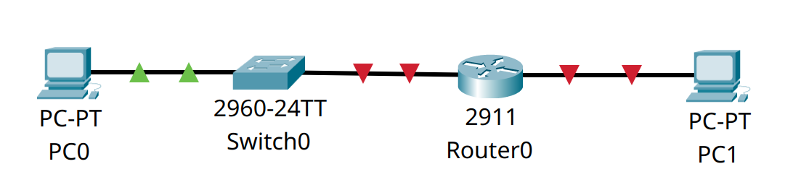
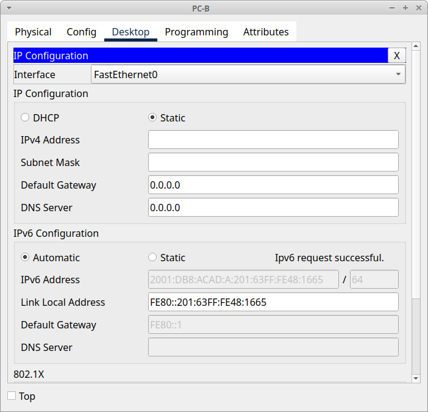

# Домашнее задание №4 «Настройка IPv6-адресов на сетевых устройствах»

## Топология


## Таблица адресации

| Устройство | Интерфейс | IPv6-адрес         | Link local IPv6-адрес | Длина префикса | Шлюз по умолчанию |
| ---------- | --------- | ------------------ | --------------------- | -------------- | ----------------- |
| R1         | G0/0/0    | 2001:db8:acad:a::1 | fe80::1               | 64             | —                 |
|            | G0/0/1    | 2001:db8:acad:1::1 | fe80::1               | 64             | —                 |
| S1         | VLAN1     | 2001:db8:acad:1::b | fe80::b               | 64             | —                 |
| PC-A       | NIC       | 2001:db8:acad:1::3 | SLACC                 | 64             | fe80::1           |
| PC-B       | NIC       | 2001:db8:acad:a::3 | SLACC                 | 64             | fe80::1           |

## Задачи

* Часть 1. Настройка топологии и конфигурация основных параметров маршрутизатора
  и коммутатора.
* Часть 2. Ручная настройка IPv6-адресов.
* Часть 3. Проверка сквозного соединения.

## Общие сведения/сценарий

В этой лабораторной работе мы будем настраивать хосты и интерфейсы устройств с
IPv6-адресами. Для просмотра индивидуальных и групповых IPv6-адресов будем
использовать команду **show**, а для проверки сквозного соединения — команды
**ping** и **traceroute**.

**Примечание:** маршрутизаторы, используемые в практических лабораторных работах
CCNA, - это Cisco 4221 с Cisco IOS XE Release 16.9.4 (образ universalk9). В
лабораторных работах используются коммутаторы Cisco Catalyst 2960 с Cisco IOS
версии 15.2(2) (образ lanbasek9). Можно использовать другие маршрутизаторы,
коммутаторы и версии Cisco IOS. В зависимости от модели устройства и версии
Cisco IOS доступные команды и результаты их выполнения могут отличаться от тех,
которые показаны в лабораторных работах. Правильные идентификаторы интерфейса
см. в сводной таблице по интерфейсам маршрутизаторов в конце лабораторной работы.

**Примечание:** убедитесь, что у всех маршрутизаторов и коммутаторов была удалена
начальная конфигурация. Если вы не уверены, обратитесь к инструктору.

**Примечание:** шаблон по умолчанию менеджера базы данных 2960 Switch Database
Manager (SDM) не поддерживает IPv6. Перед назначением IPv6-адреса SVI VLAN 1
может понадобиться выполнение команды **sdm prefer dual-ipv4-and-ipv6 default**
для включения IPv6-адресации.

**Примечание:** шаблон **default bias**, который по умолчанию используется
диспетчером SDM (диспетчер базы данных коммутатора), не предоставляет
возможностей адресации IPv6. Убедитесь, что SDM использует шаблон
**dual-ipv4-and-ipv6** или **lanbase-routing**. Новый шаблон будет использоваться
после перезагрузки.

```text
S1# show sdm prefer
```

Чтобы установить шаблон **dual-ipv4-and-ipv6** в качестве шаблона SDM по
умолчанию, необходимо выполнить следующие действия:

```text
S1# configure terminal
S1(config)# sdm prefer dual-ipv4-and-ipv6 default
S1(config)# end
S1# reload
```

## Часть 1. Настройка топологии и конфигурация основных параметров маршрутизатора и коммутатора

Для моделирования сети будем использовать ПО Cisco Packet Tracer 8.1.1. Создадим
новую конфигурацию, используя следующие ресурсы:

* 1 Маршрутизатор (Cisco 4221 с универсальным образом Cisco IOS XE версии 16.9.4
  или аналогичным).
* 1 коммутатор (Cisco 2960 с ПО Cisco IOS версии 15.2(2) с образом lanbasek9 или
  аналогичная модель).
* 2 ПК (Windows и программа эмуляции терминала, такая как Tera Term).
* Консольные кабели для настройки устройств Cisco IOS через консольные порты.
* Кабели Ethernet, расположенные в соответствии с топологией.

**Примечание.** Интерфейсы Gigabit Ethernet на маршрутизаторах Cisco 4221
определяют скорость автоматически, поэтому для подключения маршрутизатора к PC-B
можно использовать прямой кабель Ethernet. При использовании другой модели
маршрутизатора Cisco может возникнуть необходимость использовать перекрёстный
кабель Ethernet.

Соединим устройства согласно топологии.



После соединения устройств, инициализации и перезагрузки маршрутизатора и
коммутатора выполним следующие действия.

### Шаг 1. Настройка маршрутизатора

Назначим имя хоста и настроим основные параметры устройства.

```text
Router>enable
Router#configure terminal
Enter configuration commands, one per line.  End with CNTL/Z.
Router(config)#hostname R1
R1(config)#no ip domain-lookup
R1(config)#service password-encryption
R1(config)#enable secret cisco
R1(config)#banner motd # ATTENTION! Unauthorized access is strictly prohibited. #
R1(config)#line console 0
R1(config-line)#logging synchronous
R1(config-line)#password cisco
R1(config-line)#login
R1(config-line)#exit
R1(config)#line vty 0 15
R1(config-line)#logging synchronous
R1(config-line)#password cisco
R1(config-line)#login
R1(config-line)#exit
R1(config)#end
R1#
%SYS-5-CONFIG_I: Configured from console by console

R1#copy running-config startup-config
Destination filename [startup-config]? 
Building configuration...
[OK]
R1#
```

<details>
<summary>show running-config</summary>

```text
R1#show running-config
Building configuration...

Current configuration : 993 bytes
!
version 15.1
no service timestamps log datetime msec
no service timestamps debug datetime msec
service password-encryption
!
hostname R1
!
!
!
enable secret 5 $1$mERr$hx5rVt7rPNoS4wqbXKX7m0
!
!
!
!
!
!
no ip cef
no ipv6 cef
!
!
!
!
license udi pid CISCO2911/K9 sn FTX1524VN6M-
!
!
!
!
!
!
!
!
!
no ip domain-lookup
!
!
spanning-tree mode pvst
!
!
!
!
!
!
interface GigabitEthernet0/0
 no ip address
 duplex auto
 speed auto
 shutdown
!
interface GigabitEthernet0/1
 no ip address
 duplex auto
 speed auto
 shutdown
!
interface GigabitEthernet0/2
 no ip address
 duplex auto
 speed auto
 shutdown
!
interface Vlan1
 no ip address
 shutdown
!
ip classless
!
ip flow-export version 9
!
!
!
banner motd ^C ATTENTION! Unauthorized access is strictly prohibited. ^C
!
!
!
!
!
line con 0
 password 7 0822455D0A16
 logging synchronous
 login
!
line aux 0
!
line vty 0 4
 password 7 0822455D0A16
 logging synchronous
 login
line vty 5 15
 password 7 0822455D0A16
 logging synchronous
 login
!
!
!
end


R1#
```

</details>

### Шаг 2. Настройка коммутатора

Назначим имя хоста и настроим основные параметры устройства.

```text
Switch>enable
Switch#configure terminal
Enter configuration commands, one per line.  End with CNTL/Z.
Switch(config)#hostname S1
S1(config)#no ip domain-lookup
S1(config)#service password-encryption
S1(config)#enable secret cisco
S1(config)#banner motd # ATTENTION! Unauthorized access is strictly prohibited. #
S1(config)#line console 0
S1(config-line)#logging synchronous
S1(config-line)#password cisco
S1(config-line)#login
S1(config-line)#exit
S1(config)#line vty 0 15
S1(config-line)#logging synchronous
S1(config-line)#password cisco
S1(config-line)#login
S1(config-line)#exit
S1(config)#end
S1#
%SYS-5-CONFIG_I: Configured from console by console

S1#copy running-config startup-config
Destination filename [startup-config]? 
Building configuration...
[OK]
S1#
```

<details>
<summary>show running-config</summary>

```text
S1#show running-config
Building configuration...

Current configuration : 1358 bytes
!
version 15.0
no service timestamps log datetime msec
no service timestamps debug datetime msec
service password-encryption
!
hostname S1
!
enable secret 5 $1$mERr$hx5rVt7rPNoS4wqbXKX7m0
!
!
!
no ip domain-lookup
!
!
!
spanning-tree mode pvst
spanning-tree extend system-id
!
interface FastEthernet0/1
!
interface FastEthernet0/2
!
interface FastEthernet0/3
!
interface FastEthernet0/4
!
interface FastEthernet0/5
!
interface FastEthernet0/6
!
interface FastEthernet0/7
!
interface FastEthernet0/8
!
interface FastEthernet0/9
!
interface FastEthernet0/10
!
interface FastEthernet0/11
!
interface FastEthernet0/12
!
interface FastEthernet0/13
!
interface FastEthernet0/14
!
interface FastEthernet0/15
!
interface FastEthernet0/16
!
interface FastEthernet0/17
!
interface FastEthernet0/18
!
interface FastEthernet0/19
!
interface FastEthernet0/20
!
interface FastEthernet0/21
!
interface FastEthernet0/22
!
interface FastEthernet0/23
!
interface FastEthernet0/24
!
interface GigabitEthernet0/1
!
interface GigabitEthernet0/2
!
interface Vlan1
 no ip address
 shutdown
!
banner motd ^C ATTENTION! Unauthorized access is strictly prohibited. ^C
!
!
!
line con 0
 password 7 0822455D0A16
 logging synchronous
 login
!
line vty 0 4
 password 7 0822455D0A16
 logging synchronous
 login
line vty 5 15
 password 7 0822455D0A16
 logging synchronous
 login
!
!
!
!
end


S1#
```

</details>

## Часть 2. Ручная настройка IPv6-адресов

### Шаг 1. Настройка IPv6-адресов интерфейсов Ethernet на R1

#### a. Установка IPv6-адресов

Назначим глобальные индивидуальные IPv6-адреса, указанные в таблице адресации,
обоим интерфейсам Ethernet на R1. Команды для работы с IPv6 аналогичны командам,
работающим с IPv4 и отличаются только префиксом **ipv6** вместо **ip**.

```text
R1#conf t
Enter configuration commands, one per line.  End with CNTL/Z.
R1(config)#int g0/0
R1(config-if)#ipv6 address 2001:db8:acad:a::1/64
R1(config-if)#no shutdown

R1(config-if)#
%LINK-5-CHANGED: Interface GigabitEthernet0/0, changed state to up

%LINEPROTO-5-UPDOWN: Line protocol on Interface GigabitEthernet0/0, changed state to up

R1(config-if)#exit
R1(config)#int g0/1
R1(config-if)#ipv6 address 2001:db8:acad:1::1/64
R1(config-if)#no shutdown

R1(config-if)#
%LINK-5-CHANGED: Interface GigabitEthernet0/1, changed state to up

%LINEPROTO-5-UPDOWN: Line protocol on Interface GigabitEthernet0/1, changed state to up

R1(config-if)#exit
R1(config)#^Z
R1#
%SYS-5-CONFIG_I: Configured from console by console

R1#
```

#### b. Проверка корректности назначенных адресов

Введём команду **show ipv6 interface brief**, чтобы проверить, назначен ли каждому
интерфейсу корректный индивидуальный IPv6-адрес.

**Примечание:** отображаемый локальный адрес канала основан на адресации EUI-64,
которая автоматически использует MAC-адрес интерфейса для создания 128-битного
локального IPv6-адреса канала.

```text
R1#show ipv6 interface brief
GigabitEthernet0/0         [up/up]
    FE80::202:16FF:FE3C:5B01
    2001:DB8:ACAD:A::1
GigabitEthernet0/1         [up/up]
    FE80::202:16FF:FE3C:5B02
    2001:DB8:ACAD:1::1
GigabitEthernet0/2         [administratively down/down]
    unassigned
Vlan1                      [administratively down/down]
    unassigned
R1#
```

Глобальные IPv6-адреса назначены корректно, локальные сгенерированы автоматически
в соответствии с EUI-64.

#### c. Настройка локальных адресов канала

Чтобы обеспечить соответствие локальных адресов канала индивидуальному адресу,
вручную введём локальные адреса канала на каждом интерфейсе Ethernet на R1.

**Примечание:** каждый интерфейс маршрутизатора относится к отдельной сети.
Пакеты с локальным адресом канала никогда не выходят за пределы локальной сети,
а значит, для обоих интерфейсов можно указывать один и тот же локальный адрес
канала.

```text
R1#conf t
Enter configuration commands, one per line.  End with CNTL/Z.
R1(config)#int g0/0
R1(config-if)#ipv6 addr fe80::1 link-local
R1(config-if)#exit
R1(config)#int g0/1
R1(config-if)#ipv6 addr fe80::1 link-local
R1(config-if)#exit
R1(config)#end
R1#
%SYS-5-CONFIG_I: Configured from console by console

R1#
```

#### d. Проверка локального адреса

Используем снова команду **show ipv6 interface brief**, чтобы убедиться, что
локальный адрес связи изменён на fe80::1.

```text
R1#show ipv6 interface brief
GigabitEthernet0/0         [up/up]
    FE80::1
    2001:DB8:ACAD:A::1
GigabitEthernet0/1         [up/up]
    FE80::1
    2001:DB8:ACAD:1::1
GigabitEthernet0/2         [administratively down/down]
    unassigned
Vlan1                      [administratively down/down]
    unassigned
R1#
```

**Вопрос:** какие группы многоадресной рассылки назначены интерфейсу G0/0?

Для определения групп многоадресной рассылки, которые назначены интерфейсу,
воспользуемся командой **show ipv6 interface g0/0**:

```text
R1#show ipv6 interface g0/0
GigabitEthernet0/0 is up, line protocol is up
  IPv6 is enabled, link-local address is FE80::1
  No Virtual link-local address(es):
  Global unicast address(es):
    2001:DB8:ACAD:A::1, subnet is 2001:DB8:ACAD:A::/64
  Joined group address(es):
    FF02::1
    FF02::1:FF00:1
  MTU is 1500 bytes
  ICMP error messages limited to one every 100 milliseconds
  ICMP redirects are enabled
  ICMP unreachables are sent
  ND DAD is enabled, number of DAD attempts: 1
  ND reachable time is 30000 milliseconds
R1#
```

**Ответ:** интерфейсу G0/0 назначены группы `FF02::1` и `FF02::1:FF00:1`.

### Шаг 2. Включение IPv6-маршрутизации на R1

#### a. Просмотр данных IPv6-адреса на PC-B

В командной строке на PC-B введём команду **ipconfig**, чтобы получить данные
IPv6-адреса, назначенного интерфейсу ПК.

```text
Cisco Packet Tracer PC Command Line 1.0
C:\>ipconfig

FastEthernet0 Connection:(default port)

   Connection-specific DNS Suffix..: 
   Link-local IPv6 Address.........: FE80::201:63FF:FE48:1665
   IPv6 Address....................: ::
   IPv4 Address....................: 0.0.0.0
   Subnet Mask.....................: 0.0.0.0
   Default Gateway.................: ::
                                     0.0.0.0

Bluetooth Connection:

   Connection-specific DNS Suffix..: 
   Link-local IPv6 Address.........: ::
   IPv6 Address....................: ::
   IPv4 Address....................: 0.0.0.0
   Subnet Mask.....................: 0.0.0.0
   Default Gateway.................: ::
                                     0.0.0.0

C:\>
```

**Вопрос:** назначен ли индивидуальный IPv6-адрес сетевой интерфейсной карте
(NIC) на PC-B?

**Ответ:** нет, только локальный адрес канала, с использованием EUI-64 - `FE80::201:63FF:FE48:1665`

#### b. Включение IPv6-маршрутизации

Активируем IPv6-маршрутизацию на R1 с помощью команды **ipv6 unicast-routing**.

**Примечание:** это позволит компьютерам получать IP-адреса и данные шлюза по
умолчанию с помощью функции SLAAC (Stateless Address AutoConfiguration
(Автоконфигурация без сохранения состояния адреса)).

```text
R1#conf t
Enter configuration commands, one per line.  End with CNTL/Z.
R1(config)#ipv6 unicast-routing
R1(config)#end
R1#
%SYS-5-CONFIG_I: Configured from console by console

R1#
```

Можно убедить, что появилась новая группа, на которую подписан маршрутизатор:

```text
R1#show ipv6 int g0/0
GigabitEthernet0/0 is up, line protocol is up
  IPv6 is enabled, link-local address is FE80::1
  No Virtual link-local address(es):
  Global unicast address(es):
    2001:DB8:ACAD:A::1, subnet is 2001:DB8:ACAD:A::/64
  Joined group address(es):
    FF02::1
    FF02::2
    FF02::1:FF00:1
  MTU is 1500 bytes
  ICMP error messages limited to one every 100 milliseconds
  ICMP redirects are enabled
  ICMP unreachables are sent
  ND DAD is enabled, number of DAD attempts: 1
  ND reachable time is 30000 milliseconds
  ND advertised reachable time is 0 (unspecified)
  ND advertised retransmit interval is 0 (unspecified)
  ND router advertisements are sent every 200 seconds
  ND router advertisements live for 1800 seconds
  ND advertised default router preference is Medium
  Hosts use stateless autoconfig for addresses.
R1#
```

#### c. Просмотр данных IPv6-адреса на PC-B

Теперь, когда R1 входит в группу многоадресной рассылки всех маршрутизаторов,
ещё раз введём команду **ipconfig** на PC-B (предварительно необходимо убедиться,
что в настройках сетевой карты стоит автоматическое получение IPv6-адреса).
Проверим данные IPv6-адреса.

```text
C:\>ipconfig

FastEthernet0 Connection:(default port)

   Connection-specific DNS Suffix..: 
   Link-local IPv6 Address.........: FE80::201:63FF:FE48:1665
   IPv6 Address....................: 2001:DB8:ACAD:A:201:63FF:FE48:1665
   IPv4 Address....................: 0.0.0.0
   Subnet Mask.....................: 0.0.0.0
   Default Gateway.................: FE80::1
                                     0.0.0.0
```

**Вопрос:** почему PC-B получил глобальный префикс маршрутизации и идентификатор
подсети, которые мы настроили на R1?

**Ответ:** так как R1 отправил ему сообщение Router Advertisement (RA) с
соответствующими настройками.

### Шаг 3. Настройка IPv6-адреса интерфейса управления на S1

#### a. Установка адресов

Назначим адрес IPv6 для интерфейса управления (SVI) на S1. Также назначим этому
интерфейсу локальный адрес канала fe80::b.

Как отмечалось ранее, по умолчанию на коммутаторе 2960 используется профиль SDM
без поддержки IPv6.

<details>
<summary>show sdm prefer</summary>

```text
S1#show sdm prefer
 The current template is "default" template.
 The selected template optimizes the resources in
 the switch to support this level of features for
 0 routed interfaces and 1024 VLANs.

  number of unicast mac addresses:                  8K
  number of IPv4 IGMP groups + multicast routes:    0.25K
  number of IPv4 unicast routes:                    0
  number of IPv6 multicast groups:                  0
  number of directly-connected IPv6 addresses:      0
  number of indirect IPv6 unicast routes:           0
  number of IPv4 policy based routing aces:         0
  number of IPv4/MAC qos aces:                      0.125k
  number of IPv4/MAC security aces:                 0.375k
  number of IPv6 policy based routing aces:         0
  number of IPv6 qos aces:                          20
  number of IPv6 security aces:                     25

S1#
```

</details>

Включим явно поддержку IPv6-адресации:

```text
S1#conf t
Enter configuration commands, one per line.  End with CNTL/Z.
S1(config)#sdm prefer dual-ipv4-and-ipv6 default
Changes to the running SDM preferences have been stored, but cannot take effect until the next reload.
Use 'show sdm prefer' to see what SDM preference is currently active.
S1(config)#end
S1#
%SYS-5-CONFIG_I: Configured from console by console

S1#
```

Перезагрузим роутер и убедимся, что шаблон сменился:

<details>
<summary>show sdm prefer</summary>

```text
S1#show sdm prefer
 The current template is "dual-ipv4-and-ipv6 default" template.
 The selected template optimizes the resources in
 the switch to support this level of features for
 0 routed interfaces and 1024 VLANs.

  number of unicast mac addresses:                  4K
  number of IPv4 IGMP groups + multicast routes:    0.25K
  number of IPv4 unicast routes:                    0
  number of IPv6 multicast groups:                  0.375k
  number of directly-connected IPv6 addresses:      0
  number of indirect IPv6 unicast routes:           0
  number of IPv4 policy based routing aces:         0
  number of IPv4/MAC qos aces:                      0.125K
  number of IPv4/MAC security aces:                 0.375K
  number of IPv6 policy based routing aces:         0
  number of IPv6 qos aces:                          0.625k
  number of IPv6 security aces:                     0.125K

S1#
```

</details>

Теперь назначим IPv6-адреса интерфейсу SVI согласно таблице адресации:

```text
S1#conf t
Enter configuration commands, one per line.  End with CNTL/Z.
S1(config)#interface vlan 1
S1(config-if)#ipv6 address 2001:db8:acad:1::b/64
S1(config-if)#ipv6 address fe80::b link-local
S1(config-if)#no shutdown

S1(config-if)#
%LINK-5-CHANGED: Interface Vlan1, changed state to up

%LINEPROTO-5-UPDOWN: Line protocol on Interface Vlan1, changed state to up

S1(config-if)#end
S1#
%SYS-5-CONFIG_I: Configured from console by console

S1#
```

#### b. Проверка IPv6-адресов

Проверим правильность назначения IPv6-адресов интерфейсу управления с помощью
команды **show ipv6 interface vlan 1**:

```text
S1#show ipv6 interface vlan 1
Vlan1 is up, line protocol is up
  IPv6 is enabled, link-local address is FE80::B
  No Virtual link-local address(es):
  Global unicast address(es):
    2001:DB8:ACAD:1::B, subnet is 2001:DB8:ACAD:1::/64
  Joined group address(es):
    FF02::1
    FF02::1:FF00:B
  MTU is 1500 bytes
  ICMP error messages limited to one every 100 milliseconds
  ICMP redirects are enabled
  ICMP unreachables are sent
  Output features: Check hwidb
  ND DAD is enabled, number of DAD attempts: 1
  ND reachable time is 30000 milliseconds
S1#
```

### Шаг 4. Настройка статических IPv6-адресов компьютеров

#### a. Установка IPv6-адресов PC-A и PC-B

Откроем окно "Свойства Ethernet" на каждом ПК и назначим адреса IPv6 согласно
таблице адресации.


#### b. Проверка IPv6-адресов компьютеров

Убедимся, что оба компьютера имеют правильную информацию адреса IPv6. Каждый
из них должен иметь два глобальных адреса IPv6: один статический и один SLAAC.

**Примечание:** при выполнении работы в среде Cisco Packet Tracer установите
статический и SLAAC адреса на компьютеры последовательно, отразив результаты в
отчёте.

После предыдущего пункта на ПК установлены статические адреса:

<details>
<summary>PC-A ipconfig</summary>

```text
C:\>ipconfig

FastEthernet0 Connection:(default port)

   Connection-specific DNS Suffix..: 
   Link-local IPv6 Address.........: FE80::207:ECFF:FE4B:1971
   IPv6 Address....................: 2001:DB8:ACAD:1::3
   IPv4 Address....................: 0.0.0.0
   Subnet Mask.....................: 0.0.0.0
   Default Gateway.................: FE80::1
                                     0.0.0.0
```

</details>

<details>
<summary>PC-B ipconfig</summary>

```text
C:\>ipconfig

FastEthernet0 Connection:(default port)

   Connection-specific DNS Suffix..: 
   Link-local IPv6 Address.........: FE80::201:63FF:FE48:1665
   IPv6 Address....................: 2001:DB8:ACAD:A::3
   IPv4 Address....................: 0.0.0.0
   Subnet Mask.....................: 0.0.0.0
   Default Gateway.................: FE80::1
                                     0.0.0.0
```

</details>

Проверим автоматическое назначение адресов через SLAAC.


<details>
<summary>PC-A ipconfig</summary>

```text
C:\>ipconfig

FastEthernet0 Connection:(default port)

   Connection-specific DNS Suffix..: 
   Link-local IPv6 Address.........: FE80::207:ECFF:FE4B:1971
   IPv6 Address....................: 2001:DB8:ACAD:1:207:ECFF:FE4B:1971
   IPv4 Address....................: 0.0.0.0
   Subnet Mask.....................: 0.0.0.0
   Default Gateway.................: FE80::1
                                     0.0.0.0
```

</details>



<details>
<summary>PC-B ipconfig</summary>

```text
C:\>ipconfig

FastEthernet0 Connection:(default port)

   Connection-specific DNS Suffix..: 
   Link-local IPv6 Address.........: FE80::201:63FF:FE48:1665
   IPv6 Address....................: 2001:DB8:ACAD:A:201:63FF:FE48:1665
   IPv4 Address....................: 0.0.0.0
   Subnet Mask.....................: 0.0.0.0
   Default Gateway.................: FE80::1
                                     0.0.0.0
```

</details>

Как видим, назначение адресов через SLAAC работает на обоих компьютерах. Перед
продолжением работы, вернём на обоих статические IPv6-адреса.

## Часть 3. Проверка сквозного подключения

С PC-A отправим эхо-запрос на **FE80::1**. Это локальный адрес канала, назначенный
интерфейсу G0/1 на R1.

```text
C:\>ping fe80::1

Pinging fe80::1 with 32 bytes of data:

Reply from FE80::1: bytes=32 time<1ms TTL=255
Reply from FE80::1: bytes=32 time<1ms TTL=255
Reply from FE80::1: bytes=32 time<1ms TTL=255
Reply from FE80::1: bytes=32 time<1ms TTL=255

Ping statistics for FE80::1:
    Packets: Sent = 4, Received = 4, Lost = 0 (0% loss),
Approximate round trip times in milli-seconds:
    Minimum = 0ms, Maximum = 0ms, Average = 0ms

C:\>
```

Отправим эхо-запрос на интерфейс управления S1 с PC-A:

```text
C:\>ping 2001:db8:acad:1::b

Pinging 2001:db8:acad:1::b with 32 bytes of data:

Reply from 2001:DB8:ACAD:1::B: bytes=32 time<1ms TTL=255
Reply from 2001:DB8:ACAD:1::B: bytes=32 time<1ms TTL=255
Reply from 2001:DB8:ACAD:1::B: bytes=32 time<1ms TTL=255
Reply from 2001:DB8:ACAD:1::B: bytes=32 time<1ms TTL=255

Ping statistics for 2001:DB8:ACAD:1::B:
    Packets: Sent = 4, Received = 4, Lost = 0 (0% loss),
Approximate round trip times in milli-seconds:
    Minimum = 0ms, Maximum = 0ms, Average = 0ms

C:\>
```

Пинг на локальный адрес также работает:

```text
C:\>ping fe80::b

Pinging fe80::b with 32 bytes of data:

Reply from FE80::B: bytes=32 time=2003ms TTL=255
Reply from FE80::B: bytes=32 time<1ms TTL=255
Reply from FE80::B: bytes=32 time<1ms TTL=255
Reply from FE80::B: bytes=32 time<1ms TTL=255

Ping statistics for FE80::B:
    Packets: Sent = 4, Received = 4, Lost = 0 (0% loss),
Approximate round trip times in milli-seconds:
    Minimum = 0ms, Maximum = 2003ms, Average = 500ms
```

Введём команду **tracert** на PC-A, чтобы проверить наличие сквозного подключения
к PC-B:

```text
C:\>tracert 2001:db8:acad:a::3

Tracing route to 2001:db8:acad:a::3 over a maximum of 30 hops: 

  1   0 ms      0 ms      0 ms      2001:DB8:ACAD:1::1
  2   0 ms      0 ms      0 ms      2001:DB8:ACAD:A::3

Trace complete.

C:\>
```

С PC-B отправим эхо-запрос на PC-A:

```text
C:\>ping 2001:db8:acad:1::3

Pinging 2001:db8:acad:1::3 with 32 bytes of data:

Reply from 2001:DB8:ACAD:1::3: bytes=32 time<1ms TTL=127
Reply from 2001:DB8:ACAD:1::3: bytes=32 time<1ms TTL=127
Reply from 2001:DB8:ACAD:1::3: bytes=32 time<1ms TTL=127
Reply from 2001:DB8:ACAD:1::3: bytes=32 time<1ms TTL=127

Ping statistics for 2001:DB8:ACAD:1::3:
    Packets: Sent = 4, Received = 4, Lost = 0 (0% loss),
Approximate round trip times in milli-seconds:
    Minimum = 0ms, Maximum = 0ms, Average = 0ms

C:\>
```

С PC-B отправим эхо-запрос на локальный адрес канала G0/0 на R1:

```text
C:\>ping fe80::1

Pinging fe80::1 with 32 bytes of data:

Reply from FE80::1: bytes=32 time<1ms TTL=255
Reply from FE80::1: bytes=32 time<1ms TTL=255
Reply from FE80::1: bytes=32 time<1ms TTL=255
Reply from FE80::1: bytes=32 time<1ms TTL=255

Ping statistics for FE80::1:
    Packets: Sent = 4, Received = 4, Lost = 0 (0% loss),
Approximate round trip times in milli-seconds:
    Minimum = 0ms, Maximum = 0ms, Average = 0ms

C:\>
```

**Примечание:** в случае отсутствия сквозного подключения необходимо проверить,
правильно ли указаны IPv6-адреса на всех устройствах.

## Вопросы для повторения

1. Почему обоим интерфейсам Ethernet на R1 можно назначить один и тот же локальный
   адрес канала — FE80::1?

   **Ответ:** потому что эти интерфейсы находятся в разных сетях.

2. Какой идентификатор подсети в индивидуальном IPv6-адресе
   2001:db8:acad::aaaa:1234/64?

   Если представить этот индивидуальный IPv6-адрес в полном виде, то получим:
   2001:db8:acad::aaaa:1234 = 2001:0db8:acad:0000:0000:0000:aaaa:1234 Маска
   "/64" делит наш адрес пополам, следовательно сетевая часть:
   2001:0db8:acad:0000 Идентификатор подсети - последний гекстет.

   **Ответ:** идентификатор подсети - `0000`.

## Сводная таблица по интерфейсам маршрутизаторов

| Модель маршрутизатора | Интерфейс Ethernet №1           | Интерфейс Ethernet №2           | Последовательный интерфейс №1 | Последовательный интерфейс №2 |
| --------------------- | ------------------------------- | ------------------------------- | ----------------------------- | ----------------------------- |
| 1800                  | Fast Ethernet 0/0 (F0/0)        | Fast Ethernet 0/1 (F0/1)        | Serial 0/0/0 (S0/0/0)         | Serial 0/0/1 (S0/0/1)         |
| 1900                  | Gigabit Ethernet 0/0 (G0/0)     | Gigabit Ethernet 0/1 (G0/1)     | Serial 0/0/0 (S0/0/0)         | Serial 0/0/1 (S0/0/1)         |
| 2801                  | Fast Ethernet 0/0 (F0/0)        | Fast Ethernet 0/1 (F0/1)        | Serial 0/1/0 (S0/1/0)         | Serial 0/1/1 (S0/1/1)         |
| 2811                  | Fast Ethernet 0/0 (F0/0)        | Fast Ethernet 0/1 (F0/1)        | Serial 0/0/0 (S0/0/0)         | Serial 0/0/1 (S0/0/1)         |
| 2900                  | Gigabit Ethernet 0/0 (G0/0)     | Gigabit Ethernet 0/1 (G0/1)     | Serial 0/0/0 (S0/0/0)         | Serial 0/0/1 (S0/0/1)         |
| 4221                  | Gigabit Ethernet 0/0/0 (G0/0/0) | Gigabit Ethernet 0/0/1 (G0/0/1) | Serial 0/1/0 (S0/1/0)         | Serial 0/1/1 (S0/1/1)         |
| 4300                  | Gigabit Ethernet 0/0/0 (G0/0/0) | Gigabit Ethernet 0/0/1 (G0/0/1) | Serial 0/1/0 (S0/1/0)         | Serial 0/1/1 (S0/1/1)         |

**Примечание:** чтобы определить конфигурацию маршрутизатора, можно посмотреть
на интерфейсы и установить тип маршрутизатора и количество его интерфейсов.
Перечислить все комбинации конфигураций для каждого класса маршрутизаторов
невозможно. Эта таблица содержит идентификаторы для возможных комбинаций
интерфейсов Ethernet и последовательных интерфейсов на устройстве. Другие типы
интерфейсов в таблице не представлены, хотя они могут присутствовать в данном
конкретном маршрутизаторе. В качестве примера можно привести интерфейс ISDN BRI.
Строка в скобках — это официальное сокращение, которое можно использовать в
командах Cisco IOS для обозначения интерфейса.
