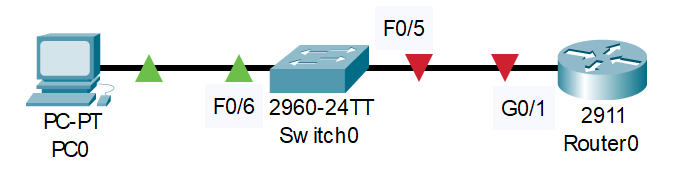
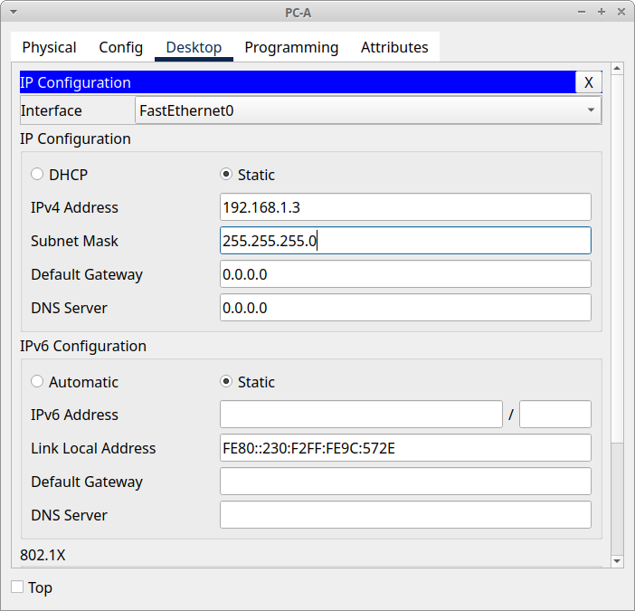
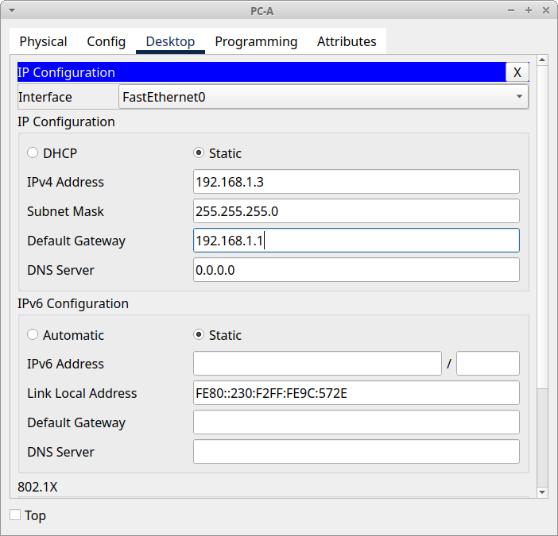

# Домашнее задание №5 «Доступ к сетевым устройствам по протоколу SSH»

## Топология


## Таблица адресации

| Устройство | Интерфейс | IP-адрес     | Маска подсети | Шлюз по умолчанию |
| ---------- | --------- | ------------ | ------------- | ----------------- |
| R1         | G0/0/1    | 192.168.1.1  | 255.255.255.0 | —                 |
| S1         | VLAN1     | 192.168.1.11 | 255.255.255.0 | 192.168.1.1       |
| PC-A       | NIC       | 192.168.1.3  | 255.255.255.0 | 192.168.1.1       |

## Задачи

* Часть 1. Настройка основных параметров устройства.
* Часть 2. Настройка маршрутизатора для доступа по протоколу SSH.
* Часть 3. Настройка коммутатора для доступа по протоколу SSH.
* Часть 4. SSH через интерфейс командной строки (CLI) коммутатора.

## Общие сведения/сценарий

Раньше для удалённой настройки сетевых устройств в основном применялся протокол
Telnet. Однако он не обеспечивает шифрование информации, передаваемой между
клиентом и сервером, что позволяет анализаторам сетевых пакетов перехватывать
пароли и данные конфигурации.

Secure Shell (SSH) — это сетевой протокол, устанавливающий безопасное подключение
с эмуляцией терминала к маршрутизатору или иному сетевому устройству. Протокол
SSH шифрует все сведения, которые поступают по сетевому каналу, и предусматривает
аутентификацию удалённого компьютера. Протокол SSH все больше заменяет Telnet —
именно его выбирают сетевые специалисты в качестве средства удаленного входа в
систему. SSH чаще всего используется для входа на удалённое устройство и
выполнения команд. Также он позволяет передавать файлы по связанным протоколам
SFTP или SCP.

Чтобы протокол SSH мог работать, на сетевых устройствах, взаимодействующих между
собой, должна быть настроена поддержка SSH. В этой лабораторной работе необходимо
включить SSH-сервер на маршрутизаторе, после чего подключиться к этому
маршрутизатору, используя ПК с установленным клиентом SSH. В локальной сети
подключение обычно устанавливается с помощью Ethernet и IP.

**Примечание:** маршрутизаторы, используемые в практических лабораторных работах
CCNA, - это Cisco 4221 с Cisco IOS XE Release 16.9.4 (образ universalk9). В
лабораторных работах используются коммутаторы Cisco Catalyst 2960 с Cisco IOS
версии 15.2(2) (образ lanbasek9). Можно использовать другие маршрутизаторы,
коммутаторы и версии Cisco IOS. В зависимости от модели устройства и версии
Cisco IOS доступные команды и результаты их выполнения могут отличаться от тех,
которые показаны в лабораторных работах. Правильные идентификаторы интерфейса
см. в сводной таблице по интерфейсам маршрутизаторов в конце лабораторной работы.

**Примечание:** убедитесь, что у всех маршрутизаторов и коммутаторов была
удалена начальная конфигурация. Если вы не уверены, обратитесь к инструктору.

## Часть 1. Настройка основных параметров устройств

Для моделирования сети будем использовать ПО Cisco Packet Tracer 8.1.1. Создадим
новую конфигурацию, используя следующие ресурсы:

* 1 Маршрутизатор (Cisco 4221 с универсальным образом Cisco IOS XE версии 16.9.4
 или аналогичным);
* 1 коммутатор (Cisco 2960 с ПО Cisco IOS версии 15.2(2) с образом lanbasek9 или
  аналогичная модель);
* 1 ПК (под управлением Windows с программой эмуляции терминала, например, Tera Term);
* консольные кабели для настройки устройств Cisco IOS через консольные порты;
* кабели Ethernet, расположенные в соответствии с топологией.

### Шаг 1. Создание сети

Соединим устройства согласно топологии.



### Шаг 2. Инициализация маршрутизатора и коммутатора

Выполним инициализацию и перезагрузку маршрутизатора и коммутатора. Для этого удалим
текущую конфигурацию командой **erase startup-config** и перезагрузим устройство
командой **reload**.

<details>
<summary>Вывод команд на коммутаторе:</summary>

```text
Switch>
Switch>enable
Switch#erase startup-config
Erasing the nvram filesystem will remove all configuration files! Continue? [confirm]
[OK]
Erase of nvram: complete
%SYS-7-NV_BLOCK_INIT: Initialized the geometry of nvram
Switch#
Switch#reload
Proceed with reload? [confirm]
C2960 Boot Loader (C2960-HBOOT-M) Version 12.2(25r)FX, RELEASE SOFTWARE (fc4)
Cisco WS-C2960-24TT (RC32300) processor (revision C0) with 21039K bytes of memory.
2960-24TT starting...
Base ethernet MAC Address: 000B.BEDA.A3D6
Xmodem file system is available.
Initializing Flash...
flashfs[0]: 1 files, 0 directories
flashfs[0]: 0 orphaned files, 0 orphaned directories
flashfs[0]: Total bytes: 64016384
flashfs[0]: Bytes used: 4670455
flashfs[0]: Bytes available: 59345929
flashfs[0]: flashfs fsck took 1 seconds.
...done Initializing Flash.

Boot Sector Filesystem (bs:) installed, fsid: 3
Parameter Block Filesystem (pb:) installed, fsid: 4


Loading "flash:/2960-lanbasek9-mz.150-2.SE4.bin"...
########################################################################## [OK]
Smart Init is enabled
smart init is sizing iomem
                  TYPE      MEMORY_REQ
                TOTAL:      0x00000000
Rounded IOMEM up to: 0Mb.
Using 6 percent iomem. [0Mb/512Mb]

              Restricted Rights Legend
Use, duplication, or disclosure by the Government is
subject to restrictions as set forth in subparagraph
(c) of the Commercial Computer Software - Restricted
Rights clause at FAR sec. 52.227-19 and subparagraph
(c) (1) (ii) of the Rights in Technical Data and Computer
Software clause at DFARS sec. 252.227-7013.
           cisco Systems, Inc.
           170 West Tasman Drive
           San Jose, California 95134-1706
Cisco IOS Software, C2960 Software (C2960-LANBASEK9-M), Version 15.0(2)SE4, RELEASE SOFTWARE (fc1)
Technical Support: http://www.cisco.com/techsupport
Copyright (c) 1986-2013 by Cisco Systems, Inc.
Compiled Wed 26-Jun-13 02:49 by mnguyen
Initializing flashfs...
fsck: Disable shadow buffering due to heap fragmentation.
flashfs[2]: 2 files, 1 directories
flashfs[2]: 0 orphaned files, 0 orphaned directories
flashfs[2]: Total bytes: 32514048
flashfs[2]: Bytes used: 11952128
flashfs[2]: Bytes available: 20561920
flashfs[2]: flashfs fsck took 2 seconds.
flashfs[2]: Initialization complete....done Initializing flashfs.
Checking for Bootloader upgrade..
Boot Loader upgrade not required (Stage 2)
POST: CPU MIC register Tests : Begin
POST: CPU MIC register Tests : End, Status Passed
POST: PortASIC Memory Tests : Begin
POST: PortASIC Memory Tests : End, Status Passed
POST: CPU MIC interface Loopback Tests : Begin
POST: CPU MIC interface Loopback Tests : End, Status Passed
POST: PortASIC RingLoopback Tests : Begin
POST: PortASIC RingLoopback Tests : End, Status Passed
POST: PortASIC CAM Subsystem Tests : Begin
POST: PortASIC CAM Subsystem Tests : End, Status Passed
POST: PortASIC Port Loopback Tests : Begin
POST: PortASIC Port Loopback Tests : End, Status Passed
Waiting for Port download...Complete

This product contains cryptographic features and is subject to United
States and local country laws governing import, export, transfer and
use. Delivery of Cisco cryptographic products does not imply
third-party authority to import, export, distribute or use encryption.
Importers, exporters, distributors and users are responsible for
compliance with U.S. and local country laws. By using this product you
agree to comply with applicable laws and regulations. If you are unable
to comply with U.S. and local laws, return this product immediately.
A summary of U.S. laws governing Cisco cryptographic products may be found at:
http://www.cisco.com/wwl/export/crypto/tool/stqrg.html
If you require further assistance please contact us by sending email to
export@cisco.com.
cisco WS-C2960-24TT-L (PowerPC405) processor (revision B0) with 65536K bytes of memory.
Processor board ID FOC1010X104
Last reset from power-on
1 Virtual Ethernet interface
24 FastEthernet interfaces
2 Gigabit Ethernet interfaces
The password-recovery mechanism is enabled.
64K bytes of flash-simulated non-volatile configuration memory.
Base ethernet MAC Address       : 00:0B:BE:DA:A3:D6
Motherboard assembly number     : 73-10390-03
Power supply part number        : 341-0097-02
Motherboard serial number       : FOC10093R12
Power supply serial number      : AZS1007032H
Model revision number           : B0
Motherboard revision number     : B0
Model number                    : WS-C2960-24TT-L
System serial number            : FOC1010X104
Top Assembly Part Number        : 800-27221-02
Top Assembly Revision Number    : A0
Version ID                      : V02
CLEI Code Number                : COM3L00BRA
Hardware Board Revision Number  : 0x01

Switch Ports Model              SW Version            SW Image
------ ----- -----              ----------            ----------
*    1 26    WS-C2960-24TT-L    15.0(2)SE4            C2960-LANBASEK9-M

Cisco IOS Software, C2960 Software (C2960-LANBASEK9-M), Version 15.0(2)SE4, RELEASE SOFTWARE (fc1)
Technical Support: http://www.cisco.com/techsupport
Copyright (c) 1986-2013 by Cisco Systems, Inc.
Compiled Wed 26-Jun-13 02:49 by mnguyen


Press RETURN to get started!


%LINK-5-CHANGED: Interface FastEthernet0/6, changed state to up

%LINEPROTO-5-UPDOWN: Line protocol on Interface FastEthernet0/6, changed state to up


Switch>
```

</details>

<details>
<summary>Вывод команд на маршрутизаторе:</summary>

```text
Router>
Router>enable
Router#erase startup-config
Erasing the nvram filesystem will remove all configuration files! Continue? [confirm]
[OK]
Erase of nvram: complete
%SYS-7-NV_BLOCK_INIT: Initialized the geometry of nvram
Router#
Router#reload
System configuration has been modified. Save? [yes/no]:no
Proceed with reload? [confirm]
System Bootstrap, Version 15.1(4)M4, RELEASE SOFTWARE (fc1)
Technical Support: http://www.cisco.com/techsupport
Copyright (c) 2010 by cisco Systems, Inc.
Total memory size = 512 MB - On-board = 512 MB, DIMM0 = 0 MB
CISCO2911/K9 platform with 524288 Kbytes of main memory
Main memory is configured to 72/-1(On-board/DIMM0) bit mode with ECC disabled

Readonly ROMMON initialized

program load complete, entry point: 0x80803000, size: 0x1b340
program load complete, entry point: 0x80803000, size: 0x1b340

IOS Image Load Test
___________________
Digitally Signed Release Software
program load complete, entry point: 0x81000000, size: 0x3bcd3d8
Self decompressing the image :
########################################################################## [OK]
Smart Init is enabled
smart init is sizing iomem
                  TYPE      MEMORY_REQ
     Onboard devices &
          buffer pools      0x022F6000
-----------------------------------------------
                TOTAL:      0x022F6000
Rounded IOMEM up to: 36Mb.
Using 6 percent iomem. [36Mb/512Mb]

              Restricted Rights Legend

Use, duplication, or disclosure by the Government is
subject to restrictions as set forth in subparagraph
(c) of the Commercial Computer Software - Restricted
Rights clause at FAR sec. 52.227-19 and subparagraph
(c) (1) (ii) of the Rights in Technical Data and Computer
Software clause at DFARS sec. 252.227-7013.

           cisco Systems, Inc.
           170 West Tasman Drive
           San Jose, California 95134-1706

Cisco IOS Software, C2900 Software (C2900-UNIVERSALK9-M), Version 15.1(4)M5, RELEASE SOFTWARE (fc2)Technical Support: http://www.cisco.com/techsupport
Copyright (c) 1986-2007 by Cisco Systems, Inc.
Compiled Wed 18-Jul-07 04:52 by pt_team
Image text-base: 0x2100F918, data-base: 0x24729040

This product contains cryptographic features and is subject to United
States and local country laws governing import, export, transfer and
use. Delivery of Cisco cryptographic products does not imply
third-party authority to import, export, distribute or use encryption.
Importers, exporters, distributors and users are responsible for
compliance with U.S. and local country laws. By using this product you
agree to comply with applicable laws and regulations. If you are unable
to comply with U.S. and local laws, return this product immediately.

A summary of U.S. laws governing Cisco cryptographic products may be found at:
http://www.cisco.com/wwl/export/crypto/tool/stqrg.html

If you require further assistance please contact us by sending email to
export@cisco.com.

Cisco CISCO2911/K9 (revision 1.0) with 491520K/32768K bytes of memory.
Processor board ID FTX152400KS
3 Gigabit Ethernet interfaces
DRAM configuration is 64 bits wide with parity disabled.
255K bytes of non-volatile configuration memory.
249856K bytes of ATA System CompactFlash 0 (Read/Write)


         --- System Configuration Dialog ---

Would you like to enter the initial configuration dialog? [yes/no]: no


Press RETURN to get started!


Router>
```

</details>

### Шаг 3. Настройка маршрутизатора

Настроим основные параметры устройства.

#### a. Активация привилегированного режима

Подключимся к маршрутизатору с помощью консоли и активируем привилегированный
режим EXEC:

```text
Router>
Router>enable
Router#
```

#### b. Вход в режим конфигурации

Войдём в режим конфигурации:

```text
Router#
Router#configure terminal
Enter configuration commands, one per line.  End with CNTL/Z.
Router(config)#
```

Для удобства сменим имя маршрутизатора на R1:

```text
Router(config)#
Router(config)#hostname R1
R1(config)#
```

#### c. Отключение поиска DNS

Чтобы предотвратить попытки маршрутизатора неверно преобразовывать введённые
команды таким образом, как будто они являются именами узлов, отключим поиск DNS:

```text
R1(config)#
R1(config)#no ip domain-lookup
R1(config)#
```

#### d. Установка пароля привилегированного режима

Назначим **class** в качестве зашифрованного пароля привилегированного режима EXEC:

```text
R1(config)#
R1(config)#enable secret class
R1(config)#
```

#### e. Установка пароля консоли

Назначим **cisco** в качестве пароля консоли и включим вход в систему по паролю:

```text
R1(config)#
R1(config)#line console 0
R1(config-line)#password cisco
R1(config-line)#login
R1(config-line)#exit
R1(config)#
```

#### f. Установка пароля VTY

Назначим **cisco** в качестве пароля VTY и включим вход в систему по паролю:

```text
R1(config)#
R1(config)#line vty 0 15
R1(config-line)#password cisco
R1(config-line)#login
R1(config-line)#exit
R1(config)#
```

#### g. Включение шифрования паролей

Зашифруем открытые пароли в файле конфигурации:

```text
R1(config)#
R1(config)#service password-encryption
R1(config)#
```

#### h. Создание баннера

Создадим баннер, который предупреждает о запрете несанкционированного доступа:

```text
R1(config)#
R1(config)#banner motd # ATTENTION! Unauthorized access is strictly prohibited. #
R1(config)#
```

#### i. Настройка интерфейса G/0/1

Так как мы используем маршрутизатор 2911, то вместо G0/0/1 будем работать с
интерфейсом G0/1.

Настроим и активируем на маршрутизаторе интерфейс G0/1, используя информацию,
приведённую в таблице адресации:

```text
R1(config)#interface GigabitEthernet 0/1
R1(config-if)#ip address 192.168.1.1 255.255.255.0
R1(config-if)#no shutdown

R1(config-if)#
%LINK-5-CHANGED: Interface GigabitEthernet0/1, changed state to up

%LINEPROTO-5-UPDOWN: Line protocol on Interface GigabitEthernet0/1, changed state to up

R1(config-if)#end
R1#
%SYS-5-CONFIG_I: Configured from console by console

R1#
```

#### j. Сохранение конфигурации

```text
R1#copy running-config startup-config 
Destination filename [startup-config]? 
Building configuration...
[OK]
R1#
```

<details>
<summary>show running-config</summary>

```text
R1#show running-config 
Building configuration...

Current configuration : 943 bytes
!
version 15.1
no service timestamps log datetime msec
no service timestamps debug datetime msec
service password-encryption
!
hostname R1
!
!
!
enable secret 5 $1$mERr$9cTjUIEqNGurQiFU.ZeCi1
!
!
!
!
!
!
no ip cef
no ipv6 cef
!
!
!
!
license udi pid CISCO2911/K9 sn FTX1524NR72-
!
!
!
!
!
!
!
!
!
no ip domain-lookup
!
!
spanning-tree mode pvst
!
!
!
!
!
!
interface GigabitEthernet0/0
 no ip address
 duplex auto
 speed auto
 shutdown
!
interface GigabitEthernet0/1
 ip address 192.168.1.1 255.255.255.0
 duplex auto
 speed auto
!
interface GigabitEthernet0/2
 no ip address
 duplex auto
 speed auto
 shutdown
!
interface Vlan1
 no ip address
 shutdown
!
ip classless
!
ip flow-export version 9
!
!
!
banner motd ^C ATTENTION! Unauthorized access is strictly prohibited. ^C
!
!
!
!
!
line con 0
 password 7 0822455D0A16
 login
!
line aux 0
!
line vty 0 4
 password 7 0822455D0A16
 login
line vty 5 15
 password 7 0822455D0A16
 login
!
!
!
end


R1#
```

</details>

### Шаг 4. Настройка компьютера PC-A

Зададим основные сетевые параметры.

#### a. Настройка IP-адреса

Зададим IP-адрес и маску подсети согласно таблице адресации.



#### b. Настройка шлюза по умолчанию

В качестве шлюза по умолчанию укажем адрес маршрутизатора R1.



### Шаг 5. Проверка подключения к сети

Пошлём с **PC-A** команду **ping** на маршрутизатор **R1**. Если эхо-запрос с
помощью команды **ping** не проходит, найдём и устраним неполадки подключения.

```text
C:\>ping 192.168.1.1

Pinging 192.168.1.1 with 32 bytes of data:

Reply from 192.168.1.1: bytes=32 time=1ms TTL=255
Reply from 192.168.1.1: bytes=32 time<1ms TTL=255
Reply from 192.168.1.1: bytes=32 time<1ms TTL=255
Reply from 192.168.1.1: bytes=32 time<1ms TTL=255

Ping statistics for 192.168.1.1:
    Packets: Sent = 4, Received = 4, Lost = 0 (0% loss),
Approximate round trip times in milli-seconds:
    Minimum = 0ms, Maximum = 1ms, Average = 0ms

C:\>
```

## Часть 2. Настройка маршрутизатора для доступа по протоколу SSH

Подключение к сетевым устройствам по протоколу Telnet сопряжено с риском для
безопасности, поскольку вся информация передаётся в виде открытого текста.
Протокол SSH шифрует данные сеанса и обеспечивает аутентификацию устройств,
поэтому для удалённых подключений рекомендуется использовать именно этот протокол.
В части 2 настроим маршрутизатор для приема соединений SSH по линиям VTY.

### Шаг 1. Настройка аутентификации устройств

При генерации ключа шифрования в качестве его части используются имя устройства
и домен. Поэтому эти имена необходимо указать перед вводом команды crypto key.

#### a. Установка имени устройства

Имя устройства мы задали ранее, на этапе базовых настроек маршрутизатора. Если,
по каким-либо причинам, этого сделано не было, можно задать его командой **hostname**:

```text
Router(config)#
Router(config)#hostname R1
R1(config)#
```

#### b. Установка домена

Для установки доменного имени воспользуемся командой **ip-domain**:

```text
R1#conf t
Enter configuration commands, one per line.  End with CNTL/Z.
R1(config)#ip domain-name otus.ru
R1(config)#
R1#
%SYS-5-CONFIG_I: Configured from console by console

R1#
```
### Шаг 2. Настройка ключа шифрования

Создадим ключ шифрования с указанием его длины.

```text
R1(config)#
R1(config)#crypto key generate rsa general-keys modulus 1024
The name for the keys will be: R1.otus.ru

% The key modulus size is 1024 bits
% Generating 1024 bit RSA keys, keys will be non-exportable...[OK]
*Mar 2 9:16:9.29: %SSH-5-ENABLED: SSH 1.99 has been enabled
R1(config)#
```

Сразу после создания ключа включается протокол SSH версии 1.99. Сменим её на
более безопасную версию 2 командой **ip ssh version 2**:

```text
R1(config)#
R1(config)#ip ssh version 2
R1(config)#
```

### Шаг 3. Добавление пользователя в локальную базу учётных записей

Создадим пользователя **admin** с паролем **Adm1nP@55** и максимальным уровнем
доступа:

```text
R1(config)#
R1(config)#username admin privilege 15 secret Adm1nP@55
R1(config)#
```

### Шаг 4. Активация протокола SSH на линиях VTY

#### a. Активация Telnet и SSH на линиях VTY

Активируем протоколы Telnet и SSH на входящих линиях VTY с помощью команды
**transport input**.

```text
R1(config)#line vty 0 15
R1(config-line)#transport input all
R1(config-line)#
```

#### b. Изменение способа аутентификации при входе

Изменим способ входа в систему таким образом, чтобы использовалась проверка
пользователей по локальной базе учётных записей.

```text
R1(config-line)#
R1(config-line)#login local
R1(config-line)#end
R1#
%SYS-5-CONFIG_I: Configured from console by console

R1#
```

### Шаг 5. Сохранение текущей конфигурации

Сохраним текущую конфигурацию в файл загрузочной конфигурации.

```text
R1#copy running-config startup-config 
Destination filename [startup-config]? 
Building configuration...
[OK]
R1#
```

<details>
<summary>show running-config</summary>

```text
R1#show running-config 
Building configuration...

Current configuration : 1065 bytes
!
version 15.1
no service timestamps log datetime msec
no service timestamps debug datetime msec
service password-encryption
!
hostname R1
!
!
!
enable secret 5 $1$mERr$9cTjUIEqNGurQiFU.ZeCi1
!
!
!
!
!
!
no ip cef
no ipv6 cef
!
!
!
username admin privilege 15 secret 5 $1$mERr$qJb.eHvBN7S590aq.dpRL.
!
!
license udi pid CISCO2911/K9 sn FTX1524NR72-
!
!
!
!
!
!
!
!
!
ip ssh version 2
no ip domain-lookup
ip domain-name otus.ru
!
!
spanning-tree mode pvst
!
!
!
!
!
!
interface GigabitEthernet0/0
 no ip address
 duplex auto
 speed auto
 shutdown
!
interface GigabitEthernet0/1
 ip address 192.168.1.1 255.255.255.0
 duplex auto
 speed auto
!
interface GigabitEthernet0/2
 no ip address
 duplex auto
 speed auto
 shutdown
!
interface Vlan1
 no ip address
 shutdown
!
ip classless
!
ip flow-export version 9
!
!
!
banner motd ^C ATTENTION! Unauthorized access is strictly prohibited. ^C
!
!
!
!
!
line con 0
 password 7 0822455D0A16
 login
!
line aux 0
!
line vty 0 4
 password 7 0822455D0A16
 login local
line vty 5 15
 password 7 0822455D0A16
 login local
!
!
!
end


R1#
```

</details>

### Шаг 6. Соединение с маршрутизатором по протоколу SSH

Запустим на **PC-A** эмулятор терминала и установим SSH-подключение к **R1**.
Используем имя пользователя **admin** и пароль **Adm1nP@55**:

```text
C:\>ssh -l admin 192.168.1.1

Password: 

 ATTENTION! Unauthorized access is strictly prohibited. 

R1#
R1#exit

[Connection to 192.168.1.1 closed by foreign host]
C:\>
```

## Часть 3. Настройка коммутатора для доступа по протоколу SSH

В части 3 настроим коммутатор для приёма подключений по протоколу SSH, а затем
установим SSH-подключение к нему.

### Шаг 1. Настройка основных параметров коммутатора

Настроим основные параметры коммутатора таким же образом, как и для маршрутизатора.

#### a. Вход в привилегированный режим

Подключимся к коммутатору с помощью консольного подключения и активируем
привилегированный режим EXEC:

```text
Switch>
Switch>enable
Switch#
```

#### b. Вход в режим конфигурации

Войдём в режим конфигурации:

```text
Switch#
Switch#configure terminal
Enter configuration commands, one per line.  End with CNTL/Z.
Switch(config)#
```

Для удобства сменим имя коммутатора на S1:

```text
Switch(config)#
Switch(config)#hostname S1
S1(config)#
```

#### c. Отключение поиска DNS

Чтобы предотвратить попытки коммутатора неверно преобразовывать введённые
команды таким образом, как будто они являются именами узлов, отключим поиск DNS:

```text
S1(config)#
S1(config)#no ip domain-lookup
S1(config)#
```

#### d. Установка пароля привилегированного режима

Назначим **class** в качестве зашифрованного пароля привилегированного режима EXEC:

```text
S1(config)#
S1(config)#enable secret class
S1(config)#
```

#### e. Установка пароля консоли

Назначим **cisco** в качестве пароля консоли и включим вход в систему по паролю:

```text
S1(config)#
S1(config)#line console 0
S1(config-line)#password cisco
S1(config-line)#login
S1(config-line)#exit
S1(config)#
```

#### f. Установка пароля VTY

Назначим **cisco** в качестве пароля VTY и включим вход в систему по паролю:

```text
S1(config)#
S1(config)#line vty 0 15
S1(config-line)#password cisco
S1(config-line)#login
S1(config-line)#exit
S1(config)#
```

#### g. Активация шифрования паролей

Зашифруем открытые пароли в файле конфигурации:

```text
S1(config)#
S1(config)#service password-encryption
S1(config)#
```

#### h. Установка баннера

Создадим баннер, который предупреждает о запрете несанкционированного доступа:

```text
S1(config)#
S1(config)#banner motd # ATTENTION! Unauthorized access is strictly prohibited. #
S1(config)#
```

#### i. Настройка и активация интерфейса VLAN 1

Настроим и активируем на коммутаторе интерфейс VLAN 1, используя информацию,
приведённую в таблице адресации:

```text
S1(config)#interface vlan 1
S1(config-if)#ip address 192.168.1.11 255.255.255.0
S1(config-if)#no shutdown

S1(config-if)#
%LINK-5-CHANGED: Interface Vlan1, changed state to up

%LINEPROTO-5-UPDOWN: Line protocol on Interface Vlan1, changed state to up

S1(config-if)#exit
S1(config)#
```

В таблице адресации для коммутатора **S1** указан IP-адрес шлюза по умолчанию.
В текущей топологии, эта настройка излишняя, тем не менее укажем его явно.

```text
S1(config)#
S1(config)#ip default-gateway 192.168.1.1
S1(config)#
```

#### j. Сохранение текущей конфигурации

Сохраним текущую конфигурацию в файл загрузочной конфигурации:

```text
S1#
S1#copy running-config startup-config 
Destination filename [startup-config]? 
Building configuration...
[OK]
S1#
```

<details>
<summary>show running-config</summary>

```text
S1#show running-config
Building configuration...

Current configuration : 1342 bytes
!
version 15.0
no service timestamps log datetime msec
no service timestamps debug datetime msec
service password-encryption
!
hostname S1
!
enable secret 5 $1$mERr$9cTjUIEqNGurQiFU.ZeCi1
!
!
!
no ip domain-lookup
!
!
!
spanning-tree mode pvst
spanning-tree extend system-id
!
interface FastEthernet0/1
!
interface FastEthernet0/2
!
interface FastEthernet0/3
!
interface FastEthernet0/4
!
interface FastEthernet0/5
!
interface FastEthernet0/6
!
interface FastEthernet0/7
!
interface FastEthernet0/8
!
interface FastEthernet0/9
!
interface FastEthernet0/10
!
interface FastEthernet0/11
!
interface FastEthernet0/12
!
interface FastEthernet0/13
!
interface FastEthernet0/14
!
interface FastEthernet0/15
!
interface FastEthernet0/16
!
interface FastEthernet0/17
!
interface FastEthernet0/18
!
interface FastEthernet0/19
!
interface FastEthernet0/20
!
interface FastEthernet0/21
!
interface FastEthernet0/22
!
interface FastEthernet0/23
!
interface FastEthernet0/24
!
interface GigabitEthernet0/1
!
interface GigabitEthernet0/2
!
interface Vlan1
 ip address 192.168.1.11 255.255.255.0
!
ip default-gateway 192.168.1.1
!
banner motd ^C ATTENTION! Unauthorized access is strictly prohibited. ^C
!
!
!
line con 0
 password 7 0822455D0A16
 login
!
line vty 0 4
 password 7 0822455D0A16
 login
line vty 5 15
 password 7 0822455D0A16
 login
!
!
!
!
end


S1#
```

</details>

### Шаг 2. Настройка коммутатор для соединения по протоколу SSH

Для настройки протокола SSH на коммутаторе используем те же команды, которые
применялись для аналогичной настройки маршрутизатора в части 2.

#### a. Настройка имени устройства

Имя устройства мы задали ранее, на этапе базовых настроек коммутатора. Если,
по каким-либо причинам, этого сделано не было, можно задать его командой **hostname**:

```text
Switch(config)#
Switch(config)#hostname S1
S1(config)#
```

#### b. Установка домена для устройства

Для установки доменного имени воспользуемся командой **ip-domain**:

```text
S1(config)#
S1(config)#ip domain-name otus.ru
S1(config)#
```

#### c. Установка ключа шифрования

Создадим ключ шифрования с указанием его длины.

```text
S1(config)#
S1(config)#crypto key generate rsa general-keys modulus 1024
The name for the keys will be: S1.otus.ru

% The key modulus size is 1024 bits
% Generating 1024 bit RSA keys, keys will be non-exportable...[OK]
*Mar 2 11:49:52.68: %SSH-5-ENABLED: SSH 1.99 has been enabled
S1(config)#
```

Сразу после создания ключа включается протокол SSH версии 1.99. Сменим её на
более безопасную версию 2 командой **ip ssh version 2**:

```text
S1(config)#
S1(config)#ip ssh version 2
S1(config)#
```

#### d. Создание пользователя в локальной базе учетных записей

Создадим пользователя **admin** с паролем **Adm1nP@55** и максимальным уровнем
доступа:

```text
S1(config)#
S1(config)#username admin privilege 15 secret Adm1nP@55
S1(config)#
```

#### e. Активация протоколов Telnet и SSH на линиях VTY

Активируем протоколы Telnet и SSH на входящих линиях VTY с помощью команды
**transport input**.

```text
S1(config)#
S1(config)#line vty 0 15
S1(config-line)#transport input all
S1(config-line)#
```

#### f. Изменение способа входа в систему

Изменим способ входа в систему таким образом, чтобы использовалась проверка
пользователей по локальной базе учётных записей.

```text
S1(config-line)#
S1(config-line)#login local
S1(config-line)#end
S1#
%SYS-5-CONFIG_I: Configured from console by console

S1#
```

#### g. Сохранение конфигурации

Сохраним текущую конфигурацию в файл загрузочной конфигурации.

```text
S1#
S1#copy running-config startup-config
Destination filename [startup-config]? 
Building configuration...
[OK]
S1#
```

<details>
<summary>show running-config</summary>

```text
S1#show running-config
Building configuration...

Current configuration : 1451 bytes
!
version 15.0
no service timestamps log datetime msec
no service timestamps debug datetime msec
service password-encryption
!
hostname S1
!
enable secret 5 $1$mERr$9cTjUIEqNGurQiFU.ZeCi1
!
!
!
ip ssh version 2
no ip domain-lookup
ip domain-name otus.ru
!
username admin secret 5 $1$mERr$qJb.eHvBN7S590aq.dpRL.
!
!
!
spanning-tree mode pvst
spanning-tree extend system-id
!
interface FastEthernet0/1
!
interface FastEthernet0/2
!
interface FastEthernet0/3
!
interface FastEthernet0/4
!
interface FastEthernet0/5
!
interface FastEthernet0/6
!
interface FastEthernet0/7
!
interface FastEthernet0/8
!
interface FastEthernet0/9
!
interface FastEthernet0/10
!
interface FastEthernet0/11
!
interface FastEthernet0/12
!
interface FastEthernet0/13
!
interface FastEthernet0/14
!
interface FastEthernet0/15
!
interface FastEthernet0/16
!
interface FastEthernet0/17
!
interface FastEthernet0/18
!
interface FastEthernet0/19
!
interface FastEthernet0/20
!
interface FastEthernet0/21
!
interface FastEthernet0/22
!
interface FastEthernet0/23
!
interface FastEthernet0/24
!
interface GigabitEthernet0/1
!
interface GigabitEthernet0/2
!
interface Vlan1
 ip address 192.168.1.11 255.255.255.0
!
ip default-gateway 192.168.1.1
!
banner motd ^C ATTENTION! Unauthorized access is strictly prohibited. ^C
!
!
!
line con 0
 password 7 0822455D0A16
 login
!
line vty 0 4
 password 7 0822455D0A16
 login local
line vty 5 15
 password 7 0822455D0A16
 login local
!
!
!
!
end


S1#
```

</details>

### Шаг 3. Установка соединения с коммутатором по протоколу SSH

Запустим на **PC-A** эмулятор терминала и установим подключение по протоколу SSH
к интерфейсу SVI коммутатора **S1**. Используем имя пользователя **admin** и
пароль **Adm1nP@55**:

```text
C:\>ssh -l admin 192.168.1.11

Password: 

 ATTENTION! Unauthorized access is strictly prohibited. 

S1#
S1#exit

[Connection to 192.168.1.11 closed by foreign host]
C:\>
```

**Вопрос:** удалось ли вам установить SSH-соединение с коммутатором?

**Ответ:** да, удалось.

## Часть 4. Настройка протокола SSH с использованием интерфейса командной строки (CLI) коммутатора

Клиент SSH встроен в операционную систему Cisco IOS и может запускаться из
интерфейса командной строки. В части 4 нам предстоит установить соединение с
маршрутизатором по протоколу SSH, используя интерфейс командной строки коммутатора.

### Шаг 1. Просмотр доступных параметров для клиента SSH в Cisco IOS

Используя вопросительный знак (?), отобразим варианты параметров для команды ssh:

```text
S1#ssh ?
  -l  Log in using this user name
  -v  Specify SSH Protocol Version
S1#ssh 
```

Т.к. лабораторная работа выполняется в Cisco Packet Tracer, то список опций программы
**ssh** отличается от аналогичного в iOS версии в меньшую стороную.

### Шаг 2. Установка соединения по протоколу SSH

Установим SSH-соединение с маршрутизатором **R1** с коммутатора **S1**.

#### a. SSH-подключение

Чтобы подключиться к маршрутизатору **R1** по протоколу SSH, введём команду
`ssh –l admin`. Это позволит войти в систему под именем **admin**.
При появлении приглашения введём в качестве пароля **Adm1nP@55**

```text
S1#
S1#ssh -l admin 192.168.1.1

Password: 

 ATTENTION! Unauthorized access is strictly prohibited. 

R1#
```

#### b. Возврат к коммутатору S1

Чтобы вернуться к коммутатору **S1**, не закрывая сеанс SSH с маршрутизатором **R1**,
нажмём комбинацию клавиш **Ctrl+Shift+6**. Затем отпустим клавиши **Ctrl+Shift+6**
и нажмём **x**. Отобразится приглашение привилегированного режима EXEC коммутатора
**S1**.

```text
R1#
S1#
```

#### c. Возврат к сеансу SSH

Чтобы вернуться к сеансу SSH на **R1**, нажмём клавишу Enter в пустой строке
интерфейса командной строки. Чтобы увидеть окно командной строки маршрутизатора,
нажмём клавишу Enter еще раз.

```text
S1#
S1#
[Resuming connection 1 to 192.168.1.1 ... ]

R1#
```

#### d. Завершение сеанса SSH

Чтобы завершить сеанс SSH на маршрутизаторе **R1**, введём в командной строке
маршрутизатора команду **exit**.

```text
R1#
R1#exit

[Connection to 192.168.1.1 closed by foreign host]
S1#
```

## Вопрос для повторения

**Вопрос:** как предоставить доступ к сетевому устройству нескольким пользователям,
у каждого из которых есть собственное имя пользователя?

**Ответ:** необходимо для каждого из них создать учётную запись в локальной базе
учётных записей, либо использовать внешние источники аутентификации, например RADIUS.

## Сводная таблица по интерфейсам маршрутизаторов

| Модель маршрутизатора | Интерфейс Ethernet №1           | Интерфейс Ethernet №2           | Последовательный интерфейс №1 | Последовательный интерфейс №2 |
| --------------------- | ------------------------------- | ------------------------------- | ----------------------------- | ----------------------------- |
| 1800                  | Fast Ethernet 0/0 (F0/0)        | Fast Ethernet 0/1 (F0/1)        | Serial 0/0/0 (S0/0/0)         | Serial 0/0/1 (S0/0/1)         |
| 1900                  | Gigabit Ethernet 0/0 (G0/0)     | Gigabit Ethernet 0/1 (G0/1)     | Serial 0/0/0 (S0/0/0)         | Serial 0/0/1 (S0/0/1)         |
| 2801                  | Fast Ethernet 0/0 (F0/0)        | Fast Ethernet 0/1 (F0/1)        | Serial 0/1/0 (S0/1/0)         | Serial 0/1/1 (S0/1/1)         |
| 2811                  | Fast Ethernet 0/0 (F0/0)        | Fast Ethernet 0/1 (F0/1)        | Serial 0/0/0 (S0/0/0)         | Serial 0/0/1 (S0/0/1)         |
| 2900                  | Gigabit Ethernet 0/0 (G0/0)     | Gigabit Ethernet 0/1 (G0/1)     | Serial 0/0/0 (S0/0/0)         | Serial 0/0/1 (S0/0/1)         |
| 4221                  | Gigabit Ethernet 0/0/0 (G0/0/0) | Gigabit Ethernet 0/0/1 (G0/0/1) | Serial 0/1/0 (S0/1/0)         | Serial 0/1/1 (S0/1/1)         |
| 4300                  | Gigabit Ethernet 0/0/0 (G0/0/0) | Gigabit Ethernet 0/0/1 (G0/0/1) | Serial 0/1/0 (S0/1/0)         | Serial 0/1/1 (S0/1/1)         |

**Примечание:** чтобы определить конфигурацию маршрутизатора, можно посмотреть
на интерфейсы и установить тип маршрутизатора и количество его интерфейсов.
Перечислить все комбинации конфигураций для каждого класса маршрутизаторов
невозможно. Эта таблица содержит идентификаторы для возможных комбинаций
интерфейсов Ethernet и последовательных интерфейсов на устройстве. Другие типы
интерфейсов в таблице не представлены, хотя они могут присутствовать в данном
конкретном маршрутизаторе. В качестве примера можно привести интерфейс ISDN BRI.
Строка в скобках — это официальное сокращение, которое можно использовать в
командах Cisco IOS для обозначения интерфейса.
