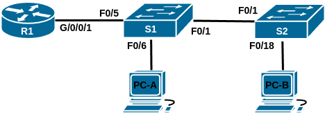
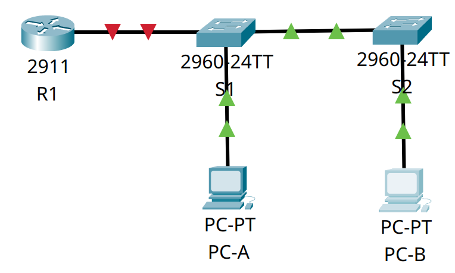
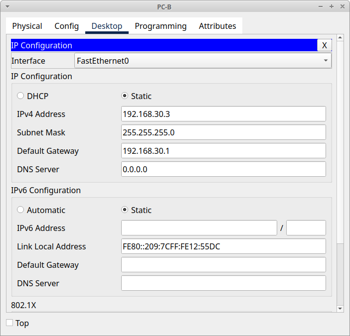

# Домашнее задание №6 «Внедрение маршрутизации между виртуальными локальными сетями»

## Топология



## Таблица адресации

| Устройство | Интерфейс   | IP-адрес      | Маска подсети | Шлюз по умолчанию |
| ---------- | ----------- | ------------- | ------------- | ----------------- |
| R1         | G0/0/1.10   | 192.168.10.1  | 255.255.255.0 | —                 |
|            | G0/0/1.20   | 192.168.20.1  | 255.255.255.0 |                   |
|            | G0/0/1.30   | 192.168.30.1  | 255.255.255.0 |                   |
|            | G0/0/1.1000 | —             | —             |                   |
| S1         | VLAN 10     | 192.168.10.11 | 255.255.255.0 | 192.168.10.1      |
| S2         | VLAN 10     | 192.168.10.12 | 255.255.255.0 | 192.168.10.1      |
| PC-A       | NIC         | 192.168.20.3  | 255.255.255.0 | 192.168.20.1      |
| PC-B       | NIC         | 192.168.30.3  | 255.255.255.0 | 192.168.30.1      |

## Таблица VLAN

| VLAN | Имя         | Назначенный интерфейс                                        |
| ---- | ----------- | ------------------------------------------------------------ |
| 10   | Управление  | S1: VLAN 10<br>S2: VLAN 10                                   |
| 20   | Sales       | S1: F0/6                                                     |
| 30   | Operations  | S2: F0/18                                                    |
| 999  | Parking_Lot | C1: F0/2-4, F0/7-24, G0/1-2<br>C2: F0/2-17, F0/19-24, G0/1-2 |
| 1000 | Собственная | —                                                            |

## Задачи

* [Часть 1. Создание сети и настройка основных параметров устройства.](#часть-1-создание-сети-и-настройка-основных-параметров-устройства)
* [Часть 2. Создание сетей VLAN и назначение портов коммутатора.](#часть-2-создание-сетей-vlan-и-назначение-портов-коммутатора)
* [Часть 3. Настройка магистрального канала между коммутаторами.](#часть-3-настройка-магистрального-канала-между-коммутаторами)
* [Часть 4. Настройка маршрутизации между сетями VLAN.](#часть-4-настройка-маршрутизации-между-сетями-vlan)
* [Часть 5. Проверка маршрутизации между сетями VLAN.](#часть-5-проверка-маршрутизации-между-сетями-vlan)

## Общие сведения/сценарий

В целях повышения производительности сети большие широковещательные домены 2-го
уровня делят на домены меньшего размера. Для этого современные коммутаторы
используют виртуальные локальные сети (VLAN). VLAN также можно использовать в
качестве меры безопасности, отделяя конфиденциальный трафик данных от остальной
части сети. Сети VLAN облегчают процесс проектирования сети, обеспечивающей помощь
в достижении целей организации. Для связи между VLAN требуется устройство,
работающее на уровне 3 модели OSI. Добавление маршрутизации между VLAN позволяет
организации разделять широковещательные домены, одновременно позволяя им
обмениваться данными друг с другом.

Транковые каналы сети VLAN используются для распространения сетей VLAN по
различным устройствам. Транковые каналы разрешают передачу трафика из множества
сетей VLAN через один канал, не нанося вред идентификации и сегментации сети VLAN.
Особый вид маршрутизации между VLAN, называемый «Router-on-a-Stick», использует
магистраль от маршрутизатора к коммутатору, чтобы все VLAN могли переходить к
маршрутизатору.

В этой работе мы создадим VLAN на обоих коммутаторах в топологии, назначим VLAN
для коммутации портов доступа, убедимся, что VLAN работают должным образом,
создадим транки VLAN между двумя коммутаторами и между S1 и R1, и настроим
маршрутизацию между VLAN на R1 для разрешения связи между хостами в разных VLAN
независимо от подсети, в которой находится хост.

**Примечание:** маршрутизаторы, используемые в практических лабораторных работах
CCNA, - это Cisco 4221 с Cisco IOS XE Release 16.9.4 (образ universalk9). В
лабораторных работах используются коммутаторы Cisco Catalyst 2960 с Cisco IOS
версии 15.2(2) (образ lanbasek9). Можно использовать другие маршрутизаторы,
коммутаторы и версии Cisco IOS. В зависимости от модели устройства и версии
Cisco IOS доступные команды и результаты их выполнения могут отличаться от тех,
которые показаны в лабораторных работах. Правильные идентификаторы интерфейса
см. в сводной таблице по интерфейсам маршрутизаторов в конце лабораторной работы.

**Примечание:** убедитесь, что у всех маршрутизаторов и коммутаторов была
удалена начальная конфигурация. Если вы не уверены, обратитесь к инструктору.

## Часть 1. Создание сети и настройка основных параметров устройства

Для моделирования сети будем использовать ПО Cisco Packet Tracer 8.1.1. Создадим
новую конфигурацию, используя следующие ресурсы:

* 1 Маршрутизатор (Cisco 4221 с универсальным образом Cisco IOS XE версии 16.9.4
 или аналогичным);
* 2 коммутатора (Cisco 2960 с ПО Cisco IOS версии 15.2(2) с образом lanbasek9 или
  аналогичная модель);
* 2 ПК (под управлением Windows с программой эмуляции терминала, например, Tera Term);
* консольные кабели для настройки устройств Cisco IOS через консольные порты;
* кабели Ethernet, расположенные в соответствии с топологией.

### Шаг 1. Создание сети

Соединим устройства согласно топологии.



### Шаг 2. Настройка маршрутизатора

Настроим базовые параметры для маршрутизатора.

#### a. Активация привилегированного режима

Подключимся к маршрутизатору с помощью консоли и активируем привилегированный
режим EXEC:

```text
Router>
Router>enable
Router#
```

#### b. Вход в режим конфигурации

Войдём в режим конфигурации:

```text
Router#
Router#configure terminal
Enter configuration commands, one per line.  End with CNTL/Z.
Router(config)#
```

#### c. Смена имени устройства

Для удобства сменим имя маршрутизатора на R1:

```text
Router(config)#
Router(config)#hostname R1
R1(config)#
```

#### d. Отключение поиска DNS

Чтобы предотвратить попытки маршрутизатора неверно преобразовывать введённые
команды таким образом, как будто они являются именами узлов, отключим поиск DNS:

```text
R1(config)#
R1(config)#no ip domain-lookup
R1(config)#
```

#### e. Установка пароля привилегированного режима

Назначим **class** в качестве зашифрованного пароля привилегированного режима EXEC:

```text
R1(config)#
R1(config)#enable secret class
R1(config)#
```

#### f. Установка пароля консоли

Назначим **cisco** в качестве пароля консоли и включим вход в систему по паролю:

```text
R1(config)#
R1(config)#line console 0
R1(config-line)#password cisco
R1(config-line)#login
R1(config-line)#exit
R1(config)#
```

#### g. Установка пароля VTY

Назначим **cisco** в качестве пароля VTY и включим вход в систему по паролю:

```text
R1(config)#
R1(config)#line vty 0 15
R1(config-line)#password cisco
R1(config-line)#login
R1(config-line)#exit
R1(config)#
```

#### h. Включение шифрования паролей

Зашифруем открытые пароли в файле конфигурации:

```text
R1(config)#
R1(config)#service password-encryption
R1(config)#
```

#### i. Создание баннера

Создадим баннер, который предупреждает о запрете несанкционированного доступа:

```text
R1(config)#
R1(config)#banner motd # ATTENTION! Unauthorized access is strictly prohibited. #
R1(config)#
```

#### j. Сохранение конфигурации

```text
R1#copy running-config startup-config 
Destination filename [startup-config]? 
Building configuration...
[OK]
R1#
```

<details>
<summary>show running-config</summary>

```text
R1#show running-config
Building configuration...

Current configuration : 927 bytes
!
version 15.1
no service timestamps log datetime msec
no service timestamps debug datetime msec
service password-encryption
!
hostname R1
!
!
!
enable secret 5 $1$mERr$9cTjUIEqNGurQiFU.ZeCi1
!
!
!
!
!
!
ip cef
no ipv6 cef
!
!
!
!
license udi pid CISCO2911/K9 sn FTX1524153G-
!
!
!
!
!
!
!
!
!
no ip domain-lookup
!
!
spanning-tree mode pvst
!
!
!
!
!
!
interface GigabitEthernet0/0
 no ip address
 duplex auto
 speed auto
 shutdown
!
interface GigabitEthernet0/1
 no ip address
 duplex auto
 speed auto
 shutdown
!
interface GigabitEthernet0/2
 no ip address
 duplex auto
 speed auto
 shutdown
!
interface Vlan1
 no ip address
 shutdown
!
ip classless
!
ip flow-export version 9
!
!
!
banner motd ^C ATTENTION! Unauthorized access is strictly prohibited. ^C
!
!
!
!
!
line con 0
 password 7 0822455D0A16
 login
!
line aux 0
!
line vty 0 4
 password 7 0822455D0A16
 login
line vty 5 15
 password 7 0822455D0A16
 login
!
!
!
end


R1#
```

</details>

#### k. Установка времени

Для установки времени и даты воспользуемся командой **clock set**. Просмотреть
текущее время и дату можно командой **show clock**.

```text
R1#
R1#clock set 12:18:30 11 Dec 2024
R1#
R1#show clock
12:18:35.207 UTC Wed Dec 11 2024
R1#
```

### Шаг 3. Настройка коммутаторов

Настроим базовые параметры каждого коммутатора.

#### a. Установка имени устройства

Подключимся к коммутатору с помощью консольного подключения, активируем
привилегированный режим и сменим имя коммутатора на S1:

```text
Switch>
Switch>enable
Switch#configure terminal
Enter configuration commands, one per line.  End with CNTL/Z.
Switch(config)#hostname S1
S1(config)#
```

#### b. Отключение поиска DNS

Чтобы предотвратить попытки коммутатора неверно преобразовывать введённые
команды таким образом, как будто они являются именами узлов, отключим поиск DNS:

```text
S1(config)#
S1(config)#no ip domain-lookup
S1(config)#
```

#### c. Установка пароля привилегированного режима

Назначим **class** в качестве зашифрованного пароля привилегированного режима EXEC:

```text
S1(config)#
S1(config)#enable secret class
S1(config)#
```

#### d. Установка пароля консоли

Назначим **cisco** в качестве пароля консоли и включим вход в систему по паролю:

```text
S1(config)#
S1(config)#line console 0
S1(config-line)#password cisco
S1(config-line)#login
S1(config-line)#exit
S1(config)#
```

#### e. Установка пароля VTY

Назначим **cisco** в качестве пароля VTY и включим вход в систему по паролю:

```text
S1(config)#
S1(config)#line vty 0 15
S1(config-line)#password cisco
S1(config-line)#login
S1(config-line)#exit
S1(config)#
```

#### f. Включение шифрования паролей

Зашифруем открытые пароли в файле конфигурации:

```text
S1(config)#
S1(config)#service password-encryption
S1(config)#
```

#### g. Создание баннера

Создадим баннер, который предупреждает о запрете несанкционированного доступа:

```text
S1(config)#
S1(config)#banner motd # ATTENTION! Unauthorized access is strictly prohibited. #
S1(config)#
```

#### h. Установка времени

Для установки времени и даты воспользуемся командой **clock set**. Просмотреть
текущее время и дату можно командой **show clock**.

```text
S1#
S1#clock set 13:27:00 11 Dec 2024
S1#
S1#show clock
13:27:4.553 UTC Wed Dec 11 2024
S1#
```

#### i. Сохранение конфигурации

```text
S1#copy running-config startup-config 
Destination filename [startup-config]? 
Building configuration...
[OK]
R1#
```

<details>
<summary>show running-config</summary>

```text
S1#show running-config 
Building configuration...

Current configuration : 1295 bytes
!
version 15.0
no service timestamps log datetime msec
no service timestamps debug datetime msec
service password-encryption
!
hostname S1
!
enable secret 5 $1$mERr$9cTjUIEqNGurQiFU.ZeCi1
!
!
!
no ip domain-lookup
!
!
!
spanning-tree mode pvst
spanning-tree extend system-id
!
interface FastEthernet0/1
!
interface FastEthernet0/2
!
interface FastEthernet0/3
!
interface FastEthernet0/4
!
interface FastEthernet0/5
!
interface FastEthernet0/6
!
interface FastEthernet0/7
!
interface FastEthernet0/8
!
interface FastEthernet0/9
!
interface FastEthernet0/10
!
interface FastEthernet0/11
!
interface FastEthernet0/12
!
interface FastEthernet0/13
!
interface FastEthernet0/14
!
interface FastEthernet0/15
!
interface FastEthernet0/16
!
interface FastEthernet0/17
!
interface FastEthernet0/18
!
interface FastEthernet0/19
!
interface FastEthernet0/20
!
interface FastEthernet0/21
!
interface FastEthernet0/22
!
interface FastEthernet0/23
!
interface FastEthernet0/24
!
interface GigabitEthernet0/1
!
interface GigabitEthernet0/2
!
interface Vlan1
 no ip address
 shutdown
!
banner motd ^C ATTENTION! Unauthorized access is strictly prohibited. ^C
!
!
!
line con 0
 password 7 0822455D0A16
 login
!
line vty 0 4
 password 7 0822455D0A16
 login
line vty 5 15
 password 7 0822455D0A16
 login
!
!
!
!
end


S1#
```

</details>

Аналогичным образом настроим второй коммутатор. Так как команды и вывод будут
идентичными первому, то опустим их.

### Шаг 4. Настройка узлов ПК

Зададим IP-адреса, маску подсети и шлюз по умолчанию для компьютеров PC-A и
PC-B согласно таблице адресации.




## Часть 2. Создание сетей VLAN и назначение портов коммутатора

Во второй части создадим на обоих коммутаторах VLAN, как указано в таблице выше.
Затем назначим VLAN соответствующему интерфейсу и проверим настройки
конфигурации.

### Шаг 1. Настройка сети VLAN на коммутаторах

#### a. Создание VLAN

Создадим и настроим необходимые VLAN на каждом коммутаторе согласно таблице
адресации.

<details>
<summary>Коммутатор <strong>S1</strong></summary>

```text
Press RETURN to get started!

 ATTENTION! Unauthorized access is strictly prohibited. 

User Access Verification

Password: 

S1>
S1>en
Password: 
S1#
S1#conf t
Enter configuration commands, one per line.  End with CNTL/Z.
S1(config)#
S1(config)#vlan 10
S1(config-vlan)#name Management
S1(config-vlan)#exit
S1(config)#vlan 20
S1(config-vlan)#name Sales
S1(config-vlan)#exit
S1(config)#vlan 30
S1(config-vlan)#name Operations
S1(config-vlan)#exit
S1(config)#vlan 999
S1(config-vlan)#name Parking_Lot
S1(config-vlan)#exit
S1(config)#vlan 1000
S1(config-vlan)#name Native
S1(config-vlan)#exit
S1(config)#exit
S1#
%SYS-5-CONFIG_I: Configured from console by console

S1#
S1#show vlan 

VLAN Name                             Status    Ports
---- -------------------------------- --------- -------------------------------
1    default                          active    Fa0/1, Fa0/2, Fa0/3, Fa0/4
                                                Fa0/5, Fa0/6, Fa0/7, Fa0/8
                                                Fa0/9, Fa0/10, Fa0/11, Fa0/12
                                                Fa0/13, Fa0/14, Fa0/15, Fa0/16
                                                Fa0/17, Fa0/18, Fa0/19, Fa0/20
                                                Fa0/21, Fa0/22, Fa0/23, Fa0/24
                                                Gig0/1, Gig0/2
10   Management                       active    
20   Sales                            active    
30   Operations                       active    
999  Parking_Lot                      active    
1000 Native                           active    
1002 fddi-default                     active    
1003 token-ring-default               active    
1004 fddinet-default                  active    
1005 trnet-default                    active    

VLAN Type  SAID       MTU   Parent RingNo BridgeNo Stp  BrdgMode Trans1 Trans2
---- ----- ---------- ----- ------ ------ -------- ---- -------- ------ ------
1    enet  100001     1500  -      -      -        -    -        0      0
10   enet  100010     1500  -      -      -        -    -        0      0
20   enet  100020     1500  -      -      -        -    -        0      0
30   enet  100030     1500  -      -      -        -    -        0      0
999  enet  100999     1500  -      -      -        -    -        0      0
1000 enet  101000     1500  -      -      -        -    -        0      0
1002 fddi  101002     1500  -      -      -        -    -        0      0   
1003 tr    101003     1500  -      -      -        -    -        0      0   
1004 fdnet 101004     1500  -      -      -        ieee -        0      0   
1005 trnet 101005     1500  -      -      -        ibm  -        0      0   

VLAN Type  SAID       MTU   Parent RingNo BridgeNo Stp  BrdgMode Trans1 Trans2
---- ----- ---------- ----- ------ ------ -------- ---- -------- ------ ------

Remote SPAN VLANs
------------------------------------------------------------------------------

Primary Secondary Type              Ports
------- --------- ----------------- ------------------------------------------
S1#
```

</details>

<details>
<summary>Коммутатор <strong>S2</strong></summary>

```text
Press RETURN to get started.

 ATTENTION! Unauthorized access is strictly prohibited. 

User Access Verification

Password: 

S2>en
Password: 
S2#conf t
Enter configuration commands, one per line.  End with CNTL/Z.
S2(config)#vlan 10
S2(config-vlan)#name Management
S2(config-vlan)#exit
S2(config)#vlan 20
S2(config-vlan)#name Sales
S2(config-vlan)#exit
S2(config)#vlan 30
S2(config-vlan)#name Operations
S2(config-vlan)#exit
S2(config)#vlan 999
S2(config-vlan)#name Parking_Lot
S2(config-vlan)#exit
S2(config)#vlan 1000
S2(config-vlan)#name Native
S2(config-vlan)#exit
S2(config)#exit
S2#
%SYS-5-CONFIG_I: Configured from console by console

S2#show vlan

VLAN Name                             Status    Ports
---- -------------------------------- --------- -------------------------------
1    default                          active    Fa0/1, Fa0/2, Fa0/3, Fa0/4
                                                Fa0/5, Fa0/6, Fa0/7, Fa0/8
                                                Fa0/9, Fa0/10, Fa0/11, Fa0/12
                                                Fa0/13, Fa0/14, Fa0/15, Fa0/16
                                                Fa0/17, Fa0/18, Fa0/19, Fa0/20
                                                Fa0/21, Fa0/22, Fa0/23, Fa0/24
                                                Gig0/1, Gig0/2
10   Management                       active    
20   Sales                            active    
30   Operations                       active    
999  Parking_Lot                      active    
1000 Native                           active    
1002 fddi-default                     active    
1003 token-ring-default               active    
1004 fddinet-default                  active    
1005 trnet-default                    active    

VLAN Type  SAID       MTU   Parent RingNo BridgeNo Stp  BrdgMode Trans1 Trans2
---- ----- ---------- ----- ------ ------ -------- ---- -------- ------ ------
1    enet  100001     1500  -      -      -        -    -        0      0
10   enet  100010     1500  -      -      -        -    -        0      0
20   enet  100020     1500  -      -      -        -    -        0      0
30   enet  100030     1500  -      -      -        -    -        0      0
999  enet  100999     1500  -      -      -        -    -        0      0
1000 enet  101000     1500  -      -      -        -    -        0      0
1002 fddi  101002     1500  -      -      -        -    -        0      0   
1003 tr    101003     1500  -      -      -        -    -        0      0   
1004 fdnet 101004     1500  -      -      -        ieee -        0      0   
1005 trnet 101005     1500  -      -      -        ibm  -        0      0   

VLAN Type  SAID       MTU   Parent RingNo BridgeNo Stp  BrdgMode Trans1 Trans2
---- ----- ---------- ----- ------ ------ -------- ---- -------- ------ ------

Remote SPAN VLANs
------------------------------------------------------------------------------

Primary Secondary Type              Ports
------- --------- ----------------- ------------------------------------------
S2#
```

</details>

#### b. Настройка SVI

Настроим интерфейс управления и шлюз по умолчанию на каждом коммутаторе,
используя информацию об IP-адресе в таблице адресации.

Коммутатор **S1**:

```text
S1(config)#interface vlan 10
S1(config-if)#
%LINK-5-CHANGED: Interface Vlan10, changed state to up

S1(config-if)#ip address 192.168.10.11 255.255.255.0
S1(config-if)#no shutdown
S1(config-if)#exit
S1(config)#ip default-gateway 192.168.10.1
S1(config)#
S1#
%SYS-5-CONFIG_I: Configured from console by console

S1#
```

Коммутатор **S2**:

```text
S2(config)#interface vlan 10
S2(config-if)#
%LINK-5-CHANGED: Interface Vlan10, changed state to up

S2(config-if)#ip address 192.168.10.12 255.255.255.0
S2(config-if)#no shutdown
S2(config-if)#exit
S2(config)#ip default-gateway 192.168.10.1
S2(config)#exit
S2#
%SYS-5-CONFIG_I: Configured from console by console

S2#
```

#### c. Назначение неиспользуемых портов

Назначим все неиспользуемые порты коммутатора VLAN Parking_Lot, настроим их для
статического режима доступа и административно деактивируем их.

**Примечание:** команда **interface range** полезна для выполнения этой задачи с
минимальным количеством команд.

Коммутатор **S1** (сообщения о деактивации интерфейса опущены для краткости):

```text
S1(config)#interface range f0/2-4
S1(config-if-range)#switchport mode access
S1(config-if-range)#switchport access vlan 999
S1(config-if-range)#shutdown
S1(config-if-range)#exit
S1(config)#interface range f0/7-24
S1(config-if-range)#switchport mode access
S1(config-if-range)#switchport access vlan 999
S1(config-if-range)#shutdown
S1(config-if-range)#exit
S1(config)#interface range g0/1-2
S1(config-if-range)#switchport mode access
S1(config-if-range)#switchport access vlan 999
S1(config-if-range)#shutdown
S1(config-if-range)#exit
S1(config)#exit
S1#
%SYS-5-CONFIG_I: Configured from console by console

S1#
```

<details>
<summary>show vlan</summary>

```text
S1#show vlan

VLAN Name                             Status    Ports
---- -------------------------------- --------- -------------------------------
1    default                          active    Fa0/1, Fa0/5, Fa0/6
10   Management                       active    
20   Sales                            active    
30   Operations                       active    
999  Parking_Lot                      active    Fa0/2, Fa0/3, Fa0/4, Fa0/7
                                                Fa0/8, Fa0/9, Fa0/10, Fa0/11
                                                Fa0/12, Fa0/13, Fa0/14, Fa0/15
                                                Fa0/16, Fa0/17, Fa0/18, Fa0/19
                                                Fa0/20, Fa0/21, Fa0/22, Fa0/23
                                                Fa0/24, Gig0/1, Gig0/2
1000 Native                           active    
1002 fddi-default                     active    
1003 token-ring-default               active    
1004 fddinet-default                  active    
1005 trnet-default                    active    

VLAN Type  SAID       MTU   Parent RingNo BridgeNo Stp  BrdgMode Trans1 Trans2
---- ----- ---------- ----- ------ ------ -------- ---- -------- ------ ------
1    enet  100001     1500  -      -      -        -    -        0      0
10   enet  100010     1500  -      -      -        -    -        0      0
20   enet  100020     1500  -      -      -        -    -        0      0
30   enet  100030     1500  -      -      -        -    -        0      0
999  enet  100999     1500  -      -      -        -    -        0      0
1000 enet  101000     1500  -      -      -        -    -        0      0
1002 fddi  101002     1500  -      -      -        -    -        0      0   
1003 tr    101003     1500  -      -      -        -    -        0      0   
1004 fdnet 101004     1500  -      -      -        ieee -        0      0   
1005 trnet 101005     1500  -      -      -        ibm  -        0      0   

VLAN Type  SAID       MTU   Parent RingNo BridgeNo Stp  BrdgMode Trans1 Trans2
---- ----- ---------- ----- ------ ------ -------- ---- -------- ------ ------

Remote SPAN VLANs
------------------------------------------------------------------------------

Primary Secondary Type              Ports
------- --------- ----------------- ------------------------------------------
S1#
```

</details>

<details>
<summary>show interfaces status</summary>

```text
S1#show interfaces status
Port      Name               Status       Vlan       Duplex  Speed Type
Fa0/1                        connected    1          auto    auto  10/100BaseTX
Fa0/2                        disabled 999        auto    auto  10/100BaseTX
Fa0/3                        disabled 999        auto    auto  10/100BaseTX
Fa0/4                        disabled 999        auto    auto  10/100BaseTX
Fa0/5                        notconnect   1          auto    auto  10/100BaseTX
Fa0/6                        connected    1          auto    auto  10/100BaseTX
Fa0/7                        disabled 999        auto    auto  10/100BaseTX
Fa0/8                        disabled 999        auto    auto  10/100BaseTX
Fa0/9                        disabled 999        auto    auto  10/100BaseTX
Fa0/10                       disabled 999        auto    auto  10/100BaseTX
Fa0/11                       disabled 999        auto    auto  10/100BaseTX
Fa0/12                       disabled 999        auto    auto  10/100BaseTX
Fa0/13                       disabled 999        auto    auto  10/100BaseTX
Fa0/14                       disabled 999        auto    auto  10/100BaseTX
Fa0/15                       disabled 999        auto    auto  10/100BaseTX
Fa0/16                       disabled 999        auto    auto  10/100BaseTX
Fa0/17                       disabled 999        auto    auto  10/100BaseTX
Fa0/18                       disabled 999        auto    auto  10/100BaseTX
Fa0/19                       disabled 999        auto    auto  10/100BaseTX
Fa0/20                       disabled 999        auto    auto  10/100BaseTX
Fa0/21                       disabled 999        auto    auto  10/100BaseTX
Fa0/22                       disabled 999        auto    auto  10/100BaseTX
Fa0/23                       disabled 999        auto    auto  10/100BaseTX
Fa0/24                       disabled 999        auto    auto  10/100BaseTX
Gig0/1                       disabled 999        auto    auto  10/100BaseTX
Gig0/2                       disabled 999        auto    auto  10/100BaseTX

S1#
```

</details>

Коммутатор **S2** (сообщения о деактивации интерфейса опущены для краткости):

```text
S2(config)#interface range f0/2-17
S2(config-if-range)#switchport mode access
S2(config-if-range)#switchport access vlan 999
S2(config-if-range)#shutdown
S2(config-if-range)#exit
S2(config)#interface range f0/19-24
S2(config-if-range)#switchport mode access
S2(config-if-range)#switchport access vlan 999
S2(config-if-range)#shutdown
S2(config-if-range)#exit
S2(config)#interface range g0/1-2
S2(config-if-range)#switchport mode access
S2(config-if-range)#switchport access vlan 999
S2(config-if-range)#shutdown
S2(config-if-range)#exit
S2(config)#exit
S2#
%SYS-5-CONFIG_I: Configured from console by console

S2#
```

<details>
<summary>show vlan</summary>

```text
S2#show vlan

VLAN Name                             Status    Ports
---- -------------------------------- --------- -------------------------------
1    default                          active    Fa0/1, Fa0/18
10   Management                       active    
20   Sales                            active    
30   Operations                       active    
999  Parking_Lot                      active    Fa0/2, Fa0/3, Fa0/4, Fa0/5
                                                Fa0/6, Fa0/7, Fa0/8, Fa0/9
                                                Fa0/10, Fa0/11, Fa0/12, Fa0/13
                                                Fa0/14, Fa0/15, Fa0/16, Fa0/17
                                                Fa0/19, Fa0/20, Fa0/21, Fa0/22
                                                Fa0/23, Fa0/24, Gig0/1, Gig0/2
1000 Native                           active    
1002 fddi-default                     active    
1003 token-ring-default               active    
1004 fddinet-default                  active    
1005 trnet-default                    active    

VLAN Type  SAID       MTU   Parent RingNo BridgeNo Stp  BrdgMode Trans1 Trans2
---- ----- ---------- ----- ------ ------ -------- ---- -------- ------ ------
1    enet  100001     1500  -      -      -        -    -        0      0
10   enet  100010     1500  -      -      -        -    -        0      0
20   enet  100020     1500  -      -      -        -    -        0      0
30   enet  100030     1500  -      -      -        -    -        0      0
999  enet  100999     1500  -      -      -        -    -        0      0
1000 enet  101000     1500  -      -      -        -    -        0      0
1002 fddi  101002     1500  -      -      -        -    -        0      0   
1003 tr    101003     1500  -      -      -        -    -        0      0   
1004 fdnet 101004     1500  -      -      -        ieee -        0      0   
1005 trnet 101005     1500  -      -      -        ibm  -        0      0   

VLAN Type  SAID       MTU   Parent RingNo BridgeNo Stp  BrdgMode Trans1 Trans2
---- ----- ---------- ----- ------ ------ -------- ---- -------- ------ ------

Remote SPAN VLANs
------------------------------------------------------------------------------

Primary Secondary Type              Ports
------- --------- ----------------- ------------------------------------------
S2#
```

</details>

<details>
<summary>show interfaces status</summary>

```text
S2#show interfaces status
Port      Name               Status       Vlan       Duplex  Speed Type
Fa0/1                        connected    1          auto    auto  10/100BaseTX
Fa0/2                        disabled 999        auto    auto  10/100BaseTX
Fa0/3                        disabled 999        auto    auto  10/100BaseTX
Fa0/4                        disabled 999        auto    auto  10/100BaseTX
Fa0/5                        disabled 999        auto    auto  10/100BaseTX
Fa0/6                        disabled 999        auto    auto  10/100BaseTX
Fa0/7                        disabled 999        auto    auto  10/100BaseTX
Fa0/8                        disabled 999        auto    auto  10/100BaseTX
Fa0/9                        disabled 999        auto    auto  10/100BaseTX
Fa0/10                       disabled 999        auto    auto  10/100BaseTX
Fa0/11                       disabled 999        auto    auto  10/100BaseTX
Fa0/12                       disabled 999        auto    auto  10/100BaseTX
Fa0/13                       disabled 999        auto    auto  10/100BaseTX
Fa0/14                       disabled 999        auto    auto  10/100BaseTX
Fa0/15                       disabled 999        auto    auto  10/100BaseTX
Fa0/16                       disabled 999        auto    auto  10/100BaseTX
Fa0/17                       disabled 999        auto    auto  10/100BaseTX
Fa0/18                       connected    1          auto    auto  10/100BaseTX
Fa0/19                       disabled 999        auto    auto  10/100BaseTX
Fa0/20                       disabled 999        auto    auto  10/100BaseTX
Fa0/21                       disabled 999        auto    auto  10/100BaseTX
Fa0/22                       disabled 999        auto    auto  10/100BaseTX
Fa0/23                       disabled 999        auto    auto  10/100BaseTX
Fa0/24                       disabled 999        auto    auto  10/100BaseTX
Gig0/1                       disabled 999        auto    auto  10/100BaseTX
Gig0/2                       disabled 999        auto    auto  10/100BaseTX

S2#
```

</details>

### Шаг 2. Присвоение VLAN соответствующим интерфейсам коммутатора

#### a. Назначение используемых портов

Назначим используемые порты соответствующей VLAN (указанной в таблице VLAN выше)
и настроим их для режима статического доступа.

Коммутатор **S1**:

```text
S1(config)#interface f0/6
S1(config-if)#switchport mode access
S1(config-if)#switchport access vlan 20
S1(config-if)#no shutdown
S1(config-if)#exit
S1(config)#exit
S1#
%SYS-5-CONFIG_I: Configured from console by console

S1#
```

Коммутатор **S2**:

```text
S2(config)#interface f0/18
S2(config-if)#switchport mode access
S2(config-if)#switchport access vlan 30
S2(config-if)#no shutdown
S2(config-if)#end
S2#
%SYS-5-CONFIG_I: Configured from console by console

S2#
```

#### b. Проверка настроек VLAN

Убедимся, что VLAN назначены на правильные интерфейсы.

<details>
<summary>S1# show vlan</summary>

```text
S2#show vlan

VLAN Name                             Status    Ports
---- -------------------------------- --------- -------------------------------
1    default                          active    Fa0/1
10   Management                       active    
20   Sales                            active    
30   Operations                       active    Fa0/18
999  Parking_Lot                      active    Fa0/2, Fa0/3, Fa0/4, Fa0/5
                                                Fa0/6, Fa0/7, Fa0/8, Fa0/9
                                                Fa0/10, Fa0/11, Fa0/12, Fa0/13
                                                Fa0/14, Fa0/15, Fa0/16, Fa0/17
                                                Fa0/19, Fa0/20, Fa0/21, Fa0/22
                                                Fa0/23, Fa0/24, Gig0/1, Gig0/2
1000 Native                           active    
1002 fddi-default                     active    
1003 token-ring-default               active    
1004 fddinet-default                  active    
1005 trnet-default                    active    

VLAN Type  SAID       MTU   Parent RingNo BridgeNo Stp  BrdgMode Trans1 Trans2
---- ----- ---------- ----- ------ ------ -------- ---- -------- ------ ------
1    enet  100001     1500  -      -      -        -    -        0      0
10   enet  100010     1500  -      -      -        -    -        0      0
20   enet  100020     1500  -      -      -        -    -        0      0
30   enet  100030     1500  -      -      -        -    -        0      0
999  enet  100999     1500  -      -      -        -    -        0      0
1000 enet  101000     1500  -      -      -        -    -        0      0
1002 fddi  101002     1500  -      -      -        -    -        0      0   
1003 tr    101003     1500  -      -      -        -    -        0      0   
1004 fdnet 101004     1500  -      -      -        ieee -        0      0   
1005 trnet 101005     1500  -      -      -        ibm  -        0      0   

VLAN Type  SAID       MTU   Parent RingNo BridgeNo Stp  BrdgMode Trans1 Trans2
---- ----- ---------- ----- ------ ------ -------- ---- -------- ------ ------

Remote SPAN VLANs
------------------------------------------------------------------------------

Primary Secondary Type              Ports
------- --------- ----------------- ------------------------------------------
S2#
```

</details>

<details>
<summary>S1# show vlan</summary>

```text
S1#show vlan

VLAN Name                             Status    Ports
---- -------------------------------- --------- -------------------------------
1    default                          active    Fa0/1, Fa0/5
10   Management                       active    
20   Sales                            active    Fa0/6
30   Operations                       active    
999  Parking_Lot                      active    Fa0/2, Fa0/3, Fa0/4, Fa0/7
                                                Fa0/8, Fa0/9, Fa0/10, Fa0/11
                                                Fa0/12, Fa0/13, Fa0/14, Fa0/15
                                                Fa0/16, Fa0/17, Fa0/18, Fa0/19
                                                Fa0/20, Fa0/21, Fa0/22, Fa0/23
                                                Fa0/24, Gig0/1, Gig0/2
1000 Native                           active    
1002 fddi-default                     active    
1003 token-ring-default               active    
1004 fddinet-default                  active    
1005 trnet-default                    active    

VLAN Type  SAID       MTU   Parent RingNo BridgeNo Stp  BrdgMode Trans1 Trans2
---- ----- ---------- ----- ------ ------ -------- ---- -------- ------ ------
1    enet  100001     1500  -      -      -        -    -        0      0
10   enet  100010     1500  -      -      -        -    -        0      0
20   enet  100020     1500  -      -      -        -    -        0      0
30   enet  100030     1500  -      -      -        -    -        0      0
999  enet  100999     1500  -      -      -        -    -        0      0
1000 enet  101000     1500  -      -      -        -    -        0      0
1002 fddi  101002     1500  -      -      -        -    -        0      0   
1003 tr    101003     1500  -      -      -        -    -        0      0   
1004 fdnet 101004     1500  -      -      -        ieee -        0      0   
1005 trnet 101005     1500  -      -      -        ibm  -        0      0   

VLAN Type  SAID       MTU   Parent RingNo BridgeNo Stp  BrdgMode Trans1 Trans2
---- ----- ---------- ----- ------ ------ -------- ---- -------- ------ ------

Remote SPAN VLANs
------------------------------------------------------------------------------

Primary Secondary Type              Ports
------- --------- ----------------- ------------------------------------------
S1#
```

</details>

## Часть 3. Настройка магистрального канала между коммутаторами

В части 3 мы вручную настроим интерфейс **F0/1** как магистральный канал (транк).

### Шаг 1. Настройка магистрального интерфейса на коммутаторах

Вручную настроим магистральный интерфейс **F0/1** на коммутаторах **S1** и **S2**.

#### a. Настройка транка на интерфейсе F0/1

Зададим статический транкинг на интерфейсе F0/1 для обоих коммутаторов.

Коммутатор **S1**:

```text
S1(config)#interface f0/1
S1(config-if)#switchport mode trunk

S1(config-if)#
%LINEPROTO-5-UPDOWN: Line protocol on Interface FastEthernet0/1, changed state to down

%LINEPROTO-5-UPDOWN: Line protocol on Interface FastEthernet0/1, changed state to up

%LINEPROTO-5-UPDOWN: Line protocol on Interface Vlan10, changed state to up

S1(config-if)#exit
S1(config)#
```

После включения транка на **F0/1** **S1** на втором коммутаторе протокол STP
заблокировал VLAN 1:

```text
%SPANTREE-2-RECV_PVID_ERR: Received 802.1Q BPDU on non trunk FastEthernet0/1 VLAN1.

%SPANTREE-2-BLOCK_PVID_LOCAL: Blocking FastEthernet0/1 on VLAN0001. Inconsistent port type.


%LINEPROTO-5-UPDOWN: Line protocol on Interface FastEthernet0/1, changed state to down

%LINEPROTO-5-UPDOWN: Line protocol on Interface FastEthernet0/1, changed state to up

%LINEPROTO-5-UPDOWN: Line protocol on Interface Vlan10, changed state to up
```

Настроим транк на втором коммутаторе:

```text
S2(config)#interface f0/1
S2(config-if)#switchport mode trunk
S2(config-if)#exit
```

#### b. Установка native VLAN 1000

Определим VLAN 1000 в качестве native на обоих коммутаторах:

```text
S1(config)#interface f0/1
S1(config-if)#switchport trunk native vlan 1000
S1(config-if)#%SPANTREE-2-RECV_PVID_ERR: Received BPDU with inconsistent peer vlan id 1 on FastEthernet0/1 VLAN1000.

%SPANTREE-2-BLOCK_PVID_LOCAL: Blocking FastEthernet0/1 on VLAN1000. Inconsistent local vlan.


S1(config-if)#end
S1#
%SYS-5-CONFIG_I: Configured from console by console

S1#
```

```text
S2(config)#interface f0/1
S2(config-if)#switchport trunk native vlan 1000
S2(config-if)#end
S2#
%SYS-5-CONFIG_I: Configured from console by console

S2#
```

После установки на втором коммутаторе такой же нативной VLAN, как и на первом,
интерфейс **F0/1** на  **S1** разблокировался:

```text
%CDP-4-NATIVE_VLAN_MISMATCH: Native VLAN mismatch discovered on FastEthernet0/1 (1000), with S2 FastEthernet0/1 (1).
%SPANTREE-2-UNBLOCK_CONSIST_PORT: Unblocking FastEthernet0/1 on VLAN0001. Port consistency restored.

%SPANTREE-2-UNBLOCK_CONSIST_PORT: Unblocking FastEthernet0/1 on VLAN1000. Port consistency restored.
```

#### c. Настройка допустимых VLAN для транка

Укажем, что VLAN 10, 20, 30 и 1000 могут проходить по транку:

```text
S1(config)#interface f0/1
S1(config-if)#switchport trunk allowed vlan 10,20,30,1000
S1(config-if)#end
S1#
%SYS-5-CONFIG_I: Configured from console by console

S1#
```

```text
S2(config)#interface f0/1
S2(config-if)#switchport trunk allowed vlan 10,20,30,1000
S2(config-if)#end
S2#
%SYS-5-CONFIG_I: Configured from console by console

S2#
```

#### d. Проверка настроек

Проверим транки, native VLAN и разрешённые VLAN через транк.

Коммутатор **S1**:

```text
S1#show interfaces f0/1 switchport 
Name: Fa0/1
Switchport: Enabled
Administrative Mode: trunk
Operational Mode: trunk
Administrative Trunking Encapsulation: dot1q
Operational Trunking Encapsulation: dot1q
Negotiation of Trunking: On
Access Mode VLAN: 1 (default)
Trunking Native Mode VLAN: 1000 (Native)
Voice VLAN: none
Administrative private-vlan host-association: none
Administrative private-vlan mapping: none
Administrative private-vlan trunk native VLAN: none
Administrative private-vlan trunk encapsulation: dot1q
Administrative private-vlan trunk normal VLANs: none
Administrative private-vlan trunk private VLANs: none
Operational private-vlan: none
Trunking VLANs Enabled: 10,20,30,1000
Pruning VLANs Enabled: 2-1001
Capture Mode Disabled
Capture VLANs Allowed: ALL
Protected: false
Unknown unicast blocked: disabled
Unknown multicast blocked: disabled
Appliance trust: none


S1#
```

### Шаг 2. Настройка магистрального интерфейса до маршрутизатора

Настроим вручную магистральный интерфейс **F0/5** на коммутаторе **S1**.

#### a. Настройка интерфейса S1 F0/5

Настроим интерфейс S1 F0/5 с теми же параметрами транка, что и F0/1. Это транк
до маршрутизатора.

```text
S1(config)#interface f0/5
S1(config-if)#switchport mode trunk
S1(config-if)#switchport trunk native vlan 1000
S1(config-if)#switchport trunk allowed vlan 10,20,30,1000
S1(config-if)#no shutdown
S1(config-if)#end
S1#
%SYS-5-CONFIG_I: Configured from console by console

S1#
```

#### b. Сохранение конфигурации

Сохраним текущую конфигурацию в файл загрузочной конфигурации.

```text
S1#copy run start
Destination filename [startup-config]? 
Building configuration...
[OK]
S1#
```

```text
S2#copy run start
Destination filename [startup-config]? 
Building configuration...
[OK]
S2#
```

<details>
<summary>S1# show running-config</summary>

```text
S1#show running-config
Building configuration...

Current configuration : 3071 bytes
!
version 15.0
no service timestamps log datetime msec
no service timestamps debug datetime msec
service password-encryption
!
hostname S1
!
enable secret 5 $1$mERr$9cTjUIEqNGurQiFU.ZeCi1
!
!
!
no ip domain-lookup
!
!
!
spanning-tree mode pvst
spanning-tree extend system-id
!
interface FastEthernet0/1
 switchport trunk native vlan 1000
 switchport trunk allowed vlan 10,20,30,1000
 switchport mode trunk
!
interface FastEthernet0/2
 switchport access vlan 999
 switchport mode access
 shutdown
!
interface FastEthernet0/3
 switchport access vlan 999
 switchport mode access
 shutdown
!
interface FastEthernet0/4
 switchport access vlan 999
 switchport mode access
 shutdown
!
interface FastEthernet0/5
 switchport trunk native vlan 1000
 switchport trunk allowed vlan 10,20,30,1000
 switchport mode trunk
!
interface FastEthernet0/6
 switchport access vlan 20
 switchport mode access
!
interface FastEthernet0/7
 switchport access vlan 999
 switchport mode access
 shutdown
!
interface FastEthernet0/8
 switchport access vlan 999
 switchport mode access
 shutdown
!
interface FastEthernet0/9
 switchport access vlan 999
 switchport mode access
 shutdown
!
interface FastEthernet0/10
 switchport access vlan 999
 switchport mode access
 shutdown
!
interface FastEthernet0/11
 switchport access vlan 999
 switchport mode access
 shutdown
!
interface FastEthernet0/12
 switchport access vlan 999
 switchport mode access
 shutdown
!
interface FastEthernet0/13
 switchport access vlan 999
 switchport mode access
 shutdown
!
interface FastEthernet0/14
 switchport access vlan 999
 switchport mode access
 shutdown
!
interface FastEthernet0/15
 switchport access vlan 999
 switchport mode access
 shutdown
!
interface FastEthernet0/16
 switchport access vlan 999
 switchport mode access
 shutdown
!
interface FastEthernet0/17
 switchport access vlan 999
 switchport mode access
 shutdown
!
interface FastEthernet0/18
 switchport access vlan 999
 switchport mode access
 shutdown
!
interface FastEthernet0/19
 switchport access vlan 999
 switchport mode access
 shutdown
!
interface FastEthernet0/20
 switchport access vlan 999
 switchport mode access
 shutdown
!
interface FastEthernet0/21
 switchport access vlan 999
 switchport mode access
 shutdown
!
interface FastEthernet0/22
 switchport access vlan 999
 switchport mode access
 shutdown
!
interface FastEthernet0/23
 switchport access vlan 999
 switchport mode access
 shutdown
!
interface FastEthernet0/24
 switchport access vlan 999
 switchport mode access
 shutdown
!
interface GigabitEthernet0/1
 switchport access vlan 999
 switchport mode access
 shutdown
!
interface GigabitEthernet0/2
 switchport access vlan 999
 switchport mode access
 shutdown
!
interface Vlan1
 no ip address
 shutdown
!
interface Vlan10
 ip address 192.168.10.11 255.255.255.0
!
ip default-gateway 192.168.10.1
!
banner motd ^C ATTENTION! Unauthorized access is strictly prohibited. ^C
!
!
!
line con 0
 password 7 0822455D0A16
 login
!
line vty 0 4
 password 7 0822455D0A16
 login
line vty 5 15
 password 7 0822455D0A16
 login
!
!
!
!
end


S1#
```

</details>

<details>
<summary>S2# show running-config</summary>

```text
S2#show running-config 
Building configuration...

Current configuration : 3030 bytes
!
version 15.0
no service timestamps log datetime msec
no service timestamps debug datetime msec
service password-encryption
!
hostname S2
!
enable secret 5 $1$mERr$9cTjUIEqNGurQiFU.ZeCi1
!
!
!
no ip domain-lookup
!
!
!
spanning-tree mode pvst
spanning-tree extend system-id
!
interface FastEthernet0/1
 switchport trunk native vlan 1000
 switchport trunk allowed vlan 10,20,30,1000
 switchport mode trunk
!
interface FastEthernet0/2
 switchport access vlan 999
 switchport mode access
 shutdown
!
interface FastEthernet0/3
 switchport access vlan 999
 switchport mode access
 shutdown
!
interface FastEthernet0/4
 switchport access vlan 999
 switchport mode access
 shutdown
!
interface FastEthernet0/5
 switchport access vlan 999
 switchport mode access
 shutdown
!
interface FastEthernet0/6
 switchport access vlan 999
 switchport mode access
 shutdown
!
interface FastEthernet0/7
 switchport access vlan 999
 switchport mode access
 shutdown
!
interface FastEthernet0/8
 switchport access vlan 999
 switchport mode access
 shutdown
!
interface FastEthernet0/9
 switchport access vlan 999
 switchport mode access
 shutdown
!
interface FastEthernet0/10
 switchport access vlan 999
 switchport mode access
 shutdown
!
interface FastEthernet0/11
 switchport access vlan 999
 switchport mode access
 shutdown
!
interface FastEthernet0/12
 switchport access vlan 999
 switchport mode access
 shutdown
!
interface FastEthernet0/13
 switchport access vlan 999
 switchport mode access
 shutdown
!
interface FastEthernet0/14
 switchport access vlan 999
 switchport mode access
 shutdown
!
interface FastEthernet0/15
 switchport access vlan 999
 switchport mode access
 shutdown
!
interface FastEthernet0/16
 switchport access vlan 999
 switchport mode access
 shutdown
!
interface FastEthernet0/17
 switchport access vlan 999
 switchport mode access
 shutdown
!
interface FastEthernet0/18
 switchport access vlan 30
 switchport mode access
!
interface FastEthernet0/19
 switchport access vlan 999
 switchport mode access
 shutdown
!
interface FastEthernet0/20
 switchport access vlan 999
 switchport mode access
 shutdown
!
interface FastEthernet0/21
 switchport access vlan 999
 switchport mode access
 shutdown
!
interface FastEthernet0/22
 switchport access vlan 999
 switchport mode access
 shutdown
!
interface FastEthernet0/23
 switchport access vlan 999
 switchport mode access
 shutdown
!
interface FastEthernet0/24
 switchport access vlan 999
 switchport mode access
 shutdown
!
interface GigabitEthernet0/1
 switchport access vlan 999
 switchport mode access
 shutdown
!
interface GigabitEthernet0/2
 switchport access vlan 999
 switchport mode access
 shutdown
!
interface Vlan1
 no ip address
 shutdown
!
interface Vlan10
 ip address 192.168.10.12 255.255.255.0
!
ip default-gateway 192.168.10.1
!
banner motd ^C ATTENTION! Unauthorized access is strictly prohibited. ^C
!
!
!
line con 0
 password 7 0822455D0A16
 login
!
line vty 0 4
 password 7 0822455D0A16
 login
line vty 5 15
 password 7 0822455D0A16
 login
!
!
!
!
end


S2#
```

</details>

#### c. Проверка транкинга

Проверим настройки магистрального порта **F0/5**.

```text
S1#show interfaces f0/5 switchport
Name: Fa0/5
Switchport: Enabled
Administrative Mode: trunk
Operational Mode: down
Administrative Trunking Encapsulation: dot1q
Operational Trunking Encapsulation: dot1q
Negotiation of Trunking: On
Access Mode VLAN: 1 (default)
Trunking Native Mode VLAN: 1000 (Native)
Voice VLAN: none
Administrative private-vlan host-association: none
Administrative private-vlan mapping: none
Administrative private-vlan trunk native VLAN: none
Administrative private-vlan trunk encapsulation: dot1q
Administrative private-vlan trunk normal VLANs: none
Administrative private-vlan trunk private VLANs: none
Operational private-vlan: none
Trunking VLANs Enabled: 10,20,30,1000
Pruning VLANs Enabled: 2-1001
Capture Mode Disabled
Capture VLANs Allowed: ALL
Protected: false
Unknown unicast blocked: disabled
Unknown multicast blocked: disabled
Appliance trust: none


S1#
```

**Вопрос:** что произойдёт, если G0/0/1 на R1 будет отключен?

**Ответ:** интерфейс **F0/5** на **S1** исчезнет из списка транк интерфейсов. Также станет невозможна маршрутизация между VLAN`ами (которую мы настроим далее).

<details>
<summary>Лог отключения на <strong>S1</strong></summary>

```text
S1#show interfaces trunk
Port        Mode         Encapsulation  Status        Native vlan
Fa0/1       on           802.1q         trunking      1000
Fa0/5       on           802.1q         trunking      1000

Port        Vlans allowed on trunk
Fa0/1       10,20,30,1000
Fa0/5       10,20,30,1000

Port        Vlans allowed and active in management domain
Fa0/1       10,20,30,1000
Fa0/5       10,20,30,1000

Port        Vlans in spanning tree forwarding state and not pruned
Fa0/1       10,20,30,1000
Fa0/5       10,20,30,1000

S1#
%LINK-3-UPDOWN: Interface FastEthernet0/5, changed state to down

%LINEPROTO-5-UPDOWN: Line protocol on Interface FastEthernet0/5, changed state to down

S1#show interfaces trunk
Port        Mode         Encapsulation  Status        Native vlan
Fa0/1       on           802.1q         trunking      1000

Port        Vlans allowed on trunk
Fa0/1       10,20,30,1000

Port        Vlans allowed and active in management domain
Fa0/1       10,20,30,1000

Port        Vlans in spanning tree forwarding state and not pruned
Fa0/1       10,20,30,1000

S1#
```

</details>

## Часть 4. Настройка маршрутизации между сетями VLAN

Настроим маршрутизацию между сетями VLAN, используя **R1** в качестве "Router-on-a-Stick".

### Шаг 1. Настройка маршрутизатора

#### a. Активация интерфейса на маршрутизаторе

Активируем интерфейс **G0/1** на маршрутизаторе **R1**:

```text
R1(config)#interface g0/1
R1(config-if)#description Trunk link to S1
R1(config-if)#no shutdown

R1(config-if)#
%LINK-5-CHANGED: Interface GigabitEthernet0/1, changed state to up

%LINEPROTO-5-UPDOWN: Line protocol on Interface GigabitEthernet0/1, changed state to up

R1(config-if)#exit
R1(config)#
```

#### b. Настройка подинтерфейсов

Настроим подинтерфейсы (сабинтерфейсы) для каждой VLAN, как указано в таблице
IP-адресации. Все подинтерфейсы используют инкапсуляцию 802.1Q. Убедимся, что
подинтерфейсу для native VLAN не назначен IP-адрес. Включим описание для каждого
подинтерфейса.

**VLAN 10**:

```text
R1(config)#interface g0/1.10
R1(config-subif)#
%LINK-5-CHANGED: Interface GigabitEthernet0/1.10, changed state to up

%LINEPROTO-5-UPDOWN: Line protocol on Interface GigabitEthernet0/1.10, changed state to up

R1(config-subif)#description Default gateway for VLAN 10
R1(config-subif)#encapsulation dot1q 10
R1(config-subif)#ip address 192.168.10.1 255.255.255.0
R1(config-subif)#exit
```

**VLAN 20**:

```text
R1(config)#interface g0/1.20
R1(config-subif)#
%LINK-5-CHANGED: Interface GigabitEthernet0/1.20, changed state to up

%LINEPROTO-5-UPDOWN: Line protocol on Interface GigabitEthernet0/1.20, changed state to up

R1(config-subif)#description Default gateway for VLAN 20
R1(config-subif)#encapsulation dot1q 20
R1(config-subif)#ip address 192.168.20.1 255.255.255.0
R1(config-subif)#exit
```

**VLAN 30**:

```text
R1(config)#interface g0/1.30
R1(config-subif)#
%LINK-5-CHANGED: Interface GigabitEthernet0/1.30, changed state to up

%LINEPROTO-5-UPDOWN: Line protocol on Interface GigabitEthernet0/1.30, changed state to up

R1(config-subif)#description Default gateway for VLAN 30
R1(config-subif)#encapsulation dot1q 30
R1(config-subif)#ip address 192.168.30.1 255.255.255.0
R1(config-subif)#exit
```

**VLAN 1000** (native):

```text
R1(config)#interface g0/1.1000
R1(config-subif)#
%LINK-5-CHANGED: Interface GigabitEthernet0/1.1000, changed state to up

%LINEPROTO-5-UPDOWN: Line protocol on Interface GigabitEthernet0/1.1000, changed state to up

R1(config-subif)#description Native VLAN 1000
R1(config-subif)#encapsulation dot1q 1000 native
R1(config-subif)#exit
```


#### c. Проверка сабинтерфейсов

Убедимся, что вспомогательные интерфейсы работают.

**VLAN 10**:

```text
R1#show interfaces g0/1.10
GigabitEthernet0/1.10 is up, line protocol is up (connected)
  Hardware is PQUICC_FEC, address is 0001.63ee.1802 (bia 0001.63ee.1802)
  Internet address is 192.168.10.1/24
  MTU 1500 bytes, BW 100000 Kbit, DLY 100 usec, 
     reliability 255/255, txload 1/255, rxload 1/255
  Encapsulation 802.1Q Virtual LAN, Vlan ID 10
  ARP type: ARPA, ARP Timeout 04:00:00, 
  Last clearing of "show interface" counters never
```

**VLAN 20**:

```text
R1#show interfaces g0/1.20
GigabitEthernet0/1.20 is up, line protocol is up (connected)
  Hardware is PQUICC_FEC, address is 0001.63ee.1802 (bia 0001.63ee.1802)
  Internet address is 192.168.20.1/24
  MTU 1500 bytes, BW 100000 Kbit, DLY 100 usec, 
     reliability 255/255, txload 1/255, rxload 1/255
  Encapsulation 802.1Q Virtual LAN, Vlan ID 20
  ARP type: ARPA, ARP Timeout 04:00:00, 
  Last clearing of "show interface" counters never
```

**VLAN 30**:

```text
R1#show interfaces g0/1.30
GigabitEthernet0/1.30 is up, line protocol is up (connected)
  Hardware is PQUICC_FEC, address is 0001.63ee.1802 (bia 0001.63ee.1802)
  Internet address is 192.168.30.1/24
  MTU 1500 bytes, BW 100000 Kbit, DLY 100 usec, 
     reliability 255/255, txload 1/255, rxload 1/255
  Encapsulation 802.1Q Virtual LAN, Vlan ID 30
  ARP type: ARPA, ARP Timeout 04:00:00, 
  Last clearing of "show interface" counters never
```

**VLAN 1000** (native):

```text
R1#show interfaces g0/1.1000
GigabitEthernet0/1.1000 is up, line protocol is up (connected)
  Hardware is PQUICC_FEC, address is 0001.63ee.1802 (bia 0001.63ee.1802)
  MTU 1500 bytes, BW 100000 Kbit, DLY 100 usec, 
     reliability 255/255, txload 1/255, rxload 1/255
  Encapsulation 802.1Q Virtual LAN, Vlan ID 1000
  ARP type: ARPA, ARP Timeout 04:00:00, 
  Last clearing of "show interface" counters never
```

**g0/1**:

```text
R1#show interfaces g0/1
GigabitEthernet0/1 is up, line protocol is up (connected)
  Hardware is CN Gigabit Ethernet, address is 0001.63ee.1802 (bia 0001.63ee.1802)
  Description: Trunk link to S1
  MTU 1500 bytes, BW 1000000 Kbit, DLY 100 usec,
     reliability 255/255, txload 1/255, rxload 1/255
  Encapsulation ARPA, loopback not set
  Keepalive set (10 sec)
  Full-duplex, 100Mb/s, media type is RJ45
  output flow-control is unsupported, input flow-control is unsupported
  ARP type: ARPA, ARP Timeout 04:00:00, 
  Last input 00:00:08, output 00:00:05, output hang never
  Last clearing of "show interface" counters never
  Input queue: 0/75/0 (size/max/drops); Total output drops: 0
  Queueing strategy: fifo
  Output queue :0/40 (size/max)
  5 minute input rate 0 bits/sec, 0 packets/sec
  5 minute output rate 0 bits/sec, 0 packets/sec
     0 packets input, 0 bytes, 0 no buffer
     Received 0 broadcasts, 0 runts, 0 giants, 0 throttles
     0 input errors, 0 CRC, 0 frame, 0 overrun, 0 ignored, 0 abort
     0 watchdog, 1017 multicast, 0 pause input
     0 input packets with dribble condition detected
     0 packets output, 0 bytes, 0 underruns
     0 output errors, 0 collisions, 2 interface resets
     0 unknown protocol drops
     0 babbles, 0 late collision, 0 deferred
     0 lost carrier, 0 no carrier
     0 output buffer failures, 0 output buffers swapped out

R1#
```

**IP-адреса**:

```text
R1#show ip interface brief
Interface              IP-Address      OK? Method Status                Protocol 
GigabitEthernet0/0     unassigned      YES unset  administratively down down 
GigabitEthernet0/1     unassigned      YES unset  up                    up 
GigabitEthernet0/1.10  192.168.10.1    YES manual up                    up 
GigabitEthernet0/1.20  192.168.20.1    YES manual up                    up 
GigabitEthernet0/1.30  192.168.30.1    YES manual up                    up 
GigabitEthernet0/1.1000unassigned      YES unset  up                    up 
GigabitEthernet0/2     unassigned      YES unset  administratively down down 
Vlan1                  unassigned      YES unset  administratively down down
R1#
```

## Часть 5. Проверка маршрутизации между сетями VLAN

### Шаг 1. Проверка маршрутизации с ПК PC-A

Выполним тесты маршрутизации с **PC-A**. Всё должно быть успешно.

**Примечание:** возможно, придётся отключить брандмауэр ПК для работы **ping**.

#### a. Проверка связи с шлюзом по умолчанию

Отправим эхо-запрос с **PC-A** на шлюз по умолчанию:

```text
C:\>ping 192.168.20.1

Pinging 192.168.20.1 with 32 bytes of data:

Reply from 192.168.20.1: bytes=32 time<1ms TTL=255
Reply from 192.168.20.1: bytes=32 time<1ms TTL=255
Reply from 192.168.20.1: bytes=32 time<1ms TTL=255
Reply from 192.168.20.1: bytes=32 time<1ms TTL=255

Ping statistics for 192.168.20.1:
    Packets: Sent = 4, Received = 4, Lost = 0 (0% loss),
Approximate round trip times in milli-seconds:
    Minimum = 0ms, Maximum = 0ms, Average = 0ms

C:\>
```

#### b. Проверка связи с ПК PC-B

Отправим эхо-запрос с **PC-A** на **PC-B**:

```text
C:\>ping 192.168.30.3

Pinging 192.168.30.3 with 32 bytes of data:

Request timed out.
Reply from 192.168.30.3: bytes=32 time<1ms TTL=127
Reply from 192.168.30.3: bytes=32 time<1ms TTL=127
Reply from 192.168.30.3: bytes=32 time<1ms TTL=127

Ping statistics for 192.168.30.3:
    Packets: Sent = 4, Received = 3, Lost = 1 (25% loss),
Approximate round trip times in milli-seconds:
    Minimum = 0ms, Maximum = 0ms, Average = 0ms

C:\>
```

#### c. Проверка связи с коммутатором S2

Отправим команду **ping** с компьютера **PC-A** на коммутатор **S2**:

```text
C:\>ping 192.168.10.12

Pinging 192.168.10.12 with 32 bytes of data:

Request timed out.
Request timed out.
Reply from 192.168.10.12: bytes=32 time<1ms TTL=254
Reply from 192.168.10.12: bytes=32 time<1ms TTL=254

Ping statistics for 192.168.10.12:
    Packets: Sent = 4, Received = 2, Lost = 2 (50% loss),
Approximate round trip times in milli-seconds:
    Minimum = 0ms, Maximum = 0ms, Average = 0ms

C:\>
```

### Шаг 2. Проверка маршрутизации с ПК PC-B

В окне командной строки на **PC-B** выполним команду **tracert** на адрес **PC-A**.

```text
C:\>tracert 192.168.20.3

Tracing route to 192.168.20.3 over a maximum of 30 hops: 

  1   0 ms      0 ms      0 ms      192.168.30.1
  2   0 ms      0 ms      0 ms      192.168.20.3

Trace complete.

C:\>
```

**Вопрос:** какие промежуточные IP-адреса отображаются в результатах?

**Ответ:** адрес шлюза по умолчанию для VLAN 30 (192.168.30.1), расположенный на
сабинтерфейсе g0/1.30 маршрутизатора **R1**.

## Сводная таблица по интерфейсам маршрутизаторов

| Модель маршрутизатора | Интерфейс Ethernet №1           | Интерфейс Ethernet №2           | Последовательный интерфейс №1 | Последовательный интерфейс №2 |
| --------------------- | ------------------------------- | ------------------------------- | ----------------------------- | ----------------------------- |
| 1800                  | Fast Ethernet 0/0 (F0/0)        | Fast Ethernet 0/1 (F0/1)        | Serial 0/0/0 (S0/0/0)         | Serial 0/0/1 (S0/0/1)         |
| 1900                  | Gigabit Ethernet 0/0 (G0/0)     | Gigabit Ethernet 0/1 (G0/1)     | Serial 0/0/0 (S0/0/0)         | Serial 0/0/1 (S0/0/1)         |
| 2801                  | Fast Ethernet 0/0 (F0/0)        | Fast Ethernet 0/1 (F0/1)        | Serial 0/1/0 (S0/1/0)         | Serial 0/1/1 (S0/1/1)         |
| 2811                  | Fast Ethernet 0/0 (F0/0)        | Fast Ethernet 0/1 (F0/1)        | Serial 0/0/0 (S0/0/0)         | Serial 0/0/1 (S0/0/1)         |
| 2900                  | Gigabit Ethernet 0/0 (G0/0)     | Gigabit Ethernet 0/1 (G0/1)     | Serial 0/0/0 (S0/0/0)         | Serial 0/0/1 (S0/0/1)         |
| 4221                  | Gigabit Ethernet 0/0/0 (G0/0/0) | Gigabit Ethernet 0/0/1 (G0/0/1) | Serial 0/1/0 (S0/1/0)         | Serial 0/1/1 (S0/1/1)         |
| 4300                  | Gigabit Ethernet 0/0/0 (G0/0/0) | Gigabit Ethernet 0/0/1 (G0/0/1) | Serial 0/1/0 (S0/1/0)         | Serial 0/1/1 (S0/1/1)         |

**Примечание:** чтобы определить конфигурацию маршрутизатора, можно посмотреть
на интерфейсы и установить тип маршрутизатора и количество его интерфейсов.
Перечислить все комбинации конфигураций для каждого класса маршрутизаторов
невозможно. Эта таблица содержит идентификаторы для возможных комбинаций
интерфейсов Ethernet и последовательных интерфейсов на устройстве. Другие типы
интерфейсов в таблице не представлены, хотя они могут присутствовать в данном
конкретном маршрутизаторе. В качестве примера можно привести интерфейс ISDN BRI.
Строка в скобках — это официальное сокращение, которое можно использовать в
командах Cisco IOS для обозначения интерфейса.
