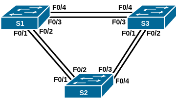
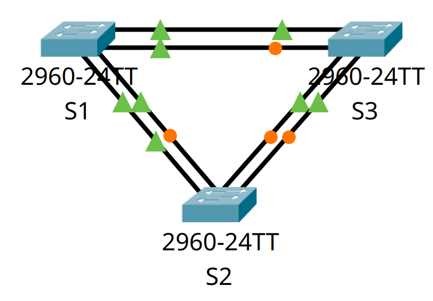
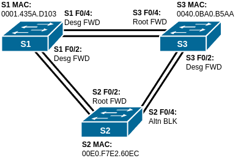

# Домашнее задание №7 «Развёртывание коммутируемой сети с резервными каналами»

## Топология



## Таблица адресации

| Устройство | Интерфейс | IP-адрес    | Маска подсети |
| ---------- | --------- | ----------- | ------------- |
| S1         | VLAN 1    | 192.168.1.1 | 255.255.255.0 |
| S2         | VLAN 1    | 192.168.1.2 | 255.255.255.0 |
| S3         | VLAN 1    | 192.168.1.3 | 255.255.255.0 |

## Цели

* [Часть 1. Создание сети и настройка основных параметров устройства.](#часть-1-создание-сети-инастройка-основных-параметров-устройства)
* [Часть 2. Выбор корневого моста.](#часть-2-определение-корневого-моста)
* [Часть 3. Наблюдение за процессом выбора протоколом STP порта, исходя из стоимости портов.](#часть-3-наблюдение-за-процессом-выбора-протоколом-stp-порта-исходя-из-стоимости-портов)
* [Часть 4. Наблюдение за процессом выбора протоколом STP порта, исходя из приоритета портов.](#часть-4-наблюдение-за-процессом-выбора-протоколом-stp-порта-исходя-из-приоритета-портов)

## Общие сведения/сценарий

Избыточность позволяет увеличить доступность устройств в топологии сети за счёт
устранения единой точки отказа. Избыточность в коммутируемой сети обеспечивается
посредством использования нескольких коммутаторов или нескольких каналов между
коммутаторами. Когда в проекте сети используется физическая избыточность, возможно
возникновение петель и дублирование кадров.

Протокол spanning-tree (STP) был разработан как механизм предотвращения возникновения
петель на 2-м уровне для избыточных каналов коммутируемой сети. Протокол STP
обеспечивает наличие только одного логического пути между всеми узлами назначения
в сети путём намеренного блокирования резервных путей, которые могли бы вызвать петлю.

В этой лабораторной работе команда **show spanning-tree** используется для наблюдения
за процессом выбора протоколом STP корневого моста. Также мы будем наблюдать за
процессом выбора портов с учётом стоимости и приоритета.

**Примечание:** используются коммутаторы Cisco Catalyst 2960s с Cisco IOS версии
15.0(2) (образ lanbasek9). Допускается использование других моделей коммутаторов
и других версий Cisco IOS. В зависимости от модели устройства и версии Cisco IOS
доступные команды и результаты их выполнения могут отличаться от тех, которые
показаны в лабораторных работах.

**Примечание:** убедитесь, что все настройки коммутаторов удалены и загрузочная
конфигурация отсутствует. Если вы не уверены, обратитесь к инструктору.

## Часть 1. Создание сети и настройка основных параметров устройства

Для моделирования сети будем использовать ПО Cisco Packet Tracer 8.1.1. Создадим
новую конфигурацию, используя следующие ресурсы:

* 3 коммутатора (Cisco 2960 с операционной системой Cisco IOS 15.0(2) (образ
  lanbasek9) или аналогичная модель);
* консольные кабели для настройки устройств Cisco IOS через консольные порты;
* кабели Ethernet, расположенные в соответствии с топологией.

### Шаг 1. Создание сети

Соединим устройства согласно топологии.



### Шаг 2. Инициализация и перезагрузка коммутаторов

Для того, чтобы убедиться, что коммутаторы не содержат никаких предыдущих настроек,
выполним их инициализацию и перезагрузку.

Для удаления загрузочной конфигурации служит команда **erase startup-config**
привилегированного режима EXEC, а для перезагрузки устройства команда **reload**.

<details>
<summary>Первый коммутатор</strong>:</summary>

```text
Switch>enable
Switch#erase startup-config
Erasing the nvram filesystem will remove all configuration files! Continue? [confirm]
[OK]
Erase of nvram: complete
%SYS-7-NV_BLOCK_INIT: Initialized the geometry of nvram
Switch#reload
Proceed with reload? [confirm]
C2960 Boot Loader (C2960-HBOOT-M) Version 12.2(25r)FX, RELEASE SOFTWARE (fc4)
Cisco WS-C2960-24TT (RC32300) processor (revision C0) with 21039K bytes of memory.
2960-24TT starting...
Base ethernet MAC Address: 0001.435A.D103
Xmodem file system is available.
Initializing Flash...
flashfs[0]: 1 files, 0 directories
flashfs[0]: 0 orphaned files, 0 orphaned directories
flashfs[0]: Total bytes: 64016384
flashfs[0]: Bytes used: 4670455
flashfs[0]: Bytes available: 59345929
flashfs[0]: flashfs fsck took 1 seconds.
...done Initializing Flash.

Boot Sector Filesystem (bs:) installed, fsid: 3
Parameter Block Filesystem (pb:) installed, fsid: 4


Loading "flash:/2960-lanbasek9-mz.150-2.SE4.bin"...
########################################################################## [OK]
Smart Init is enabled
smart init is sizing iomem
                  TYPE      MEMORY_REQ
                TOTAL:      0x00000000
Rounded IOMEM up to: 0Mb.
Using 6 percent iomem. [0Mb/512Mb]

              Restricted Rights Legend
Use, duplication, or disclosure by the Government is
subject to restrictions as set forth in subparagraph
(c) of the Commercial Computer Software - Restricted
Rights clause at FAR sec. 52.227-19 and subparagraph
(c) (1) (ii) of the Rights in Technical Data and Computer
Software clause at DFARS sec. 252.227-7013.
           cisco Systems, Inc.
           170 West Tasman Drive
           San Jose, California 95134-1706
Cisco IOS Software, C2960 Software (C2960-LANBASEK9-M), Version 15.0(2)SE4, RELEASE SOFTWARE (fc1)
Technical Support: http://www.cisco.com/techsupport
Copyright (c) 1986-2013 by Cisco Systems, Inc.
Compiled Wed 26-Jun-13 02:49 by mnguyen
Initializing flashfs...
fsck: Disable shadow buffering due to heap fragmentation.
flashfs[2]: 2 files, 1 directories
flashfs[2]: 0 orphaned files, 0 orphaned directories
flashfs[2]: Total bytes: 32514048
flashfs[2]: Bytes used: 11952128
flashfs[2]: Bytes available: 20561920
flashfs[2]: flashfs fsck took 2 seconds.
flashfs[2]: Initialization complete....done Initializing flashfs.
Checking for Bootloader upgrade..
Boot Loader upgrade not required (Stage 2)
POST: CPU MIC register Tests : Begin
POST: CPU MIC register Tests : End, Status Passed
POST: PortASIC Memory Tests : Begin
POST: PortASIC Memory Tests : End, Status Passed
POST: CPU MIC interface Loopback Tests : Begin
POST: CPU MIC interface Loopback Tests : End, Status Passed
POST: PortASIC RingLoopback Tests : Begin
POST: PortASIC RingLoopback Tests : End, Status Passed
POST: PortASIC CAM Subsystem Tests : Begin
POST: PortASIC CAM Subsystem Tests : End, Status Passed
POST: PortASIC Port Loopback Tests : Begin
POST: PortASIC Port Loopback Tests : End, Status Passed
Waiting for Port download...Complete

This product contains cryptographic features and is subject to United
States and local country laws governing import, export, transfer and
use. Delivery of Cisco cryptographic products does not imply
third-party authority to import, export, distribute or use encryption.
Importers, exporters, distributors and users are responsible for
compliance with U.S. and local country laws. By using this product you
agree to comply with applicable laws and regulations. If you are unable
to comply with U.S. and local laws, return this product immediately.
A summary of U.S. laws governing Cisco cryptographic products may be found at:
http://www.cisco.com/wwl/export/crypto/tool/stqrg.html
If you require further assistance please contact us by sending email to
export@cisco.com.
cisco WS-C2960-24TT-L (PowerPC405) processor (revision B0) with 65536K bytes of memory.
Processor board ID FOC1010X104
Last reset from power-on
1 Virtual Ethernet interface
24 FastEthernet interfaces
2 Gigabit Ethernet interfaces
The password-recovery mechanism is enabled.
64K bytes of flash-simulated non-volatile configuration memory.
Base ethernet MAC Address       : 00:01:43:5A:D1:03
Motherboard assembly number     : 73-10390-03
Power supply part number        : 341-0097-02
Motherboard serial number       : FOC10093R12
Power supply serial number      : AZS1007032H
Model revision number           : B0
Motherboard revision number     : B0
Model number                    : WS-C2960-24TT-L
System serial number            : FOC1010X104
Top Assembly Part Number        : 800-27221-02
Top Assembly Revision Number    : A0
Version ID                      : V02
CLEI Code Number                : COM3L00BRA
Hardware Board Revision Number  : 0x01

Switch Ports Model              SW Version            SW Image
------ ----- -----              ----------            ----------
*    1 26    WS-C2960-24TT-L    15.0(2)SE4            C2960-LANBASEK9-M

Cisco IOS Software, C2960 Software (C2960-LANBASEK9-M), Version 15.0(2)SE4, RELEASE SOFTWARE (fc1)
Technical Support: http://www.cisco.com/techsupport
Copyright (c) 1986-2013 by Cisco Systems, Inc.
Compiled Wed 26-Jun-13 02:49 by mnguyen


Press RETURN to get started!


%LINK-5-CHANGED: Interface FastEthernet0/1, changed state to up

%LINEPROTO-5-UPDOWN: Line protocol on Interface FastEthernet0/1, changed state to up

%LINK-5-CHANGED: Interface FastEthernet0/2, changed state to up

%LINEPROTO-5-UPDOWN: Line protocol on Interface FastEthernet0/2, changed state to up

%LINK-5-CHANGED: Interface FastEthernet0/3, changed state to up

%LINEPROTO-5-UPDOWN: Line protocol on Interface FastEthernet0/3, changed state to up

%LINK-5-CHANGED: Interface FastEthernet0/4, changed state to up

%LINEPROTO-5-UPDOWN: Line protocol on Interface FastEthernet0/4, changed state to up


Switch>
```

</details>

<details>
<summary>Второй коммутатор:</summary>

```text
Switch>enable
Switch#erase startup-config
Erasing the nvram filesystem will remove all configuration files! Continue? [confirm]
[OK]
Erase of nvram: complete
%SYS-7-NV_BLOCK_INIT: Initialized the geometry of nvram
Switch#reload
Proceed with reload? [confirm]
C2960 Boot Loader (C2960-HBOOT-M) Version 12.2(25r)FX, RELEASE SOFTWARE (fc4)
Cisco WS-C2960-24TT (RC32300) processor (revision C0) with 21039K bytes of memory.
2960-24TT starting...
Base ethernet MAC Address: 00E0.F7E2.60EC
Xmodem file system is available.
Initializing Flash...
flashfs[0]: 1 files, 0 directories
flashfs[0]: 0 orphaned files, 0 orphaned directories
flashfs[0]: Total bytes: 64016384
flashfs[0]: Bytes used: 4670455
flashfs[0]: Bytes available: 59345929
flashfs[0]: flashfs fsck took 1 seconds.
...done Initializing Flash.

Boot Sector Filesystem (bs:) installed, fsid: 3
Parameter Block Filesystem (pb:) installed, fsid: 4


Loading "flash:/2960-lanbasek9-mz.150-2.SE4.bin"...
########################################################################## [OK]
Smart Init is enabled
smart init is sizing iomem
                  TYPE      MEMORY_REQ
                TOTAL:      0x00000000
Rounded IOMEM up to: 0Mb.
Using 6 percent iomem. [0Mb/512Mb]

              Restricted Rights Legend
Use, duplication, or disclosure by the Government is
subject to restrictions as set forth in subparagraph
(c) of the Commercial Computer Software - Restricted
Rights clause at FAR sec. 52.227-19 and subparagraph
(c) (1) (ii) of the Rights in Technical Data and Computer
Software clause at DFARS sec. 252.227-7013.
           cisco Systems, Inc.
           170 West Tasman Drive
           San Jose, California 95134-1706
Cisco IOS Software, C2960 Software (C2960-LANBASEK9-M), Version 15.0(2)SE4, RELEASE SOFTWARE (fc1)
Technical Support: http://www.cisco.com/techsupport
Copyright (c) 1986-2013 by Cisco Systems, Inc.
Compiled Wed 26-Jun-13 02:49 by mnguyen
Initializing flashfs...
fsck: Disable shadow buffering due to heap fragmentation.
flashfs[2]: 2 files, 1 directories
flashfs[2]: 0 orphaned files, 0 orphaned directories
flashfs[2]: Total bytes: 32514048
flashfs[2]: Bytes used: 11952128
flashfs[2]: Bytes available: 20561920
flashfs[2]: flashfs fsck took 2 seconds.
flashfs[2]: Initialization complete....done Initializing flashfs.
Checking for Bootloader upgrade..
Boot Loader upgrade not required (Stage 2)
POST: CPU MIC register Tests : Begin
POST: CPU MIC register Tests : End, Status Passed
POST: PortASIC Memory Tests : Begin
POST: PortASIC Memory Tests : End, Status Passed
POST: CPU MIC interface Loopback Tests : Begin
POST: CPU MIC interface Loopback Tests : End, Status Passed
POST: PortASIC RingLoopback Tests : Begin
POST: PortASIC RingLoopback Tests : End, Status Passed
POST: PortASIC CAM Subsystem Tests : Begin
POST: PortASIC CAM Subsystem Tests : End, Status Passed
POST: PortASIC Port Loopback Tests : Begin
POST: PortASIC Port Loopback Tests : End, Status Passed
Waiting for Port download...Complete

This product contains cryptographic features and is subject to United
States and local country laws governing import, export, transfer and
use. Delivery of Cisco cryptographic products does not imply
third-party authority to import, export, distribute or use encryption.
Importers, exporters, distributors and users are responsible for
compliance with U.S. and local country laws. By using this product you
agree to comply with applicable laws and regulations. If you are unable
to comply with U.S. and local laws, return this product immediately.
A summary of U.S. laws governing Cisco cryptographic products may be found at:
http://www.cisco.com/wwl/export/crypto/tool/stqrg.html
If you require further assistance please contact us by sending email to
export@cisco.com.
cisco WS-C2960-24TT-L (PowerPC405) processor (revision B0) with 65536K bytes of memory.
Processor board ID FOC1010X104
Last reset from power-on
1 Virtual Ethernet interface
24 FastEthernet interfaces
2 Gigabit Ethernet interfaces
The password-recovery mechanism is enabled.
64K bytes of flash-simulated non-volatile configuration memory.
Base ethernet MAC Address       : 00:E0:F7:E2:60:EC
Motherboard assembly number     : 73-10390-03
Power supply part number        : 341-0097-02
Motherboard serial number       : FOC10093R12
Power supply serial number      : AZS1007032H
Model revision number           : B0
Motherboard revision number     : B0
Model number                    : WS-C2960-24TT-L
System serial number            : FOC1010X104
Top Assembly Part Number        : 800-27221-02
Top Assembly Revision Number    : A0
Version ID                      : V02
CLEI Code Number                : COM3L00BRA
Hardware Board Revision Number  : 0x01

Switch Ports Model              SW Version            SW Image
------ ----- -----              ----------            ----------
*    1 26    WS-C2960-24TT-L    15.0(2)SE4            C2960-LANBASEK9-M

Cisco IOS Software, C2960 Software (C2960-LANBASEK9-M), Version 15.0(2)SE4, RELEASE SOFTWARE (fc1)
Technical Support: http://www.cisco.com/techsupport
Copyright (c) 1986-2013 by Cisco Systems, Inc.
Compiled Wed 26-Jun-13 02:49 by mnguyen


Press RETURN to get started!


%LINK-5-CHANGED: Interface FastEthernet0/1, changed state to up

%LINEPROTO-5-UPDOWN: Line protocol on Interface FastEthernet0/1, changed state to up

%LINK-5-CHANGED: Interface FastEthernet0/2, changed state to up

%LINEPROTO-5-UPDOWN: Line protocol on Interface FastEthernet0/2, changed state to up

%LINK-5-CHANGED: Interface FastEthernet0/3, changed state to up

%LINEPROTO-5-UPDOWN: Line protocol on Interface FastEthernet0/3, changed state to up

%LINK-5-CHANGED: Interface FastEthernet0/4, changed state to up

%LINEPROTO-5-UPDOWN: Line protocol on Interface FastEthernet0/4, changed state to up


Switch>
```

</details>

<details>
<summary>Третий коммутатор:</summary>

```text
Switch>enable
Switch#erase startup-config
Erasing the nvram filesystem will remove all configuration files! Continue? [confirm]
[OK]
Erase of nvram: complete
%SYS-7-NV_BLOCK_INIT: Initialized the geometry of nvram
Switch#reload
Proceed with reload? [confirm]
C2960 Boot Loader (C2960-HBOOT-M) Version 12.2(25r)FX, RELEASE SOFTWARE (fc4)
Cisco WS-C2960-24TT (RC32300) processor (revision C0) with 21039K bytes of memory.
2960-24TT starting...
Base ethernet MAC Address: 0040.0BA0.B5AA
Xmodem file system is available.
Initializing Flash...
flashfs[0]: 1 files, 0 directories
flashfs[0]: 0 orphaned files, 0 orphaned directories
flashfs[0]: Total bytes: 64016384
flashfs[0]: Bytes used: 4670455
flashfs[0]: Bytes available: 59345929
flashfs[0]: flashfs fsck took 1 seconds.
...done Initializing Flash.

Boot Sector Filesystem (bs:) installed, fsid: 3
Parameter Block Filesystem (pb:) installed, fsid: 4


Loading "flash:/2960-lanbasek9-mz.150-2.SE4.bin"...
########################################################################## [OK]
Smart Init is enabled
smart init is sizing iomem
                  TYPE      MEMORY_REQ
                TOTAL:      0x00000000
Rounded IOMEM up to: 0Mb.
Using 6 percent iomem. [0Mb/512Mb]

              Restricted Rights Legend
Use, duplication, or disclosure by the Government is
subject to restrictions as set forth in subparagraph
(c) of the Commercial Computer Software - Restricted
Rights clause at FAR sec. 52.227-19 and subparagraph
(c) (1) (ii) of the Rights in Technical Data and Computer
Software clause at DFARS sec. 252.227-7013.
           cisco Systems, Inc.
           170 West Tasman Drive
           San Jose, California 95134-1706
Cisco IOS Software, C2960 Software (C2960-LANBASEK9-M), Version 15.0(2)SE4, RELEASE SOFTWARE (fc1)
Technical Support: http://www.cisco.com/techsupport
Copyright (c) 1986-2013 by Cisco Systems, Inc.
Compiled Wed 26-Jun-13 02:49 by mnguyen
Initializing flashfs...
fsck: Disable shadow buffering due to heap fragmentation.
flashfs[2]: 2 files, 1 directories
flashfs[2]: 0 orphaned files, 0 orphaned directories
flashfs[2]: Total bytes: 32514048
flashfs[2]: Bytes used: 11952128
flashfs[2]: Bytes available: 20561920
flashfs[2]: flashfs fsck took 2 seconds.
flashfs[2]: Initialization complete....done Initializing flashfs.
Checking for Bootloader upgrade..
Boot Loader upgrade not required (Stage 2)
POST: CPU MIC register Tests : Begin
POST: CPU MIC register Tests : End, Status Passed
POST: PortASIC Memory Tests : Begin
POST: PortASIC Memory Tests : End, Status Passed
POST: CPU MIC interface Loopback Tests : Begin
POST: CPU MIC interface Loopback Tests : End, Status Passed
POST: PortASIC RingLoopback Tests : Begin
POST: PortASIC RingLoopback Tests : End, Status Passed
POST: PortASIC CAM Subsystem Tests : Begin
POST: PortASIC CAM Subsystem Tests : End, Status Passed
POST: PortASIC Port Loopback Tests : Begin
POST: PortASIC Port Loopback Tests : End, Status Passed
Waiting for Port download...Complete

This product contains cryptographic features and is subject to United
States and local country laws governing import, export, transfer and
use. Delivery of Cisco cryptographic products does not imply
third-party authority to import, export, distribute or use encryption.
Importers, exporters, distributors and users are responsible for
compliance with U.S. and local country laws. By using this product you
agree to comply with applicable laws and regulations. If you are unable
to comply with U.S. and local laws, return this product immediately.
A summary of U.S. laws governing Cisco cryptographic products may be found at:
http://www.cisco.com/wwl/export/crypto/tool/stqrg.html
If you require further assistance please contact us by sending email to
export@cisco.com.
cisco WS-C2960-24TT-L (PowerPC405) processor (revision B0) with 65536K bytes of memory.
Processor board ID FOC1010X104
Last reset from power-on
1 Virtual Ethernet interface
24 FastEthernet interfaces
2 Gigabit Ethernet interfaces
The password-recovery mechanism is enabled.
64K bytes of flash-simulated non-volatile configuration memory.
Base ethernet MAC Address       : 00:40:0B:A0:B5:AA
Motherboard assembly number     : 73-10390-03
Power supply part number        : 341-0097-02
Motherboard serial number       : FOC10093R12
Power supply serial number      : AZS1007032H
Model revision number           : B0
Motherboard revision number     : B0
Model number                    : WS-C2960-24TT-L
System serial number            : FOC1010X104
Top Assembly Part Number        : 800-27221-02
Top Assembly Revision Number    : A0
Version ID                      : V02
CLEI Code Number                : COM3L00BRA
Hardware Board Revision Number  : 0x01

Switch Ports Model              SW Version            SW Image
------ ----- -----              ----------            ----------
*    1 26    WS-C2960-24TT-L    15.0(2)SE4            C2960-LANBASEK9-M

Cisco IOS Software, C2960 Software (C2960-LANBASEK9-M), Version 15.0(2)SE4, RELEASE SOFTWARE (fc1)
Technical Support: http://www.cisco.com/techsupport
Copyright (c) 1986-2013 by Cisco Systems, Inc.
Compiled Wed 26-Jun-13 02:49 by mnguyen


Press RETURN to get started!


%LINK-5-CHANGED: Interface FastEthernet0/1, changed state to up

%LINEPROTO-5-UPDOWN: Line protocol on Interface FastEthernet0/1, changed state to up

%LINK-5-CHANGED: Interface FastEthernet0/2, changed state to up

%LINEPROTO-5-UPDOWN: Line protocol on Interface FastEthernet0/2, changed state to up

%LINK-5-CHANGED: Interface FastEthernet0/3, changed state to up

%LINEPROTO-5-UPDOWN: Line protocol on Interface FastEthernet0/3, changed state to up

%LINK-5-CHANGED: Interface FastEthernet0/4, changed state to up

%LINEPROTO-5-UPDOWN: Line protocol on Interface FastEthernet0/4, changed state to up


Switch>
```

</details>

### Шаг 3. Настройка коммутаторов

Настроим базовые параметры каждого коммутатора.

#### a. Отключение поиска DNS

Чтобы предотвратить попытки коммутатора неверно преобразовывать введённые
команды таким образом, как будто они являются именами узлов, отключим поиск DNS:

```text
Switch>en
Switch#conf t
Enter configuration commands, one per line.  End with CNTL/Z.
Switch(config)#no ip domain-lookup
Switch(config)#
```

#### b. Установка имени устройства

Подключимся к коммутатору с помощью консольного подключения, активируем
привилегированный режим и сменим имя коммутатора:

```text
Switch(config)#host S1
S1(config)#
```

```text
Switch(config)#host S2
S2(config)#
```

```text
Switch(config)#host S3
S3(config)#
```

#### c. Установка пароля привилегированного режима

Назначим **class** в качестве зашифрованного пароля привилегированного режима EXEC:

```text
S1(config)#enable secret class
S1(config)#
```

```text
S2(config)#enable secret class
S2(config)#
```

```text
S3(config)#enable secret class
S3(config)#
```

Зашифруем открытые пароли в файле конфигурации:

```text
S1(config)#service password-encryption
S1(config)#
```

```text
S2(config)#service password-encryption
S2(config)#
```

```text
S3(config)#service password-encryption
S3(config)#
```

#### d. Установка паролей консоли и VTY

Назначим **cisco** в качестве пароля консоли и VTY каналов, включим вход в систему
по паролю:

```text
S1(config)#line console 0
S1(config-line)#password cisco
S1(config-line)#login
S1(config-line)#exit
S1(config)#line vty 0 15
S1(config-line)#password cisco
S1(config-line)#login
S1(config-line)#exit
S1(config)#
```

```text
S2(config)#line console 0
S2(config-line)#password cisco
S2(config-line)#login
S2(config-line)#exit
S2(config)#line vty 0 15
S2(config-line)#password cisco
S2(config-line)#login
S2(config-line)#exit
S2(config)#
```

```text
S3(config)#line console 0
S3(config-line)#password cisco
S3(config-line)#login
S3(config-line)#exit
S3(config)#line vty 0 15
S3(config-line)#password cisco
S3(config-line)#login
S3(config-line)#exit
S3(config)#
```

#### e. Настройте logging synchronous для консольного канала

Чтобы консольные сообщения не прерывали выполнение команд, установим
параметр **logging synchronous**:

```text
S1(config)#line console 0
S1(config-line)#logging synchronous
S1(config-line)#exit
S1(config)#line vty 0 15
S1(config-line)#logging synchronous
S1(config-line)#exit
S1(config)#
```

```text
S2(config)#line console 0
S2(config-line)#logging synchronous
S2(config-line)#exit
S2(config)#line vty 0 15
S2(config-line)#logging synchronous
S2(config-line)#exit
S2(config)#
```

```text
S3(config)#line console 0
S3(config-line)#logging synchronous
S3(config-line)#exit
S3(config)#line vty 0 15
S3(config-line)#logging synchronous
S3(config-line)#exit
S3(config)#
```

#### f. Создание баннера

Для предупреждения пользователей о запрете несанкционированного доступа, настроим
баннерное сообщение дня (MOTD):

```text
S1(config)#banner motd # ATTENTION! Unauthorized access is strictly prohibited. #
S1(config)#
```

```text
S2(config)#banner motd # ATTENTION! Unauthorized access is strictly prohibited. #
S2(config)#
```

```text
S3(config)#banner motd # ATTENTION! Unauthorized access is strictly prohibited. #
S3(config)#
```

#### g. Установка IP-адреса для SVI

Зададим на всех коммутаторах IP-адрес, указанный в таблице адресации для VLAN 1:

```text
S1(config)#int vlan 1
S1(config-if)#ip address 192.168.1.1 255.255.255.0
S1(config-if)#no shut

S1(config-if)#
%LINK-5-CHANGED: Interface Vlan1, changed state to up

%LINEPROTO-5-UPDOWN: Line protocol on Interface Vlan1, changed state to up

S1(config-if)#exit
S1(config)#
```

```text
S2(config)#int vlan 1
S2(config-if)#ip address 192.168.1.2 255.255.255.0
S2(config-if)#no shut

S2(config-if)#
%LINK-5-CHANGED: Interface Vlan1, changed state to up

%LINEPROTO-5-UPDOWN: Line protocol on Interface Vlan1, changed state to up

S2(config-if)#exit
S2(config)#
```

```text
S3(config)#int vlan 1
S3(config-if)#ip address 192.168.1.3 255.255.255.0
S3(config-if)#no shut

S3(config-if)#
%LINK-5-CHANGED: Interface Vlan1, changed state to up

%LINEPROTO-5-UPDOWN: Line protocol on Interface Vlan1, changed state to up

S3(config-if)#exit
S3(config)#
```

#### h. Сохранение конфигурации

Скопируем текущую конфигурацию в файл загрузочной конфигурации.

```text
S1#copy running-config startup-config
Destination filename [startup-config]? 
Building configuration...
[OK]
S1#
```

<details>
<summary>S1# show running-config</summary>

```text
S1#show running-config
Building configuration...

Current configuration : 1371 bytes
!
version 15.0
no service timestamps log datetime msec
no service timestamps debug datetime msec
service password-encryption
!
hostname S1
!
enable secret 5 $1$mERr$9cTjUIEqNGurQiFU.ZeCi1
!
!
!
no ip domain-lookup
!
!
!
spanning-tree mode pvst
spanning-tree extend system-id
!
interface FastEthernet0/1
!
interface FastEthernet0/2
!
interface FastEthernet0/3
!
interface FastEthernet0/4
!
interface FastEthernet0/5
!
interface FastEthernet0/6
!
interface FastEthernet0/7
!
interface FastEthernet0/8
!
interface FastEthernet0/9
!
interface FastEthernet0/10
!
interface FastEthernet0/11
!
interface FastEthernet0/12
!
interface FastEthernet0/13
!
interface FastEthernet0/14
!
interface FastEthernet0/15
!
interface FastEthernet0/16
!
interface FastEthernet0/17
!
interface FastEthernet0/18
!
interface FastEthernet0/19
!
interface FastEthernet0/20
!
interface FastEthernet0/21
!
interface FastEthernet0/22
!
interface FastEthernet0/23
!
interface FastEthernet0/24
!
interface GigabitEthernet0/1
!
interface GigabitEthernet0/2
!
interface Vlan1
 ip address 192.168.1.1 255.255.255.0
!
banner motd ^C ATTENTION! Unauthorized access is strictly prohibited. ^C
!
!
!
line con 0
 password 7 0822455D0A16
 logging synchronous
 login
!
line vty 0 4
 password 7 0822455D0A16
 logging synchronous
 login
line vty 5 15
 password 7 0822455D0A16
 logging synchronous
 login
!
!
!
!
end


S1#
```

</details>

```text
S2#copy running-config startup-config
Destination filename [startup-config]? 
Building configuration...
[OK]
S2#
```

<details>
<summary>S2# show running-config</summary>

```text
S2#show running-config 
Building configuration...

Current configuration : 1371 bytes
!
version 15.0
no service timestamps log datetime msec
no service timestamps debug datetime msec
service password-encryption
!
hostname S2
!
enable secret 5 $1$mERr$9cTjUIEqNGurQiFU.ZeCi1
!
!
!
no ip domain-lookup
!
!
!
spanning-tree mode pvst
spanning-tree extend system-id
!
interface FastEthernet0/1
!
interface FastEthernet0/2
!
interface FastEthernet0/3
!
interface FastEthernet0/4
!
interface FastEthernet0/5
!
interface FastEthernet0/6
!
interface FastEthernet0/7
!
interface FastEthernet0/8
!
interface FastEthernet0/9
!
interface FastEthernet0/10
!
interface FastEthernet0/11
!
interface FastEthernet0/12
!
interface FastEthernet0/13
!
interface FastEthernet0/14
!
interface FastEthernet0/15
!
interface FastEthernet0/16
!
interface FastEthernet0/17
!
interface FastEthernet0/18
!
interface FastEthernet0/19
!
interface FastEthernet0/20
!
interface FastEthernet0/21
!
interface FastEthernet0/22
!
interface FastEthernet0/23
!
interface FastEthernet0/24
!
interface GigabitEthernet0/1
!
interface GigabitEthernet0/2
!
interface Vlan1
 ip address 192.168.1.2 255.255.255.0
!
banner motd ^C ATTENTION! Unauthorized access is strictly prohibited. ^C
!
!
!
line con 0
 password 7 0822455D0A16
 logging synchronous
 login
!
line vty 0 4
 password 7 0822455D0A16
 logging synchronous
 login
line vty 5 15
 password 7 0822455D0A16
 logging synchronous
 login
!
!
!
!
end


S2#
```

</details>

```text
S3#copy running-config startup-config
Destination filename [startup-config]? 
Building configuration...
[OK]
S3#
```

<details>
<summary>S3# show running-config</summary>

```text
S3#show running-config
Building configuration...

Current configuration : 1371 bytes
!
version 15.0
no service timestamps log datetime msec
no service timestamps debug datetime msec
service password-encryption
!
hostname S3
!
enable secret 5 $1$mERr$9cTjUIEqNGurQiFU.ZeCi1
!
!
!
no ip domain-lookup
!
!
!
spanning-tree mode pvst
spanning-tree extend system-id
!
interface FastEthernet0/1
!
interface FastEthernet0/2
!
interface FastEthernet0/3
!
interface FastEthernet0/4
!
interface FastEthernet0/5
!
interface FastEthernet0/6
!
interface FastEthernet0/7
!
interface FastEthernet0/8
!
interface FastEthernet0/9
!
interface FastEthernet0/10
!
interface FastEthernet0/11
!
interface FastEthernet0/12
!
interface FastEthernet0/13
!
interface FastEthernet0/14
!
interface FastEthernet0/15
!
interface FastEthernet0/16
!
interface FastEthernet0/17
!
interface FastEthernet0/18
!
interface FastEthernet0/19
!
interface FastEthernet0/20
!
interface FastEthernet0/21
!
interface FastEthernet0/22
!
interface FastEthernet0/23
!
interface FastEthernet0/24
!
interface GigabitEthernet0/1
!
interface GigabitEthernet0/2
!
interface Vlan1
 ip address 192.168.1.3 255.255.255.0
!
banner motd ^C ATTENTION! Unauthorized access is strictly prohibited. ^C
!
!
!
line con 0
 password 7 0822455D0A16
 logging synchronous
 login
!
line vty 0 4
 password 7 0822455D0A16
 logging synchronous
 login
line vty 5 15
 password 7 0822455D0A16
 logging synchronous
 login
!
!
!
!
end


S3#
```

</details>

### Шаг 4. Проверка связи

Проверим способность коммутаторов обмениваться эхо-запросами.

Отправим эхо-запрос с **S1** на **S2**:

```text
S1#ping 192.168.1.2

Type escape sequence to abort.
Sending 5, 100-byte ICMP Echos to 192.168.1.2, timeout is 2 seconds:
..!!!
Success rate is 60 percent (3/5), round-trip min/avg/max = 0/0/0 ms

S1#
```

Отправим эхо-запрос с **S1** на **S3**:

```text
S1#ping 192.168.1.3

Type escape sequence to abort.
Sending 5, 100-byte ICMP Echos to 192.168.1.3, timeout is 2 seconds:
..!!!
Success rate is 60 percent (3/5), round-trip min/avg/max = 0/0/0 ms

S1#
```

Отправим эхо-запрос с **S2** на **S3**:

```text
S2#ping 192.168.1.3

Type escape sequence to abort.
Sending 5, 100-byte ICMP Echos to 192.168.1.3, timeout is 2 seconds:
..!!!
Success rate is 60 percent (3/5), round-trip min/avg/max = 0/0/0 ms

S2#
```

Успешно ли выполняется эхо-запрос от коммутатора S1 на коммутатор S2? *<u>**да**</u>*

Успешно ли выполняется эхо-запрос от коммутатора S1 на коммутатор S3? *<u>**да**</u>*

Успешно ли выполняется эхо-запрос от коммутатора S2 на коммутатор S3? *<u>**да**</u>*

Будем выполнять отладку до тех пор, пока ответы на все вопросы не будут положительными.

## Часть 2. Определение корневого моста

Для каждого экземпляра протокола spanning-tree (коммутируемая сеть LAN или
широковещательный домен) существует коммутатор, выделенный в качестве корневого
моста. Корневой мост служит точкой привязки для всех расчётов протокола
spanning-tree, позволяя определить избыточные пути, которые следует заблокировать.

Процесс выбора определяет, какой из коммутаторов станет корневым мостом.
Коммутатор с наименьшим значением идентификатора моста (BID) становится корневым
мостом. Идентификатор BID состоит из значения приоритета моста, расширенного
идентификатора системы и MAC-адреса коммутатора. Значение приоритета может
находиться в диапазоне от 0 до 65535 с шагом 4096. По умолчанию используется
значение 32768.

### Шаг 1: Отключение портов

Отключим все порты на коммутаторах. Для этого воспользуемся командой **shutdown**
в сочетании с **interface range**.

<details>
<summary>Коммутатор <strong>S1</strong></summary>

```text
S1#conf t
Enter configuration commands, one per line.  End with CNTL/Z.
S1(config)#int ran
S1(config)#int range f0/1-24
S1(config-if-range)#shutdown

%LINK-5-CHANGED: Interface FastEthernet0/5, changed state to administratively down

%LINK-5-CHANGED: Interface FastEthernet0/6, changed state to administratively down

%LINK-5-CHANGED: Interface FastEthernet0/7, changed state to administratively down

%LINK-5-CHANGED: Interface FastEthernet0/8, changed state to administratively down

%LINK-5-CHANGED: Interface FastEthernet0/9, changed state to administratively down

%LINK-5-CHANGED: Interface FastEthernet0/10, changed state to administratively down

%LINK-5-CHANGED: Interface FastEthernet0/11, changed state to administratively down

%LINK-5-CHANGED: Interface FastEthernet0/12, changed state to administratively down

%LINK-5-CHANGED: Interface FastEthernet0/13, changed state to administratively down

%LINK-5-CHANGED: Interface FastEthernet0/14, changed state to administratively down

%LINK-5-CHANGED: Interface FastEthernet0/15, changed state to administratively down

%LINK-5-CHANGED: Interface FastEthernet0/16, changed state to administratively down

%LINK-5-CHANGED: Interface FastEthernet0/17, changed state to administratively down

%LINK-5-CHANGED: Interface FastEthernet0/18, changed state to administratively down

%LINK-5-CHANGED: Interface FastEthernet0/19, changed state to administratively down

%LINK-5-CHANGED: Interface FastEthernet0/20, changed state to administratively down

%LINK-5-CHANGED: Interface FastEthernet0/21, changed state to administratively down

%LINK-5-CHANGED: Interface FastEthernet0/22, changed state to administratively down

%LINK-5-CHANGED: Interface FastEthernet0/23, changed state to administratively down

%LINK-5-CHANGED: Interface FastEthernet0/24, changed state to administratively down
S1(config-if-range)#
%LINK-5-CHANGED: Interface FastEthernet0/1, changed state to administratively down

%LINEPROTO-5-UPDOWN: Line protocol on Interface FastEthernet0/1, changed state to down

%LINK-5-CHANGED: Interface FastEthernet0/2, changed state to administratively down

%LINEPROTO-5-UPDOWN: Line protocol on Interface FastEthernet0/2, changed state to down

%LINK-5-CHANGED: Interface FastEthernet0/3, changed state to administratively down

%LINEPROTO-5-UPDOWN: Line protocol on Interface FastEthernet0/3, changed state to down

%LINK-5-CHANGED: Interface FastEthernet0/4, changed state to administratively down

%LINEPROTO-5-UPDOWN: Line protocol on Interface FastEthernet0/4, changed state to down

%LINEPROTO-5-UPDOWN: Line protocol on Interface Vlan1, changed state to down

S1(config-if-range)#exit
S1(config)#
```

</details>

При отключении портов на коммутаторе **S1** на **S2** порты, поключённые к **S1**
также отключились.

<details>
<summary>Коммутатор <strong>S2</strong></summary>

```text
%LINK-3-UPDOWN: Interface FastEthernet0/1, changed state to down

%LINEPROTO-5-UPDOWN: Line protocol on Interface FastEthernet0/1, changed state to down

%LINK-3-UPDOWN: Interface FastEthernet0/2, changed state to down

%LINEPROTO-5-UPDOWN: Line protocol on Interface FastEthernet0/2, changed state to down

S2#conf t
Enter configuration commands, one per line.  End with CNTL/Z.
S2(config)#int range f0/1-24
S2(config-if-range)#shut

%LINK-5-CHANGED: Interface FastEthernet0/1, changed state to administratively down

%LINK-5-CHANGED: Interface FastEthernet0/2, changed state to administratively down


%LINK-5-CHANGED: Interface FastEthernet0/5, changed state to administratively down

%LINK-5-CHANGED: Interface FastEthernet0/6, changed state to administratively down

%LINK-5-CHANGED: Interface FastEthernet0/7, changed state to administratively down

%LINK-5-CHANGED: Interface FastEthernet0/8, changed state to administratively down

%LINK-5-CHANGED: Interface FastEthernet0/9, changed state to administratively down

%LINK-5-CHANGED: Interface FastEthernet0/10, changed state to administratively down

%LINK-5-CHANGED: Interface FastEthernet0/11, changed state to administratively down

%LINK-5-CHANGED: Interface FastEthernet0/12, changed state to administratively down

%LINK-5-CHANGED: Interface FastEthernet0/13, changed state to administratively down

%LINK-5-CHANGED: Interface FastEthernet0/14, changed state to administratively down

%LINK-5-CHANGED: Interface FastEthernet0/15, changed state to administratively down

%LINK-5-CHANGED: Interface FastEthernet0/16, changed state to administratively down

%LINK-5-CHANGED: Interface FastEthernet0/17, changed state to administratively down

%LINK-5-CHANGED: Interface FastEthernet0/18, changed state to administratively down

%LINK-5-CHANGED: Interface FastEthernet0/19, changed state to administratively down

%LINK-5-CHANGED: Interface FastEthernet0/20, changed state to administratively down

%LINK-5-CHANGED: Interface FastEthernet0/21, changed state to administratively down

%LINK-5-CHANGED: Interface FastEthernet0/22, changed state to administratively down

%LINK-5-CHANGED: Interface FastEthernet0/23, changed state to administratively down

%LINK-5-CHANGED: Interface FastEthernet0/24, changed state to administratively down
S2(config-if-range)#
%LINK-5-CHANGED: Interface FastEthernet0/3, changed state to administratively down

%LINEPROTO-5-UPDOWN: Line protocol on Interface FastEthernet0/3, changed state to down

%LINK-5-CHANGED: Interface FastEthernet0/4, changed state to administratively down

%LINEPROTO-5-UPDOWN: Line protocol on Interface FastEthernet0/4, changed state to down

%LINEPROTO-5-UPDOWN: Line protocol on Interface Vlan1, changed state to down

S2(config-if-range)#exit
S2(config)#
```

</details>

На коммутаторе **S3** также отображались уведомления об отключении портов,
подключённых к соседям.

<details>
<summary>Коммутатор <strong>S3</strong></summary>

```text
%LINK-3-UPDOWN: Interface FastEthernet0/3, changed state to down

%LINEPROTO-5-UPDOWN: Line protocol on Interface FastEthernet0/3, changed state to down

%LINK-3-UPDOWN: Interface FastEthernet0/4, changed state to down

%LINEPROTO-5-UPDOWN: Line protocol on Interface FastEthernet0/4, changed state to down


%LINK-3-UPDOWN: Interface FastEthernet0/1, changed state to down

%LINEPROTO-5-UPDOWN: Line protocol on Interface FastEthernet0/1, changed state to down

%LINK-3-UPDOWN: Interface FastEthernet0/2, changed state to down

%LINEPROTO-5-UPDOWN: Line protocol on Interface FastEthernet0/2, changed state to down

%LINEPROTO-5-UPDOWN: Line protocol on Interface Vlan1, changed state to down

S3#conf t
Enter configuration commands, one per line.  End with CNTL/Z.
S3(config)#int range f0/1-24
S3(config-if-range)#shut

%LINK-5-CHANGED: Interface FastEthernet0/1, changed state to administratively down

%LINK-5-CHANGED: Interface FastEthernet0/2, changed state to administratively down

%LINK-5-CHANGED: Interface FastEthernet0/3, changed state to administratively down

%LINK-5-CHANGED: Interface FastEthernet0/4, changed state to administratively down

%LINK-5-CHANGED: Interface FastEthernet0/5, changed state to administratively down

%LINK-5-CHANGED: Interface FastEthernet0/6, changed state to administratively down

%LINK-5-CHANGED: Interface FastEthernet0/7, changed state to administratively down

%LINK-5-CHANGED: Interface FastEthernet0/8, changed state to administratively down

%LINK-5-CHANGED: Interface FastEthernet0/9, changed state to administratively down

%LINK-5-CHANGED: Interface FastEthernet0/10, changed state to administratively down

%LINK-5-CHANGED: Interface FastEthernet0/11, changed state to administratively down

%LINK-5-CHANGED: Interface FastEthernet0/12, changed state to administratively down

%LINK-5-CHANGED: Interface FastEthernet0/13, changed state to administratively down

%LINK-5-CHANGED: Interface FastEthernet0/14, changed state to administratively down

%LINK-5-CHANGED: Interface FastEthernet0/15, changed state to administratively down

%LINK-5-CHANGED: Interface FastEthernet0/16, changed state to administratively down

%LINK-5-CHANGED: Interface FastEthernet0/17, changed state to administratively down

%LINK-5-CHANGED: Interface FastEthernet0/18, changed state to administratively down

%LINK-5-CHANGED: Interface FastEthernet0/19, changed state to administratively down

%LINK-5-CHANGED: Interface FastEthernet0/20, changed state to administratively down

%LINK-5-CHANGED: Interface FastEthernet0/21, changed state to administratively down

%LINK-5-CHANGED: Interface FastEthernet0/22, changed state to administratively down

%LINK-5-CHANGED: Interface FastEthernet0/23, changed state to administratively down

%LINK-5-CHANGED: Interface FastEthernet0/24, changed state to administratively down
S3(config-if-range)#exit
S3(config)#
```

</details>

### Шаг 2: Настройка транковых портов

Настроим подключенные порты в качестве транковых.

```text
S1(config)#int range f0/1-4
S1(config-if-range)#switchport mode trunk
S1(config-if-range)#exit
S1(config)#
```

Так как в рамках данной работы нас интересует только протокол STP, то настройку
native VLAN и ограничение списка разрешённых VLAN на транке мы опустим.

```text
S2(config)#int range f0/1-4
S2(config-if-range)#switchport mode trunk
S2(config-if-range)#exit
S2(config)#
```

```text
S3(config)#int range f0/1-4
S3(config-if-range)#switchport mode trunk
S3(config-if-range)#exit
S3(config)#
```

### Шаг 3: Включение части портов

Включим порты F0/2 и F0/4 на всех коммутаторах. Эти порты связывают коммутаторы
одинарным линком.

Коммутатор **S1**:

```text
S1(config)#int f0/2
S1(config-if)#no shut

%LINK-5-CHANGED: Interface FastEthernet0/2, changed state to down
S1(config-if)#exit
S1(config)#int f0/4
S1(config-if)#no shut

%LINK-5-CHANGED: Interface FastEthernet0/4, changed state to down
S1(config-if)#exit
S1(config)#
```

Коммутатор **S2**:

```text
S2(config)#int f0/2
S2(config-if)#no shut

S2(config-if)#
%LINK-5-CHANGED: Interface FastEthernet0/2, changed state to up

%LINEPROTO-5-UPDOWN: Line protocol on Interface FastEthernet0/2, changed state to up

%LINEPROTO-5-UPDOWN: Line protocol on Interface Vlan1, changed state to up

S2(config-if)#exit
S2(config)#int f0/4
S2(config-if)#no shut

%LINK-5-CHANGED: Interface FastEthernet0/4, changed state to down
S2(config-if)#exit
S2(config)#
```

Коммутатор **S3**:

```text
S3(config)#int f0/2
S3(config-if)#no shut

S3(config-if)#
%LINK-5-CHANGED: Interface FastEthernet0/2, changed state to up

%LINEPROTO-5-UPDOWN: Line protocol on Interface FastEthernet0/2, changed state to up

%LINEPROTO-5-UPDOWN: Line protocol on Interface Vlan1, changed state to up

S3(config-if)#exit
S3(config)#int f0/4
S3(config-if)#no shut

S3(config-if)#
%LINK-5-CHANGED: Interface FastEthernet0/4, changed state to up

%LINEPROTO-5-UPDOWN: Line protocol on Interface FastEthernet0/4, changed state to up

S3(config-if)#exit
S3(config)#
```

### Шаг 4: Отображение данных протокола spanning-tree

Введём команду **show spanning-tree** на всех трёх коммутаторах. Приоритет
идентификатора моста рассчитывается путём сложения значений приоритета и
расширенного идентификатора системы. Расширенным идентификатором системы всегда
является номер сети VLAN. В примере ниже все три коммутатора имеют равные значения
приоритета идентификатора моста (32769 = 32768 + 1, где приоритет по умолчанию =
32768, номер сети VLAN = 1); следовательно, коммутатор с самым низким значением
MAC-адреса становится корневым мостом (в примере — **S1**).

```text
S1#show spanning-tree
VLAN0001
  Spanning tree enabled protocol ieee
  Root ID    Priority    32769
             Address     0001.435A.D103
             This bridge is the root
             Hello Time  2 sec  Max Age 20 sec  Forward Delay 15 sec

  Bridge ID  Priority    32769  (priority 32768 sys-id-ext 1)
             Address     0001.435A.D103
             Hello Time  2 sec  Max Age 20 sec  Forward Delay 15 sec
             Aging Time  20

Interface        Role Sts Cost      Prio.Nbr Type
---------------- ---- --- --------- -------- --------------------------------
Fa0/4            Desg FWD 19        128.4    P2p
Fa0/2            Desg FWD 19        128.2    P2p

S1#
```

```text
S2#show spanning-tree
VLAN0001
  Spanning tree enabled protocol ieee
  Root ID    Priority    32769
             Address     0001.435A.D103
             Cost        19
             Port        2(FastEthernet0/2)
             Hello Time  2 sec  Max Age 20 sec  Forward Delay 15 sec

  Bridge ID  Priority    32769  (priority 32768 sys-id-ext 1)
             Address     00E0.F7E2.60EC
             Hello Time  2 sec  Max Age 20 sec  Forward Delay 15 sec
             Aging Time  20

Interface        Role Sts Cost      Prio.Nbr Type
---------------- ---- --- --------- -------- --------------------------------
Fa0/2            Root FWD 19        128.2    P2p
Fa0/4            Altn BLK 19        128.4    P2p

S2#
```

```text
S3#show spanning-tree
VLAN0001
  Spanning tree enabled protocol ieee
  Root ID    Priority    32769
             Address     0001.435A.D103
             Cost        19
             Port        4(FastEthernet0/4)
             Hello Time  2 sec  Max Age 20 sec  Forward Delay 15 sec

  Bridge ID  Priority    32769  (priority 32768 sys-id-ext 1)
             Address     0040.0BA0.B5AA
             Hello Time  2 sec  Max Age 20 sec  Forward Delay 15 sec
             Aging Time  20

Interface        Role Sts Cost      Prio.Nbr Type
---------------- ---- --- --------- -------- --------------------------------
Fa0/2            Desg FWD 19        128.2    P2p
Fa0/4            Root FWD 19        128.4    P2p

S3#
```

**Примечание:** на коммутаторе 2960 режим STP по умолчанию — протокол STP для
каждой сети VLAN (PVST).

В схему ниже запишем роль и состояние (Sts) активных портов на каждом коммутаторе
в топологии.



С учётом выходных данных, поступающих с коммутаторов, ответим на следующие вопросы.

Какой коммутатор является корневым мостом? <u>**S1**</u>

Почему этот коммутатор был выбран протоколом spanning-tree в качестве корневого моста?

<u>Потому что у него наименьший BID, который складывается из приоритета (установлен по
умолчанию и не изменялся нами), идентификатора VLAN (у всех
трёх одинаковый) и MAC-адреса (у коммутатора **S1** он наименьший).</u>

Какие порты на коммутаторе являются корневыми портами? <u>**S2 F0/2** и **S3 F0/4**</u>

Какие порты на коммутаторе являются назначенными портами? <u>**S1 F0/2**, **S1 F0/4**
и **S3 F0/2**</u>

Какой порт отображается в качестве альтернативного и в настоящее время заблокирован?
<u>**S2 F0/4**</u>

Почему протокол spanning-tree выбрал этот порт в качестве невыделенного (заблокированного)
порта?

<u>Так как коммутаторы соединены в кольцо, то траффик может идти по нему двумя путями
(по часовой стрелке и против). Чтобы избежать возникновения петли один из портов
на коммутаторе **S3** (у него BID больше, чем у **S2**) должен быть заблокирован.
Порт **F0/2** ведёт к корневому коммутатору кратчайшим путём (путём с наименьшей
стоимостью), поэтому он выбирается в качестве приоритетного. Порт **F0/4** становится
резервным и блокируется.</u>

## Часть 3. Наблюдение за процессом выбора протоколом STP порта, исходя из стоимости портов

Алгоритм протокола spanning-tree (STA) использует корневой мост как точку привязки,
после чего определяет, какие порты будут заблокированы, исходя из стоимости пути.
Порт с более низкой стоимостью пути является предпочтительным. Если стоимости портов
равны, процесс сравнивает BID. Если BID равны, для определения корневого моста
используются приоритеты портов. Наиболее низкие значения являются предпочтительными.
В части 3 мы изменим стоимость порта, чтобы определить, какой порт будет заблокирован
протоколом spanning-tree.

### Шаг 1. Определение коммутатора с заблокированным портом

При текущей конфигурации только один коммутатор может содержать заблокированный
протоколом STP порт. Выполним команду show spanning-tree на обоих коммутаторах
некорневого моста. В примере ниже протокол spanning-tree блокирует порт **F0/4**
на коммутаторе с самым высоким идентификатором BID (**S2**).

Коммутатор **S2**:
```text
S2#show spanning-tree
VLAN0001
  Spanning tree enabled protocol ieee
  Root ID    Priority    32769
             Address     0001.435A.D103
             Cost        19
             Port        2(FastEthernet0/2)
             Hello Time  2 sec  Max Age 20 sec  Forward Delay 15 sec

  Bridge ID  Priority    32769  (priority 32768 sys-id-ext 1)
             Address     00E0.F7E2.60EC
             Hello Time  2 sec  Max Age 20 sec  Forward Delay 15 sec
             Aging Time  20

Interface        Role Sts Cost      Prio.Nbr Type
---------------- ---- --- --------- -------- --------------------------------
Fa0/2            Root FWD 19        128.2    P2p
Fa0/4            Altn BLK 19        128.4    P2p

S2#
```

Коммутатор **S3**:
```text
S3#show spanning-tree
VLAN0001
  Spanning tree enabled protocol ieee
  Root ID    Priority    32769
             Address     0001.435A.D103
             Cost        19
             Port        4(FastEthernet0/4)
             Hello Time  2 sec  Max Age 20 sec  Forward Delay 15 sec

  Bridge ID  Priority    32769  (priority 32768 sys-id-ext 1)
             Address     0040.0BA0.B5AA
             Hello Time  2 sec  Max Age 20 sec  Forward Delay 15 sec
             Aging Time  20

Interface        Role Sts Cost      Prio.Nbr Type
---------------- ---- --- --------- -------- --------------------------------
Fa0/2            Desg FWD 19        128.2    P2p
Fa0/4            Root FWD 19        128.4    P2p

S3#
```

**Примечание:** в конкретной топологии корневой мост может отличаться от выбора порта.

### Шаг 2. Изменение стоимости порта

Помимо заблокированного порта, единственным активным портом на этом коммутаторе
является порт, выделенный в качестве порта корневого моста. Уменьшим стоимость
этого порта корневого моста до 18, выполнив команду **spanning-tree vlan 1 cost 18**
режима конфигурации интерфейса.

```text
S2#conf t
Enter configuration commands, one per line.  End with CNTL/Z.
S2(config)#int f0/2
S2(config-if)#spanning-tree vlan 1 cost 18
S2(config-if)#exit
S2(config)#
```

### Шаг 3. Просмотр изменений протокола spanning-tree

Повторно выполним команду **show spanning-tree** на обоих коммутаторах некорневого
моста. Обратим внимание, что ранее заблокированный порт (**S2 F0/4)** теперь
является назначенным портом, и протокол spanning-tree теперь блокирует порт на
другом коммутаторе некорневого моста (**S3 F0/2**).

Коммутатор **S2**:

```text
S2#show spanning-tree
VLAN0001
  Spanning tree enabled protocol ieee
  Root ID    Priority    32769
             Address     0001.435A.D103
             Cost        18
             Port        2(FastEthernet0/2)
             Hello Time  2 sec  Max Age 20 sec  Forward Delay 15 sec

  Bridge ID  Priority    32769  (priority 32768 sys-id-ext 1)
             Address     00E0.F7E2.60EC
             Hello Time  2 sec  Max Age 20 sec  Forward Delay 15 sec
             Aging Time  20

Interface        Role Sts Cost      Prio.Nbr Type
---------------- ---- --- --------- -------- --------------------------------
Fa0/2            Root FWD 18        128.2    P2p
Fa0/4            Desg FWD 19        128.4    P2p

S2#
```

Коммутатор **S3**:

```text
S3#show spanning-tree
VLAN0001
  Spanning tree enabled protocol ieee
  Root ID    Priority    32769
             Address     0001.435A.D103
             Cost        19
             Port        4(FastEthernet0/4)
             Hello Time  2 sec  Max Age 20 sec  Forward Delay 15 sec

  Bridge ID  Priority    32769  (priority 32768 sys-id-ext 1)
             Address     0040.0BA0.B5AA
             Hello Time  2 sec  Max Age 20 sec  Forward Delay 15 sec
             Aging Time  20

Interface        Role Sts Cost      Prio.Nbr Type
---------------- ---- --- --------- -------- --------------------------------
Fa0/2            Altn BLK 19        128.2    P2p
Fa0/4            Root FWD 19        128.4    P2p

S3#
```

**Вопрос:** почему протокол spanning-tree заменяет ранее заблокированный порт на
назначенный порт и блокирует порт, который был назначенным портом на другом коммутаторе?

**Ответ:** при выборе роли порта между "альтернативным" и "назначенным" протокол
STP учитывает стоимость маршрута к корневому мосту и блокирует тот порт, путь от
которого имеет больший вес доступа к корневому мосту. Так как мы уменьшили вес
порта **S2 F0/2** с 19 до 18, то вес пути к корневому мосту с коммутатора **S2**
стал меньше веса пути к корневому мосту с коммутатора **S3**. Поэтому протокол STP
поменял местами роли у портов **S2 F0/4** и **S3 F0/2**.

### Шаг 4. Отмена изменения стоимости порта

Удалим изменения стоимости порта **S2 F0/2**.

#### a. Отмена изменений

Выполним команду ***no spanning-tree vlan 1 cost 18** режима конфигурации
интерфейса, чтобы удалить запись стоимости, созданную ранее.

```text
S2(config)#int f0/2
S2(config-if)#no spanning-tree vlan 1 cost 18
S2(config-if)#exit
S2(config)#
```

#### b. Просмотр информации STP

Повторно выполним команду **show spanning-tree**, чтобы подтвердить, что протокол
STP сбросил порт на коммутаторе некорневого моста, вернув исходные настройки порта.
Протоколу STP требуется примерно 30 секунд, чтобы завершить процесс перевода порта.

Коммутатор **S2**

```text
S2#show spanning-tree
VLAN0001
  Spanning tree enabled protocol ieee
  Root ID    Priority    32769
             Address     0001.435A.D103
             Cost        19
             Port        2(FastEthernet0/2)
             Hello Time  2 sec  Max Age 20 sec  Forward Delay 15 sec

  Bridge ID  Priority    32769  (priority 32768 sys-id-ext 1)
             Address     00E0.F7E2.60EC
             Hello Time  2 sec  Max Age 20 sec  Forward Delay 15 sec
             Aging Time  20

Interface        Role Sts Cost      Prio.Nbr Type
---------------- ---- --- --------- -------- --------------------------------
Fa0/2            Root FWD 19        128.2    P2p
Fa0/4            Altn BLK 19        128.4    P2p

S2#
```

Коммутатор **S3**

```text
S3#show spanning-tree
VLAN0001
  Spanning tree enabled protocol ieee
  Root ID    Priority    32769
             Address     0001.435A.D103
             Cost        19
             Port        4(FastEthernet0/4)
             Hello Time  2 sec  Max Age 20 sec  Forward Delay 15 sec

  Bridge ID  Priority    32769  (priority 32768 sys-id-ext 1)
             Address     0040.0BA0.B5AA
             Hello Time  2 sec  Max Age 20 sec  Forward Delay 15 sec
             Aging Time  20

Interface        Role Sts Cost      Prio.Nbr Type
---------------- ---- --- --------- -------- --------------------------------
Fa0/2            Desg FWD 19        128.2    P2p
Fa0/4            Root FWD 19        128.4    P2p

S3#
```

## Часть 4. Наблюдение за процессом выбора протоколом STP порта, исходя из приоритета портов

Если стоимости портов равны, процесс сравнивает BID. Если BID равны, для определения
корневого моста используются приоритеты портов. Значение приоритета по
умолчанию — 128. STP объединяет приоритет порта с номером порта, чтобы разорвать
связи. Наиболее низкие значения являются предпочтительными. В части 4 нам предстоит
активировать избыточные пути до каждого из коммутаторов, чтобы просмотреть, каким
образом протокол STP выбирает порт с учётом приоритета портов.

### a. Включение избыточных путей

Включим порты **F0/1** и **F0/3** на всех коммутаторах.

Коммутатор **S1**:

```text
S1(config)#int f0/1
S1(config-if)#no shut

%LINK-5-CHANGED: Interface FastEthernet0/1, changed state to down
S1(config-if)#exit
S1(config)#int f0/3
S1(config-if)#no shut

%LINK-5-CHANGED: Interface FastEthernet0/3, changed state to down
S1(config-if)#end
S1#
```

Коммутатор **S2**:

```text
S2(config)#int f0/1
S2(config-if)#no shut

S2(config-if)#
%LINK-5-CHANGED: Interface FastEthernet0/1, changed state to up

%LINEPROTO-5-UPDOWN: Line protocol on Interface FastEthernet0/1, changed state to up

S2(config-if)#exit
S2(config)#int f0/3
S2(config-if)#no shut

%LINK-5-CHANGED: Interface FastEthernet0/3, changed state to down
S2(config-if)#end
S2#
```

Коммутатор **S3**:

```text
S3(config)#int f0/1
S3(config-if)#no shut

S3(config-if)#
%LINK-5-CHANGED: Interface FastEthernet0/1, changed state to up

%LINEPROTO-5-UPDOWN: Line protocol on Interface FastEthernet0/1, changed state to up

S3(config-if)#exit
S3(config)#int f0/3
S3(config-if)#no shut

S3(config-if)#
%LINK-5-CHANGED: Interface FastEthernet0/3, changed state to up

%LINEPROTO-5-UPDOWN: Line protocol on Interface FastEthernet0/3, changed state to up

S3(config-if)#end
S3#
```

### b. Просмотр информации о статусах портов

Подождём 30 секунд, чтобы протокол STP завершил процесс перевода порта, после чего
выполним команду **show spanning-tree** на коммутаторах некорневого моста. Обратим
внимание, что порт корневого моста переместился на порт с меньшим номером, связанный
с коммутатором корневого моста, и заблокировал предыдущий порт корневого моста.

Коммутатор **S2**:

```text
S2#show spanning-tree
VLAN0001
  Spanning tree enabled protocol ieee
  Root ID    Priority    32769
             Address     0001.435A.D103
             Cost        19
             Port        1(FastEthernet0/1)
             Hello Time  2 sec  Max Age 20 sec  Forward Delay 15 sec

  Bridge ID  Priority    32769  (priority 32768 sys-id-ext 1)
             Address     00E0.F7E2.60EC
             Hello Time  2 sec  Max Age 20 sec  Forward Delay 15 sec
             Aging Time  20

Interface        Role Sts Cost      Prio.Nbr Type
---------------- ---- --- --------- -------- --------------------------------
Fa0/1            Root FWD 19        128.1    P2p
Fa0/2            Altn BLK 19        128.2    P2p
Fa0/3            Altn BLK 19        128.3    P2p
Fa0/4            Altn BLK 19        128.4    P2p

S2#
```

Коммутатор **S3**:

```text
S3#show spanning-tree
VLAN0001
  Spanning tree enabled protocol ieee
  Root ID    Priority    32769
             Address     0001.435A.D103
             Cost        19
             Port        3(FastEthernet0/3)
             Hello Time  2 sec  Max Age 20 sec  Forward Delay 15 sec

  Bridge ID  Priority    32769  (priority 32768 sys-id-ext 1)
             Address     0040.0BA0.B5AA
             Hello Time  2 sec  Max Age 20 sec  Forward Delay 15 sec
             Aging Time  20

Interface        Role Sts Cost      Prio.Nbr Type
---------------- ---- --- --------- -------- --------------------------------
Fa0/1            Desg FWD 19        128.1    P2p
Fa0/2            Desg FWD 19        128.2    P2p
Fa0/3            Root FWD 19        128.3    P2p
Fa0/4            Altn BLK 19        128.4    P2p

S3#
```

**Вопрос:** какой порт выбран протоколом STP в качестве порта корневого моста на
каждом коммутаторе некорневого моста?

**Ответ:** коммутатор **S2** порт **F0/1**, коммутатор **S3** порт **F0/3**.

**Вопрос:** почему протокол STP выбрал эти порты в качестве портов корневого моста
на этих коммутаторах?

**Ответ:** так как стоимость пути до корневого моста, BID и приоритет (по
умолчанию 128) у всех портов на наших коммутаторах одинаковы, то в качестве
корневого на коммутаторе выбирается порт с наименьшим идентификатором (номером)
интерфейса, который соединяется с приоритетом (поле **Prio.Nbr** в выводе
**show spanning-tree**).

## Вопросы для повторения

1. Какое значение протокол STP использует первым после выбора корневого моста,
   чтобы определить выбор порта?

   **Ответ:** стоимость пути к корневому мосту.

2. Если первое значение на двух портах одинаково, какое следующее значение будет
   использовать протокол STP при выборе порта?

   **Ответ:** BID соседних коммутаторов.

3. Если оба значения на двух портах равны, каким будет следующее значение, которое
   использует протокол STP при выборе порта?

   **Ответ:** приоритет порта (Port-Id).
