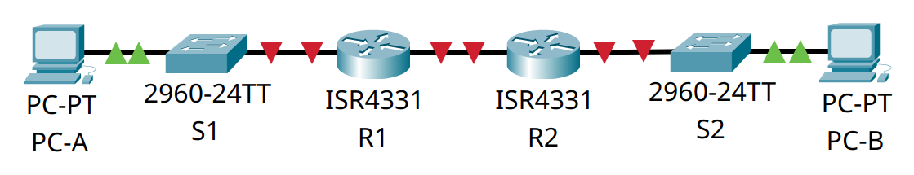

# Домашнее задание №8.1 «Реализация DHCPv4»

## Топология


## 1. Таблица адресации

| Устройство | Интерфейс   | IP-адрес | Маска подсети   | Шлюз по умолчанию |
| ---------- | ----------- | -------- | --------------- | ----------------- |
| R1         | G0/0/0      | 10.0.0.1 | 255.255.255.252 | —                 |
|            | G0/0/1      | —        | —               |                   |
|            | G0/0/1.100  |          |                 |                   |
|            | G0/0/1.200  |          |                 |                   |
|            | G0/0/1.1000 | —        | —               |                   |
| R2         | G0/0/0      | 10.0.0.2 | 255.255.255.252 | —                 |
|            | G0/0/1      |          |                 |                   |
| S1         | VLAN 200    |          |                 |                   |
| S2         | VLAN 1      |          |                 |                   |
| PC-A       | NIC         | DHCP     | DHCP            | DHCP              |
| PC-A       | NIC         | DHCP     | DHCP            | DHCP              |

## 2. Таблица VLAN

| VLAN | Имя         | Назначенный интерфейс       |
| ---- | ----------- | --------------------------- |
| 1    | Нет         | S2: F0/18                   |
| 100  | Клиенты     | S1: F0/6                    |
| 200  | Управление  | S1: VLAN 200                |
| 999  | Parking_Lot | S1: F0/1-4, F0/7-24, G0/1-2 |
| 1000 | Собственная | —                           |

## 3. Задачи

* [Часть 1. Создание сети и настройка основных параметров устройства.](#часть-1-создание-сети-инастройка-основных-параметров-устройства)
* [Часть 2. Настройка и проверка двух серверов DHCPv4 на R1.](#часть-2-настройка-и-проверка-двух-серверов-dhcpv4-на-r1)
* [Часть 3. Настройка и проверка DHCP-ретрансляции на R2.](#часть-3-настройка-и-проверка-dhcp-ретрансляции-на-r2)

## Общие сведения/сценарий

Протокол динамической конфигурации сетевого узла (DHCP) — сетевой протокол,
позволяющий сетевым администраторам управлять и автоматизировать назначение
IP-адресов. Без использования DHCP  для IPv4 администратору необходимо вручную
назначать и настраивать IP-адреса, предпочтительные DNS-серверы и шлюзы по
умолчанию. По мере увеличения сети и перемещении устройств из одной внутренней
сети в другую это становится административной проблемой.

В предложенном сценарии размеры компании увеличились, и сетевые администраторы
больше не имеют возможности назначать IP-адреса для устройств вручную. Ваша
задача заключается в настройке маршрутизатора R1 для назначения IPv4-адресов в
двух разных подсетях.

**Примечание:** маршрутизаторы, используемые в практических лабораторных работах
CCNA, - это Cisco 4221 с Cisco IOS XE Release 16.9.3 (образ universalk9). В
лабораторных работах используются коммутаторы Cisco Catalyst 2960 с Cisco IOS
версии 15.0(2) (образ lanbasek9). Можно использовать другие маршрутизаторы,
коммутаторы и версии Cisco IOS. В зависимости от модели устройства и версии Cisco
IOS доступные команды и результаты их выполнения могут отличаться от тех, которые
показаны в лабораторных работах. Правильные идентификаторы интерфейса см. в
сводной таблице по интерфейсам маршрутизаторов в конце лабораторной работы.

**Примечание:** убедитесь, что все настройки коммутаторов удалены и загрузочная
конфигурация отсутствует. Если вы не уверены, обратитесь к инструктору.

## Часть 1. Создание сети и настройка основных параметров устройства

Для моделирования сети будем использовать ПО Cisco Packet Tracer 8.1.1. Создадим
новую конфигурацию, используя следующие ресурсы:

* 2 маршрутизатора (Cisco 4221 с универсальным образом Cisco IOS XE версии
  16.9.3 или аналогичным);
* 2 коммутатора (Cisco 2960 с операционной системой Cisco IOS 15.0(2) (образ
  lanbasek9) или аналогичная модель);
* 2 ПК (ОС Windows с программой эмуляции терминалов, например Tera Term);
* консольные кабели для настройки устройств Cisco IOS через консольные порты;
* кабели Ethernet, расположенные в соответствии с топологией.

В первой части лабораторной работы создадим топологию сети и настроим базовые
параметры для узлов ПК и коммутаторов.

### Шаг 1. Создание схемы адресации

Разобьём сеть 192.168.1.0/24 на подсети в соответствии со следующими требованиями:

#### a. «Подсеть А»

Клиентская VLAN на **R1**: 58 хостов.

Запишем первый IP-адрес в таблице адресации для **R1** G0/0/1.100: 192.168.1.1,
подсеть 192.168.1.0/26 (62 хоста, маска 255.255.255.192).

#### b. «Подсеть B»

Управляющая VLAN на **R1**: 28 хостов.

Запишем первый IP-адрес в таблице адресации для **R1** G0/0/1.200. Запишем второй
IP-адрес в таблице адресов для **S1** VLAN 200 и введём соответствующий шлюз по
умолчанию.

Необходимая подсеть: 192.168.1.64/27 (30 хостов, маска 255.255.255.224), первый
IP 192.168.1.65, второй - 192.168.1.66.

#### c. «Подсеть C»

Клиентская сеть на **R2**: 12 узлов.

Запишем первый IP-адрес в таблице адресации для **R2** G0/0/1: 192.168.1.97.
Подсеть 192.168.1.96/28 (14 хостов, маска 255.255.255.240).

### Шаг 2. Создание сети

Подключим устройства, как показано в топологии, и подсоединим необходимые кабели.



### Шаг 3. Базовая настройка маршрутизаторов

Настроим базовые параметры каждого маршрутизатора.

#### a. Установка имени устройства

Подключимся к маршрутизатору с помощью консольного подключения, активируем
привилегированный режим и сменим имя:

```text
Router>en
Router#conf t
Enter configuration commands, one per line.  End with CNTL/Z.
Router(config)#host R1
R1(config)#
```

#### b. Отключение поиска DNS

Чтобы предотвратить попытки маршрутизатора неверно преобразовывать введённые
команды таким образом, как будто они являются именами узлов, отключим поиск DNS:

```text
R1(config)#no ip domain-lookup
R1(config)#
```

#### c. Установка пароля привилегированного режима

Назначим **class** в качестве зашифрованного пароля привилегированного режима EXEC:

```text
R1(config)#enable secret class
R1(config)#
```

#### d. Установка пароля консоли

Назначим **cisco** в качестве пароля консоли и включим вход в систему
по паролю:

```text
R1(config)#line con 0
R1(config-line)#password cisco
R1(config-line)#login
R1(config-line)#exit
R1(config)#
```

#### e. Установка пароля VTY

Назначим **cisco** в качестве пароля VTY каналов и включим вход в систему
по паролю:

```text
R1(config)#line vty 0 15
R1(config-line)#password cisco
R1(config-line)#login
R1(config-line)#exit
R1(config)#
```

#### f. Включение шифрования паролей

Зашифруем открытые пароли в файле конфигурации:

```text
R1(config)#service password-encryption
R1(config)#
```

#### g. Создание баннера

Для предупреждения пользователей о запрете несанкционированного доступа, настроим
баннерное сообщение дня (MOTD):

```text
R1(config)#banner motd # ATTENTION! Unauthorized access is strictly prohibited. #
R1(config)#
```

#### h. Сохранение конфигурации

Скопируем текущую конфигурацию в файл загрузочной конфигурации.

```text
R1(config)#exit
R1#copy run start
Destination filename [startup-config]? 
Building configuration...
[OK]
R1#
```

<details>
<summary>R1# show running-config</summary>

```text
R1#show running-config
Building configuration...

Current configuration : 884 bytes
!
version 16.6.4
no service timestamps log datetime msec
no service timestamps debug datetime msec
service password-encryption
!
hostname R1
!
!
!
enable secret 5 $1$mERr$9cTjUIEqNGurQiFU.ZeCi1
!
!
!
!
!Настройте G0/0/1 на R2 с первым IP-адресом подсети C, рассчитанным ранее.
!
ip cef
no ipv6 cef
!
!
!
!
!
!
!
!
!
!
no ip domain-lookup
!
!
spanning-tree mode pvst
!
!
!
!
!
!
interface GigabitEthernet0/0/0
 no ip address
 duplex auto
 speed auto
 shutdown
!
interface GigabitEthernet0/0/1
 no ip address
 duplex auto
 speed auto
 shutdown
!
interface GigabitEthernet0/0/2
 no ip address
 duplex auto
 speed auto
 shutdown
!
interface Vlan1
 no ip address
 shutdown
!
ip classless
!
ip flow-export version 9
!
!
!
banner motd ^C ATTENTION! Unauthorized access is strictly prohibited. ^C
!
!
!
!
!
line con 0
 password 7 0822455D0A16
 login
!
line aux 0
!
line vty 0 4
 password 7 0822455D0A16
 login
line vty 5 15
 password 7 0822455D0A16
 login
!
!
!
end


R1#
```

</details>

<details>
<summary>R2# show running-config</summary>

```text
R2#show running-config 
Building configuration...

Current configuration : 884 bytes
!
version 16.6.4
no service timestamps log datetime msec
no service timestamps debug datetime msec
service password-encryption
!
hostname R2
!
!
!
enable secret 5 $1$mERr$9cTjUIEqNGurQiFU.ZeCi1
!
!
!
!
!
!
ip cef
no ipv6 cef
!
!
!
!
!
!
!
!
!
!
no ip domain-lookup
!
!
spanning-tree mode pvst
!
!
!
!
!
!
interface GigabitEthernet0/0/0
 no ip address
 duplex auto
 speed auto
 shutdown
!
interface GigabitEthernet0/0/1
 no ip address
 duplex auto
 speed auto
 shutdown
!
interface GigabitEthernet0/0/2
 no ip address
 duplex auto
 speed auto
 shutdown
!
interface Vlan1
 no ip address
 shutdown
!
ip classless
!
ip flow-export version 9
!
!
!
banner motd ^C ATTENTION! Unauthorized access is strictly prohibited. ^C
!
!
!
!
!
line con 0
 password 7 0822455D0A16
 login
!
line aux 0
!
line vty 0 4
 password 7 0822455D0A16
 login
line vty 5 15
 password 7 0822455D0A16
 login
!
!
!
end


R2#
```

</details>

#### i. Установка времени

Для установки времени и даты воспользуемся командой **clock set**. Просмотреть
текущее время и дату можно командой **show clock**.

```text
R1#clock set 17:04 03 Jan 2025
R1#show clock
17:4:0.0 UTC Fri Jan 3 2025
R1#
```

### Шаг 4. Настройка маршрутизации между сетями VLAN

Настроим маршрутизацию между сетями VLAN на маршрутизаторе **R1**.

#### a. Активация интерфейса

Активируем интерфейс G0/0/1 на маршрутизаторе **R1**.

```text
R1(config)#interface GigabitEthernet 0/0/1
R1(config-if)#no shut

R1(config-if)#
%LINK-5-CHANGED: Interface GigabitEthernet0/0/1, changed state to up

%LINEPROTO-5-UPDOWN: Line protocol on Interface GigabitEthernet0/0/1, changed state to up

R1(config-if)#exit
R1(config)#
```

#### b. Настройка подинтерфейсов

Настроим подинтерфейсы для каждой VLAN в соответствии с требованиями таблицы
IP-адресации. Все субинтерфейсы используют инкапсуляцию 802.1Q, им назначается
первый полезный адрес из вычисленного пула IP-адресов. Убедимся, что подинтерфейсу
для native VLAN не назначен IP-адрес. Включим описание для каждого подинтерфейса.

```text

R1(config)#int g0/0/1.100
R1(config-subif)#
%LINK-5-CHANGED: Interface GigabitEthernet0/0/1.100, changed state to up

%LINEPROTO-5-UPDOWN: Line protocol on Interface GigabitEthernet0/0/1.100, changed state to up

R1(config-subif)#desc Clients
R1(config-subif)#enc dot1Q 100
R1(config-subif)#ip add 192.168.1.1 255.255.255.192
R1(config-subif)#exit
R1(config)#int g0/0/1.200
R1(config-subif)#
%LINK-5-CHANGED: Interface GigabitEthernet0/0/1.200, changed state to up

%LINEPROTO-5-UPDOWN: Line protocol on Interface GigabitEthernet0/0/1.200, changed state to up

R1(config-subif)#desc Management
R1(config-subif)#enc dot1Q 200
R1(config-subif)#ip add 192.168.1.65 255.255.255.224
R1(config-subif)#exit
R1(config)#
R1(config)#int g0/0/1.999
R1(config-subif)#
%LINK-5-CHANGED: Interface GigabitEthernet0/0/1.999, changed state to up

%LINEPROTO-5-UPDOWN: Line protocol on Interface GigabitEthernet0/0/1.999, changed state to up

R1(config-subif)#desc Parking_Lot
R1(config-subif)#enc dot1Q 999
R1(config-subif)#exit
R1(config)#int g0/0/1.1000
R1(config-subif)#
%LINK-5-CHANGED: Interface GigabitEthernet0/0/1.1000, changed state to up

%LINEPROTO-5-UPDOWN: Line protocol on Interface GigabitEthernet0/0/1.1000, changed state to up

R1(config-subif)#enc dot1Q 1000 native
R1(config-subif)#desc Native
R1(config-subif)#exit
R1(config)#
```

#### c. Проверка работы подинтерфейсов

Убедимся, что вспомогательные интерфейсы работают.

<summary>R1#show interfaces</summary>

```text
R1#show interfaces
GigabitEthernet0/0/0 is up, line protocol is up (connected)
  Hardware is ISR4331-3x1GE, address is 0060.2f78.7101 (bia 0060.2f78.7101)
  Internet address is 10.0.0.1/30
  MTU 1500 bytes, BW 1000000 Kbit, DLY 10 usec,
     reliability 255/255, txload 1/255, rxload 1/255
  Encapsulation ARPA, loopback not set
  Keepalive not supported
  Full Duplex, 1000Mbps, link type is auto,  media type is Auto Select
  output flow-control is on, input flow-control is on
  ARP type: ARPA, ARP Timeout 04:00:00, 
  Last input 00:00:08, output 00:00:05, output hang never
  Last clearing of "show interface" counters never
  Input queue: 0/375/0 (size/max/drops); Total output drops: 0
  Queueing strategy: fifo
  Output queue :0/40 (size/max)
  5 minute input rate 0 bits/sec, 0 packets/sec
  5 minute output rate 0 bits/sec, 0 packets/sec
     14 packets input, 1792 bytes, 0 no buffer
     Received 0 broadcasts (0 IP multicasts)
     0 runts, 0 giants, 0 throttles
     0 input errors, 0 CRC, 0 frame, 0 overrun, 0 ignored
     0 watchdog, 1017 multicast, 0 pause input
     0 input packets with dribble condition detected
     14 packets output, 1792 bytes, 0 underruns
     0 output errors, 0 collisions, 1 interface resets
     0 unknown protocol drops
     0 babbles, 0 late collision, 0 deferred
     0 lost carrier, 0 no carrier
     0 output buffer failures, 0 output buffers swapped out
GigabitEthernet0/0/1 is up, line protocol is up (connected)
  Hardware is ISR4331-3x1GE, address is 0060.2f78.7102 (bia 0060.2f78.7102)
  MTU 1500 bytes, BW 1000000 Kbit, DLY 100 usec,
     reliability 255/255, txload 1/255, rxload 1/255
  Encapsulation ARPA, loopback not set
  Keepalive not supported
  output flow-control is on, input flow-control is on
  ARP type: ARPA, ARP Timeout 04:00:00, 
  Last input 00:00:08, output 00:00:05, output hang never
  Last clearing of "show interface" counters never
  Input queue: 0/375/0 (size/max/drops); Total output drops: 0
  Queueing strategy: fifo
  Output queue :0/40 (size/max)
  5 minute input rate 0 bits/sec, 0 packets/sec
  5 minute output rate 0 bits/sec, 0 packets/sec
     0 packets input, 0 bytes, 0 no buffer
     Received 0 broadcasts (0 IP multicasts)
     0 runts, 0 giants, 0 throttles
     0 input errors, 0 CRC, 0 frame, 0 overrun, 0 ignored
     0 watchdog, 1017 multicast, 0 pause input
     0 input packets with dribble condition detected
     0 packets output, 0 bytes, 0 underruns
     0 output errors, 0 collisions, 3 interface resets
     0 unknown protocol drops
     0 babbles, 0 late collision, 0 deferred
     0 lost carrier, 0 no carrier
     0 output buffer failures, 0 output buffers swapped out
GigabitEthernet0/0/1.100 is up, line protocol is up (connected)
  Hardware is PQUICC_FEC, address is 0060.2f78.7102 (bia 0060.2f78.7102)
  Internet address is 192.168.1.1/26
  MTU 1500 bytes, BW 100000 Kbit, DLY 100 usec, 
     reliability 255/255, txload 1/255, rxload 1/255
  Encapsulation 802.1Q Virtual LAN, Vlan ID 100
  ARP type: ARPA, ARP Timeout 04:00:00, 
  Last clearing of "show interface" counters never
GigabitEthernet0/0/1.200 is up, line protocol is up (connected)
  Hardware is PQUICC_FEC, address is 0060.2f78.7102 (bia 0060.2f78.7102)
  Internet address is 192.168.1.65/27
  MTU 1500 bytes, BW 100000 Kbit, DLY 100 usec, 
     reliability 255/255, txload 1/255, rxload 1/255
  Encapsulation 802.1Q Virtual LAN, Vlan ID 200
  ARP type: ARPA, ARP Timeout 04:00:00, 
  Last clearing of "show interface" counters never
GigabitEthernet0/0/1.1000 is up, line protocol is up (connected)
  Hardware is PQUICC_FEC, address is 0060.2f78.7102 (bia 0060.2f78.7102)
  MTU 1500 bytes, BW 100000 Kbit, DLY 100 usec, 
     reliability 255/255, txload 1/255, rxload 1/255
  Encapsulation 802.1Q Virtual LAN, Vlan ID 1000
  ARP type: ARPA, ARP Timeout 04:00:00, 
  Last clearing of "show interface" counters never
GigabitEthernet0/0/2 is administratively down, line protocol is down (disabled)
  Hardware is ISR4331-3x1GE, address is 0060.2f78.7103 (bia 0060.2f78.7103)
  MTU 1500 bytes, BW 1000000 Kbit, DLY 10 usec,
     reliability 255/255, txload 1/255, rxload 1/255
  Encapsulation ARPA, loopback not set
  Keepalive not supported
  Full Duplex, 1000Mbps, link type is auto,  media type is unknown media type
  output flow-control is on, input flow-control is on
  ARP type: ARPA, ARP Timeout 04:00:00, 
  Last input 00:00:08, output 00:00:05, output hang never
  Last clearing of "show interface" counters never
  Input queue: 0/375/0 (size/max/drops); Total output drops: 0
  Queueing strategy: fifo
  Output queue :0/40 (size/max)
  5 minute input rate 0 bits/sec, 0 packets/sec
  5 minute output rate 0 bits/sec, 0 packets/sec
     0 packets input, 0 bytes, 0 no buffer
     Received 0 broadcasts (0 IP multicasts)
     0 runts, 0 giants, 0 throttles
     0 input errors, 0 CRC, 0 frame, 0 overrun, 0 ignored
     0 watchdog, 1017 multicast, 0 pause input
     0 input packets with dribble condition detected
     0 packets output, 0 bytes, 0 underruns
     0 output errors, 0 collisions, 1 interface resets
     0 unknown protocol drops
     0 babbles, 0 late collision, 0 deferred
     0 lost carrier, 0 no carrier
     0 output buffer failures, 0 output buffers swapped out
Vlan1 is administratively down, line protocol is down
  Hardware is CPU Interface, address is 0007.ecd4.a64c (bia 0007.ecd4.a64c)
  MTU 1500 bytes, BW 100000 Kbit, DLY 1000000 usec,
     reliability 255/255, txload 1/255, rxload 1/255
  Encapsulation ARPA, loopback not set
  ARP type: ARPA, ARP Timeout 04:00:00
  Last input 21:40:21, output never, output hang never
  Last clearing of "show interface" counters never
  Input queue: 0/75/0/0 (size/max/drops/flushes); Total output drops: 0
  Queueing strategy: fifo
  Output queue: 0/40 (size/max)
  5 minute input rate 0 bits/sec, 0 packets/sec
  5 minute output rate 0 bits/sec, 0 packets/sec
     1682 packets input, 530955 bytes, 0 no buffer
     Received 0 broadcasts (0 IP multicast)
     0 runts, 0 giants, 0 throttles
     0 input errors, 0 CRC, 0 frame, 0 overrun, 0 ignored
     563859 packets output, 0 bytes, 0 underruns
     0 output errors, 23 interface resets
     0 output buffer failures, 0 output buffers swapped out

R1#
```

</details>

### Шаг 5. Настройка статической маршрутизации

Настроим G0/0/1 на **R2**, затем G0/0/0 и статическую маршрутизацию для обоих
маршрутизаторов.

#### a. Настройка G0/0/1 на R2

Настроим G0/0/1 на **R2** с первым IP-адресом подсети C, рассчитанным ранее.

```text
R2#conf t
Enter configuration commands, one per line.  End with CNTL/Z.
R2(config)#int g0/0/1
R2(config-if)#ip add 192.168.1.97 255.255.255.240
R2(config-if)#no shut

R2(config-if)#
%LINK-5-CHANGED: Interface GigabitEthernet0/0/1, changed state to up

%LINEPROTO-5-UPDOWN: Line protocol on Interface GigabitEthernet0/0/1, changed state to up

R2(config-if)#exit
R2(config)#
```

#### b. Настройка G0/0/0 на маршрутизаторах

Настроим интерфейс G0/0/0 для каждого маршрутизатора на основе приведенной выше
таблицы IP-адресации.

```text
R1(config)#int g0/0/0
R1(config-if)#ip add 10.0.0.1 255.255.255.252
R1(config-if)#no shut

R1(config-if)#
%LINK-5-CHANGED: Interface GigabitEthernet0/0/0, changed state to up

R1(config-if)#exit
R1(config)#
```

```text
R2(config)#int g0/0/0
R2(config-if)#ip add 10.0.0.2 255.255.255.252
R2(config-if)#no shut

R2(config-if)#
%LINK-5-CHANGED: Interface GigabitEthernet0/0/0, changed state to up

%LINEPROTO-5-UPDOWN: Line protocol on Interface GigabitEthernet0/0/0, changed state to up

R2(config-if)#exit
R2(config)#
```

#### c. Настройка маршрутов по умолчанию

Настроим маршрут по умолчанию на каждом маршрутизаторе, указываемом на IP-адрес
G0/0/0 на другом маршрутизаторе.

```text
R1(config)#ip route 0.0.0.0 0.0.0.0 10.0.0.2
```

```text
R2(config)#ip route 0.0.0.0 0.0.0.0 10.0.0.1
```

#### d. Проверка работы маршрутизации

Убедимся, что статическая маршрутизация работает с помощью пинга до адреса
G0/0/1 **R2** от **R1**.

```text
R1#ping 10.0.0.2

Type escape sequence to abort.
Sending 5, 100-byte ICMP Echos to 10.0.0.2, timeout is 2 seconds:
.!!!!
Success rate is 80 percent (4/5), round-trip min/avg/max = 0/0/0 ms

R1#
```

#### e. Сохранение конфигурации

Сохраним текущую конфигурацию в файл загрузочной конфигурации.

```text
R1#copy run start
Destination filename [startup-config]? 
Building configuration...
[OK]
R1#
```

<details>
<summary>R1# show running-config</summary>

```text
R1#show running-config 
Building configuration...

Current configuration : 1277 bytes
!
version 16.6.4
no service timestamps log datetime msec
no service timestamps debug datetime msec
service password-encryption
!
hostname R1
!
!
!
enable secret 5 $1$mERr$9cTjUIEqNGurQiFU.ZeCi1
!
!
!
!
!
!
ip cef
no ipv6 cef
!
!
!
!
!
!
!
!
!
!
no ip domain-lookup
!
!
spanning-tree mode pvst
!
!
!
!
!
!
interface GigabitEthernet0/0/0
 ip address 10.0.0.1 255.255.255.252
 duplex auto
 speed auto
!
interface GigabitEthernet0/0/1
 no ip address
 duplex auto
 speed auto
!
interface GigabitEthernet0/0/1.100
 description Clients
 encapsulation dot1Q 100
 ip address 192.168.1.1 255.255.255.192
!
interface GigabitEthernet0/0/1.200
 description Management
 encapsulation dot1Q 200
 ip address 192.168.1.65 255.255.255.224
!
interface GigabitEthernet0/0/1.1000
 description Native
 encapsulation dot1Q 1000 native
 no ip address
!
interface GigabitEthernet0/0/2
 no ip address
 duplex auto
 speed auto
 shutdown
!
interface Vlan1
 no ip address
 shutdown
!
ip classless
ip route 0.0.0.0 0.0.0.0 10.0.0.2 
!
ip flow-export version 9
!
!
!
banner motd ^C ATTENTION! Unauthorized access is strictly prohibited. ^C
!
!
!
!
!
line con 0
 password 7 0822455D0A16
 login
!
line aux 0
!
line vty 0 4
 password 7 0822455D0A16
 login
line vty 5 15
 password 7 0822455D0A16
 login
!
!
!
end


R1# 
```

</details>


<details>
<summary>R2# show running-config</summary>

```text
R2#show running-config 
Building configuration...

Current configuration : 947 bytes
!
version 16.6.4
no service timestamps log datetime msec
no service timestamps debug datetime msec
service password-encryption
!
hostname R2
!
!
!
enable secret 5 $1$mERr$9cTjUIEqNGurQiFU.ZeCi1
!
!
!
!
!
!
ip cef
no ipv6 cef
!
!
!
!
!
!
!
!
!
!
no ip domain-lookup
!
!
spanning-tree mode pvst
!
!
!
!
!
!
interface GigabitEthernet0/0/0
 ip address 10.0.0.2 255.255.255.252
 duplex auto
 speed auto
!
interface GigabitEthernet0/0/1
 ip address 192.168.1.97 255.255.255.240
 duplex auto
 speed auto
!
interface GigabitEthernet0/0/2
 no ip address
 duplex auto
 speed auto
 shutdown
!
interface Vlan1
 no ip address
 shutdown
!
ip classless
ip route 0.0.0.0 0.0.0.0 10.0.0.1 
!
ip flow-export version 9
!
!
!
banner motd ^C ATTENTION! Unauthorized access is strictly prohibited. ^C
!
!
!
!
!
line con 0
 password 7 0822455D0A16
 login
!
line aux 0
!
line vty 0 4
 password 7 0822455D0A16
 login
line vty 5 15
 password 7 0822455D0A16
 login
!
!
!
end


R2#
```

</details>

### Шаг 6. Настройка базовых параметров коммутаторов

Настроим базовые параметры каждого коммутатора.

#### a. Установка имени устройства

Подключимся к коммутатору с помощью консольного подключения, активируем
привилегированный режим и сменим имя:

```text
Switch>en
Switch#conf t
Enter configuration commands, one per line.  End with CNTL/Z.
Switch(config)#host S1
S1(config)#
```

#### b. Отключение поиска DNS

Чтобы предотвратить попытки коммутатора неверно преобразовывать введённые
команды таким образом, как будто они являются именами узлов, отключим поиск DNS:

```text
S1(config)#no ip domain-lookup
S1(config)#
```

#### c. Установка пароля привилегированного режима

Назначим **class** в качестве зашифрованного пароля привилегированного режима EXEC:

```text
S1(config)#enable secret class
S1(config)#
```

#### d. Установка пароля консоли

Назначим **cisco** в качестве пароля консоли и включим вход в систему
по паролю:

```text
S1(config)#line con 0
S1(config-line)#password cisco
S1(config-line)#login
S1(config-line)#exit
S1(config)#
```

#### e. Установка пароля VTY

Назначим **cisco** в качестве пароля VTY каналов и включим вход в систему
по паролю:

```text
S1(config)#line vty 0 15
S1(config-line)#password cisco
S1(config-line)#login
S1(config-line)#exit
S1(config)#
```

#### f. Включение шифрования паролей

Зашифруем открытые пароли в файле конфигурации:

```text
S1(config)#service password-encryption
S1(config)#
```

#### g. Создание баннера

Для предупреждения пользователей о запрете несанкционированного доступа, настроим
баннерное сообщение дня (MOTD):

```text
S1(config)#banner motd # ATTENTION! Unauthorized access is strictly prohibited. #
S1(config)#
```

#### h. Сохранение конфигурации

Скопируем текущую конфигурацию в файл загрузочной конфигурации.

```text
S1(config)#exit
S1#copy run start
Destination filename [startup-config]? 
Building configuration...
[OK]
S1#
```

<details>
<summary>S1# show running-config</summary>

```text
S1#show running-config
Building configuration...

Current configuration : 1295 bytes
!
version 15.0
no service timestamps log datetime msec
no service timestamps debug datetime msec
service password-encryption
!
hostname S1
!
enable secret 5 $1$mERr$9cTjUIEqNGurQiFU.ZeCi1
!
!
!
no ip domain-lookup
!
!
!
spanning-tree mode pvst
spanning-tree extend system-id
!
interface FastEthernet0/1
!
interface FastEthernet0/2
!
interface FastEthernet0/3
!
interface FastEthernet0/4
!
interface FastEthernet0/5
!
interface FastEthernet0/6
!
interface FastEthernet0/7
!
interface FastEthernet0/8
!
interface FastEthernet0/9
!
interface FastEthernet0/10
!
interface FastEthernet0/11
!
interface FastEthernet0/12
!
interface FastEthernet0/13
!
interface FastEthernet0/14
!
interface FastEthernet0/15
!
interface FastEthernet0/16
!
interface FastEthernet0/17
!
interface FastEthernet0/18
!
interface FastEthernet0/19
!
interface FastEthernet0/20
!
interface FastEthernet0/21
!
interface FastEthernet0/22
!
interface FastEthernet0/23
!
interface FastEthernet0/24
!
interface GigabitEthernet0/1
!
interface GigabitEthernet0/2
!
interface Vlan1
 no ip address
 shutdown
!
banner motd ^C ATTENTION! Unauthorized access is strictly prohibited. ^C
!
!
!
line con 0
 password 7 0822455D0A16
 login
!
line vty 0 4
 password 7 0822455D0A16
 login
line vty 5 15
 password 7 0822455D0A16
 login
!
!
!
!
end


S1#
```

</details>

<details>
<summary>S2# show running-config</summary>

```text
S2#show running-config 
Building configuration...

Current configuration : 1295 bytes
!
version 15.0
no service timestamps log datetime msec
no service timestamps debug datetime msec
service password-encryption
!
hostname S2
!
enable secret 5 $1$mERr$9cTjUIEqNGurQiFU.ZeCi1
!
!
!
no ip domain-lookup
!
!
!
spanning-tree mode pvst
spanning-tree extend system-id
!
interface FastEthernet0/1
!
interface FastEthernet0/2
!
interface FastEthernet0/3
!
interface FastEthernet0/4
!
interface FastEthernet0/5
!
interface FastEthernet0/6
!
interface FastEthernet0/7
!
interface FastEthernet0/8
!
interface FastEthernet0/9
!
interface FastEthernet0/10
!
interface FastEthernet0/11
!
interface FastEthernet0/12
!
interface FastEthernet0/13
!
interface FastEthernet0/14
!
interface FastEthernet0/15
!
interface FastEthernet0/16
!
interface FastEthernet0/17
!
interface FastEthernet0/18
!
interface FastEthernet0/19
!
interface FastEthernet0/20
!
interface FastEthernet0/21
!
interface FastEthernet0/22
!
interface FastEthernet0/23
!
interface FastEthernet0/24
!
interface GigabitEthernet0/1
!
interface GigabitEthernet0/2
!
interface Vlan1
 no ip address
 shutdown
!
banner motd ^C ATTENTION! Unauthorized access is strictly prohibited. ^C
!
!
!
line con 0
 password 7 0822455D0A16
 login
!
line vty 0 4
 password 7 0822455D0A16
 login
line vty 5 15
 password 7 0822455D0A16
 login
!
!
!
!
end


S2#
```

</details>

#### i. Установка времени

Для установки времени и даты воспользуемся командой **clock set**. Просмотреть
текущее время и дату можно командой **show clock**.

**Примечание.** Вопросительный знак (?) позволяет открыть справку с правильной
последовательностью параметров, необходимых для выполнения этой команды.

```text
S1#clock set 01:35 04 Jan 2025
S1#show clock
1:35:3.467 UTC Sat Jan 4 2025
S1#
```

#### j. Сохранение конфигурации

Повторно сохраним конфигурацию коммутаторов.

### Шаг 7. Создание сетей VLAN на коммутаторе S1

Создадим и настроим сети VLAN на коммутаторе **S1**.

Примечание. S2 настроен только с базовыми настройками.

#### a. Создание сетей VLAN

Создадим необходимые VLAN на коммутаторе **S1** и присвоим им имена из приведённой
выше таблицы.

```text
S1(config)#vlan 100
S1(config-vlan)#name Clients
S1(config-vlan)#exit
S1(config)#vlan 200
S1(config-vlan)#name Management
S1(config-vlan)#exit
S1(config)#vlan 999
S1(config-vlan)#name Parking_Lot
S1(config-vlan)#exit
S1(config)#vlan 1000
S1(config-vlan)#name Native
S1(config-vlan)#exit
S1(config)#
```

#### b. Настройка интерфейса управления на S1

Настроим и активируем интерфейс управления на **S1** (VLAN 200), используя второй
IP-адрес из подсети, рассчитанный ранее. Кроме того установим шлюз по умолчанию
на **S1**.

```text
S1(config)#int vlan 200
S1(config-if)#
%LINK-5-CHANGED: Interface Vlan200, changed state to up

S1(config-if)#ip add 192.168.1.66 255.255.255.224
S1(config-if)#no shut
S1(config-if)#exit
S1(config)#ip default-gateway 192.168.1.65
S1(config)#
```

#### c. Настройка интерфейса управления на S2

Настроим и активируем интерфейс управления на **S2** (VLAN 1), используя второй
IP-адрес из подсети, рассчитанный ранее. Кроме того, установим шлюз по умолчанию
на **S2**

```text
S2(config)#int vlan 1
S2(config-if)#ip add 192.168.1.98 255.255.255.240
S2(config-if)#no shut

S2(config-if)#
%LINK-5-CHANGED: Interface Vlan1, changed state to up

%LINEPROTO-5-UPDOWN: Line protocol on Interface Vlan1, changed state to up

S2(config-if)#exit
S2(config)#ip default-gateway 192.168.1.97
S2(config)#
```

#### d. Деактивация неиспользуемых портов

Назначим все неиспользуемые порты **S1** VLAN Parking_Lot, настроим их для
статического режима доступа и административно деактивируем их. На **S2**
административно деактивируем все неиспользуемые порты.

**Примечание.** Команда interface range полезна для выполнения этой задачи с
минимальным количеством команд.

<details>
<summary>Коммутатор <strong>S1</strong></summary>

```text
S1(config)#int range f0/1-4
S1(config-if-range)#sw mode access
S1(config-if-range)#sw access vl 999
S1(config-if-range)#shut

%LINK-5-CHANGED: Interface FastEthernet0/1, changed state to administratively down

%LINK-5-CHANGED: Interface FastEthernet0/2, changed state to administratively down

%LINK-5-CHANGED: Interface FastEthernet0/3, changed state to administratively down

%LINK-5-CHANGED: Interface FastEthernet0/4, changed state to administratively down
S1(config-if-range)#exit
S1(config)#int range f0/7-24
S1(config-if-range)#sw m access
S1(config-if-range)#sw access vl 999
S1(config-if-range)#shut

%LINK-5-CHANGED: Interface FastEthernet0/7, changed state to administratively down

%LINK-5-CHANGED: Interface FastEthernet0/8, changed state to administratively down

%LINK-5-CHANGED: Interface FastEthernet0/9, changed state to administratively down

%LINK-5-CHANGED: Interface FastEthernet0/10, changed state to administratively down

%LINK-5-CHANGED: Interface FastEthernet0/11, changed state to administratively down

%LINK-5-CHANGED: Interface FastEthernet0/12, changed state to administratively down

%LINK-5-CHANGED: Interface FastEthernet0/13, changed state to administratively down

%LINK-5-CHANGED: Interface FastEthernet0/14, changed state to administratively down

%LINK-5-CHANGED: Interface FastEthernet0/15, changed state to administratively down

%LINK-5-CHANGED: Interface FastEthernet0/16, changed state to administratively down

%LINK-5-CHANGED: Interface FastEthernet0/17, changed state to administratively down

%LINK-5-CHANGED: Interface FastEthernet0/18, changed state to administratively down

%LINK-5-CHANGED: Interface FastEthernet0/19, changed state to administratively down

%LINK-5-CHANGED: Interface FastEthernet0/20, changed state to administratively down

%LINK-5-CHANGED: Interface FastEthernet0/21, changed state to administratively down

%LINK-5-CHANGED: Interface FastEthernet0/22, changed state to administratively down

%LINK-5-CHANGED: Interface FastEthernet0/23, changed state to administratively down

%LINK-5-CHANGED: Interface FastEthernet0/24, changed state to administratively down
S1(config-if-range)#exit
S1(config)#int range g0/1-2
S1(config-if-range)#sw m access
S1(config-if-range)#sw access vl 999
S1(config-if-range)#shut

%LINK-5-CHANGED: Interface GigabitEthernet0/1, changed state to administratively down

%LINK-5-CHANGED: Interface GigabitEthernet0/2, changed state to administratively down
S1(config-if-range)#exit
S1(config)#
```

</details>

<details>
<summary>Коммутатор <strong>S2</strong></summary>

```text
S2(config)#int range f0/1-4
S2(config-if-range)#sw m access
S2(config-if-range)#shut

%LINK-5-CHANGED: Interface FastEthernet0/1, changed state to administratively down

%LINK-5-CHANGED: Interface FastEthernet0/2, changed state to administratively down

%LINK-5-CHANGED: Interface FastEthernet0/3, changed state to administratively down

%LINK-5-CHANGED: Interface FastEthernet0/4, changed state to administratively down

S2(config-if-range)#exit

S2(config)#int range f0/6-17
S2(config-if-range)#sw m access
S2(config-if-range)#shut

%LINK-5-CHANGED: Interface FastEthernet0/6, changed state to administratively down

%LINK-5-CHANGED: Interface FastEthernet0/7, changed state to administratively down

%LINK-5-CHANGED: Interface FastEthernet0/8, changed state to administratively down

%LINK-5-CHANGED: Interface FastEthernet0/9, changed state to administratively down

%LINK-5-CHANGED: Interface FastEthernet0/10, changed state to administratively down

%LINK-5-CHANGED: Interface FastEthernet0/11, changed state to administratively down

%LINK-5-CHANGED: Interface FastEthernet0/12, changed state to administratively down

%LINK-5-CHANGED: Interface FastEthernet0/13, changed state to administratively down

%LINK-5-CHANGED: Interface FastEthernet0/14, changed state to administratively down

%LINK-5-CHANGED: Interface FastEthernet0/15, changed state to administratively down

%LINK-5-CHANGED: Interface FastEthernet0/16, changed state to administratively down

%LINK-5-CHANGED: Interface FastEthernet0/17, changed state to administratively down

S2(config-if-range)#exit

S2(config)#int range f0/19-24
S2(config-if-range)#sw m access
S2(config-if-range)#shut

%LINK-5-CHANGED: Interface FastEthernet0/19, changed state to administratively down

%LINK-5-CHANGED: Interface FastEthernet0/20, changed state to administratively down

%LINK-5-CHANGED: Interface FastEthernet0/21, changed state to administratively down

%LINK-5-CHANGED: Interface FastEthernet0/22, changed state to administratively down

%LINK-5-CHANGED: Interface FastEthernet0/23, changed state to administratively down

%LINK-5-CHANGED: Interface FastEthernet0/24, changed state to administratively down

S2(config-if-range)#exit

S2(config)#int range g0/1-2
S2(config-if-range)#sw m access
S2(config-if-range)#shut

%LINK-5-CHANGED: Interface GigabitEthernet0/1, changed state to administratively down

%LINK-5-CHANGED: Interface GigabitEthernet0/2, changed state to administratively down
S2(config-if-range)#exit
S2(config)#
```

</details>

### Шаг 8. Назначение сетей VLAN соответствующим интерфейсам коммутатора

#### a. Назначение используемых портов

Назначим используемые порты соответствующей VLAN (указанной в таблице VLAN выше)
и настроим их для режима статического доступа.

```text
S1(config)#int f0/6
S1(config-if)#sw m acc
S1(config-if)#sw acc vl 100
S1(config-if)#no shut
S1(config-if)#exit
S1(config)#
```

#### b. Проверка назначения портов

Убедимся, что VLAN назначены на правильные интерфейсы.

```text
S1(config)#do show vlan

VLAN Name                             Status    Ports
---- -------------------------------- --------- -------------------------------
1    default                          active    Fa0/5
100  Clients                          active    Fa0/6
200  Management                       active    
999  Parking_Lot                      active    Fa0/1, Fa0/2, Fa0/3, Fa0/4
                                                Fa0/7, Fa0/8, Fa0/9, Fa0/10
                                                Fa0/11, Fa0/12, Fa0/13, Fa0/14
                                                Fa0/15, Fa0/16, Fa0/17, Fa0/18
                                                Fa0/19, Fa0/20, Fa0/21, Fa0/22
                                                Fa0/23, Fa0/24, Gig0/1, Gig0/2
1000 Native                           active    
1002 fddi-default                     active    
1003 token-ring-default               active    
1004 fddinet-default                  active    
1005 trnet-default                    active    

VLAN Type  SAID       MTU   Parent RingNo BridgeNo Stp  BrdgMode Trans1 Trans2
---- ----- ---------- ----- ------ ------ -------- ---- -------- ------ ------
1    enet  100001     1500  -      -      -        -    -        0      0
100  enet  100100     1500  -      -      -        -    -        0      0
200  enet  100200     1500  -      -      -        -    -        0      0
999  enet  100999     1500  -      -      -        -    -        0      0
1000 enet  101000     1500  -      -      -        -    -        0      0
1002 fddi  101002     1500  -      -      -        -    -        0      0   
1003 tr    101003     1500  -      -      -        -    -        0      0   
1004 fdnet 101004     1500  -      -      -        ieee -        0      0   
1005 trnet 101005     1500  -      -      -        ibm  -        0      0   

VLAN Type  SAID       MTU   Parent RingNo BridgeNo Stp  BrdgMode Trans1 Trans2
---- ----- ---------- ----- ------ ------ -------- ---- -------- ------ ------

Remote SPAN VLANs
------------------------------------------------------------------------------

Primary Secondary Type              Ports
------- --------- ----------------- ------------------------------------------
S1(config)#
```

**Вопрос:** почему интерфейс F0/5 указан в VLAN 1?

**Ответ:** потому что мы не назначили ему явно VLAN.

### Шаг 9. Настройка транка на S1

Вручную настроим интерфейс **S1** F0/5 в качестве транка 802.1Q.

#### a. Включение транка для порта

Изменим режим порта коммутатора, чтобы принудительно создать магистральный канал.

```text
S1(config)#int f0/5
S1(config-if)#sw m trunk

S1(config-if)#
%LINEPROTO-5-UPDOWN: Line protocol on Interface FastEthernet0/5, changed state to down

%LINEPROTO-5-UPDOWN: Line protocol on Interface FastEthernet0/5, changed state to up

%LINEPROTO-5-UPDOWN: Line protocol on Interface Vlan200, changed state to up

S1(config-if)#
```

#### b. Установка VLAN для транка

В рамках конфигурации транка установим для native VLAN значение 1000.

```text
S1(config-if)#sw trunk native vlan 1000
S1(config-if)#
```

#### c. Настройка допустимых VLAN для транка

В качестве другой части конфигурации магистрали укажем, что VLAN 100, 200 и 1000
могут проходить по транку.

```text
S1(config-if)#sw trunk allowed vlan 100,200,1000
S1(config-if)#exit
S1(config)#
```

#### d. Сохранение конфигурации

Сохраним текущую конфигурацию в файл загрузочной конфигурации.

```text
S1#copy run start
Destination filename [startup-config]? 
Building configuration...
[OK]
S1#
```

<details>
<summary>S1#show run<summary>>

```text
S1#show run
Building configuration...

Current configuration : 3032 bytes
!
version 15.0
no service timestamps log datetime msec
no service timestamps debug datetime msec
service password-encryption
!
hostname S1
!
enable secret 5 $1$mERr$9cTjUIEqNGurQiFU.ZeCi1
!
!
!
no ip domain-lookup
!
!
!
spanning-tree mode pvst
spanning-tree extend system-id
!
interface FastEthernet0/1
 switchport access vlan 999
 switchport mode access
 shutdown
!
interface FastEthernet0/2
 switchport access vlan 999
 switchport mode access
 shutdown
!
interface FastEthernet0/3
 switchport access vlan 999
 switchport mode access
 shutdown
!
interface FastEthernet0/4
 switchport access vlan 999
 switchport mode access
 shutdown
!
interface FastEthernet0/5
 switchport trunk native vlan 1000
 switchport trunk allowed vlan 100,200,1000
 switchport mode trunk
!
interface FastEthernet0/6
 switchport access vlan 100
 switchport mode access
!
interface FastEthernet0/7
 switchport access vlan 999
 switchport mode access
 shutdown
!
interface FastEthernet0/8
 switchport access vlan 999
 switchport mode access
 shutdown
!
interface FastEthernet0/9
 switchport access vlan 999
 switchport mode access
 shutdown
!
interface FastEthernet0/10
 switchport access vlan 999
 switchport mode access
 shutdown
!
interface FastEthernet0/11
 switchport access vlan 999
 switchport mode access
 shutdown
!
interface FastEthernet0/12
 switchport access vlan 999
 switchport mode access
 shutdown
!
interface FastEthernet0/13
 switchport access vlan 999
 switchport mode access
 shutdown
!
interface FastEthernet0/14
 switchport access vlan 999
 switchport mode access
 shutdown
!
interface FastEthernet0/15
 switchport access vlan 999
 switchport mode access
 shutdown
!
interface FastEthernet0/16
 switchport access vlan 999
 switchport mode access
 shutdown
!
interface FastEthernet0/17
 switchport access vlan 999
 switchport mode access
 shutdown
!
interface FastEthernet0/18
 switchport access vlan 999
 switchport mode access
 shutdown
!
interface FastEthernet0/19
 switchport access vlan 999
 switchport mode access
 shutdown
!
interface FastEthernet0/20
 switchport access vlan 999
 switchport mode access
 shutdown
!
interface FastEthernet0/21
 switchport access vlan 999
 switchport mode access
 shutdown
!
interface FastEthernet0/22
 switchport access vlan 999
 switchport mode access
 shutdown
!
interface FastEthernet0/23
 switchport access vlan 999
 switchport mode access
 shutdown
!
interface FastEthernet0/24
 switchport access vlan 999
 switchport mode access
 shutdown
!
interface GigabitEthernet0/1
 switchport access vlan 999
 switchport mode access
 shutdown
!
interface GigabitEthernet0/2
 switchport access vlan 999
 switchport mode access
 shutdown
!
interface Vlan1
 no ip address
 shutdown
!
interface Vlan200
 ip address 192.168.1.66 255.255.255.224
!
ip default-gateway 192.168.1.65
!
banner motd ^C ATTENTION! Unauthorized access is strictly prohibited. ^C
!
!
!
line con 0
 password 7 0822455D0A16
 login
!
line vty 0 4
 password 7 0822455D0A16
 login
line vty 5 15
 password 7 0822455D0A16
 login
!
!
!
!
end


S1#
```

</details>

<details>
<summary>S2#show run<summary>>

```text
S2#show run
Building configuration...

Current configuration : 2209 bytes
!
version 15.0
no service timestamps log datetime msec
no service timestamps debug datetime msec
service password-encryption
!
hostname S2
!
enable secret 5 $1$mERr$9cTjUIEqNGurQiFU.ZeCi1
!
!
!
no ip domain-lookup
!
!
!
spanning-tree mode pvst
spanning-tree extend system-id
!
interface FastEthernet0/1
 switchport mode access
 shutdown
!
interface FastEthernet0/2
 switchport mode access
 shutdown
!
interface FastEthernet0/3
 switchport mode access
 shutdown
!
interface FastEthernet0/4
 switchport mode access
 shutdown
!
interface FastEthernet0/5
 switchport mode access
!
interface FastEthernet0/6
 switchport mode access
 shutdown
!
interface FastEthernet0/7
 switchport mode access
 shutdown
!
interface FastEthernet0/8
 switchport mode access
 shutdown
!
interface FastEthernet0/9
 switchport mode access
 shutdown
!
interface FastEthernet0/10
 switchport mode access
 shutdown
!
interface FastEthernet0/11
 switchport mode access
 shutdown
!
interface FastEthernet0/12
 switchport mode access
 shutdown
!
interface FastEthernet0/13
 switchport mode access
 shutdown
!
interface FastEthernet0/14
 switchport mode access
 shutdown
!
interface FastEthernet0/15
 switchport mode access
 shutdown
!
interface FastEthernet0/16
 switchport mode access
 shutdown
!
interface FastEthernet0/17
 switchport mode access
 shutdown
!
interface FastEthernet0/18
 switchport mode access
!
interface FastEthernet0/19
 switchport mode access
 shutdown
!
interface FastEthernet0/20
 switchport mode access
 shutdown
!
interface FastEthernet0/21
 switchport mode access
 shutdown
!
interface FastEthernet0/22
 switchport mode access
 shutdown
!
interface FastEthernet0/23
 switchport mode access
 shutdown
!
interface FastEthernet0/24
 switchport mode access
 shutdown
!
interface GigabitEthernet0/1
 switchport mode access
 shutdown
!
interface GigabitEthernet0/2
 switchport mode access
 shutdown
!
interface Vlan1
 ip address 192.168.1.98 255.255.255.240
!
ip default-gateway 192.168.1.97
!
banner motd ^C ATTENTION! Unauthorized access is strictly prohibited. ^C
!
!
!
line con 0
 password 7 0822455D0A16
 login
!
line vty 0 4
 password 7 0822455D0A16
 login
line vty 5 15
 password 7 0822455D0A16
 login
!
!
!
!
end


S2#
```

</details>


#### e. Проверка транка

Проверим состояние транка.

```text
S1#show interfaces f0/5 switchport
Name: Fa0/5
Switchport: Enabled
Administrative Mode: trunk
Operational Mode: trunk
Administrative Trunking Encapsulation: dot1q
Operational Trunking Encapsulation: dot1q
Negotiation of Trunking: On
Access Mode VLAN: 1 (default)
Trunking Native Mode VLAN: 1000 (Native)
Voice VLAN: none
Administrative private-vlan host-association: none
Administrative private-vlan mapping: none
Administrative private-vlan trunk native VLAN: none
Administrative private-vlan trunk encapsulation: dot1q
Administrative private-vlan trunk normal VLANs: none
Administrative private-vlan trunk private VLANs: none
Operational private-vlan: none
Trunking VLANs Enabled: 100,200,1000
Pruning VLANs Enabled: 2-1001
Capture Mode Disabled
Capture VLANs Allowed: ALL
Protected: false
Unknown unicast blocked: disabled
Unknown multicast blocked: disabled
Appliance trust: none


S1#
```

**Вопрос:** какой IP-адрес был бы у ПК, если бы он был подключен к сети с помощью
DHCP?

**Ответ:** 192.168.1.67 (если считать, что сервер DHCP выдаёт адреса в той же
подсети, что и VLAN 200).

## Часть 2. Настройка и проверка двух серверов DHCPv4 на R1

В части 2 настроим и проверим сервер DHCPv4 на **R1**. Сервер DHCPv4 будет
обслуживать две подсети, подсеть A и подсеть C.

### Шаг 1. Настройка R1 с пулами DHCPv4

Настроим **R1** с пулами DHCPv4 для двух поддерживаемых подсетей. Ниже приведен
только пул DHCP для подсети A.

#### a. Исключение используемых адресов

Исключим первые пять используемых адресов из каждого пула адресов.

```text
R1(config)#ip dhcp excluded-address 192.168.1.1 192.168.1.5
R1(config)#
```

#### b. Создание пула DHCP

Создадим пул DHCP (используя уникальное имя для каждого пула).

```text
R1(config)#ip dhcp pool R1_Client_LAN
R1(dhcp-config)#
```

#### c. Настройка сети для пула

Укажем сеть, поддерживающую этот DHCP-сервер.

```text
R1(dhcp-config)#network 192.168.1.0 255.255.255.192
R1(dhcp-config)#
```

#### d. Настройка домена

В качестве имени домена укажем CCNA-lab.com.

```text
R1(dhcp-config)#domain-name CCNA-lab.com
R1(dhcp-config)#
```

#### e. Установка шлюза по умолчанию

Настроим соответствующий шлюз по умолчанию для каждого пула DHCP.

```text
R1(dhcp-config)#default-router 192.168.1.1
R1(dhcp-config)#
```

#### f. Настройка времени аренды

Настроим время аренды на 2 дня 12 часов и 30 минут.

Команда **lease** в Cisco Packet Tracer не поддерживается. Соответствующий вывод
выглядел бы так:

```text
R1(dhcp-config)#lease 2 12 30
R1(dhcp-config)#
```

#### g. Настройка второго пула

Создадим и настроим второй пул DHCPv4, используя имя пула R2_Client_LAN и
вычислим сеть, маршрутизатор по умолчанию, используем то же имя домена и время
аренды, что и предыдущий пул DHCP.

```text
R1(config)#ip dhcp excluded-address 192.168.1.96 192.168.1.101
R1(config)#ip dhcp pool R2_Client_LAN
R1(dhcp-config)#network 192.168.1.96 255.255.255.240
R1(dhcp-config)#default-router 192.168.1.97
R1(dhcp-config)#domain-name CCNA-lab.com
R1(dhcp-config)#exit
R1(config)#
```

### Шаг 2. Сохранение конфигурации R1

Сохраним текущую конфигурацию в файл загрузочной конфигурации.

```text
R1#copy run start
Destination filename [startup-config]? 
Building configuration...
[OK]
R1#
```

<details>
<summary>R1#show run</summary>

```text
R1#show run
Building configuration...

Current configuration : 1562 bytes
!
version 15.4
no service timestamps log datetime msec
no service timestamps debug datetime msec
service password-encryption
!
hostname R1
!
!
!
enable secret 5 $1$mERr$9cTjUIEqNGurQiFU.ZeCi1
!
!
ip dhcp excluded-address 192.168.1.1 192.168.1.5
ip dhcp excluded-address 192.168.1.96 192.168.1.101
!
ip dhcp pool R1_Client_LAN
 network 192.168.1.0 255.255.255.192
 default-router 192.168.1.1
 domain-name CCNA-lab.com
ip dhcp pool R2_Client_LAN
 network 192.168.1.96 255.255.255.240
 default-router 192.168.1.97
 domain-name CCNA-lab.com
!
!
!
ip cef
no ipv6 cef
!
!
!
!
!
!
!
!
!
!
no ip domain-lookup
!
!
spanning-tree mode pvst
!
!
!
!
!
!
interface GigabitEthernet0/0/0
 ip address 10.0.0.1 255.255.255.252
 duplex auto
 speed auto
!
interface GigabitEthernet0/0/1
 no ip address
 duplex auto
 speed auto
!
interface GigabitEthernet0/0/1.100
 description Clients
 encapsulation dot1Q 100
 ip address 192.168.1.1 255.255.255.192
!
interface GigabitEthernet0/0/1.200
 description Management
 encapsulation dot1Q 200
 ip address 192.168.1.65 255.255.255.224
!
interface GigabitEthernet0/0/1.1000
 description Native
 encapsulation dot1Q 1000 native
 no ip address
!
interface GigabitEthernet0/0/2
 no ip address
 duplex auto
 speed auto
 shutdown
!
interface Vlan1
 no ip address
 shutdown
!
ip classless
ip route 0.0.0.0 0.0.0.0 10.0.0.2 
!
ip flow-export version 9
!
!
!
banner motd ^C ATTENTION! Unauthorized access is strictly prohibited. ^C
!
!
!
!
!
line con 0
 password 7 0822455D0A16
 login
!
line aux 0
!
line vty 0 4
 password 7 0822455D0A16
 login
line vty 5 15
 password 7 0822455D0A16
 login
!
!
!
end


R1#
```

</details>

### Шаг 3. Проверка конфигурации сервера DHCPv4

Проверим настройки сервера DHCPv4.

#### a. Просмотр сведений о пуле

Чтобы просмотреть сведения о пуле, выполним команду **show ip dhcp pool**.

```text
R1#show ip dhcp pool

Pool R1_Client_LAN :
 Utilization mark (high/low)    : 100 / 0
 Subnet size (first/next)       : 0 / 0 
 Total addresses                : 62
 Leased addresses               : 0
 Excluded addresses             : 1
 Pending event                  : none

 1 subnet is currently in the pool
 Current index        IP address range                    Leased/Excluded/Total
 192.168.1.1          192.168.1.1      - 192.168.1.62      0    / 1     / 62

Pool R2_Client_LAN :
 Utilization mark (high/low)    : 100 / 0
 Subnet size (first/next)       : 0 / 0 
 Total addresses                : 14
 Leased addresses               : 0
 Excluded addresses             : 1
 Pending event                  : none

 1 subnet is currently in the pool
 Current index        IP address range                    Leased/Excluded/Total
 192.168.1.97         192.168.1.97     - 192.168.1.110     0    / 1     / 14
R1#
```

#### b. Проверка установленных назначений адресов DHCP

Для проверки установленных назначений адресов DHCP выполним команду
**show ip dhcp bindings**.

```text
R1#show ip dhcp binding
IP address       Client-ID/              Lease expiration        Type
                 Hardware address
R1#
```

#### c. Проверка сообщений DHCP

Выполним команду **show ip dhcp server statistics** для проверки сообщений DHCP.

В моей версии Cisco Packet Tracer (8.1.1) данная команда не поддерживается.

### Шаг 4. Проверка получения адреса на PC-A

Проверим получение IP-адреса компьютером **PC-A**.

#### a. Просмотр конфигурации IP

Из командной строки компьютера **PC-A** выполним команду **ipconfig /all**.

```text
C:\>ipconfig /all

FastEthernet0 Connection:(default port)

   Connection-specific DNS Suffix..: 
   Physical Address................: 0006.2A0D.DA90
   Link-local IPv6 Address.........: FE80::206:2AFF:FE0D:DA90
   IPv6 Address....................: ::
   IPv4 Address....................: 0.0.0.0
   Subnet Mask.....................: 0.0.0.0
   Default Gateway.................: ::
                                     0.0.0.0
   DHCP Servers....................: 0.0.0.0
   DHCPv6 IAID.....................: 
   DHCPv6 Client DUID..............: 00-01-00-01-E4-C4-CD-9E-00-06-2A-0D-DA-90
   DNS Servers.....................: ::
                                     0.0.0.0

Bluetooth Connection:

   Connection-specific DNS Suffix..: 
   Physical Address................: 0001.C7EB.3281
   Link-local IPv6 Address.........: ::
   IPv6 Address....................: ::
   IPv4 Address....................: 0.0.0.0
   Subnet Mask.....................: 0.0.0.0
   Default Gateway.................: ::
                                     0.0.0.0
   DHCP Servers....................: 0.0.0.0
   DHCPv6 IAID.....................: 
   DHCPv6 Client DUID..............: 00-01-00-01-E4-C4-CD-9E-00-06-2A-0D-DA-90
   DNS Servers.....................: ::
                                     0.0.0.0


C:\>
```

#### b. Просмотр информации после обновления

После завершения процесса обновления (можно принудительно инициировать командой
**ipconfig /renew**) выполним команду **ipconfig** для просмотра новой информации
об IP-адресе.

```text
C:\>ipconfig /renew

   IP Address......................: 192.168.1.6
   Subnet Mask.....................: 255.255.255.192
   Default Gateway.................: 192.168.1.1
   DNS Server......................: 0.0.0.0

C:\>ipconfig

FastEthernet0 Connection:(default port)

   Connection-specific DNS Suffix..: CCNA-lab.com
   Link-local IPv6 Address.........: FE80::206:2AFF:FE0D:DA90
   IPv6 Address....................: ::
   IPv4 Address....................: 192.168.1.6
   Subnet Mask.....................: 255.255.255.192
   Default Gateway.................: ::
                                     192.168.1.1

Bluetooth Connection:

   Connection-specific DNS Suffix..: CCNA-lab.com
   Link-local IPv6 Address.........: ::
   IPv6 Address....................: ::
   IPv4 Address....................: 0.0.0.0
   Subnet Mask.....................: 0.0.0.0
   Default Gateway.................: ::
                                     0.0.0.0

C:\>
```

#### c. Проверка подключения

Проверим подключение с помощью пинга IP-адреса интерфейса **R1** G0/0/1.

```text
C:\>ping 192.168.1.1

Pinging 192.168.1.1 with 32 bytes of data:

Reply from 192.168.1.1: bytes=32 time<1ms TTL=255
Reply from 192.168.1.1: bytes=32 time<1ms TTL=255
Reply from 192.168.1.1: bytes=32 time<1ms TTL=255
Reply from 192.168.1.1: bytes=32 time<1ms TTL=255

Ping statistics for 192.168.1.1:
    Packets: Sent = 4, Received = 4, Lost = 0 (0% loss),
Approximate round trip times in milli-seconds:
    Minimum = 0ms, Maximum = 0ms, Average = 0ms

C:\>
```

## Часть 3. Настройка и проверка DHCP-ретрансляции на R2

В части 3 настроим **R2** для ретрансляции DHCP-запросов из локальной сети на
интерфейсе G0/0/1 на DHCP-сервер (**R1**).

### Шаг 1. Настройка R2 в качестве агента DHCP-ретрансляции

Настроим **R2** в качестве агента DHCP-ретрансляции для локальной сети на G0/0/1.

#### a. Настройка ретрансляции DHCP

Выполним команду **ip helper-address** на G0/0/1, указав IP-адрес G0/0/0 **R1**.

```text
R2(config)#int g0/0/1
R2(config-if)#ip helper-address 10.0.0.1
R2(config-if)#exit
R2(config)#
```

#### b. Сохранение конфигурации

Сохраним конфигурацию.

```text
R2#copy run start
Destination filename [startup-config]? 
Building configuration...
[OK]
R2#
```

<details>
<summary>R2#show run</summary>

```text
R2#show run
Building configuration...

Current configuration : 973 bytes
!
version 15.4
no service timestamps log datetime msec
no service timestamps debug datetime msec
service password-encryption
!
hostname R2
!
!
!
enable secret 5 $1$mERr$9cTjUIEqNGurQiFU.ZeCi1
!
!
!
!
!
!
ip cef
no ipv6 cef
!
!
!
!
!
!
!
!
!
!
no ip domain-lookup
!
!
spanning-tree mode pvst
!
!
!
!
!
!
interface GigabitEthernet0/0/0
 ip address 10.0.0.2 255.255.255.252
 duplex auto
 speed auto
!
interface GigabitEthernet0/0/1
 ip address 192.168.1.97 255.255.255.240
 ip helper-address 10.0.0.1
 duplex auto
 speed auto
!
interface GigabitEthernet0/0/2
 no ip address
 duplex auto
 speed auto
 shutdown
!
interface Vlan1
 no ip address
 shutdown
!
ip classless
ip route 0.0.0.0 0.0.0.0 10.0.0.1 
!
ip flow-export version 9
!
!
!
banner motd ^C ATTENTION! Unauthorized access is strictly prohibited. ^C
!
!
!
!
!
line con 0
 password 7 0822455D0A16
 login
!
line aux 0
!
line vty 0 4
 password 7 0822455D0A16
 login
line vty 5 15
 password 7 0822455D0A16
 login
!
!
!
end


R2#
```

</details>

### Шаг 2. Получение IP-адреса от DHCP на PC-B

Проверим получение IP-адреса компьютером **PC-B**.

#### a. Просмотр информации ipconfig

Из командной строки компьютера **PC-B** выполним команду **ipconfig /all**.

```text
C:\>ipconfig /all

FastEthernet0 Connection:(default port)

   Connection-specific DNS Suffix..: 
   Physical Address................: 00E0.A31B.3EE5
   Link-local IPv6 Address.........: FE80::2E0:A3FF:FE1B:3EE5
   IPv6 Address....................: ::
   IPv4 Address....................: 0.0.0.0
   Subnet Mask.....................: 0.0.0.0
   Default Gateway.................: ::
                                     0.0.0.0
   DHCP Servers....................: 0.0.0.0
   DHCPv6 IAID.....................: 
   DHCPv6 Client DUID..............: 00-01-00-01-52-3B-6B-81-00-E0-A3-1B-3E-E5
   DNS Servers.....................: ::
                                     0.0.0.0

Bluetooth Connection:

   Connection-specific DNS Suffix..: 
   Physical Address................: 0006.2ABB.9DBC
   Link-local IPv6 Address.........: ::
   IPv6 Address....................: ::
   IPv4 Address....................: 0.0.0.0
   Subnet Mask.....................: 0.0.0.0
   Default Gateway.................: ::
                                     0.0.0.0
   DHCP Servers....................: 0.0.0.0
   DHCPv6 IAID.....................: 
   DHCPv6 Client DUID..............: 00-01-00-01-52-3B-6B-81-00-E0-A3-1B-3E-E5
   DNS Servers.....................: ::
                                     0.0.0.0


C:\>
```

#### b. Просмотр информации ipconfig после обновления

После завершения процесса обновления выполним команду **ipconfig** для просмотра
новой информации об IP-адресе.

```text
C:\>ipconfig /renew
DHCP request failed. 

C:\>ipconfig /renew

   IP Address......................: 192.168.1.102
   Subnet Mask.....................: 255.255.255.240
   Default Gateway.................: 192.168.1.97
   DNS Server......................: 0.0.0.0

C:\>ipconfig

FastEthernet0 Connection:(default port)

   Connection-specific DNS Suffix..: CCNA-lab.com
   Link-local IPv6 Address.........: FE80::2E0:A3FF:FE1B:3EE5
   IPv6 Address....................: ::
   IPv4 Address....................: 192.168.1.102
   Subnet Mask.....................: 255.255.255.240
   Default Gateway.................: ::
                                     192.168.1.97

Bluetooth Connection:

   Connection-specific DNS Suffix..: CCNA-lab.com
   Link-local IPv6 Address.........: ::
   IPv6 Address....................: ::
   IPv4 Address....................: 0.0.0.0
   Subnet Mask.....................: 0.0.0.0
   Default Gateway.................: ::
                                     0.0.0.0
```


#### c. Проверка подключения к R1

Проверьте подключение с помощью пинга IP-адреса интерфейса **R1** G0/0/1.

```text
C:\>ping 192.168.1.1

Pinging 192.168.1.1 with 32 bytes of data:

Reply from 192.168.1.1: bytes=32 time=6ms TTL=254
Reply from 192.168.1.1: bytes=32 time<1ms TTL=254
Reply from 192.168.1.1: bytes=32 time<1ms TTL=254
Reply from 192.168.1.1: bytes=32 time<1ms TTL=254

Ping statistics for 192.168.1.1:
    Packets: Sent = 4, Received = 4, Lost = 0 (0% loss),
Approximate round trip times in milli-seconds:
    Minimum = 0ms, Maximum = 6ms, Average = 1ms

C:\>
```

#### d. Просмотр назначений DHCP

Выполним **show ip dhcp binding** для **R1** для проверки назначений адресов в DHCP.

```text
R1#show ip dhcp binding
IP address       Client-ID/              Lease expiration        Type
                 Hardware address
192.168.1.6      0006.2A0D.DA90           --                     Automatic
192.168.1.99     00E0.A31B.3EE5           --                     Automatic
R1#
```

#### e. Просмотр сообщения DHCP

Выполните команду **show ip dhcp server statistics** для проверки сообщений DHCP.

В моей версии Cisco Packet Tracer (8.1.1) данная команда не поддерживается.
