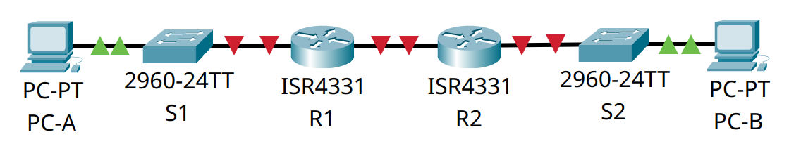

# Домашнее задание №8.2 «Настройка DHCPv6»

## Топология


## Таблица адресации

| Устройство | Интерфейс | IPv6-адрес            |
| ---------- | --------- | --------------------- |
| R1         | G0/0/0    | 2001:db8:acad:2::1/64 |
|            |           | fe80::1               |
|            | G0/0/1    | 2001:db8:acad:1::1/64 |
|            |           | fe80::1               |
| R2         | G0/0/0    | 2001:db8:acad:2::2/64 |
|            |           | fe80::2               |
|            | G0/0/1    | 2001:db8:acad:3::1/64 |
|            |           | fe80::1               |
| PC-A       | NIC       | DHCP                  |
| PC-A       | NIC       | DHCP                  |

## Задачи

* [Часть 1. Создание сети и настройка основных параметров устройства.](#часть-1-создание-сети-инастройка-основных-параметров-устройства)
* [Часть 2. Проверка назначения адреса SLAAC от R1.](#часть-2-проверка-назначения-адреса-slaac-от-r1)
* [Часть 3. Настройка и проверка сервера DHCPv6 на R1.](#часть-3-настройка-и-проверка-сервера-dhcpv6-на-r1)
* [Часть 4. Настройка сервера DHCPv6 с сохранением состояния на R1.](#часть-4-настройка-сервера-dhcpv6-с-сохранением-состояния-на-r1)
* [Часть 5. Настройка и проверка ретрансляции DHCPv6 на R2.](#часть-5-настройка-и-проверка-ретрансляции-dhcpv6-на-r2)

## Общие сведения/сценарий

Динамическое назначение глобальных индивидуальных IPv6-адресов можно настроить
тремя способами:

* автоматическая конфигурация адреса без сохранения состояния (Stateless Address
  Autoconfiguration, SLAAC);
* DHCPv6 без отслеживания состояния;
* адресация DHCPv6 с учетом состояний.

При использовании SLAAC для назначения адресов IPv6 хостам сервер DHCPv6 не
используется. Поскольку DHCPv6 сервер не используется при реализации SLAAC, хосты
не могут получать дополнительную важную сетевую информацию, включая адрес сервера
доменных имен (DNS), а также имя домена.

При использовании Stateless DHCPv6 для назначения адресов IPv6 хосту сервер DHCPv6
используется для назначения дополнительной важной информации о сети, однако адрес
IPv6 назначается с помощью SLAAC.

При использовании DHCPv6 с отслеживанием состояния, сервер DHCP назначает всю
информацию, включая IPv6-адрес узла.

Определение способа получения динамической IPv6-адресации зависит от установленных
значений флагов, содержащихся в объявлениях маршрутизатора (сообщениях RA).

В предложенном сценарии размеры компании увеличились, и сетевые администраторы
больше не имеют возможности назначать IP-адреса для устройств вручную. Ваша
задача - настроить маршрутизатор **R2** для назначения адресов IPv6 в двух разных
подсетях, подключенных к маршрутизатору **R1**.

**Примечание:** маршрутизаторы, используемые в практических лабораторных работах
CCNA, - это Cisco 4221 с Cisco IOS XE Release 16.9.3 (образ universalk9). В
лабораторных работах используются коммутаторы Cisco Catalyst 2960 с Cisco IOS
версии 15.0(2) (образ lanbasek9). Можно использовать другие маршрутизаторы,
коммутаторы и версии Cisco IOS. В зависимости от модели устройства и версии Cisco
IOS доступные команды и результаты их выполнения могут отличаться от тех, которые
показаны в лабораторных работах. Правильные идентификаторы интерфейса см. в
сводной таблице по интерфейсам маршрутизаторов в конце лабораторной работы.


**Примечание:** убедитесь, что все настройки коммутаторов удалены и загрузочная
конфигурация отсутствует. Если вы не уверены, обратитесь к инструктору.

## Часть 1. Создание сети и настройка основных параметров устройства

Для моделирования сети будем использовать ПО Cisco Packet Tracer 8.1.1. Создадим
новую конфигурацию, используя следующие ресурсы:

* 2 маршрутизатора (Cisco 4221 с универсальным образом Cisco IOS XE версии
  16.9.3 или аналогичным);
* 2 коммутатора (Cisco 2960 с операционной системой Cisco IOS 15.0(2) (образ
  lanbasek9) или аналогичная модель);
* 2 ПК (ОС Windows с программой эмуляции терминалов, например Tera Term);
* консольные кабели для настройки устройств Cisco IOS через консольные порты;
* кабели Ethernet, расположенные в соответствии с топологией.

В первой части лабораторной работы создадим топологию сети и настроим базовые
параметры для узлов ПК и коммутаторов.

### Шаг 1. Создание сети

Подключим устройства, как показано в топологии, и подсоединим необходимые кабели.



### Шаг 2. Настройка базовых параметров коммутаторов

Настроим базовые параметры каждого коммутатора.

#### a. Установка имени устройства

Подключимся к коммутатору с помощью консольного подключения, активируем
привилегированный режим и сменим имя:

```text
Switch>en
Switch#conf t
Enter configuration commands, one per line.  End with CNTL/Z.
Switch(config)#host S1
S1(config)#
```

#### b. Отключение поиска DNS

Чтобы предотвратить попытки коммутатора неверно преобразовывать введённые
команды таким образом, как будто они являются именами узлов, отключим поиск DNS:

```text
S1(config)#no ip domain-lookup
S1(config)#
```

#### c. Установка пароля привилегированного режима

Назначим **class** в качестве зашифрованного пароля привилегированного режима EXEC:

```text
S1(config)#enable secret class
S1(config)#
```

#### d. Установка пароля консоли

Назначим **cisco** в качестве пароля консоли и включим вход в систему
по паролю:

```text
S1(config)#line con 0
S1(config-line)#password cisco
S1(config-line)#login
S1(config-line)#exit
S1(config)#
```

#### e. Установка пароля VTY

Назначим **cisco** в качестве пароля VTY каналов и включим вход в систему
по паролю:

```text
S1(config)#line vty 0 15
S1(config-line)#password cisco
S1(config-line)#login
S1(config-line)#exit
S1(config)#
```

#### f. Включение шифрования паролей

Зашифруем открытые пароли в файле конфигурации:

```text
S1(config)#service password-encryption
S1(config)#
```

#### g. Создание баннера

Для предупреждения пользователей о запрете несанкционированного доступа, настроим
баннерное сообщение дня (MOTD):

```text
S1(config)#banner motd # ATTENTION! Unauthorized access is strictly prohibited. #
S1(config)#
```

#### h. Выключение неиспользуемых портов

Отключим все неиспользуемые порты.

<details>
<summary>Коммутатор <strong>S1</strong></summary>

```text
S1(config)#int range f0/1-4
S1(config-if-range)#shut

%LINK-5-CHANGED: Interface FastEthernet0/1, changed state to administratively down

%LINK-5-CHANGED: Interface FastEthernet0/2, changed state to administratively down

%LINK-5-CHANGED: Interface FastEthernet0/3, changed state to administratively down

%LINK-5-CHANGED: Interface FastEthernet0/4, changed state to administratively down
S1(config-if-range)#exit
S1(config)#int range f0/7-24
S1(config-if-range)#shut

%LINK-5-CHANGED: Interface FastEthernet0/7, changed state to administratively down

%LINK-5-CHANGED: Interface FastEthernet0/8, changed state to administratively down

%LINK-5-CHANGED: Interface FastEthernet0/9, changed state to administratively down

%LINK-5-CHANGED: Interface FastEthernet0/10, changed state to administratively down

%LINK-5-CHANGED: Interface FastEthernet0/11, changed state to administratively down

%LINK-5-CHANGED: Interface FastEthernet0/12, changed state to administratively down

%LINK-5-CHANGED: Interface FastEthernet0/13, changed state to administratively down

%LINK-5-CHANGED: Interface FastEthernet0/14, changed state to administratively down

%LINK-5-CHANGED: Interface FastEthernet0/15, changed state to administratively down

%LINK-5-CHANGED: Interface FastEthernet0/16, changed state to administratively down

%LINK-5-CHANGED: Interface FastEthernet0/17, changed state to administratively down

%LINK-5-CHANGED: Interface FastEthernet0/18, changed state to administratively down

%LINK-5-CHANGED: Interface FastEthernet0/19, changed state to administratively down

%LINK-5-CHANGED: Interface FastEthernet0/20, changed state to administratively down

%LINK-5-CHANGED: Interface FastEthernet0/21, changed state to administratively down

%LINK-5-CHANGED: Interface FastEthernet0/22, changed state to administratively down

%LINK-5-CHANGED: Interface FastEthernet0/23, changed state to administratively down

%LINK-5-CHANGED: Interface FastEthernet0/24, changed state to administratively down
S1(config-if-range)#exit
S1(config)#int range g0/1-2
S1(config-if-range)#shut

%LINK-5-CHANGED: Interface GigabitEthernet0/1, changed state to administratively down

%LINK-5-CHANGED: Interface GigabitEthernet0/2, changed state to administratively down
S1(config-if-range)#exit
S1(config)#
```

</details>

<details>
<summary>Коммутатор <strong>S2</strong></summary>

```text
S2(config)#int range f0/1-4
S2(config-if-range)#shut

%LINK-5-CHANGED: Interface FastEthernet0/1, changed state to administratively down

%LINK-5-CHANGED: Interface FastEthernet0/2, changed state to administratively down

%LINK-5-CHANGED: Interface FastEthernet0/3, changed state to administratively down

%LINK-5-CHANGED: Interface FastEthernet0/4, changed state to administratively down
S2(config-if-range)#exit
S2(config)#int range f0/6-17
S2(config-if-range)#shut

%LINK-5-CHANGED: Interface FastEthernet0/6, changed state to administratively down

%LINK-5-CHANGED: Interface FastEthernet0/7, changed state to administratively down

%LINK-5-CHANGED: Interface FastEthernet0/8, changed state to administratively down

%LINK-5-CHANGED: Interface FastEthernet0/9, changed state to administratively down

%LINK-5-CHANGED: Interface FastEthernet0/10, changed state to administratively down

%LINK-5-CHANGED: Interface FastEthernet0/11, changed state to administratively down

%LINK-5-CHANGED: Interface FastEthernet0/12, changed state to administratively down

%LINK-5-CHANGED: Interface FastEthernet0/13, changed state to administratively down

%LINK-5-CHANGED: Interface FastEthernet0/14, changed state to administratively down

%LINK-5-CHANGED: Interface FastEthernet0/15, changed state to administratively down

%LINK-5-CHANGED: Interface FastEthernet0/16, changed state to administratively down

%LINK-5-CHANGED: Interface FastEthernet0/17, changed state to administratively down
S2(config-if-range)#exit
S2(config)#int range f0/19-24
S2(config-if-range)#shut

%LINK-5-CHANGED: Interface FastEthernet0/19, changed state to administratively down

%LINK-5-CHANGED: Interface FastEthernet0/20, changed state to administratively down

%LINK-5-CHANGED: Interface FastEthernet0/21, changed state to administratively down

%LINK-5-CHANGED: Interface FastEthernet0/22, changed state to administratively down

%LINK-5-CHANGED: Interface FastEthernet0/23, changed state to administratively down

%LINK-5-CHANGED: Interface FastEthernet0/24, changed state to administratively down
S2(config-if-range)#exit
S2(config)#int range g0/1-2
S2(config-if-range)#shut

%LINK-5-CHANGED: Interface GigabitEthernet0/1, changed state to administratively down

%LINK-5-CHANGED: Interface GigabitEthernet0/2, changed state to administratively down
S2(config-if-range)#exit
S2(config)#
```

</details>


#### i. Сохранение конфигурации

Скопируем текущую конфигурацию в файл загрузочной конфигурации.

```text
S1(config)#exit
S1#copy run start
Destination filename [startup-config]? 
Building configuration...
[OK]
S1#
```

<details>
<summary>S1# show run</summary>

```text
S1#show run
Building configuration...

Current configuration : 1535 bytes
!
version 15.0
no service timestamps log datetime msec
no service timestamps debug datetime msec
service password-encryption
!
hostname S1
!
enable secret 5 $1$mERr$9cTjUIEqNGurQiFU.ZeCi1
!
!
!
no ip domain-lookup
!
!
!
spanning-tree mode pvst
spanning-tree extend system-id
!
interface FastEthernet0/1
 shutdown
!
interface FastEthernet0/2
 shutdown
!
interface FastEthernet0/3
 shutdown
!
interface FastEthernet0/4
 shutdown
!
interface FastEthernet0/5
!
interface FastEthernet0/6
!
interface FastEthernet0/7
 shutdown
!
interface FastEthernet0/8
 shutdown
!
interface FastEthernet0/9
 shutdown
!
interface FastEthernet0/10
 shutdown
!
interface FastEthernet0/11
 shutdown
!
interface FastEthernet0/12
 shutdown
!
interface FastEthernet0/13
 shutdown
!
interface FastEthernet0/14
 shutdown
!
interface FastEthernet0/15
 shutdown
!
interface FastEthernet0/16
 shutdown
!
interface FastEthernet0/17
 shutdown
!
interface FastEthernet0/18
 shutdown
!
interface FastEthernet0/19
 shutdown
!
interface FastEthernet0/20
 shutdown
!
interface FastEthernet0/21
 shutdown
!
interface FastEthernet0/22
 shutdown
!
interface FastEthernet0/23
 shutdown
!
interface FastEthernet0/24
 shutdown
!
interface GigabitEthernet0/1
 shutdown
!
interface GigabitEthernet0/2
 shutdown
!
interface Vlan1
 no ip address
 shutdown
!
banner motd ^C ATTENTION! Unauthorized access is strictly prohibited. ^C
!
!
!
line con 0
 password 7 0822455D0A16
 login
!
line vty 0 4
 password 7 0822455D0A16
 login
line vty 5 15
 password 7 0822455D0A16
 login
!
!
!
!
end


S1#
```

</details>

<details>
<summary>S2# show run</summary>

```text
S2#show run
Building configuration...

Current configuration : 1535 bytes
!
version 15.0
no service timestamps log datetime msec
no service timestamps debug datetime msec
service password-encryption
!
hostname S2
!
enable secret 5 $1$mERr$9cTjUIEqNGurQiFU.ZeCi1
!
!
!
no ip domain-lookup
!
!
!
spanning-tree mode pvst
spanning-tree extend system-id
!
interface FastEthernet0/1
 shutdown
!
interface FastEthernet0/2
 shutdown
!
interface FastEthernet0/3
 shutdown
!
interface FastEthernet0/4
 shutdown
!
interface FastEthernet0/5
!
interface FastEthernet0/6
 shutdown
!
interface FastEthernet0/7
 shutdown
!
interface FastEthernet0/8
 shutdown
!
interface FastEthernet0/9
 shutdown
!
interface FastEthernet0/10
 shutdown
!
interface FastEthernet0/11
 shutdown
!
interface FastEthernet0/12
 shutdown
!
interface FastEthernet0/13
 shutdown
!
interface FastEthernet0/14
 shutdown
!
interface FastEthernet0/15
 shutdown
!
interface FastEthernet0/16
 shutdown
!
interface FastEthernet0/17
 shutdown
!
interface FastEthernet0/18
!
interface FastEthernet0/19
 shutdown
!
interface FastEthernet0/20
 shutdown
!
interface FastEthernet0/21
 shutdown
!
interface FastEthernet0/22
 shutdown
!
interface FastEthernet0/23
 shutdown
!
interface FastEthernet0/24
 shutdown
!
interface GigabitEthernet0/1
 shutdown
!
interface GigabitEthernet0/2
 shutdown
!
interface Vlan1
 no ip address
 shutdown
!
banner motd ^C ATTENTION! Unauthorized access is strictly prohibited. ^C
!
!
!
line con 0
 password 7 0822455D0A16
 login
!
line vty 0 4
 password 7 0822455D0A16
 login
line vty 5 15
 password 7 0822455D0A16
 login
!
!
!
!
end


S2#
```

</details>

### Шаг 3. Базовая настройка маршрутизаторов

Настроим базовые параметры каждого маршрутизатора.

#### a. Установка имени устройства

Подключимся к маршрутизатору с помощью консольного подключения, активируем
привилегированный режим и сменим имя:

```text
Router>en
Router#conf t
Enter configuration commands, one per line.  End with CNTL/Z.
Router(config)#host R1
R1(config)#
```

#### b. Отключение поиска DNS

Чтобы предотвратить попытки маршрутизатора неверно преобразовывать введённые
команды таким образом, как будто они являются именами узлов, отключим поиск DNS:

```text
R1(config)#no ip domain-lookup
R1(config)#
```

#### c. Установка пароля привилегированного режима

Назначим **class** в качестве зашифрованного пароля привилегированного режима EXEC:

```text
R1(config)#enable secret class
R1(config)#
```

#### d. Установка пароля консоли

Назначим **cisco** в качестве пароля консоли и включим вход в систему
по паролю:

```text
R1(config)#line con 0
R1(config-line)#password cisco
R1(config-line)#login
R1(config-line)#exit
R1(config)#
```

#### e. Установка пароля VTY

Назначим **cisco** в качестве пароля VTY каналов и включим вход в систему
по паролю:

```text
R1(config)#line vty 0 15
R1(config-line)#password cisco
R1(config-line)#login
R1(config-line)#exit
R1(config)#
```

#### f. Включение шифрования паролей

Зашифруем открытые пароли в файле конфигурации:

```text
R1(config)#service password-encryption
R1(config)#
```

#### g. Создание баннера

Для предупреждения пользователей о запрете несанкционированного доступа, настроим
баннерное сообщение дня (MOTD):

```text
R1(config)#banner motd # ATTENTION! Unauthorized access is strictly prohibited. #
R1(config)#
```

#### h. Активация IPv6-маршрутизации

Включим IPv6-маршрутизацию.

```text
R1(config)#ipv6 unicast-routing
R1(config)#
```

#### i. Сохранение конфигурации

Скопируем текущую конфигурацию в файл загрузочной конфигурации.

```text
R1(config)#exit
R1#copy run start
Destination filename [startup-config]? 
Building configuration...
[OK]
R1#
```

<details>
<summary>R1# show run</summary>

```text
R1#show run
Building configuration...

Current configuration : 907 bytes
!
version 16.6.4
no service timestamps log datetime msec
no service timestamps debug datetime msec
service password-encryption
!
hostname R1
!
!
!
enable secret 5 $1$mERr$9cTjUIEqNGurQiFU.ZeCi1
!
!
!
!
!
!
ip cef
ipv6 unicast-routing
!
no ipv6 cef
!
!
!
!
!
!
!
!
!
!
no ip domain-lookup
!
!
spanning-tree mode pvst
!
!
!
!
!
!
interface GigabitEthernet0/0/0
 no ip address
 duplex auto
 speed auto
 shutdown
!
interface GigabitEthernet0/0/1
 no ip address
 duplex auto
 speed auto
 shutdown
!
interface GigabitEthernet0/0/2
 no ip address
 duplex auto
 speed auto
 shutdown
!
interface Vlan1
 no ip address
 shutdown
!
ip classless
!
ip flow-export version 9
!
!
!
banner motd ^C ATTENTION! Unauthorized access is strictly prohibited. ^C
!
!
!
!
!
line con 0
 password 7 0822455D0A16
 login
!
line aux 0
!
line vty 0 4
 password 7 0822455D0A16
 login
line vty 5 15
 password 7 0822455D0A16
 login
!
!
!
end


R1#
```

</details>

<details>
<summary>R2# show run</summary>

```text
R2#show run
Building configuration...

Current configuration : 907 bytes
!
version 16.6.4
no service timestamps log datetime msec
no service timestamps debug datetime msec
service password-encryption
!
hostname R2
!
!
!
enable secret 5 $1$mERr$9cTjUIEqNGurQiFU.ZeCi1
!
!
!
!
!
!
ip cef
ipv6 unicast-routing
!
no ipv6 cef
!
!
!
!
!
!
!
!
!
!
no ip domain-lookup
!
!
spanning-tree mode pvst
!
!
!
!
!
!
interface GigabitEthernet0/0/0
 no ip address
 duplex auto
 speed auto
 shutdown
!
interface GigabitEthernet0/0/1
 no ip address
 duplex auto
 speed auto
 shutdown
!
interface GigabitEthernet0/0/2
 no ip address
 duplex auto
 speed auto
 shutdown
!
interface Vlan1
 no ip address
 shutdown
!
ip classless
!
ip flow-export version 9
!
!
!
banner motd ^C ATTENTION! Unauthorized access is strictly prohibited. ^C
!
!
!
!
!
line con 0
 password 7 0822455D0A16
 login
!
line aux 0
!
line vty 0 4
 password 7 0822455D0A16
 login
line vty 5 15
 password 7 0822455D0A16
 login
!
!
!
end


R2#
```

</details>

### Шаг 4. Настройка интерфейсов и маршрутизации

Настроим интерфейсы и маршрутизацию для обоих маршрутизаторов.

#### a. Установка IPv6-адресов на интерфейсах

Настроим интерфейсы G0/0/0 и G0/1 на **R1** и **R2** с адресами IPv6, указанными
в таблице выше.

```text
R1(config)#int g0/0/0
R1(config-if)#ipv6 addr 2001:db8:acad:2::1/64
R1(config-if)#ipv6 addr fe80::1 link-local
R1(config-if)#no shut

R1(config-if)#
%LINK-5-CHANGED: Interface GigabitEthernet0/0/0, changed state to up

R1(config-if)#exit
R1(config)#int g0/0/1
R1(config-if)#ipv6 addr 2001:db8:acad:1::1/64
R1(config-if)#ipv6 addr fe80::1 link-local
R1(config-if)#no shut

R1(config-if)#
%LINK-5-CHANGED: Interface GigabitEthernet0/0/1, changed state to up

%LINEPROTO-5-UPDOWN: Line protocol on Interface GigabitEthernet0/0/1, changed state to up

R1(config-if)#exit
```

```text
R2(config)#int g0/0/0
R2(config-if)#ipv6 addr 2001:db8:acad:2::2/64
R2(config-if)#ipv6 addr fe80::2 link-local
R2(config-if)#no shut

R2(config-if)#
%LINK-5-CHANGED: Interface GigabitEthernet0/0/0, changed state to up

%LINEPROTO-5-UPDOWN: Line protocol on Interface GigabitEthernet0/0/0, changed state to up

R2(config-if)#exit
R2(config)#int g0/0/1
R2(config-if)#ipv6 addr 2001:db8:acad:3::1/64
R2(config-if)#ipv6 addr fe80::1 link-local
R2(config-if)#no shut

R2(config-if)#
%LINK-5-CHANGED: Interface GigabitEthernet0/0/1, changed state to up

%LINEPROTO-5-UPDOWN: Line protocol on Interface GigabitEthernet0/0/1, changed state to up

R2(config-if)#exit
```

#### b. Настройка маршрута по умолчанию

Настроим маршрут по умолчанию на каждом маршрутизаторе, который указывает на
IP-адрес G0/0/0 на другом маршрутизаторе.

```text
R1(config)#ipv6 route ::/0 2001:db8:acad:2::2
R1(config)#
```

```text
R2(config)#ipv6 route ::/0 2001:db8:acad:2::1
R2(config)#
```

#### c. Проверка работы маршрутизации

Убедимся, что маршрутизация работает с помощью пинга адреса G0/0/1 **R2** из **R1**.

```text
R1#ping 2001:db8:acad:3::1

Type escape sequence to abort.
Sending 5, 100-byte ICMP Echos to 2001:db8:acad:3::1, timeout is 2 seconds:
!!!!!
Success rate is 100 percent (5/5), round-trip min/avg/max = 0/0/0 ms

R1#
```

#### d. Сохранение конфигурации

Сохраним текущую конфигурацию в файл загрузочной конфигурации.

```text
R1#copy run start
Destination filename [startup-config]? 
Building configuration...
[OK]
R1#
```

<details>
<summary>R1#show run</summary>

```text
R1#show run
Building configuration...

Current configuration : 1060 bytes
!
version 16.6.4
no service timestamps log datetime msec
no service timestamps debug datetime msec
service password-encryption
!
hostname R1
!
!
!
enable secret 5 $1$mERr$9cTjUIEqNGurQiFU.ZeCi1
!
!
!
!
!
!
ip cef
ipv6 unicast-routing
!
no ipv6 cef
!
!
!
!
!
!
!
!
!
!
no ip domain-lookup
!
!
spanning-tree mode pvst
!
!
!
!
!
!
interface GigabitEthernet0/0/0
 no ip address
 duplex auto
 speed auto
 ipv6 address FE80::1 link-local
 ipv6 address 2001:DB8:ACAD:2::1/64
!
interface GigabitEthernet0/0/1
 no ip address
 duplex auto
 speed auto
 ipv6 address FE80::1 link-local
 ipv6 address 2001:DB8:ACAD:1::1/64
!
interface GigabitEthernet0/0/2
 no ip address
 duplex auto
 speed auto
 shutdown
!
interface Vlan1
 no ip address
 shutdown
!
ip classless
!
ip flow-export version 9
!
ipv6 route ::/0 2001:DB8:ACAD:2::2
!
!
banner motd ^C ATTENTION! Unauthorized access is strictly prohibited. ^C
!
!
!
!
!
line con 0
 password 7 0822455D0A16
 login
!
line aux 0
!
line vty 0 4
 password 7 0822455D0A16
 login
line vty 5 15
 password 7 0822455D0A16
 login
!
!
!
end


R1#
```

</details>

<details>
<summary>R2#show run</summary>

```text
R2#show run
Building configuration...

Current configuration : 1060 bytes
!
version 16.6.4
no service timestamps log datetime msec
no service timestamps debug datetime msec
service password-encryption
!
hostname R2
!
!
!
enable secret 5 $1$mERr$9cTjUIEqNGurQiFU.ZeCi1
!
!
!
!
!
!
ip cef
ipv6 unicast-routing
!
no ipv6 cef
!
!
!
!
!
!
!
!
!
!
no ip domain-lookup
!
!
spanning-tree mode pvst
!
!
!
!
!
!
interface GigabitEthernet0/0/0
 no ip address
 duplex auto
 speed auto
 ipv6 address FE80::2 link-local
 ipv6 address 2001:DB8:ACAD:2::2/64
!
interface GigabitEthernet0/0/1
 no ip address
 duplex auto
 speed auto
 ipv6 address FE80::1 link-local
 ipv6 address 2001:DB8:ACAD:3::1/64
!
interface GigabitEthernet0/0/2
 no ip address
 duplex auto
 speed auto
 shutdown
!
interface Vlan1
 no ip address
 shutdown
!
ip classless
!
ip flow-export version 9
!
ipv6 route ::/0 2001:DB8:ACAD:2::1
!
!
banner motd ^C ATTENTION! Unauthorized access is strictly prohibited. ^C
!
!
!
!
!
line con 0
 password 7 0822455D0A16
 login
!
line aux 0
!
line vty 0 4
 password 7 0822455D0A16
 login
line vty 5 15
 password 7 0822455D0A16
 login
!
!
!
end


R2#
```

</details>

## Часть 2. Проверка назначения адреса SLAAC от R1

В части 2 мы убедимся, что узел **PC-A** получает адрес IPv6 с помощью метода
SLAAC.

Включим **PC-A** и убедимся, что сетевой адаптер настроен для автоматической
настройки IPv6.


Через несколько минут результаты команды **ipconfig** должны показать, что **PC-A**
присвоил себе адрес из сети 2001:db8:1::/64.

```text
C:\>ipconfig

FastEthernet0 Connection:(default port)

   Connection-specific DNS Suffix..: 
   Link-local IPv6 Address.........: FE80::201:42FF:FEA5:4B66
   IPv6 Address....................: 2001:DB8:ACAD:1:201:42FF:FEA5:4B66
   Autoconfiguration IPv4 Address..: 169.254.75.102
   Subnet Mask.....................: 255.255.0.0
   Default Gateway.................: FE80::1
                                     0.0.0.0
```

**Вопрос:** откуда взялась часть адреса с идентификатором хоста?

**Ответ:** была получена от **R1** в рамках SLAAC как ответ на RS запрос.

## Часть 3. Настройка и проверка сервера DHCPv6 на R1

В части 3 выполним настройку и проверку состояния DHCP-сервера на **R1**. Цель
состоит в том, чтобы предоставить **PC-A** информацию о DNS-сервере и домене.

### Шаг 1. Просмотр конфигурации PC-A

Более подробно изучим конфигурацию **PC-A**.

#### a. Просмотр информации о настройках IP

Выполним команду **ipconfig /all** на **PC-A** и посмотрим на результат.

```text
C:\>ipconfig /all

FastEthernet0 Connection:(default port)

   Connection-specific DNS Suffix..: 
   Physical Address................: 0001.42A5.4B66
   Link-local IPv6 Address.........: FE80::201:42FF:FEA5:4B66
   IPv6 Address....................: 2001:DB8:ACAD:1:201:42FF:FEA5:4B66
   Autoconfiguration IP Address....: 169.254.75.102
   Subnet Mask.....................: 255.255.0.0
   Default Gateway.................: FE80::1
                                     0.0.0.0
   DHCP Servers....................: 0.0.0.0
   DHCPv6 IAID.....................: 
   DHCPv6 Client DUID..............: 00-01-00-01-86-C6-A6-7E-00-01-42-A5-4B-66
   DNS Servers.....................: ::
                                     0.0.0.0
```

#### b. Анализ информации об адресах

Обратим внимание, что основной DNS-суффикс отсутствует. Также обратим внимание,
что предоставленные адреса DNS-сервера являются адресами «локального сайта
anycast», а не одноадресными адресами, как ожидалось.

### Шаг 2. Настройка R1 как stateless DHCP

Настроим **R1** для предоставления DHCPv6 без состояния для **PC-A**.

#### a. Настройка пула DHCP на R1

Создадим пул DHCP IPv6 на **R1** с именем R1-STATELESS. В составе этого пула
назначим адрес DNS-сервера как 2001:db8:acad::1, а имя домена — как stateless.com.

```text
R1(config)#ipv6 dhcp pool R1-STATELESS
R1(config-dhcpv6)#dns-server 2001:db8:acad::1
R1(config-dhcpv6)#domain-name STATELESS.com
R1(config-dhcpv6)#exit
R1(config)#
```

#### b. Настройка флагов DHCP на интерфейсе R1 G0/0/1

Настроим интерфейс G0/0/1 на **R1**, чтобы предоставить флаг конфигурации OTHER
для локальной сети **R1** и укажем только что созданный пул DHCP в качестве ресурса
DHCP для этого интерфейса.

```text
R1(config)#int g0/0/1
R1(config-if)#ipv6 nd other-config-flag
R1(config-if)#ipv6 dhcp server R1-STATELESS
R1(config-if)#exit
R1(config)#
```

#### c. Сохранение конфигурации

Сохраним текущую конфигурацию в файл загрузочной конфигурации.

```text
R1#copy run start
Destination filename [startup-config]? 
Building configuration...
[OK]
R1#
```

<details>
<summary>R1#show run</summary>

```text
R1#show run
Building configuration...

Current configuration : 1204 bytes
!
version 16.6.4
no service timestamps log datetime msec
no service timestamps debug datetime msec
service password-encryption
!
hostname R1
!
!
!
enable secret 5 $1$mERr$9cTjUIEqNGurQiFU.ZeCi1
!
!
!
!
!
!
ip cef
ipv6 unicast-routing
!
no ipv6 cef
!
ipv6 dhcp pool R1-STATELESS
 dns-server 2001:DB8:ACAD::1
 domain-name STATELESS.com
!
!
!
!
!
!
!
!
!
!
no ip domain-lookup
!
!
spanning-tree mode pvst
!
!
!
!
!
!
interface GigabitEthernet0/0/0
 no ip address
 duplex auto
 speed auto
 ipv6 address FE80::1 link-local
 ipv6 address 2001:DB8:ACAD:2::1/64
!
interface GigabitEthernet0/0/1
 no ip address
 duplex auto
 speed auto
 ipv6 address FE80::1 link-local
 ipv6 address 2001:DB8:ACAD:1::1/64
 ipv6 nd other-config-flag
 ipv6 dhcp server R1-STATELESS
!
interface GigabitEthernet0/0/2
 no ip address
 duplex auto
 speed auto
 shutdown
!
interface Vlan1
 no ip address
 shutdown
!
ip classless
!
ip flow-export version 9
!
ipv6 route ::/0 2001:DB8:ACAD:2::2
!
!
banner motd ^C ATTENTION! Unauthorized access is strictly prohibited. ^C
!
!
!
!
!
line con 0
 password 7 0822455D0A16
 login
!
line aux 0
!
line vty 0 4
 password 7 0822455D0A16
 login
line vty 5 15
 password 7 0822455D0A16
 login
!
!
!
end


R1#
```

</details>

#### d. Перезапуск PC-A

Перезапустим **PC-A**.

#### e. Просмотр информации об IP-адресе

Проверим вывод **ipconfig /all** и обратим внимание на изменения.

```text
C:\>ipconfig /all

FastEthernet0 Connection:(default port)

   Connection-specific DNS Suffix..: STATELESS.com 
   Physical Address................: 0001.42A5.4B66
   Link-local IPv6 Address.........: FE80::201:42FF:FEA5:4B66
   IPv6 Address....................: 2001:DB8:ACAD:1:201:42FF:FEA5:4B66
   Autoconfiguration IP Address....: 169.254.75.102
   Subnet Mask.....................: 255.255.0.0
   Default Gateway.................: FE80::1
                                     0.0.0.0
   DHCP Servers....................: 0.0.0.0
   DHCPv6 IAID.....................: 1645508924
   DHCPv6 Client DUID..............: 00-01-00-01-86-C6-A6-7E-00-01-42-A5-4B-66
   DNS Servers.....................: 2001:DB8:ACAD::1
                                     0.0.0.0
```

#### f. Проверка подключения к R2

Тестирование подключения с помощью пинга IP-адреса интерфейса G0/0/1 **R2**.

```text
C:\>ping 2001:db8:acad:3::1

Pinging 2001:db8:acad:3::1 with 32 bytes of data:

Reply from 2001:DB8:ACAD:3::1: bytes=32 time<1ms TTL=254
Reply from 2001:DB8:ACAD:3::1: bytes=32 time<1ms TTL=254
Reply from 2001:DB8:ACAD:3::1: bytes=32 time<1ms TTL=254
Reply from 2001:DB8:ACAD:3::1: bytes=32 time<1ms TTL=254

Ping statistics for 2001:DB8:ACAD:3::1:
    Packets: Sent = 4, Received = 4, Lost = 0 (0% loss),
Approximate round trip times in milli-seconds:
    Minimum = 0ms, Maximum = 0ms, Average = 0ms

C:\>
```

## Часть 4. Настройка сервера DHCPv6 с сохранением состояния на R2

В части 4 настроим сервер DHCP для ответа на запросы от локальной сети на **R2**.
Т.к. в Cisco Packet Tracer команда **ipv6 dhcp relay** не поддерживается, то вместо
предлагаемого в методичке **R1** пул поднимем на **R2**.

#### a. Настройка пула DHCP

Создадим пул DHCPv6 на **R2** для сети 2001:db8:acad:3:aaa::/80. Это предоставит
адреса локальной сети, подключенной к интерфейсу G0/0/1 на **R2**. В составе пула
зададим DNS-сервер 2001:db8:acad::254 и доменное имя STATEFUL.com.

```text
R2(config)#ipv6 dhcp pool R2-STATEFUL
R2(config-dhcpv6)#address prefix 2001:db8:acad:3:aaa::/80
R2(config-dhcpv6)#dns-server 2001:db8:acad::254
R2(config-dhcpv6)#domain-name STATEFUL.com
R2(config-dhcpv6)#exit
R2(config)#
```

#### b. Назначение пула интерфейсу

Назначим только что созданный пул DHCPv6 интерфейсу g0/0/1 на **R2**.

```text
R2(config)#int g0/0/1
R2(config-if)#ipv6 dhcp server R2-STATEFUL
R2(config-if)#exit
R2(config)#
```

## Часть 5. Настройка и проверка ретрансляции DHCPv6 на R2

В части 5 настроим и проверим ретрансляцию DHCPv6 на **R2**, позволив **PC-B**
получать адрес IPv6.

### Шаг 1. Проверка получения адреса PC-B

Включим **PC-B** и проверим адрес SLAAC, который он генерирует.

```text
C:\>ipconfig /all

FastEthernet0 Connection:(default port)

   Connection-specific DNS Suffix..: STATEFUL.com 
   Physical Address................: 000A.F308.00C1
   Link-local IPv6 Address.........: FE80::20A:F3FF:FE08:C1
   IPv6 Address....................: 2001:DB8:ACAD:3:AAA:32FB:6620:C84A
   IPv4 Address....................: 0.0.0.0
   Subnet Mask.....................: 0.0.0.0
   Default Gateway.................: FE80::1
                                     0.0.0.0
   DHCP Servers....................: 0.0.0.0
   DHCPv6 IAID.....................: 958506067
   DHCPv6 Client DUID..............: 00-01-00-01-BC-19-B5-38-00-0A-F3-08-00-C1
   DNS Servers.....................: 2001:DB8:ACAD::254
                                     0.0.0.0
C:\>
```

Обратим внимание на вывод, что используется префикс 2001:db8:acad:3::

### Шаг 2. Настройка R2 в качестве агента DHCP-ретрансляции

Далее в методичке предлагается настроить **R2** в качестве агента DHCP-ретрансляции
для локальной сети на G0/0/1. Так как в Cisco Packet Tracer DHCP relay не
поддерживается, то мы будем использовать DHCP пул на **R2**.

#### a. Включение managed флага

Выполним команду **managed-config-flag**.

```text
R2(config)#int g0/0/1
R2(config-if)#ipv6 nd managed-config-flag
R2(config-if)#exit
R2(config)#
```

#### b. Сохранение конфигурации

Сохраним текущую конфигурацию в файл загрузочной конфигурации.

```text
R2#copy run start
Destination filename [startup-config]? 
Building configuration...
[OK]
R2#
```

<details>
<summary>R2#show run</summary>

```text
R2#show run
Building configuration...

Current configuration : 1266 bytes
!
version 15.4
no service timestamps log datetime msec
no service timestamps debug datetime msec
service password-encryption
!
hostname R2
!
!
!
enable secret 5 $1$mERr$9cTjUIEqNGurQiFU.ZeCi1
!
!
!
!
!
!
ip cef
ipv6 unicast-routing
!
no ipv6 cef
!
ipv6 dhcp pool R2-STATEFUL
 address prefix 2001:db8:acad:3:aaa::/80 lifetime 172800 86400
 dns-server 2001:DB8:ACAD::254
 domain-name STATEFUL.com
!
!
!
!
!
!
!
!
!
!
no ip domain-lookup
!
!
spanning-tree mode pvst
!
!
!
!
!
!
interface GigabitEthernet0/0/0
 no ip address
 duplex auto
 speed auto
 ipv6 address FE80::2 link-local
 ipv6 address 2001:DB8:ACAD:2::2/64
!
interface GigabitEthernet0/0/1
 no ip address
 duplex auto
 speed auto
 ipv6 address FE80::1 link-local
 ipv6 address 2001:DB8:ACAD:3::1/64
 ipv6 nd managed-config-flag
 ipv6 dhcp server R2-STATEFUL
!
interface GigabitEthernet0/0/2
 no ip address
 duplex auto
 speed auto
 shutdown
!
interface Vlan1
 no ip address
 shutdown
!
ip classless
!
ip flow-export version 9
!
ipv6 route ::/0 2001:DB8:ACAD:2::1
!
!
banner motd ^C ATTENTION! Unauthorized access is strictly prohibited. ^C
!
!
!
!
!
line con 0
 password 7 0822455D0A16
 login
!
line aux 0
!
line vty 0 4
 password 7 0822455D0A16
 login
line vty 5 15
 password 7 0822455D0A16
 login
!
!
!
end


R2#
```

</details>

### Шаг 3. Проверка получения IPv6-адреса PC-B

Проверим, получает ли **PC-B** адрес IPv6 из DHCPv6.

#### a. Перезапуск PC-B

Перезапустим **PC-B**.

#### b. Просмотр информации об IP-адресах

Откроем командную строку на **PC-B**, выполним команду **ipconfig /all** и
проверим выходные данные, чтобы увидеть результаты операции ретрансляции DHCPv6.

```text
C:\>ipconfig /all

FastEthernet0 Connection:(default port)

   Connection-specific DNS Suffix..: STATEFUL.com 
   Physical Address................: 000A.F308.00C1
   Link-local IPv6 Address.........: FE80::20A:F3FF:FE08:C1
   IPv6 Address....................: 2001:DB8:ACAD:3:AAA:32FB:6620:C84A
   Autoconfiguration IP Address....: 169.254.0.193
   Subnet Mask.....................: 255.255.0.0
   Default Gateway.................: FE80::1
                                     0.0.0.0
   DHCP Servers....................: 0.0.0.0
   DHCPv6 IAID.....................: 958506067
   DHCPv6 Client DUID..............: 00-01-00-01-BC-19-B5-38-00-0A-F3-08-00-C1
   DNS Servers.....................: 2001:DB8:ACAD::254
                                     0.0.0.0
```

Обратим внимание, что **PC-B** получил адрес DNS-сервера по DHCP.

#### c. Проверка подключения

Проверим подключение с помощью пинга IP-адреса интерфейса **R0** G0/0/1.

```text
C:\>ping 2001:DB8:ACAD:3::1

Pinging 2001:DB8:ACAD:3::1 with 32 bytes of data:

Reply from 2001:DB8:ACAD:3::1: bytes=32 time<1ms TTL=255
Reply from 2001:DB8:ACAD:3::1: bytes=32 time<1ms TTL=255
Reply from 2001:DB8:ACAD:3::1: bytes=32 time<1ms TTL=255

C:\>Reply from 2001:DB8:ACAD:3::1: bytes=32 time<1ms TTL=255

Ping statistics for 2001:DB8:ACAD:3::1:
    Packets: Sent = 4, Received = 4, Lost = 0 (0% loss),
Approximate round trip times in milli-seconds:
    Minimum = 0ms, Maximum = 0ms, Average = 0ms

C:\>
```