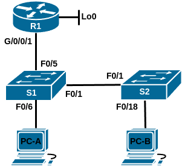
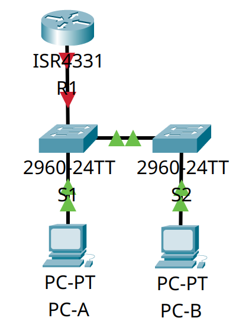

# Домашнее задание №9 «Конфигурация безопасности коммутатора»

## Топология



## Таблица адресации

| Устройство | Интерфейс  | IP-адрес       | Маска подсети |
| ---------- | ---------- | -------------- | ------------- |
| R1         | G0/0/1     | 192.168.10.1   | 255.255.255.0 |
|            | Loopback 0 | 10.10.1.1      | 255.255.255.0 |
| S1         | VLAN 10    | 192.168.10.201 | 255.255.255.0 |
| S2         | VLAN 10    | 192.168.10.202 | 255.255.255.0 |
| PC-A       | NIC        | DHCP           | 255.255.255.0 |
| PC-A       | NIC        | DHCP           | 255.255.255.0 |

## Задачи

* [Часть 1. Настройка основного сетевого устройства.](#часть-1-настройка-основного-сетевого-устройства)
* [Часть 2. Настройка сетей VLAN.](#часть-2-настройка-сетей-vlan)
* [Часть 3. Настройки безопасности коммутатора.](#часть-3-настройки-безопасности-коммутатора)

## Общие сведения/сценарий

Это комплексная лабораторная работа, нацеленная на повторение ранее изученных
функций безопасности уровня 2.

**Примечание:** маршрутизаторы, используемые в практических лабораторных работах
CCNA, - это Cisco 4221 с Cisco IOS XE Release 16.9.3 (образ universalk9). В
лабораторных работах используются коммутаторы Cisco Catalyst 2960 с Cisco IOS
версии 15.0(2) (образ lanbasek9). Можно использовать другие маршрутизаторы,
коммутаторы и версии Cisco IOS. В зависимости от модели устройства и версии Cisco
IOS доступные команды и результаты их выполнения могут отличаться от тех, которые
показаны в лабораторных работах. Правильные идентификаторы интерфейса см. в
сводной таблице по интерфейсам маршрутизаторов в конце лабораторной работы.

**Примечание:** убедитесь, что все настройки коммутаторов удалены и загрузочная
конфигурация отсутствует. Если вы не уверены, обратитесь к инструктору.

## Часть 1. Настройка основного сетевого устройства

Для моделирования сети будем использовать ПО Cisco Packet Tracer 8.1.1. Создадим
новую конфигурацию, используя следующие ресурсы:

* 1 маршрутизатор (Cisco 4221 с универсальным образом Cisco IOS XE версии
  16.9.3 или аналогичным);
* 2 коммутатора (Cisco 2960 с операционной системой Cisco IOS 15.2(2) (образ
  lanbasek9) или аналогичная модель);
* 2 ПК (ОС Windows с программой эмуляции терминалов, например Tera Term);
* консольные кабели для настройки устройств Cisco IOS через консольные порты;
* кабели Ethernet, расположенные в соответствии с топологией.

В первой части лабораторной работы создадим топологию сети и настроим базовые
параметры для узлов ПК и коммутаторов.

### Шаг 1. Создание сети

Подключим устройства, как показано в топологии, и подсоединим необходимые кабели.



### Шаг 2. Настройка маршрутизатора

Настроим базовые параметры маршрутизатора **R1**.

#### a. Загрузка конфигурационного скрипта

Загрузим следующий конфигурационный скрипт на R1.:

```text
enable
configure terminal
hostname R1
no ip domain lookup
ip dhcp excluded-address 192.168.10.1 192.168.10.9
ip dhcp excluded-address 192.168.10.201 192.168.10.202
!
ip dhcp pool Students
 network 192.168.10.0 255.255.255.0
 default-router 192.168.10.1
 domain-name CCNA2.Lab-11.6.1
!
interface Loopback0
 ip address 10.10.1.1 255.255.255.0
!
interface GigabitEthernet0/0/1
 description Link to S1
 ip dhcp relay information trusted
 ip address 192.168.10.1 255.255.255.0
 no shutdown
!
line con 0
 logging synchronous
 exec-timeout 0 0
```

<details>
<summary>Вывод команд на <strong>R1</strong></summary>

```text
Router>
Router>enable
Router#configure terminal
Enter configuration commands, one per line.  End with CNTL/Z.
Router(config)#hostname R1
R1(config)#no ip domain lookup
R1(config)#ip dhcp excluded-address 192.168.10.1 192.168.10.9
R1(config)#ip dhcp excluded-address 192.168.10.201 192.168.10.202
R1(config)#!
R1(config)#ip dhcp pool Students
R1(dhcp-config)# network 192.168.10.0 255.255.255.0
R1(dhcp-config)# default-router 192.168.10.1
R1(dhcp-config)# domain-name CCNA2.Lab-11.6.1
R1(dhcp-config)#!
R1(dhcp-config)#interface Loopback0

R1(config-if)# ip address 10.10.1.1 255.255.255.0
R1(config-if)#!
R1(config-if)#interface GigabitEthernet0/0/1
R1(config-if)# description Link to S1
R1(config-if)# ip dhcp relay information trusted
                  ^
% Invalid input detected at '^' marker.
	
R1(config-if)# ip address 192.168.10.1 255.255.255.0
R1(config-if)# no shutdown

R1(config-if)#!
R1(config-if)#line con 0
R1(config-line)# logging synchronous
R1(config-line)# exec-timeout 0 0
%LINK-5-CHANGED: Interface Loopback0, changed state to up

%LINEPROTO-5-UPDOWN: Line protocol on Interface Loopback0, changed state to up

%LINK-5-CHANGED: Interface GigabitEthernet0/0/1, changed state to up

%LINEPROTO-5-UPDOWN: Line protocol on Interface GigabitEthernet0/0/1, changed state to up

R1(config-line)# exec-timeout 0 0
R1(config-line)#end
R1#
%SYS-5-CONFIG_I: Configured from console by console

R1#
```

</details>

#### b. Проверка конфигурации

Проверим текущую конфигурацию на **R1**, используя команду **show ip interface brief**.

```text
R1#show ip interface brief
Interface              IP-Address      OK? Method Status                Protocol 
GigabitEthernet0/0/0   unassigned      YES NVRAM  administratively down down 
GigabitEthernet0/0/1   192.168.10.1    YES manual up                    up 
GigabitEthernet0/0/2   unassigned      YES NVRAM  administratively down down 
Loopback0              10.10.1.1       YES manual up                    up 
Vlan1                  unassigned      YES NVRAM  administratively down down
R1#
```

#### c. Проверка настроек интерфейсов

Убедимся, что IP-адресация и интерфейсы находятся в состоянии up/up (при
необходимости устраним неполадки).

В принципе это видно и по выводу **show ip interface brief** но, на всякий случай,
продублируем командой **show interfaces**.

<details>
<summary>R1#show interfaces</summary>

```text
R1#show interfaces 
GigabitEthernet0/0/0 is administratively down, line protocol is down (disabled)
  Hardware is ISR4331-3x1GE, address is 00e0.f9a8.dc01 (bia 00e0.f9a8.dc01)
  MTU 1500 bytes, BW 1000000 Kbit, DLY 10 usec,
     reliability 255/255, txload 1/255, rxload 1/255
  Encapsulation ARPA, loopback not set
  Keepalive not supported
  Half Duplex, 1000Mbps, link type is auto,  media type is Auto Select
  output flow-control is on, input flow-control is on
  ARP type: ARPA, ARP Timeout 04:00:00, 
  Last input 00:00:08, output 00:00:05, output hang never
  Last clearing of "show interface" counters never
  Input queue: 0/375/0 (size/max/drops); Total output drops: 0
  Queueing strategy: fifo
  Output queue :0/40 (size/max)
  5 minute input rate 0 bits/sec, 0 packets/sec
  5 minute output rate 0 bits/sec, 0 packets/sec
     0 packets input, 0 bytes, 0 no buffer
     Received 0 broadcasts (0 IP multicasts)
     0 runts, 0 giants, 0 throttles
     0 input errors, 0 CRC, 0 frame, 0 overrun, 0 ignored
     0 watchdog, 1017 multicast, 0 pause input
     0 input packets with dribble condition detected
     0 packets output, 0 bytes, 0 underruns
     0 output errors, 0 collisions, 1 interface resets
     0 unknown protocol drops
     0 babbles, 0 late collision, 0 deferred
     0 lost carrier, 0 no carrier
     0 output buffer failures, 0 output buffers swapped out
GigabitEthernet0/0/1 is up, line protocol is up (connected)
  Hardware is ISR4331-3x1GE, address is 00e0.f9a8.dc02 (bia 00e0.f9a8.dc02)
  Description: Link to S1
  Internet address is 192.168.10.1/24
  MTU 1500 bytes, BW 1000000 Kbit, DLY 100 usec,
     reliability 255/255, txload 1/255, rxload 1/255
  Encapsulation ARPA, loopback not set
  Keepalive not supported
  output flow-control is on, input flow-control is on
  ARP type: ARPA, ARP Timeout 04:00:00, 
  Last input 00:00:08, output 00:00:05, output hang never
  Last clearing of "show interface" counters never
  Input queue: 0/375/0 (size/max/drops); Total output drops: 0
  Queueing strategy: fifo
  Output queue :0/40 (size/max)
  5 minute input rate 0 bits/sec, 0 packets/sec
  5 minute output rate 0 bits/sec, 0 packets/sec
     0 packets input, 0 bytes, 0 no buffer
     Received 0 broadcasts (0 IP multicasts)
     0 runts, 0 giants, 0 throttles
     0 input errors, 0 CRC, 0 frame, 0 overrun, 0 ignored
     0 watchdog, 1017 multicast, 0 pause input
     0 input packets with dribble condition detected
     0 packets output, 0 bytes, 0 underruns
     0 output errors, 0 collisions, 1 interface resets
     0 unknown protocol drops
     0 babbles, 0 late collision, 0 deferred
     0 lost carrier, 0 no carrier
     0 output buffer failures, 0 output buffers swapped out
GigabitEthernet0/0/2 is administratively down, line protocol is down (disabled)
  Hardware is ISR4331-3x1GE, address is 00e0.f9a8.dc03 (bia 00e0.f9a8.dc03)
  MTU 1500 bytes, BW 1000000 Kbit, DLY 10 usec,
     reliability 255/255, txload 1/255, rxload 1/255
  Encapsulation ARPA, loopback not set
  Keepalive not supported
  Half Duplex, 1000Mbps, link type is auto,  media type is unknown media type
  output flow-control is on, input flow-control is on
  ARP type: ARPA, ARP Timeout 04:00:00, 
  Last input 00:00:08, output 00:00:05, output hang never
  Last clearing of "show interface" counters never
  Input queue: 0/375/0 (size/max/drops); Total output drops: 0
  Queueing strategy: fifo
  Output queue :0/40 (size/max)
  5 minute input rate 0 bits/sec, 0 packets/sec
  5 minute output rate 0 bits/sec, 0 packets/sec
     0 packets input, 0 bytes, 0 no buffer
     Received 0 broadcasts (0 IP multicasts)
     0 runts, 0 giants, 0 throttles
     0 input errors, 0 CRC, 0 frame, 0 overrun, 0 ignored
     0 watchdog, 1017 multicast, 0 pause input
     0 input packets with dribble condition detected
     0 packets output, 0 bytes, 0 underruns
     0 output errors, 0 collisions, 1 interface resets
     0 unknown protocol drops
     0 babbles, 0 late collision, 0 deferred
     0 lost carrier, 0 no carrier
     0 output buffer failures, 0 output buffers swapped out
Loopback0 is up, line protocol is up (connected)
  Hardware is Loopback
  Internet address is 10.10.1.1/24
  MTU 1514 bytes, BW 8000000 Kbit, DLY 5000 usec,
     reliability 255/255, txload 1/255, rxload 1/255
  Encapsulation LOOPBACK, loopback not set
  Last input never, output never, output hang never
  Last clearing of "show interface" counters never
  Queueing strategy: fifo
  Output queue 0/0, 0 drops; input queue 0/75, 0 drops
  5 minute input rate 0 bits/sec, 0 packets/sec
  5 minute output rate 0 bits/sec, 0 packets/sec
     0 packets input, 0 bytes, 0 no buffer
     Received 0 broadcasts, 0 runts, 0 giants, 0 throttles
     0 input errors, 0 CRC, 0 frame, 0 overrun, 0 ignored, 0 abort
     0 input packets with dribble condition detected
     0 packets output, 0 bytes, 0 underruns
     0 output errors, 0 collisions, 0 interface resets
     0 babbles, 0 late collision, 0 deferred
     0 lost carrier, 0 no carrier
     0 output buffer failures, 0 output buffers swapped out
Vlan1 is administratively down, line protocol is down
  Hardware is CPU Interface, address is 000c.cf2d.1676 (bia 000c.cf2d.1676)
  MTU 1500 bytes, BW 100000 Kbit, DLY 1000000 usec,
     reliability 255/255, txload 1/255, rxload 1/255
  Encapsulation ARPA, loopback not set
  ARP type: ARPA, ARP Timeout 04:00:00
  Last input 21:40:21, output never, output hang never
  Last clearing of "show interface" counters never
  Input queue: 0/75/0/0 (size/max/drops/flushes); Total output drops: 0
  Queueing strategy: fifo
  Output queue: 0/40 (size/max)
  5 minute input rate 0 bits/sec, 0 packets/sec
  5 minute output rate 0 bits/sec, 0 packets/sec
     1682 packets input, 530955 bytes, 0 no buffer
     Received 0 broadcasts (0 IP multicast)
     0 runts, 0 giants, 0 throttles
     0 input errors, 0 CRC, 0 frame, 0 overrun, 0 ignored
     563859 packets output, 0 bytes, 0 underruns
     0 output errors, 23 interface resets
     0 output buffer failures, 0 output buffers swapped out

R1#
```

</details>

### Шаг 3. Настройка коммутаторов

Настроим и проверим основные параметры коммутаторов.

#### a. Установка имени хоста

Настроим имя хоста для коммутаторов **S1** и **S2**.

```text
Switch>en
Switch#conf t
Enter configuration commands, one per line.  End with CNTL/Z.
Switch(config)#hostname S1
S1(config)#
```

#### b. Запрет нежелательного поиска в DNS

Чтобы предотвратить попытки коммутатора неверно преобразовывать введённые
команды таким образом, как будто они являются именами узлов, отключим поиск DNS:

```text
S1(config)#no ip domain-lookup
S1(config)#
```

#### c. Настройка описания интерфейсов

Настроим описания интерфейсов для портов, которые используются в **S1** и **S2**.

```text
S1(config)#int f0/1
S1(config-if)#desc Link to S2
S1(config-if)#exit
S1(config)#int f0/5
S1(config-if)#desc Link to R1
S1(config-if)#exit
S1(config)#int f0/6
S1(config-if)#desc Link to PC-A
S1(config-if)#exit
S1(config)#
```

```text
S2(config)#int f0/1
S2(config-if)#desc Link to S1
S2(config-if)#exit
S2(config)#int f0/18
S2(config-if)#desc Link to PC-B
S2(config-if)#exit
S2(config)#
```

#### d. Установка шлюза по умолчанию

Установим для шлюза по умолчанию для VLAN управления значение 192.168.10.1 на
обоих коммутаторах.

```text
S1(config)#ip default-gateway 192.168.10.1
S1(config)#
```

## Часть 2. Настройка сетей VLAN

В части 2 создадим и настроим сети VLAN на коммутаторах **S1** и **S2**.

### Шаг 1. Конфигурация VLAN 10

Добавим VLAN 10 на **S1** и **S2** и назовём VLAN - **Management**.

```text
S1(config)#vlan 10
S1(config-vlan)#name Management
S1(config-vlan)#exit
S1(config)#
```

### Шаг 2. Настройка SVI для VLAN 10

Настроим IP-адрес в соответствии с таблицей адресации для SVI для VLAN 10 на **S1**
и **S2**. Включим интерфейсы SVI и предоставим описание для интерфейса.

```text
S1(config)#int vlan 10
S1(config-if)#
%LINK-5-CHANGED: Interface Vlan10, changed state to up

S1(config-if)#ip addr 192.168.10.201 255.255.255.0
S1(config-if)#desc Management
S1(config-if)#no shut
S1(config-if)#exit
S1(config)#
```

```text
S2(config)#int vlan 10
S2(config-if)#
%LINK-5-CHANGED: Interface Vlan10, changed state to up

S2(config-if)#ip addr 192.168.10.202 255.255.255.0
S2(config-if)#desc Management
S2(config-if)#no shut
S2(config-if)#exit
S2(config)#
```

### Шаг 3. Настройка Native VLAN

Создадим VLAN 333 с именем Native на **S1** и **S2**.

```text
S1(config)#vlan 333
S1(config-vlan)#name Native
S1(config-vlan)#exit
S1(config)#
```

### Шаг 4. Настройка VLAN Parking_Lot

Создадим VLAN 999 с именем Parking_Lot на **S1** и **S2**.

```text
S1(config)#vlan 999
S1(config-vlan)#name Parking_Lot
S1(config-vlan)#exit
S1(config)#
```

## Часть 3. Настройки безопасности коммутатора

В части 3 создадим магистральный канал между коммутаторами и настроим основные
параметры безопасности для портов.

### Шаг 1. Реализация магистральных соединений 802.1Q

Создадим магистральный канал между коммутаторами **S1** и **S2**.

#### a. Настройка магистральных портов

Настроим все магистральные порты Fa0/1 на обоих коммутаторах для использования
VLAN 333 в качестве native VLAN.

```text
S1(config)#int f0/1
S1(config-if)#switchport mode trunk

S1(config-if)#
%LINEPROTO-5-UPDOWN: Line protocol on Interface FastEthernet0/1, changed state to down

%LINEPROTO-5-UPDOWN: Line protocol on Interface FastEthernet0/1, changed state to up

%LINEPROTO-5-UPDOWN: Line protocol on Interface Vlan10, changed state to up

S1(config-if)#switchport trunk native vlan 333
S1(config-if)#exit
S1(config)#
```

#### b. Проверка транкинга

Убедимся, что режим транкинга успешно настроен на всех коммутаторах.

```text
S1#show interface trunk
Port        Mode         Encapsulation  Status        Native vlan
Fa0/1       on           802.1q         trunking      333

Port        Vlans allowed on trunk
Fa0/1       1-1005

Port        Vlans allowed and active in management domain
Fa0/1       1,10,333,999

Port        Vlans in spanning tree forwarding state and not pruned
Fa0/1       1,10,333,999

S1#
```

```text
S2#show interface trunk
Port        Mode         Encapsulation  Status        Native vlan
Fa0/1       on           802.1q         trunking      333

Port        Vlans allowed on trunk
Fa0/1       1-1005

Port        Vlans allowed and active in management domain
Fa0/1       1,10,333,999

Port        Vlans in spanning tree forwarding state and not pruned
Fa0/1       1,10,333,999

S2#
```

#### c. Отключение согласования DTP

Отключим согласование DTP F0/1 на **S1** и **S2**.

```text
S1(config)#int f0/1
S1(config-if)#switchport nonegotiate
S1(config-if)#end
S1#
%SYS-5-CONFIG_I: Configured from console by console

S1#
```

#### d. Проверка настроек согласования

Проверим настройки согласования с помощью команды **show interfaces**.

```text
S1#show interface f0/1 switchport | include negotiation
S1#
```

```text
S2#show interface f0/1 switchport | include negotiation
S2#
```

### Шаг 2. Настройка портов доступа

#### a. Настройка портов доступа на S1

Настроим на **S1** F0/5 и F0/6 в качестве портов доступа и свяжем их с VLAN 10.

```text
S1(config)#int range f0/5-6
S1(config-if-range)#sw mode acc
S1(config-if-range)#sw acc vlan 10
S1(config-if-range)#no shut
S1(config-if-range)#exit
S1(config)#
```

#### b. Настройка портов доступа на S2

Настроим на **S2** порт доступа Fa0/18 и свяжем его с VLAN 10.

```text
S2(config)#int f0/18
S2(config-if)#sw mode acc
S2(config-if)#sw acc vlan 10
S2(config-if)#no shut
S2(config-if)#exit
S2(config)#
```

### Шаг 3. Безопасность неиспользуемых портов коммутатора

#### a. Отключение неиспользуемых портов

На **S1** и **S2** переместим неиспользуемые порты из VLAN 1 в VLAN 999 и
отключим их.

<details>
<summary>Коммутатор <strong>S1</strong></summary>

```text
S1(config)#int range f0/2-4
S1(config-if-range)#sw m ac
S1(config-if-range)#sw ac vlan 999
S1(config-if-range)#shut

%LINK-5-CHANGED: Interface FastEthernet0/2, changed state to administratively down

%LINK-5-CHANGED: Interface FastEthernet0/3, changed state to administratively down

%LINK-5-CHANGED: Interface FastEthernet0/4, changed state to administratively down
S1(config-if-range)#exit
S1(config)#int range f0/7-24
S1(config-if-range)#sw m ac
S1(config-if-range)#sw ac vlan 999
S1(config-if-range)#shut

%LINK-5-CHANGED: Interface FastEthernet0/7, changed state to administratively down

%LINK-5-CHANGED: Interface FastEthernet0/8, changed state to administratively down

%LINK-5-CHANGED: Interface FastEthernet0/9, changed state to administratively down

%LINK-5-CHANGED: Interface FastEthernet0/10, changed state to administratively down

%LINK-5-CHANGED: Interface FastEthernet0/11, changed state to administratively down

%LINK-5-CHANGED: Interface FastEthernet0/12, changed state to administratively down

%LINK-5-CHANGED: Interface FastEthernet0/13, changed state to administratively down

%LINK-5-CHANGED: Interface FastEthernet0/14, changed state to administratively down

%LINK-5-CHANGED: Interface FastEthernet0/15, changed state to administratively down

%LINK-5-CHANGED: Interface FastEthernet0/16, changed state to administratively down

%LINK-5-CHANGED: Interface FastEthernet0/17, changed state to administratively down

%LINK-5-CHANGED: Interface FastEthernet0/18, changed state to administratively down

%LINK-5-CHANGED: Interface FastEthernet0/19, changed state to administratively down

%LINK-5-CHANGED: Interface FastEthernet0/20, changed state to administratively down

%LINK-5-CHANGED: Interface FastEthernet0/21, changed state to administratively down

%LINK-5-CHANGED: Interface FastEthernet0/22, changed state to administratively down

%LINK-5-CHANGED: Interface FastEthernet0/23, changed state to administratively down

%LINK-5-CHANGED: Interface FastEthernet0/24, changed state to administratively down
S1(config-if-range)#exit
S1(config)#int range g0/1-2
S1(config-if-range)#sw m ac
S1(config-if-range)#sw ac vlan 999
S1(config-if-range)#shut

%LINK-5-CHANGED: Interface GigabitEthernet0/1, changed state to administratively down

%LINK-5-CHANGED: Interface GigabitEthernet0/2, changed state to administratively down
S1(config-if-range)#exit
S1(config)#
```

</details>

<details>
<summary>Коммутатор <strong>S2</strong></summary>

```text
S2(config)#int range f0/2-17
S2(config-if-range)#sw m ac
S2(config-if-range)#sw ac vlan 999
S2(config-if-range)#shut

%LINK-5-CHANGED: Interface FastEthernet0/2, changed state to administratively down

%LINK-5-CHANGED: Interface FastEthernet0/3, changed state to administratively down

%LINK-5-CHANGED: Interface FastEthernet0/4, changed state to administratively down

%LINK-5-CHANGED: Interface FastEthernet0/5, changed state to administratively down

%LINK-5-CHANGED: Interface FastEthernet0/6, changed state to administratively down

%LINK-5-CHANGED: Interface FastEthernet0/7, changed state to administratively down

%LINK-5-CHANGED: Interface FastEthernet0/8, changed state to administratively down

%LINK-5-CHANGED: Interface FastEthernet0/9, changed state to administratively down

%LINK-5-CHANGED: Interface FastEthernet0/10, changed state to administratively down

%LINK-5-CHANGED: Interface FastEthernet0/11, changed state to administratively down

%LINK-5-CHANGED: Interface FastEthernet0/12, changed state to administratively down

%LINK-5-CHANGED: Interface FastEthernet0/13, changed state to administratively down

%LINK-5-CHANGED: Interface FastEthernet0/14, changed state to administratively down

%LINK-5-CHANGED: Interface FastEthernet0/15, changed state to administratively down

%LINK-5-CHANGED: Interface FastEthernet0/16, changed state to administratively down

%LINK-5-CHANGED: Interface FastEthernet0/17, changed state to administratively down
S2(config-if-range)#exit
S2(config)#int range f0/19-24
S2(config-if-range)#sw m ac
S2(config-if-range)#sw ac vlan 999
S2(config-if-range)#shut

%LINK-5-CHANGED: Interface FastEthernet0/19, changed state to administratively down

%LINK-5-CHANGED: Interface FastEthernet0/20, changed state to administratively down

%LINK-5-CHANGED: Interface FastEthernet0/21, changed state to administratively down

%LINK-5-CHANGED: Interface FastEthernet0/22, changed state to administratively down

%LINK-5-CHANGED: Interface FastEthernet0/23, changed state to administratively down

%LINK-5-CHANGED: Interface FastEthernet0/24, changed state to administratively down
S2(config-if-range)#exit
S2(config)#int range g0/1-2
S2(config-if-range)#sw m ac
S2(config-if-range)#sw ac vlan 999
S2(config-if-range)#shut

%LINK-5-CHANGED: Interface GigabitEthernet0/1, changed state to administratively down

%LINK-5-CHANGED: Interface GigabitEthernet0/2, changed state to administratively down
S2(config-if-range)#exit
S2(config)#
```

</details>

#### b. Проверка настроек неиспользуемых портов

Убедимся, что неиспользуемые порты отключены и связаны с VLAN 999, введя команду
**show**.

<details>
<summary>Коммутатор <strong>S1</strong></summary>

```text
S1#show interfaces status
Port      Name               Status       Vlan       Duplex  Speed Type
Fa0/1     Link to S2         connected    trunk      auto    auto  10/100BaseTX
Fa0/2                        disabled 999        auto    auto  10/100BaseTX
Fa0/3                        disabled 999        auto    auto  10/100BaseTX
Fa0/4                        disabled 999        auto    auto  10/100BaseTX
Fa0/5     Link to R1         connected    10         auto    auto  10/100BaseTX
Fa0/6     Link to PC-A       connected    10         auto    auto  10/100BaseTX
Fa0/7                        disabled 999        auto    auto  10/100BaseTX
Fa0/8                        disabled 999        auto    auto  10/100BaseTX
Fa0/9                        disabled 999        auto    auto  10/100BaseTX
Fa0/10                       disabled 999        auto    auto  10/100BaseTX
Fa0/11                       disabled 999        auto    auto  10/100BaseTX
Fa0/12                       disabled 999        auto    auto  10/100BaseTX
Fa0/13                       disabled 999        auto    auto  10/100BaseTX
Fa0/14                       disabled 999        auto    auto  10/100BaseTX
Fa0/15                       disabled 999        auto    auto  10/100BaseTX
Fa0/16                       disabled 999        auto    auto  10/100BaseTX
Fa0/17                       disabled 999        auto    auto  10/100BaseTX
Fa0/18                       disabled 999        auto    auto  10/100BaseTX
Fa0/19                       disabled 999        auto    auto  10/100BaseTX
Fa0/20                       disabled 999        auto    auto  10/100BaseTX
Fa0/21                       disabled 999        auto    auto  10/100BaseTX
Fa0/22                       disabled 999        auto    auto  10/100BaseTX
Fa0/23                       disabled 999        auto    auto  10/100BaseTX
Fa0/24                       disabled 999        auto    auto  10/100BaseTX
Gig0/1                       disabled 999        auto    auto  10/100BaseTX
Gig0/2                       disabled 999        auto    auto  10/100BaseTX

S1#
```

</details>

<details>
<summary>Коммутатор <strong>S2</strong></summary>

```text
S2#show interfaces status
Port      Name               Status       Vlan       Duplex  Speed Type
Fa0/1     Link to S1         connected    trunk      auto    auto  10/100BaseTX
Fa0/2                        disabled 999        auto    auto  10/100BaseTX
Fa0/3                        disabled 999        auto    auto  10/100BaseTX
Fa0/4                        disabled 999        auto    auto  10/100BaseTX
Fa0/5                        disabled 999        auto    auto  10/100BaseTX
Fa0/6                        disabled 999        auto    auto  10/100BaseTX
Fa0/7                        disabled 999        auto    auto  10/100BaseTX
Fa0/8                        disabled 999        auto    auto  10/100BaseTX
Fa0/9                        disabled 999        auto    auto  10/100BaseTX
Fa0/10                       disabled 999        auto    auto  10/100BaseTX
Fa0/11                       disabled 999        auto    auto  10/100BaseTX
Fa0/12                       disabled 999        auto    auto  10/100BaseTX
Fa0/13                       disabled 999        auto    auto  10/100BaseTX
Fa0/14                       disabled 999        auto    auto  10/100BaseTX
Fa0/15                       disabled 999        auto    auto  10/100BaseTX
Fa0/16                       disabled 999        auto    auto  10/100BaseTX
Fa0/17                       disabled 999        auto    auto  10/100BaseTX
Fa0/18    Link to PC-B       connected    10         auto    auto  10/100BaseTX
Fa0/19                       disabled 999        auto    auto  10/100BaseTX
Fa0/20                       disabled 999        auto    auto  10/100BaseTX
Fa0/21                       disabled 999        auto    auto  10/100BaseTX
Fa0/22                       disabled 999        auto    auto  10/100BaseTX
Fa0/23                       disabled 999        auto    auto  10/100BaseTX
Fa0/24                       disabled 999        auto    auto  10/100BaseTX
Gig0/1                       disabled 999        auto    auto  10/100BaseTX
Gig0/2                       disabled 999        auto    auto  10/100BaseTX

S2#
```

</details>

### Шаг 4. Документирование и реализация функций безопасности порта

Интерфейсы F0/6 на **S1** и F0/18 на **S2** настроены как порты доступа. На этом
шаге мы настроим безопасность портов на этих двух портах доступа.

#### a. Просмотр настроек порта F0/6

На **S1**, введём команду **show port-security interface f0/6**  для отображения
настроек по умолчанию безопасности порта для интерфейса F0/6. Запишем свои ответы
ниже.

```text
S1#show port-security interface f0/6
Port Security              : Disabled
Port Status                : Secure-down
Violation Mode             : Shutdown
Aging Time                 : 0 mins
Aging Type                 : Absolute
SecureStatic Address Aging : Disabled
Maximum MAC Addresses      : 1
Total MAC Addresses        : 0
Configured MAC Addresses   : 0
Sticky MAC Addresses       : 0
Last Source Address:Vlan   : 0000.0000.0000:0
Security Violation Count   : 0
S1#
```

**Конфигурация безопасности порта по умолчанию.**

| Функция                                     | Настройка по умолчанию |
| ------------------------------------------- | ---------------------- |
| Защита портов                               | Disabled               |
| Максимальное количество записей MAC-адресов | 1                      |
| Режим проверки на нарушение безопасности    | Shutdown               |
| Aging Time                                  | 0 mins                 |
| Aging Type                                  | Absolute               |
| Secure Static Address Aging                 | Disabled               |
| Sticky MAC Address                          | 0                      |

#### b. Защита порта F0/6

На **S1** включим защиту порта на F0/6 со следующими настройками:

* максимальное количество записей MAC-адресов: 3;
* режим безопасности: restrict;
* Aging time: 60 мин;
* Aging type: неактивный.

```text
S1(config)#int f0/6
S1(config-if)#switchport port-security
S1(config-if)#switchport port-security maximum 3
S1(config-if)#switchport port-security violation restrict
S1(config-if)#switchport port-security aging time 60
S1(config-if)#switchport port-security aging type inactivity
                                              ^
% Invalid input detected at '^' marker.

S1(config-if)#exit
S1(config)#
```

**Примечание:** команда **switchport port-security aging type inactivity** не
поддерживается в Cisco Packet Tracer 8.1.1.

#### c. Проверка настроек порта F0/6

Просмотрим настройки безопасности порта F0/6 на **S1**.

```text
S1#show port-security interface f0/6
Port Security              : Enabled
Port Status                : Secure-up
Violation Mode             : Restrict
Aging Time                 : 60 mins
Aging Type                 : Absolute
SecureStatic Address Aging : Disabled
Maximum MAC Addresses      : 3
Total MAC Addresses        : 0
Configured MAC Addresses   : 0
Sticky MAC Addresses       : 0
Last Source Address:Vlan   : 0000.0000.0000:0
Security Violation Count   : 0

S1#
```

#### d. Защита порта F0/18

Включим безопасность порта для F0/18 на **S2**. Настроим каждый активный порт
доступа таким образом, чтобы он автоматически добавлял адреса МАС, изученные на
этом порту, в текущую конфигурацию.

```text
S2(config)#int f0/18
S2(config-if)#switchport port-security
S2(config-if)#switchport port-security mac-address sticky
```

#### e. Настройка порта F0/18

Настроим следующие параметры безопасности порта на **S2** F0/18:

* максимальное количество записей MAC-адресов: 2;
* тип безопасности: Protect;
* Aging time: 60 мин.

```text
S2(config-if)#switchport port-security maximum 2
S2(config-if)#switchport port-security violation protect
S2(config-if)#switchport port-security aging time 60
S2(config-if)#end
S2#
%SYS-5-CONFIG_I: Configured from console by console

S2#
```

#### f. Проверка настроек порта F0/18

Проверим функции безопасности портов на **S2** F0/18.

```text
S2#show port-security interface f0/18
Port Security              : Enabled
Port Status                : Secure-up
Violation Mode             : Shutdown
Aging Time                 : 0 mins
Aging Type                 : Absolute
SecureStatic Address Aging : Disabled
Maximum MAC Addresses      : 1
Total MAC Addresses        : 1
Configured MAC Addresses   : 0
Sticky MAC Addresses       : 1
Last Source Address:Vlan   : 00E0.F961.8413:10
Security Violation Count   : 0

S2#show port-security address
               Secure Mac Address Table
-----------------------------------------------------------------------------
Vlan    Mac Address       Type                          Ports   Remaining Age
                                                                   (mins)
----    -----------       ----                          -----   -------------
  10    00E0.F961.8413    SecureSticky                  Fa0/18       -
-----------------------------------------------------------------------------
Total Addresses in System (excluding one mac per port)     : 0
Max Addresses limit in System (excluding one mac per port) : 1024
S2#
```

### Шаг 5. Реализация безопасности DHCP snooping

#### a. Включение DHCP snooping

На **S2** включим DHCP snooping и настроим DHCP snooping во VLAN 10.

```text
S2(config)#ip dhcp snooping
S2(config)#ip dhcp snooping vlan 10
S2(config)#
```

#### b. Настройка магистральных портов

Настроим магистральные порты на **S2** как доверенные порты.

```text
S2(config)#int f0/1
S2(config-if)#ip dhcp snooping trust
S2(config-if)#exit
S2(config)#
```

#### c. Ограничение ненадёжного порта

Ограничим ненадёжный порт Fa0/18 на **S2** пятью DHCP-пакетами в секунду.

```text
S2(config)#int f0/18
S2(config-if)#ip dhcp snooping limit rate 5
S2(config-if)#exit
S2(config)#
```

#### d. Проверка DHCP snooping

Проверим настройки DHCP Snooping на **S2**.

```text
S2#show ip dhcp snooping
Switch DHCP snooping is enabled
DHCP snooping is configured on following VLANs:
10
Insertion of option 82 is enabled
Option 82 on untrusted port is not allowed
Verification of hwaddr field is enabled
Interface                  Trusted    Rate limit (pps)
-----------------------    -------    ----------------
FastEthernet0/1            yes        unlimited       
FastEthernet0/18           no         5               
S2#
```

#### e. Переполучение IP-адреса на PC-B

В командной строке на **PC-B** освободим, а затем обновим IP-адрес.

```text
C:\>ipconfig

FastEthernet0 Connection:(default port)

   Connection-specific DNS Suffix..: CCNA2.Lab-11.6.1
   Link-local IPv6 Address.........: FE80::2E0:F9FF:FE61:8413
   IPv6 Address....................: ::
   IPv4 Address....................: 192.168.10.11
   Subnet Mask.....................: 255.255.255.0
   Default Gateway.................: ::
                                     192.168.10.1

C:\>ipconfig /renew
DHCP request failed. 

C:\>ipconfig

FastEthernet0 Connection:(default port)

   Connection-specific DNS Suffix..: CCNA2.Lab-11.6.1
   Link-local IPv6 Address.........: FE80::2E0:F9FF:FE61:8413
   IPv6 Address....................: ::
   Autoconfiguration IPv4 Address..: 169.254.132.19
   Subnet Mask.....................: 255.255.0.0
   Default Gateway.................: ::
                                     0.0.0.0
```

После включения DHCP snooping запросы адреса с **PC-B** перестали выполняться.

Для того, чтобы запросы стали проходить отключим вставку опции DHCP 82:

```text
S2(config)#no ip dhcp snooping information option
S2(config)#
```

Теперь **PC-B** успешно получает адрес:

```text
C:\>ipconfig /renew

   IP Address......................: 192.168.10.11
   Subnet Mask.....................: 255.255.255.0
   Default Gateway.................: 192.168.10.1
   DNS Server......................: 0.0.0.0

```

#### f. Проверка привязки DHCP

Проверим привязку отслеживания DHCP с помощью команды **show ip dhcp snooping binding**.

```text
S2#show ip dhcp snooping binding
MacAddress          IpAddress        Lease(sec)  Type           VLAN  Interface
------------------  ---------------  ----------  -------------  ----  -----------------
00:E0:F9:61:84:13   192.168.10.11    0           dhcp-snooping  10    FastEthernet0/18
Total number of bindings: 1
S2#
```

### Шаг 6. Реализация PortFast и BPDU Guard

Для защиты от атак на STP включим PortFast и BPDU Guard.

#### a. Настройка PortFast

Настроим PortFast на всех портах доступа на обоих коммутаторах.

```text
S1(config)#spanning-tree portfast default
S1(config)#
```

#### b. Включение BPDU Guard

Включим защиту BPDU на портах доступа VLAN 10 **S1** и **S2**, подключенных к
**PC-A** и **PC-B**.

```text
S1(config)#int f0/6
S1(config-if)#spanning-tree bpduguard enable
S1(config-if)#exit
```

```text
S2(config)#int f0/18
S2(config-if)#spanning-tree bpduguard enable
S2(config-if)#exit
```

#### c. Проверка настроек PortFast и BPDU Guard

Убедимся, что защита BPDU и PortFast включены на соответствующих портах.

```text
S1#show spanning-tree interface f0/6 detail

Port 6 (FastEthernet0/6) of VLAN0010 is designated forwarding
  Port path cost 19, Port priority 128, Port Identifier 128.6
  Designated root has priority 32778, address 0002.4A8E.C7B0
  Designated bridge has priority 32778, address 0002.4A8E.C7B0
  Designated port id is 128.6, designated path cost 19
  Timers: message age 16, forward delay 0, hold 0
  Number of transitions to forwarding state: 1
  The port is in the portfast mode by default
  Link type is point-to-point by default

S1#
```

```text
S2#show spanning-tree interface f0/18 detail

Port 18 (FastEthernet0/18) of VLAN0010 is designated forwarding
  Port path cost 19, Port priority 128, Port Identifier 128.18
  Designated root has priority 32778, address 0002.4A8E.C7B0
  Designated bridge has priority 32778, address 000C.8572.07E9
  Designated port id is 128.18, designated path cost 19
  Timers: message age 16, forward delay 0, hold 0
  Number of transitions to forwarding state: 1
  The port is in the portfast mode by default
  Link type is point-to-point by default

S2#
```


### Шаг 7. Проверьте наличие сквозного подключения

Проверим PING связь между всеми устройствами в таблице IP-адресации. В случае
сбоя проверки связи может потребоваться отключить брандмауэр на хостах.

<details>
<summary>Пинг с <strong>PC-A</strong></summary>

```text
C:\>ping 192.168.10.1

Pinging 192.168.10.1 with 32 bytes of data:

Reply from 192.168.10.1: bytes=32 time<1ms TTL=255
Reply from 192.168.10.1: bytes=32 time<1ms TTL=255
Reply from 192.168.10.1: bytes=32 time<1ms TTL=255
Reply from 192.168.10.1: bytes=32 time<1ms TTL=255

Ping statistics for 192.168.10.1:
    Packets: Sent = 4, Received = 4, Lost = 0 (0% loss),
Approximate round trip times in milli-seconds:
    Minimum = 0ms, Maximum = 0ms, Average = 0ms

C:\>ping 192.168.10.201

Pinging 192.168.10.201 with 32 bytes of data:

Request timed out.
Reply from 192.168.10.201: bytes=32 time<1ms TTL=255
Reply from 192.168.10.201: bytes=32 time<1ms TTL=255
Reply from 192.168.10.201: bytes=32 time<1ms TTL=255

Ping statistics for 192.168.10.201:
    Packets: Sent = 4, Received = 3, Lost = 1 (25% loss),
Approximate round trip times in milli-seconds:
    Minimum = 0ms, Maximum = 0ms, Average = 0ms

C:\>ping 192.168.10.202

Pinging 192.168.10.202 with 32 bytes of data:

Request timed out.
Reply from 192.168.10.202: bytes=32 time<1ms TTL=255
Reply from 192.168.10.202: bytes=32 time<1ms TTL=255
Reply from 192.168.10.202: bytes=32 time=4ms TTL=255

Ping statistics for 192.168.10.202:
    Packets: Sent = 4, Received = 3, Lost = 1 (25% loss),
Approximate round trip times in milli-seconds:
    Minimum = 0ms, Maximum = 4ms, Average = 1ms

C:\>ping 192.168.10.11

Pinging 192.168.10.11 with 32 bytes of data:

Reply from 192.168.10.11: bytes=32 time<1ms TTL=128
Reply from 192.168.10.11: bytes=32 time<1ms TTL=128
Reply from 192.168.10.11: bytes=32 time<1ms TTL=128
Reply from 192.168.10.11: bytes=32 time<1ms TTL=128

Ping statistics for 192.168.10.11:
    Packets: Sent = 4, Received = 4, Lost = 0 (0% loss),
Approximate round trip times in milli-seconds:
    Minimum = 0ms, Maximum = 0ms, Average = 0ms

C:\>
```

</details>

<details>
<summary>Пинг с <strong>PC-B</strong></summary>

```text
C:\>ping 192.168.10.1

Pinging 192.168.10.1 with 32 bytes of data:

Reply from 192.168.10.1: bytes=32 time<1ms TTL=255
Reply from 192.168.10.1: bytes=32 time<1ms TTL=255
Reply from 192.168.10.1: bytes=32 time<1ms TTL=255
Reply from 192.168.10.1: bytes=32 time<1ms TTL=255

Ping statistics for 192.168.10.1:
    Packets: Sent = 4, Received = 4, Lost = 0 (0% loss),
Approximate round trip times in milli-seconds:
    Minimum = 0ms, Maximum = 0ms, Average = 0ms

C:\>ping 192.168.10.10

Pinging 192.168.10.10 with 32 bytes of data:

Reply from 192.168.10.10: bytes=32 time<1ms TTL=128
Reply from 192.168.10.10: bytes=32 time<1ms TTL=128
Reply from 192.168.10.10: bytes=32 time<1ms TTL=128
Reply from 192.168.10.10: bytes=32 time<1ms TTL=128

Ping statistics for 192.168.10.10:
    Packets: Sent = 4, Received = 4, Lost = 0 (0% loss),
Approximate round trip times in milli-seconds:
    Minimum = 0ms, Maximum = 0ms, Average = 0ms

C:\>ping 192.168.10.201

Pinging 192.168.10.201 with 32 bytes of data:

Request timed out.
Reply from 192.168.10.201: bytes=32 time<1ms TTL=255
Reply from 192.168.10.201: bytes=32 time=2ms TTL=255
Reply from 192.168.10.201: bytes=32 time<1ms TTL=255

Ping statistics for 192.168.10.201:
    Packets: Sent = 4, Received = 3, Lost = 1 (25% loss),
Approximate round trip times in milli-seconds:
    Minimum = 0ms, Maximum = 2ms, Average = 0ms

C:\>ping 192.168.10.202

Pinging 192.168.10.202 with 32 bytes of data:

Request timed out.
Reply from 192.168.10.202: bytes=32 time=4ms TTL=255
Reply from 192.168.10.202: bytes=32 time=4ms TTL=255
Reply from 192.168.10.202: bytes=32 time<1ms TTL=255

Ping statistics for 192.168.10.202:
    Packets: Sent = 4, Received = 3, Lost = 1 (25% loss),
Approximate round trip times in milli-seconds:
    Minimum = 0ms, Maximum = 4ms, Average = 2ms

C:\>
```

</details>


<details>
<summary>Пинг с <strong>R1</strong></summary>

```text
R1>
R1>en
R1#ping 192.168.10.10

Type escape sequence to abort.
Sending 5, 100-byte ICMP Echos to 192.168.10.10, timeout is 2 seconds:
!!!!!
Success rate is 100 percent (5/5), round-trip min/avg/max = 0/0/0 ms

R1#ping 192.168.10.11

Type escape sequence to abort.
Sending 5, 100-byte ICMP Echos to 192.168.10.11, timeout is 2 seconds:
!!!!!
Success rate is 100 percent (5/5), round-trip min/avg/max = 0/1/7 ms

R1#ping 192.168.10.201

Type escape sequence to abort.
Sending 5, 100-byte ICMP Echos to 192.168.10.201, timeout is 2 seconds:
..!!!
Success rate is 60 percent (3/5), round-trip min/avg/max = 0/0/0 ms

R1#ping 192.168.10.202

Type escape sequence to abort.
Sending 5, 100-byte ICMP Echos to 192.168.10.202, timeout is 2 seconds:
..!!!
Success rate is 60 percent (3/5), round-trip min/avg/max = 0/0/0 ms

R1#
```

</details>

Пинговать с коммутаторов нет смысла, т.к. через них и так проходят пинги с
оконечных устройств.

## Вопросы для повторения

1. С точки зрения безопасности порта на **S2**, почему нет значения таймера для
   оставшегося возраста в минутах, когда было сконфигурировано динамическое
   обучение - sticky?

**Ответ:** потому что в режиме sticky MAC-адрес запоминается "навсегда" и
записывается в NVRAM-память (в конфиг).

2. Что касается безопасности порта на **S2**, если вы загружаете скрипт текущей
   конфигурации на **S2**, почему порт 18 на **PC-B** никогда не получит IP-адрес
   через DHCP?

**Ответ:** потому что по умолчанию будет включена опция 82 DHCP.

3. Что касается безопасности порта, в чём разница между типом абсолютного
   устаревания и типом устаревание по неактивности?

**Ответ:** при абсолютном устаревании изученный динамически MAC-адрес удаляется
по истечении фиксированного времени от момента изучения. При втором типе любая
активность на порту сбрасывает заново таймер отсчёта устаревания для этого порта.
