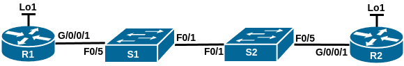
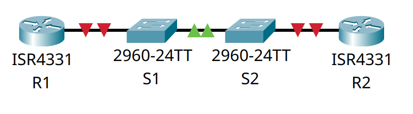

# Домашнее задание №10 «Настройка протокола OSPFv2 для одной области»

## Топология



## Таблица адресации

| Устройство | Интерфейс  | IP-адрес    | Маска подсети |
| ---------- | ---------- | ----------- | ------------- |
| R1         | G0/0/1     | 10.53.0.1   | 255.255.255.0 |
|            | Loopback 1 | 172.16.1.1  | 255.255.255.0 |
| R2         | G0/0/1     | 10.53.0.2   | 255.255.255.0 |
|            | Loopback 1 | 192.168.1.1 | 255.255.255.0 |

## Задачи

* [Часть 1. Создание сети и настройка основных параметров устройства.](#часть-1-создание-сети-и-настройка-основных-параметров-устройства)
* [Часть 2. Настройка и проверка базовой работы протокола  OSPFv2 для одной области.](#часть-2-настройка-и-проверка-базовой-работы-протокола-ospfv2-для-одной-области)
* [Часть 3. Оптимизация и проверка конфигурации OSPFv2 для одной области.](#часть-3-оптимизация-и-проверка-конфигурации-ospfv2-для-одной-области)

## Общие сведения/сценарий

Нам было поручено настроить сеть небольшой компании с помощью OSPFv2. **R1** будет
размещать интернет-соединение (имитируемое интерфейсом Loopback 1) и делиться
информацией о маршруте по умолчанию до **R2**. После первоначальной настройки
организация попросила оптимизировать конфигурацию, чтобы уменьшить трафик
протокола и гарантировать, что **R1** продолжает контролировать маршрутизацию.

**Примечание:** Статическая маршрутизация, используемая в данной лабораторной,
заключается в оценке возможности настройки и настройки OSPFv2 в конфигурации для
одной области. Этот подход, используемый в данной лабораторной, может не отражать
рекомендации по работе с реальными сетями.

**Примечание:** маршрутизаторы, используемые в практических лабораторных работах
CCNA, - это Cisco 4221 с Cisco IOS XE Release 16.9.3 (образ universalk9). В
лабораторных работах используются коммутаторы Cisco Catalyst 2960 с Cisco IOS
версии 15.0(2) (образ lanbasek9). Можно использовать другие маршрутизаторы,
коммутаторы и версии Cisco IOS. В зависимости от модели устройства и версии Cisco
IOS доступные команды и результаты их выполнения могут отличаться от тех, которые
показаны в лабораторных работах. Правильные идентификаторы интерфейса см. в
сводной таблице по интерфейсам маршрутизаторов в конце лабораторной работы.

**Примечание:** убедитесь, что у всех маршрутизаторов и коммутаторов была
удалена начальная конфигурация. Если вы не уверены, обратитесь к инструктору.

## Часть 1. Создание сети и настройка основных параметров устройства

Для моделирования сети будем использовать ПО Cisco Packet Tracer 8.1.1. Создадим
новую конфигурацию, используя следующие ресурсы:

* 2 маршрутизатора (Cisco 4221 с универсальным образом Cisco IOS XE версии
  16.9.3 или аналогичным);
* 2 коммутатора (Cisco 2960 с операционной системой Cisco IOS 15.2(2) (образ
  lanbasek9) или аналогичная модель);
* 1 ПК (ОС Windows с программой эмуляции терминалов, например Tera Term);
* консольные кабели для настройки устройств Cisco IOS через консольные порты;
* кабели Ethernet, расположенные в соответствии с топологией.

В первой части лабораторной работы создадим топологию сети и настроим базовые
параметры для узлов ПК и коммутаторов.

### Шаг 1. Создание сети

Подключим устройства, как показано в топологии, и подсоединим необходимые кабели.



### Шаг 2. Настройка маршрутизаторов

Настроим базовые параметры маршрутизаторов **R1** и **R2**.

#### a. Установка имени устройства

Подключимся к маршрутизатору с помощью консольного подключения, активируем
привилегированный режим и сменим имя:

```text
Router>en
Router#conf t
Enter configuration commands, one per line.  End with CNTL/Z.
Router(config)#host R1
R1(config)#
```

#### b. Отключение поиска DNS

Чтобы предотвратить попытки маршрутизатора неверно преобразовывать введённые
команды таким образом, как будто они являются именами узлов, отключим поиск DNS:

```text
R1(config)#no ip domain-lookup
R1(config)#
```

#### c. Установка пароля привилегированного режима

Назначим **class** в качестве зашифрованного пароля привилегированного режима EXEC:

```text
R1(config)#enable secret class
R1(config)#
```

#### d. Установка пароля консоли

Назначим **cisco** в качестве пароля консоли и включим вход в систему
по паролю:

```text
R1(config)#line con 0
R1(config-line)#password cisco
R1(config-line)#login
R1(config-line)#exit
R1(config)#
```

#### e. Установка пароля VTY

Назначим **cisco** в качестве пароля VTY каналов и включим вход в систему
по паролю:

```text
R1(config)#line vty 0 15
R1(config-line)#password cisco
R1(config-line)#login
R1(config-line)#exit
R1(config)#
```

#### f. Включение шифрования паролей

Зашифруем открытые пароли в файле конфигурации:

```text
R1(config)#service password-encryption
R1(config)#
```

#### g. Создание баннера

Для предупреждения пользователей о запрете несанкционированного доступа, настроим
баннерное сообщение дня (MOTD):

```text
R1(config)#banner motd # ATTENTION! Unauthorized access is strictly prohibited. #
R1(config)#
```

#### h. Сохранение конфигурации

Скопируем текущую конфигурацию в файл загрузочной конфигурации.

```text
R1(config)#exit
R1#copy run start
Destination filename [startup-config]? 
Building configuration...
[OK]
R1#
```

<details>
<summary>R1# show run</summary>

```text
R1#show run
Building configuration...

Current configuration : 884 bytes
!
version 16.6.4
no service timestamps log datetime msec
no service timestamps debug datetime msec
service password-encryption
!
hostname R1
!
!
!
enable secret 5 $1$mERr$9cTjUIEqNGurQiFU.ZeCi1
!
!
!
!
!
!
ip cef
no ipv6 cef
!
!
!
!
!
!
!
!
!
!
no ip domain-lookup
!
!
spanning-tree mode pvst
!
!
!
!
!
!
interface GigabitEthernet0/0/0
 no ip address
 duplex auto
 speed auto
 shutdown
!
interface GigabitEthernet0/0/1
 no ip address
 duplex auto
 speed auto
 shutdown
!
interface GigabitEthernet0/0/2
 no ip address
 duplex auto
 speed auto
 shutdown
!
interface Vlan1
 no ip address
 shutdown
!
ip classless
!
ip flow-export version 9
!
!
!
banner motd ^C ATTENTION! Unauthorized access is strictly prohibited. ^C
!
!
!
!
!
line con 0
 password 7 0822455D0A16
 login
!
line aux 0
!
line vty 0 4
 password 7 0822455D0A16
 login
line vty 5 15
 password 7 0822455D0A16
 login
!
!
!
end


R1#
```

</details>

<details>
<summary>R2# show run</summary>

```text
R2#show run
Building configuration...

Current configuration : 884 bytes
!
version 16.6.4
no service timestamps log datetime msec
no service timestamps debug datetime msec
service password-encryption
!
hostname R2
!
!
!
enable secret 5 $1$mERr$9cTjUIEqNGurQiFU.ZeCi1
!
!
!
!
!
!
ip cef
no ipv6 cef
!
!
!
!
!
!
!
!
!
!
no ip domain-lookup
!
!
spanning-tree mode pvst
!
!
!
!
!
!
interface GigabitEthernet0/0/0
 no ip address
 duplex auto
 speed auto
 shutdown
!
interface GigabitEthernet0/0/1
 no ip address
 duplex auto
 speed auto
 shutdown
!
interface GigabitEthernet0/0/2
 no ip address
 duplex auto
 speed auto
 shutdown
!
interface Vlan1
 no ip address
 shutdown
!
ip classless
!
ip flow-export version 9
!
!
!
banner motd ^C ATTENTION! Unauthorized access is strictly prohibited. ^C
!
!
!
!
!
line con 0
 password 7 0822455D0A16
 login
!
line aux 0
!
line vty 0 4
 password 7 0822455D0A16
 login
line vty 5 15
 password 7 0822455D0A16
 login
!
!
!
end


R2#
```

</details>

### Шаг 3. Настройка коммутаторов

Настроим основные параметры коммутаторов **S1** и **S2**.

#### a. Установка имени устройства

Подключимся к коммутатору с помощью консольного подключения, активируем
привилегированный режим и сменим имя:

```text
Switch>en
Switch#conf t
Enter configuration commands, one per line.  End with CNTL/Z.
Switch(config)#host S1
S1(config)#
```

#### b. Отключение поиска DNS

Чтобы предотвратить попытки коммутатора неверно преобразовывать введённые
команды таким образом, как будто они являются именами узлов, отключим поиск DNS:

```text
S1(config)#no ip domain-lookup
S1(config)#
```

#### c. Установка пароля привилегированного режима

Назначим **class** в качестве зашифрованного пароля привилегированного режима EXEC:

```text
S1(config)#enable secret class
S1(config)#
```

#### d. Установка пароля консоли

Назначим **cisco** в качестве пароля консоли и включим вход в систему
по паролю:

```text
S1(config)#line con 0
S1(config-line)#password cisco
S1(config-line)#login
S1(config-line)#exit
S1(config)#
```

#### e. Установка пароля VTY

Назначим **cisco** в качестве пароля VTY каналов и включим вход в систему
по паролю:

```text
S1(config)#line vty 0 15
S1(config-line)#password cisco
S1(config-line)#login
S1(config-line)#exit
S1(config)#
```

#### f. Включение шифрования паролей

Зашифруем открытые пароли в файле конфигурации:

```text
S1(config)#service password-encryption
S1(config)#
```

#### g. Создание баннера

Для предупреждения пользователей о запрете несанкционированного доступа, настроим
баннерное сообщение дня (MOTD):

```text
S1(config)#banner motd # ATTENTION! Unauthorized access is strictly prohibited. #
S1(config)#
```

#### h. Сохранение конфигурации

Скопируем текущую конфигурацию в файл загрузочной конфигурации.

```text
S1(config)#exit
S1#copy run start
Destination filename [startup-config]? 
Building configuration...
[OK]
S1#
```

<details>
<summary>S1# show run</summary>

```text
S1#show run
Building configuration...

Current configuration : 1295 bytes
!
version 15.0
no service timestamps log datetime msec
no service timestamps debug datetime msec
service password-encryption
!
hostname S1
!
enable secret 5 $1$mERr$9cTjUIEqNGurQiFU.ZeCi1
!
!
!
no ip domain-lookup
!
!
!
spanning-tree mode pvst
spanning-tree extend system-id
!
interface FastEthernet0/1
!
interface FastEthernet0/2
!
interface FastEthernet0/3
!
interface FastEthernet0/4
!
interface FastEthernet0/5
!
interface FastEthernet0/6
!
interface FastEthernet0/7
!
interface FastEthernet0/8
!
interface FastEthernet0/9
!
interface FastEthernet0/10
!
interface FastEthernet0/11
!
interface FastEthernet0/12
!
interface FastEthernet0/13
!
interface FastEthernet0/14
!
interface FastEthernet0/15
!
interface FastEthernet0/16
!
interface FastEthernet0/17
!
interface FastEthernet0/18
!
interface FastEthernet0/19
!
interface FastEthernet0/20
!
interface FastEthernet0/21
!
interface FastEthernet0/22
!
interface FastEthernet0/23
!
interface FastEthernet0/24
!
interface GigabitEthernet0/1
!
interface GigabitEthernet0/2
!
interface Vlan1
 no ip address
 shutdown
!
banner motd ^C ATTENTION! Unauthorized access is strictly prohibited. ^C
!
!
!
line con 0
 password 7 0822455D0A16
 login
!
line vty 0 4
 password 7 0822455D0A16
 login
line vty 5 15
 password 7 0822455D0A16
 login
!
!
!
!
end


S1#
```

</details>

<details>
<summary>S2# show run</summary>

```text
S2#show run
Building configuration...

Current configuration : 1295 bytes
!
version 15.0
no service timestamps log datetime msec
no service timestamps debug datetime msec
service password-encryption
!
hostname S2
!
enable secret 5 $1$mERr$9cTjUIEqNGurQiFU.ZeCi1
!
!
!
no ip domain-lookup
!
!
!
spanning-tree mode pvst
spanning-tree extend system-id
!
interface FastEthernet0/1
!
interface FastEthernet0/2
!
interface FastEthernet0/3
!
interface FastEthernet0/4
!
interface FastEthernet0/5
!
interface FastEthernet0/6
!
interface FastEthernet0/7
!
interface FastEthernet0/8
!
interface FastEthernet0/9
!
interface FastEthernet0/10
!
interface FastEthernet0/11
!
interface FastEthernet0/12
!
interface FastEthernet0/13
!
interface FastEthernet0/14
!
interface FastEthernet0/15
!
interface FastEthernet0/16
!
interface FastEthernet0/17
!
interface FastEthernet0/18
!
interface FastEthernet0/19
!
interface FastEthernet0/20
!
interface FastEthernet0/21
!
interface FastEthernet0/22
!
interface FastEthernet0/23
!
interface FastEthernet0/24
!
interface GigabitEthernet0/1
!
interface GigabitEthernet0/2
!
interface Vlan1
 no ip address
 shutdown
!
banner motd ^C ATTENTION! Unauthorized access is strictly prohibited. ^C
!
!
!
line con 0
 password 7 0822455D0A16
 login
!
line vty 0 4
 password 7 0822455D0A16
 login
line vty 5 15
 password 7 0822455D0A16
 login
!
!
!
!
end


S2#
```

</details>

## Часть 2. Настройка и проверка базовой работы протокола OSPFv2 для одной области

### Шаг 1. Настройка OSPF на маршрутизаторах

Настроим адреса интерфейса и базового OSPFv2 на каждом маршрутизаторе.

#### a. Настройка адресов интерфейсов

Настроим адреса интерфейсов на каждом маршрутизаторе, как показано в таблице
адресации выше.

Маршрутизатор **R1**:

```text
R1(config)#int g0/0/1
R1(config-if)#ip add 10.53.0.1 255.255.255.0
R1(config-if)#no shut

R1(config-if)#
%LINK-5-CHANGED: Interface GigabitEthernet0/0/1, changed state to up

%LINEPROTO-5-UPDOWN: Line protocol on Interface GigabitEthernet0/0/1, changed state to up

R1(config-if)#exit
R1(config)#int Loopback1

R1(config-if)#
%LINK-5-CHANGED: Interface Loopback1, changed state to up

%LINEPROTO-5-UPDOWN: Line protocol on Interface Loopback1, changed state to up

R1(config-if)#ip add 172.16.1.1 255.255.255.0
R1(config-if)#exit
R1(config)#
```

Маршрутизатор **R2**:

```text
R2(config)#int g0/0/1
R2(config-if)#ip add 10.53.0.2 255.255.255.0
R2(config-if)#no shut

R2(config-if)#
%LINK-5-CHANGED: Interface GigabitEthernet0/0/1, changed state to up

%LINEPROTO-5-UPDOWN: Line protocol on Interface GigabitEthernet0/0/1, changed state to up

R2(config-if)#exit
R2(config)#int Loopback1

R2(config-if)#
%LINK-5-CHANGED: Interface Loopback1, changed state to up

%LINEPROTO-5-UPDOWN: Line protocol on Interface Loopback1, changed state to up

R2(config-if)#ip add 192.168.1.1 255.255.255.0
R2(config-if)#exit
R2(config)#
```

#### b. Включение процесса OSPF

Перейдём в режим конфигурации маршрутизатора OSPF, используя идентификатор
процесса 56.

```text
R1(config)#router ospf 56
R1(config-router)#
```

#### c. Настройка идентификаторов маршрутизатора

Настроим статический идентификатор маршрутизатора для каждого маршрутизатора
(1.1.1.1 для **R1**, 2.2.2.2 для **R2**).

```text
R1(config-router)#router-id 1.1.1.1
R1(config-router)#
```

```text
R2(config-router)#router-id 2.2.2.2
R2(config-router)#
```

#### d. Настройка сети между **R1** и **R2**

Настроим инструкцию сети для сети между **R1** и **R2**, поместив её в область 0.

```text
R1(config-router)#network 10.53.0.0 0.0.0.255 area 0
R1(config-router)#
```

#### e. Добавление сети лупбэка в OSPF на **R2**

Только на **R2** добавим конфигурацию, необходимую для объявления сети Loopback 1
в область OSPF 0.

```text
R2(config)#int Loopback1
R2(config-if)#ip ospf 56 area 0
R2(config-if)#exit
R2(config)#
```

#### f. Проверка работы OSPF

Убедимся, что OSPFv2 работает между маршрутизаторами. Выполним команду, чтобы
убедиться, что **R1** и **R2** сформировали смежность.

```text
R1#show ip ospf neighbor 


Neighbor ID     Pri   State           Dead Time   Address         Interface
2.2.2.2           1   FULL/BDR        00:00:34    10.53.0.2       GigabitEthernet0/0/1
R1#
```

**Вопрос:** какой маршрутизатор является DR? Какой маршрутизатор является BDR?
Каковы критерии отбора?

**Ответ:** маршрутизатор **R1** - DR, **R2** - BDR. Критерий отбора - максимальный
идентификатор маршрутизатора. В данном случае по какой-то причине в качестве DR
был выбран маршрутизатор **R1** вместо **R2**. Для того, чтобы получить требуемый
результат, перезапустим процессы OSPF на обоих маршрутизаторах.

```text
R1#sh ip os ne


Neighbor ID     Pri   State           Dead Time   Address         Interface
2.2.2.2           1   FULL/BDR        00:00:33    10.53.0.2       GigabitEthernet0/0/1
R1#clear ip ospf process
Reset ALL OSPF processes? [no]: y

R1#
00:54:51: %OSPF-5-ADJCHG: Process 56, Nbr 2.2.2.2 on GigabitEthernet0/0/1 from FULL to DOWN, Neighbor Down: Adjacency forced to reset

00:54:51: %OSPF-5-ADJCHG: Process 56, Nbr 2.2.2.2 on GigabitEthernet0/0/1 from FULL to DOWN, Neighbor Down: Interface down or detached

00:54:59: %OSPF-5-ADJCHG: Process 56, Nbr 2.2.2.2 on GigabitEthernet0/0/1 from LOADING to FULL, Loading Done

R1#sh ip os ne


Neighbor ID     Pri   State           Dead Time   Address         Interface
2.2.2.2           1   FULL/DR         00:00:31    10.53.0.2       GigabitEthernet0/0/1
R1#
```

Теперь в качестве DR выбран маршрутизатор с наибольшим идентификатором - **R2**,
**R1** - BDR.

#### g. Просмотр маршрутов

На **R1** выполним команду **show ip route ospf**, чтобы убедиться, что сеть **R2**
Loopback1 присутствует в таблице маршрутизации. Обратим внимание, что поведение
OSPF по умолчанию заключается в объявлении интерфейса обратной связи в качестве
маршрута узла с использованием 32-битной маски.

```text
R1#show ip route ospf
     192.168.1.0/32 is subnetted, 1 subnets
O       192.168.1.1 [110/2] via 10.53.0.2, 00:17:18, GigabitEthernet0/0/1

R1#
```

#### h. Отправка эхо-запросов

Запустим Ping до адреса интерфейса **R2** Loopback 1 из **R1**. Выполнение команды
**ping** должно быть успешным.

```text
R1#ping 192.168.1.1

Type escape sequence to abort.
Sending 5, 100-byte ICMP Echos to 192.168.1.1, timeout is 2 seconds:
!!!!!
Success rate is 100 percent (5/5), round-trip min/avg/max = 0/0/0 ms

R1#
```

## Часть 3. Оптимизация и проверка конфигурации OSPFv2 для одной области

### Шаг 1. Оптимизация настроек OSPF на маршрутизаторах

Реализуем различные оптимизации OSPFv2 на каждом маршрутизаторе.

#### a. Настройка приоритета OSPF

На **R1** настроим приоритет OSPF интерфейса G0/0/1 на 50, чтобы убедиться, что
**R1** является назначенным маршрутизатором.

```text
R1#conf t
Enter configuration commands, one per line.  End with CNTL/Z.
R1(config)#int g0/0/1
R1(config-if)#ip ospf priority 50
R1(config-if)#end
R1#
%SYS-5-CONFIG_I: Configured from console by console

R1#
```

Перезапустим процесс OSPF:

```text
R1#clear ip ospf process
Reset ALL OSPF processes? [no]: y

R1#
01:38:59: %OSPF-5-ADJCHG: Process 56, Nbr 2.2.2.2 on GigabitEthernet0/0/1 from FULL to DOWN, Neighbor Down: Adjacency forced to reset

01:38:59: %OSPF-5-ADJCHG: Process 56, Nbr 2.2.2.2 on GigabitEthernet0/0/1 from FULL to DOWN, Neighbor Down: Interface down or detached

01:38:59: %OSPF-5-ADJCHG: Process 56, Nbr 2.2.2.2 on GigabitEthernet0/0/1 from LOADING to FULL, Loading Done

R1#
```

Маршрутизатор **R1** стал DR:

```text
R1#sh ip os ne


Neighbor ID     Pri   State           Dead Time   Address         Interface
2.2.2.2           1   FULL/BDR        00:00:35    10.53.0.2       GigabitEthernet0/0/1
```

#### b. Настройка таймеров

Настроим таймеры OSPF на G0/0/1 каждого маршрутизатора для таймера приветствия,
составляющего 30 секунд.

```text
R1(config)#int g0/0/1
R1(config-if)#ip ospf hello-interval 30
R1(config-if)#exit
R1(config)#
```

Так как Cisco Packet Tracer не изменяет автоматически интервал простоя, то зададим
его явно, равным четырёхкратному интервалу приветствия.

```text
R1(config)#int g0/0/1
R1(config-if)#ip ospf dead-interval 120
R1(config-if)#exit
R1(config)#
```

#### c. Настройка статического маршрута по умолчанию

На **R1** настроим статический маршрут по умолчанию, который использует интерфейс
Loopback 1 в качестве интерфейса выхода. Затем распространим маршрут по умолчанию
в OSPF. Обратим внимание на сообщение консоли после установки маршрута по умолчанию.

```text
R1(config)#ip route 0.0.0.0 0.0.0.0 loopback 1
%Default route without gateway, if not a point-to-point interface, may impact performance
R1(config)#router ospf 56
R1(config-router)#default-information originate
R1(config-router)#end
R1#
%SYS-5-CONFIG_I: Configured from console by console

R1#
```

#### d. Добавление конфигурации сети точка-точка

Добавим конфигурацию, необходимую для OSPF для обработки **R2** Loopback 1 как
сети точка-точка. Это приведёт к тому, что OSPF объявит Loopback 1 используя маску
подсети интерфейса.

```text
R2(config)#int Loopback1
R2(config-if)#ip ospf network point-to-point
R2(config-if)#end
R2#
```

#### e. Отключение отправки объявлений на **R2**

Только на **R2** добавим конфигурацию, необходимую для предотвращения отправки
объявлений OSPF в сеть Loopback 1.

```text
R2(config)#router ospf 56
R2(config-router)#passive-interface Loopback1
R2(config-router)#end
R2#
%SYS-5-CONFIG_I: Configured from console by console

R2#
```

#### f. Изменение базовой пропускной способности

Изменим базовую пропускную способность для маршрутизаторов. После этой настройки
перезапустим OSPF с помощью команды **clear ip ospf process**. Обратим внимание
на сообщение консоли после установки новой опорной полосы пропускания.

```text
R1(config)#router ospf 56
R1(config-router)#auto-cost reference-bandwidth 1000
% OSPF: Reference bandwidth is changed.
        Please ensure reference bandwidth is consistent across all routers.
R1(config-router)#end
R1#
%SYS-5-CONFIG_I: Configured from console by console

R1#clear ip ospf process 
Reset ALL OSPF processes? [no]: y

R1#
03:10:57: %OSPF-5-ADJCHG: Process 56, Nbr 2.2.2.2 on GigabitEthernet0/0/1 from FULL to DOWN, Neighbor Down: Adjacency forced to reset

03:10:57: %OSPF-5-ADJCHG: Process 56, Nbr 2.2.2.2 on GigabitEthernet0/0/1 from FULL to DOWN, Neighbor Down: Interface down or detached

R1#
03:11:20: %OSPF-5-ADJCHG: Process 56, Nbr 2.2.2.2 on GigabitEthernet0/0/1 from LOADING to FULL, Loading Done

R1#
```

### Шаг 2. Проверка оптимизации OSPF

Убедимся, что оптимизация OSPFv2 реализовалась.

#### a. Просмотр сведений об OSPF на интерфейсе

Выполним команду **show ip ospf interface g0/0/1** на **R1** и убедимся, что
приоритет интерфейса установлен равным 50, а временные интервалы — Hello 30,
Dead 120, а тип сети по умолчанию — Broadcast

```text
R1#show ip ospf interface g0/0/1

GigabitEthernet0/0/1 is up, line protocol is up
  Internet address is 10.53.0.1/24, Area 0
  Process ID 56, Router ID 1.1.1.1, Network Type BROADCAST, Cost: 10
  Transmit Delay is 1 sec, State DR, Priority 50
  Designated Router (ID) 1.1.1.1, Interface address 10.53.0.1
  Backup Designated Router (ID) 2.2.2.2, Interface address 10.53.0.2
  Timer intervals configured, Hello 30, Dead 120, Wait 120, Retransmit 5
    Hello due in 00:00:09
  Index 1/1, flood queue length 0
  Next 0x0(0)/0x0(0)
  Last flood scan length is 1, maximum is 1
  Last flood scan time is 0 msec, maximum is 0 msec
  Neighbor Count is 1, Adjacent neighbor count is 1
    Adjacent with neighbor 2.2.2.2  (Backup Designated Router)
  Suppress hello for 0 neighbor(s)
R1#
```

#### b. Просмотр таблицы маршрутизации на **R1**

На **R1** выполним команду **

**, чтобы убедиться, что сеть **R2**
Loopback1 присутствует в таблице маршрутизации. Обратим внимание на разницу в
метрике между этим выходным и предыдущим выходным. Также обратим внимание, что
маска теперь составляет 24 бита, в отличие от 32 битов, ранее объявленных.

```text
R1#show ip route ospf
O    192.168.1.0 [110/10] via 10.53.0.2, 00:06:50, GigabitEthernet0/0/1

R1#
```

#### c. Просмотр таблицы маршрутизации на **R2**

Введём команду **show ip route ospf** на маршрутизаторе **R2**. Единственная
информация о маршруте OSPF должна быть распространяемый по умолчанию маршрут **R1**.

```text
R2#show ip route ospf
O*E2 0.0.0.0/0 [110/1] via 10.53.0.1, 00:01:55, GigabitEthernet0/0/1

R2#
```

#### d. Проверка связности командой **ping**

Запустим Ping до адреса интерфейса **R1** Loopback 1 из **R2**. Выполнение команды
**ping** должно быть успешным.

```text
R2#ping 172.16.1.1

Type escape sequence to abort.
Sending 5, 100-byte ICMP Echos to 172.16.1.1, timeout is 2 seconds:
!!!!!
Success rate is 100 percent (5/5), round-trip min/avg/max = 0/0/0 ms

R2#
```

**Вопрос:** почему стоимость OSPF для маршрута по умолчанию отличается от стоимости
OSPF в **R1** для сети 192.168.1.0/24?

**Ответ:** потому что в данной конфигурации у нас один внешний маршрут по умолчанию
с типом E2. Его стоимость не изменяется при переходе от маршрутизатора к маршрутизатору
и не учитывается (равна 1), т.к. альтернативного маршрута для выбора нет.

## Сводная таблица по интерфейсам маршрутизаторов

| Модель маршрутизатора | Интерфейс Ethernet №1           | Интерфейс Ethernet №2           | Последовательный интерфейс №1 | Последовательный интерфейс №2 |
| --------------------- | ------------------------------- | ------------------------------- | ----------------------------- | ----------------------------- |
| 1800                  | Fast Ethernet 0/0 (F0/0)        | Fast Ethernet 0/1 (F0/1)        | Serial 0/0/0 (S0/0/0)         | Serial 0/0/1 (S0/0/1)         |
| 1900                  | Gigabit Ethernet 0/0 (G0/0)     | Gigabit Ethernet 0/1 (G0/1)     | Serial 0/0/0 (S0/0/0)         | Serial 0/0/1 (S0/0/1)         |
| 2801                  | Fast Ethernet 0/0 (F0/0)        | Fast Ethernet 0/1 (F0/1)        | Serial 0/1/0 (S0/1/0)         | Serial 0/1/1 (S0/1/1)         |
| 2811                  | Fast Ethernet 0/0 (F0/0)        | Fast Ethernet 0/1 (F0/1)        | Serial 0/0/0 (S0/0/0)         | Serial 0/0/1 (S0/0/1)         |
| 2900                  | Gigabit Ethernet 0/0 (G0/0)     | Gigabit Ethernet 0/1 (G0/1)     | Serial 0/0/0 (S0/0/0)         | Serial 0/0/1 (S0/0/1)         |
| 4221                  | Gigabit Ethernet 0/0/0 (G0/0/0) | Gigabit Ethernet 0/0/1 (G0/0/1) | Serial 0/1/0 (S0/1/0)         | Serial 0/1/1 (S0/1/1)         |
| 4300                  | Gigabit Ethernet 0/0/0 (G0/0/0) | Gigabit Ethernet 0/0/1 (G0/0/1) | Serial 0/1/0 (S0/1/0)         | Serial 0/1/1 (S0/1/1)         |

**Примечание:** чтобы определить конфигурацию маршрутизатора, можно посмотреть
на интерфейсы и установить тип маршрутизатора и количество его интерфейсов.
Перечислить все комбинации конфигураций для каждого класса маршрутизаторов
невозможно. Эта таблица содержит идентификаторы для возможных комбинаций
интерфейсов Ethernet и последовательных интерфейсов на устройстве. Другие типы
интерфейсов в таблице не представлены, хотя они могут присутствовать в данном
конкретном маршрутизаторе. В качестве примера можно привести интерфейс ISDN BRI.
Строка в скобках — это официальное сокращение, которое можно использовать в
командах Cisco IOS для обозначения интерфейса.
