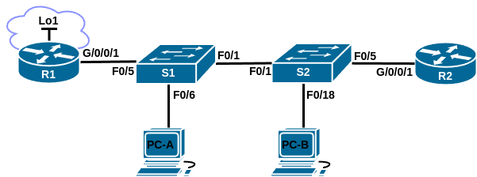
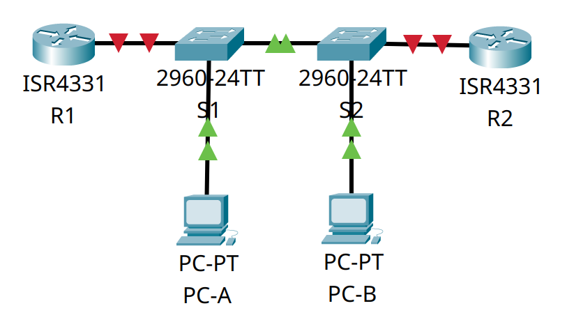
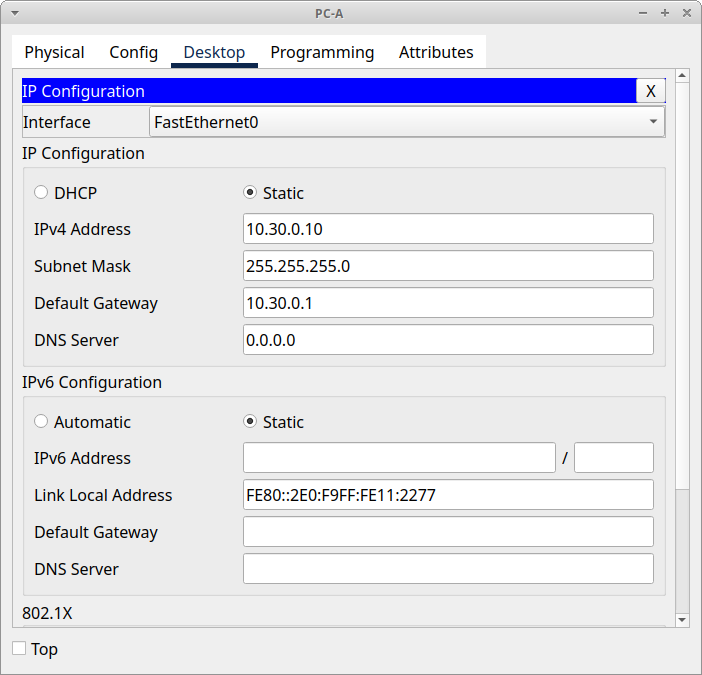
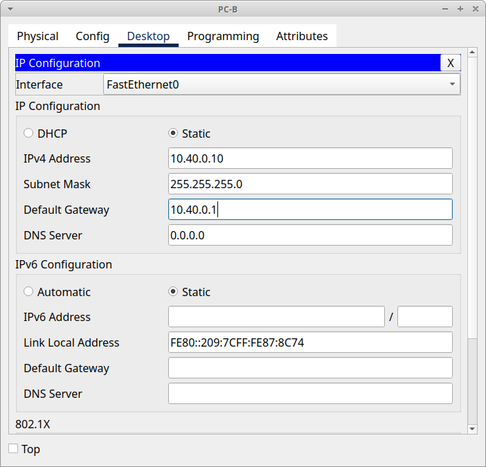

# Домашнее задание №11 «Настройка и проверка расширенных списков контроля доступа.»

## Топология



## Таблица адресации

| Устройство | Интерфейс   | IP-адрес   | Маска подсети | Шлюз по умолчанию |
| ---------- | ----------- | ---------- | ------------- | ----------------- |
| R1         | G0/0/1      | —          | —             | —                 |
|            | G0/0/1.20   | 10.20.0.1  | 255.255.255.0 |                   |
|            | G0/0/1.30   | 10.30.0.1  | 255.255.255.0 |                   |
|            | G0/0/1.40   | 10.40.0.1  | 255.255.255.0 |                   |
|            | G0/0/1.1000 | —          | —             |                   |
|            | Loopback 1  | 172.16.1.1 | 255.255.255.0 |                   |
| R2         | G0/0/1      | 10.20.0.4  | 255.255.255.0 | —                 |
| S1         | VLAN 20     | 10.20.0.2  | 255.255.255.0 | 10.20.0.1         |
| S2         | VLAN 20     | 10.20.0.3  | 255.255.255.0 | 10.20.0.1         |
| PC-A       | NIC         | 10.30.0.10 | 255.255.255.0 | 10.30.0.1         |
| PC-B       | NIC         | 10.40.0.10 | 255.255.255.0 | 10.40.0.1         |

## Таблица VLAN

| VLAN | Имя         | Назначенный интерфейс                                                |
| ---- | ----------- | -------------------------------------------------------------------- |
| 20   | Management  | S2: F0/5                                                             |
| 30   | Operations  | S1: F0/6                                                             |
| 40   | Sales       | S2: F0/18                                                            |
| 999  | ParkingLot  | S1: F0/2-4, F0/7-24, G0/1-2<br>S2: F0/2-4, F0/6-17, F0/19-24, G0/1-2 |
| 1000 | Собственная | —                                                                    |

## Задачи

* [Часть 1. Создание сети и настройка основных параметров устройства.](#часть-1-создание-сети-и-настройка-основных-параметров-устройства)
* [Часть 2. Настройка сетей VLAN.](#часть-2-настройка-сетей-vlan)
* [Часть 3. Настройка магистральных каналов](#часть-3-настройка-магистральных-каналов)
* [Часть 4. Настройка маршрутизации](#часть-4-настройка-маршрутизации)
* [Часть 5. Настройка удалённого доступа](#часть-5-настройка-удалённого-доступа)
* [Часть 6. Проверка подключения](#часть-6-проверка-подключения)
* [Часть 7. Настройка и проверка списков контроля доступа](#часть-7-настройка-и-проверка-списков-контроля-доступа)

## Общие сведения/сценарий

Нам было поручено настроить списки контроля доступа в сети небольшой компании.
ACL являются одним из самых простых и прямых средств управления трафиком уровня 3.
**R1** будет размещать интернет-соединение (смоделированное интерфейсом Loopback 1)
и предоставлять информацию о маршруте по умолчанию для **R2**. После завершения
первоначальной настройки компания имеет некоторые конкретные требования к
безопасности дорожного движения, которые вы несете ответственность за реализацию.

**Примечание:** маршрутизаторы, используемые в практических лабораторных работах
CCNA, - это Cisco 4221 с Cisco IOS XE Release 16.9.3 (образ universalk9). В
лабораторных работах используются коммутаторы Cisco Catalyst 2960 с Cisco IOS
версии 15.0(2) (образ lanbasek9). Можно использовать другие маршрутизаторы,
коммутаторы и версии Cisco IOS. В зависимости от модели устройства и версии Cisco
IOS доступные команды и результаты их выполнения могут отличаться от тех, которые
показаны в лабораторных работах. Правильные идентификаторы интерфейса см. в
сводной таблице по интерфейсам маршрутизаторов в конце лабораторной работы.

**Примечание:** убедитесь, что у всех маршрутизаторов и коммутаторов была
удалена начальная конфигурация. Если вы не уверены, обратитесь к инструктору.

## Часть 1. Создание сети и настройка основных параметров устройства

Для моделирования сети будем использовать ПО Cisco Packet Tracer 8.1.1. Создадим
новую конфигурацию, используя следующие ресурсы:

* 2 маршрутизатора (Cisco 4221 с универсальным образом Cisco IOS XE версии
  16.9.3 или аналогичным);
* 2 коммутатора (Cisco 2960 с операционной системой Cisco IOS 15.2(2) (образ
  lanbasek9) или аналогичная модель);
* 2 ПК (ОС Windows с программой эмуляции терминалов, например Tera Term);
* консольные кабели для настройки устройств Cisco IOS через консольные порты;
* кабели Ethernet, расположенные в соответствии с топологией.

В первой части лабораторной работы создадим топологию сети и настроим базовые
параметры для узлов ПК и коммутаторов.

### Шаг 1. Создание сети

Подключим устройства, как показано в топологии, и подсоединим необходимые кабели.



### Шаг 2. Настройка маршрутизаторов

Настроим базовые параметры маршрутизаторов **R1** и **R2**.

#### a. Установка имени устройства

Подключимся к маршрутизатору с помощью консольного подключения, активируем
привилегированный режим и сменим имя:

```text
Router>en
Router#conf t
Enter configuration commands, one per line.  End with CNTL/Z.
Router(config)#host R1
R1(config)#
```

#### b. Отключение поиска DNS

Чтобы предотвратить попытки маршрутизатора неверно преобразовывать введённые
команды таким образом, как будто они являются именами узлов, отключим поиск DNS:

```text
R1(config)#no ip domain-lookup
R1(config)#
```

#### c. Установка пароля привилегированного режима

Назначим **class** в качестве зашифрованного пароля привилегированного режима EXEC:

```text
R1(config)#enable secret class
R1(config)#
```

#### d. Установка пароля консоли

Назначим **cisco** в качестве пароля консоли и включим вход в систему
по паролю:

```text
R1(config)#line con 0
R1(config-line)#password cisco
R1(config-line)#login
R1(config-line)#exit
R1(config)#
```

#### e. Установка пароля VTY

Назначим **cisco** в качестве пароля VTY каналов и включим вход в систему
по паролю:

```text
R1(config)#line vty 0 15
R1(config-line)#password cisco
R1(config-line)#login
R1(config-line)#exit
R1(config)#
```

#### f. Включение шифрования паролей

Зашифруем открытые пароли в файле конфигурации:

```text
R1(config)#service password-encryption
R1(config)#
```

#### g. Создание баннера

Для предупреждения пользователей о запрете несанкционированного доступа, настроим
баннерное сообщение дня (MOTD):

```text
R1(config)#banner motd # ATTENTION! Unauthorized access is strictly prohibited. #
R1(config)#
```

#### h. Сохранение конфигурации

Скопируем текущую конфигурацию в файл загрузочной конфигурации.

```text
R1(config)#exit
R1#copy run start
Destination filename [startup-config]? 
Building configuration...
[OK]
R1#
```

<details>
<summary>R1# show run</summary>

```text
R1#show run
Building configuration...

Current configuration : 884 bytes
!
version 16.6.4
no service timestamps log datetime msec
no service timestamps debug datetime msec
service password-encryption
!
hostname R1
!
!
!
enable secret 5 $1$mERr$9cTjUIEqNGurQiFU.ZeCi1
!
!
!
!
!
!
ip cef
no ipv6 cef
!
!
!
!
!
!
!
!
!
!
no ip domain-lookup
!
!
spanning-tree mode pvst
!
!
!
!
!
!
interface GigabitEthernet0/0/0
 no ip address
 duplex auto
 speed auto
 shutdown
!
interface GigabitEthernet0/0/1
 no ip address
 duplex auto
 speed auto
 shutdown
!
interface GigabitEthernet0/0/2
 no ip address
 duplex auto
 speed auto
 shutdown
!
interface Vlan1
 no ip address
 shutdown
!
ip classless
!
ip flow-export version 9
!
!
!
banner motd ^C ATTENTION! Unauthorized access is strictly prohibited. ^C
!
!
!
!
!
line con 0
 password 7 0822455D0A16
 login
!
line aux 0
!
line vty 0 4
 password 7 0822455D0A16
 login
line vty 5 15
 password 7 0822455D0A16
 login
!
!
!
end


R1#
```

</details>

<details>
<summary>R2# show run</summary>

```text
R2#show run
Building configuration...

Current configuration : 884 bytes
!
version 16.6.4
no service timestamps log datetime msec
no service timestamps debug datetime msec
service password-encryption
!
hostname R2
!
!
!
enable secret 5 $1$mERr$9cTjUIEqNGurQiFU.ZeCi1
!
!
!
!
!
!
ip cef
no ipv6 cef
!
!
!
!
!
!
!
!
!
!
no ip domain-lookup
!
!
spanning-tree mode pvst
!
!
!
!
!
!
interface GigabitEthernet0/0/0
 no ip address
 duplex auto
 speed auto
 shutdown
!
interface GigabitEthernet0/0/1
 no ip address
 duplex auto
 speed auto
 shutdown
!
interface GigabitEthernet0/0/2
 no ip address
 duplex auto
 speed auto
 shutdown
!
interface Vlan1
 no ip address
 shutdown
!
ip classless
!
ip flow-export version 9
!
!
!
banner motd ^C ATTENTION! Unauthorized access is strictly prohibited. ^C
!
!
!
!
!
line con 0
 password 7 0822455D0A16
 login
!
line aux 0
!
line vty 0 4
 password 7 0822455D0A16
 login
line vty 5 15
 password 7 0822455D0A16
 login
!
!
!
end


R2#
```

</details>

### Шаг 3. Настройка коммутаторов

Настроим основные параметры коммутаторов **S1** и **S2**.

#### a. Установка имени устройства

Подключимся к коммутатору с помощью консольного подключения, активируем
привилегированный режим и сменим имя:

```text
Switch>en
Switch#conf t
Enter configuration commands, one per line.  End with CNTL/Z.
Switch(config)#host S1
S1(config)#
```

#### b. Отключение поиска DNS

Чтобы предотвратить попытки коммутатора неверно преобразовывать введённые
команды таким образом, как будто они являются именами узлов, отключим поиск DNS:

```text
S1(config)#no ip domain-lookup
S1(config)#
```

#### c. Установка пароля привилегированного режима

Назначим **class** в качестве зашифрованного пароля привилегированного режима EXEC:

```text
S1(config)#enable secret class
S1(config)#
```

#### d. Установка пароля консоли

Назначим **cisco** в качестве пароля консоли и включим вход в систему
по паролю:

```text
S1(config)#line con 0
S1(config-line)#password cisco
S1(config-line)#login
S1(config-line)#exit
S1(config)#
```

#### e. Установка пароля VTY

Назначим **cisco** в качестве пароля VTY каналов и включим вход в систему
по паролю:

```text
S1(config)#line vty 0 15
S1(config-line)#password cisco
S1(config-line)#login
S1(config-line)#exit
S1(config)#
```

#### f. Включение шифрования паролей

Зашифруем открытые пароли в файле конфигурации:

```text
S1(config)#service password-encryption
S1(config)#
```

#### g. Создание баннера

Для предупреждения пользователей о запрете несанкционированного доступа, настроим
баннерное сообщение дня (MOTD):

```text
S1(config)#banner motd # ATTENTION! Unauthorized access is strictly prohibited. #
S1(config)#
```

#### h. Сохранение конфигурации

Скопируем текущую конфигурацию в файл загрузочной конфигурации.

```text
S1(config)#exit
S1#copy run start
Destination filename [startup-config]? 
Building configuration...
[OK]
S1#
```

<details>
<summary>S1# show run</summary>

```text
S1#show run
Building configuration...

Current configuration : 1295 bytes
!
version 15.0
no service timestamps log datetime msec
no service timestamps debug datetime msec
service password-encryption
!
hostname S1
!
enable secret 5 $1$mERr$9cTjUIEqNGurQiFU.ZeCi1
!
!
!
no ip domain-lookup
!
!
!
spanning-tree mode pvst
spanning-tree extend system-id
!
interface FastEthernet0/1
!
interface FastEthernet0/2
!
interface FastEthernet0/3
!
interface FastEthernet0/4
!
interface FastEthernet0/5
!
interface FastEthernet0/6
!
interface FastEthernet0/7
!
interface FastEthernet0/8
!
interface FastEthernet0/9
!
interface FastEthernet0/10
!
interface FastEthernet0/11
!
interface FastEthernet0/12
!
interface FastEthernet0/13
!
interface FastEthernet0/14
!
interface FastEthernet0/15
!
interface FastEthernet0/16
!
interface FastEthernet0/17
!
interface FastEthernet0/18
!
interface FastEthernet0/19
!
interface FastEthernet0/20
!
interface FastEthernet0/21
!
interface FastEthernet0/22
!
interface FastEthernet0/23
!
interface FastEthernet0/24
!
interface GigabitEthernet0/1
!
interface GigabitEthernet0/2
!
interface Vlan1
 no ip address
 shutdown
!
banner motd ^C ATTENTION! Unauthorized access is strictly prohibited. ^C
!
!
!
line con 0
 password 7 0822455D0A16
 login
!
line vty 0 4
 password 7 0822455D0A16
 login
line vty 5 15
 password 7 0822455D0A16
 login
!
!
!
!
end


S1#
```

</details>

<details>
<summary>S2# show run</summary>

```text
S2#show run
Building configuration...

Current configuration : 1295 bytes
!
version 15.0
no service timestamps log datetime msec
no service timestamps debug datetime msec
service password-encryption
!
hostname S2
!
enable secret 5 $1$mERr$9cTjUIEqNGurQiFU.ZeCi1
!
!
!
no ip domain-lookup
!
!
!
spanning-tree mode pvst
spanning-tree extend system-id
!
interface FastEthernet0/1
!
interface FastEthernet0/2
!
interface FastEthernet0/3
!
interface FastEthernet0/4
!
interface FastEthernet0/5
!
interface FastEthernet0/6
!
interface FastEthernet0/7
!
interface FastEthernet0/8
!
interface FastEthernet0/9
!
interface FastEthernet0/10
!
interface FastEthernet0/11
!
interface FastEthernet0/12
!
interface FastEthernet0/13
!
interface FastEthernet0/14
!
interface FastEthernet0/15
!
interface FastEthernet0/16
!
interface FastEthernet0/17
!
interface FastEthernet0/18
!
interface FastEthernet0/19
!
interface FastEthernet0/20
!
interface FastEthernet0/21
!
interface FastEthernet0/22
!
interface FastEthernet0/23
!
interface FastEthernet0/24
!
interface GigabitEthernet0/1
!
interface GigabitEthernet0/2
!
interface Vlan1
 no ip address
 shutdown
!
banner motd ^C ATTENTION! Unauthorized access is strictly prohibited. ^C
!
!
!
line con 0
 password 7 0822455D0A16
 login
!
line vty 0 4
 password 7 0822455D0A16
 login
line vty 5 15
 password 7 0822455D0A16
 login
!
!
!
!
end


S2#
```

</details>

## Часть 2. Настройка сетей VLAN

Выполним настройку сетей VLAN на коммутаторах.

### Шаг 1. Создание сетей

#### a. Создание VLAN

Создадим необходимые VLAN и назовём их на каждом коммутаторе согласно приведённой
выше таблицы VLAN.

```text
S1(config)#vlan 20
S1(config-vlan)#name Management
S1(config-vlan)#exit
S1(config)#vlan 30
S1(config-vlan)#name Operations
S1(config-vlan)#exit
S1(config)#vlan 40
S1(config-vlan)#name Sales
S1(config-vlan)#exit
S1(config)#vlan 999
S1(config-vlan)#name ParkingLot
S1(config-vlan)#exit
S1(config)#vlan 1000
S1(config-vlan)#name Native
S1(config-vlan)#exit
S1(config)#
```

#### b. Настройка интерфейсов управления и установка шлюза по умолчанию

Настроим интерфейс управления и шлюз по умолчанию на каждом коммутаторе,
используя информацию об IP-адресе в таблице адресации.

```text
S1(config)#int vlan 20
S1(config-if)#
%LINK-5-CHANGED: Interface Vlan20, changed state to up

S1(config-if)#ip add 10.20.0.2 255.255.255.0
S1(config-if)#no shut
S1(config-if)#exit
S1(config)#ip default-gateway 10.20.0.1
S1(config)#
```

#### c. Отключение неиспользуемых портов

Назначим все неиспользуемые порты коммутатора VLAN ParkingLot, настроим их для
статического режима доступа и административно деактивируем их.

**Примечание:** команда **interface range** полезна для выполнения этой задачи с
помощью необходимого количества команд.

Коммутатор **S1** (сообщения о деактивации интерфейса опущены для краткости):

```text
S1(config)#int r f0/2-4
S1(config-if-range)#sw m ac
S1(config-if-range)#sw ac vl 999
S1(config-if-range)#shut
S1(config-if-range)#exit
S1(config)#int r f0/7-24
S1(config-if-range)#sw m ac
S1(config-if-range)#sw ac vl 999
S1(config-if-range)#shut
S1(config-if-range)#exit
S1(config)#int r g0/1-2
S1(config-if-range)#sw m ac
S1(config-if-range)#sw ac vl 999
S1(config-if-range)#shut
S1(config-if-range)#exit
S1(config)#
```

Коммутатор **S2** (сообщения о деактивации интерфейса опущены для краткости):

```text
S2(config)#int r f0/2-4
S2(config-if-range)#sw m ac
S2(config-if-range)#sw ac vl 999
S2(config-if-range)#shut
S2(config-if-range)#exit
S2(config)#int r f0/6-17
S2(config-if-range)#sw m ac
S2(config-if-range)#sw ac vl 999
S2(config-if-range)#shut
S2(config-if-range)#exit
S2(config)#int r f0/19-24
S2(config-if-range)#sw m ac
S2(config-if-range)#sw ac vl 999
S2(config-if-range)#shut
S2(config-if-range)#exit
S2(config)#int r g0/1-2
S2(config-if-range)#sw m ac
S2(config-if-range)#sw ac vl 999
S2(config-if-range)#shut
S2(config-if-range)#exit
S2(config)#
```

### Шаг 2. Назначьте сети VLAN соответствующим интерфейсам коммутатора.

#### a. Настройка используемых портов

Назначим используемые порты соответствующей VLAN (указанной в таблице VLAN выше)
и настроим их для режима статического доступа.

Коммутатор **S1**:

```text
S1(config)#int f0/6
S1(config-if)#sw m ac
S1(config-if)#sw ac vl 30
S1(config-if)#no shut
S1(config-if)#exit
S1(config)#
```

Коммутатор **S2**:

```text
S2(config)#int f0/5
S2(config-if)#sw m ac
S2(config-if)#sw ac vl 20
S2(config-if)#no shut
S2(config-if)#exit
S2(config)#int f0/18
S2(config-if)#sw m ac
S2(config-if)#sw ac vl 40
S2(config-if)#no shut
S2(config-if)#exit
S2(config)#
```

#### b. Просмотр информации о VLAN

Выполним команду **show vlan brief**, чтобы убедиться, что сети VLAN назначены
правильным интерфейсам.

Коммутатор **S1**:

```text
S1#show vlan brief

VLAN Name                             Status    Ports
---- -------------------------------- --------- -------------------------------
1    default                          active    Fa0/1, Fa0/5
20   Management                       active    
30   Operations                       active    Fa0/6
40   Sales                            active    
999  ParkingLot                       active    Fa0/2, Fa0/3, Fa0/4, Fa0/7
                                                Fa0/8, Fa0/9, Fa0/10, Fa0/11
                                                Fa0/12, Fa0/13, Fa0/14, Fa0/15
                                                Fa0/16, Fa0/17, Fa0/18, Fa0/19
                                                Fa0/20, Fa0/21, Fa0/22, Fa0/23
                                                Fa0/24, Gig0/1, Gig0/2
1000 Native                           active    
1002 fddi-default                     active    
1003 token-ring-default               active    
1004 fddinet-default                  active    
1005 trnet-default                    active    
```

Коммутатор **S2**:

```text
S2#show vlan brief

VLAN Name                             Status    Ports
---- -------------------------------- --------- -------------------------------
1    default                          active    Fa0/1
20   Management                       active    Fa0/5
30   Operations                       active    
40   Sales                            active    Fa0/18
999  ParkingLot                       active    Fa0/2, Fa0/3, Fa0/4, Fa0/6
                                                Fa0/7, Fa0/8, Fa0/9, Fa0/10
                                                Fa0/11, Fa0/12, Fa0/13, Fa0/14
                                                Fa0/15, Fa0/16, Fa0/17, Fa0/19
                                                Fa0/20, Fa0/21, Fa0/22, Fa0/23
                                                Fa0/24, Gig0/1, Gig0/2
1000 Native                           active    
1002 fddi-default                     active    
1003 token-ring-default               active    
1004 fddinet-default                  active    
1005 trnet-default                    active    
```

## Часть 3. Настройка магистральных каналов

Создадим и настроим транки (магистральные каналы).

### Шаг 1. Настройка магистрального канала между коммутаторами

Настроим магистральный интерфейс F0/1 на обоих коммутаторах.

#### a. Установка режима порта

Изменим режим порта на интерфейсе F0/1 обоих коммутаторов, чтобы принудительно
создать магистральную связь.

```text
S1(config)#int f0/1
S1(config-if)#sw m tr
S1(config-if)#exit
S1(config)#
```

#### b. Настройка native VLAN

В рамках конфигурации транка установим для native vlan значение 1000 на обоих
коммутаторах. При настройке двух интерфейсов для разных собственных VLAN могут
отображаться временные сообщения об ошибках (вызваны работой протоколо STP, для
наглядности опущены).

```text
S1(config)#int f0/1
S1(config-if)#sw tr nat vl 1000
S1(config-if)#exit
S1(config)#
```

```text
S2(config)#int f0/1
S2(config-if)#sw tr nat vl 1000
S2(config-if)#exit
S2(config)#
```

#### c. Добавление разрешённых VLAN

В качестве другой части конфигурации транка укажем, что VLAN 20, 30, 40 и 1000
разрешены в транке.

```text
S1(config)#int f0/1
S1(config-if)#sw tr allow vl 20,30,40,1000
S1(config-if)#exit
S1(config)#
```

#### d. Просмотр информации о транке

Выполним команду **show interfaces trunk** для проверки портов магистрали,
собственной VLAN и разрешённых VLAN через магистраль.

Коммутатор **S1**:

```text
S1#show interfaces trunk
Port        Mode         Encapsulation  Status        Native vlan
Fa0/1       on           802.1q         trunking      1000

Port        Vlans allowed on trunk
Fa0/1       20,30,40,1000

Port        Vlans allowed and active in management domain
Fa0/1       20,30,40,1000

Port        Vlans in spanning tree forwarding state and not pruned
Fa0/1       20,30,40,1000
```

Коммутатор **S2**:

```text
S2#show interfaces trunk
Port        Mode         Encapsulation  Status        Native vlan
Fa0/1       on           802.1q         trunking      1000

Port        Vlans allowed on trunk
Fa0/1       20,30,40,1000

Port        Vlans allowed and active in management domain
Fa0/1       20,30,40,1000

Port        Vlans in spanning tree forwarding state and not pruned
Fa0/1       20,30,40,1000
```

### Шаг 2. Настройка транка между **S1** и **R1**

Настроим магистральный интерфейс F0/5 на коммутаторе **S1**.

#### a. Настройка транка на S1 F0/5

Настроим интерфейс **S1** F0/5 с теми же параметрами транка, что и F0/1. Это
транк до маршрутизатора **R1**.

```text
S1(config)#int f0/5
S1(config-if)#sw m tr
S1(config-if)#sw tr nat vl 1000
S1(config-if)#sw tr allow vl 20,30,40,1000
S1(config-if)#no shut
S1(config-if)#exit
S1(config)#
```

#### b. Сохранение конфигурации

Скопируем текущую конфигурацию в файл загрузочной конфигурации.

```text
S1(config)#exit
S1#copy run start
Destination filename [startup-config]? 
Building configuration...
[OK]
S1#
```

<details>
<summary>S1# show run</summary>

```text
S1#show run
Building configuration...

Current configuration : 3064 bytes
!
version 15.0
no service timestamps log datetime msec
no service timestamps debug datetime msec
service password-encryption
!
hostname S1
!
enable secret 5 $1$mERr$9cTjUIEqNGurQiFU.ZeCi1
!
!
!
no ip domain-lookup
!
!
!
spanning-tree mode pvst
spanning-tree extend system-id
!
interface FastEthernet0/1
 switchport trunk native vlan 1000
 switchport trunk allowed vlan 20,30,40,1000
 switchport mode trunk
!
interface FastEthernet0/2
 switchport access vlan 999
 switchport mode access
 shutdown
!
interface FastEthernet0/3
 switchport access vlan 999
 switchport mode access
 shutdown
!
interface FastEthernet0/4
 switchport access vlan 999
 switchport mode access
 shutdown
!
interface FastEthernet0/5
 switchport trunk native vlan 1000
 switchport trunk allowed vlan 20,30,40,1000
 switchport mode trunk
!
interface FastEthernet0/6
 switchport access vlan 30
 switchport mode access
!
interface FastEthernet0/7
 switchport access vlan 999
 switchport mode access
 shutdown
!
interface FastEthernet0/8
 switchport access vlan 999
 switchport mode access
 shutdown
!
interface FastEthernet0/9
 switchport access vlan 999
 switchport mode access
 shutdown
!
interface FastEthernet0/10
 switchport access vlan 999
 switchport mode access
 shutdown
!
interface FastEthernet0/11
 switchport access vlan 999
 switchport mode access
 shutdown
!
interface FastEthernet0/12
 switchport access vlan 999
 switchport mode access
 shutdown
!
interface FastEthernet0/13
 switchport access vlan 999
 switchport mode access
 shutdown
!
interface FastEthernet0/14
 switchport access vlan 999
 switchport mode access
 shutdown
!
interface FastEthernet0/15
 switchport access vlan 999
 switchport mode access
 shutdown
!
interface FastEthernet0/16
 switchport access vlan 999
 switchport mode access
 shutdown
!
interface FastEthernet0/17
 switchport access vlan 999
 switchport mode access
 shutdown
!
interface FastEthernet0/18
 switchport access vlan 999
 switchport mode access
 shutdown
!
interface FastEthernet0/19
 switchport access vlan 999
 switchport mode access
 shutdown
!
interface FastEthernet0/20
 switchport access vlan 999
 switchport mode access
 shutdown
!
interface FastEthernet0/21
 switchport access vlan 999
 switchport mode access
 shutdown
!
interface FastEthernet0/22
 switchport access vlan 999
 switchport mode access
 shutdown
!
interface FastEthernet0/23
 switchport access vlan 999
 switchport mode access
 shutdown
!
interface FastEthernet0/24
 switchport access vlan 999
 switchport mode access
 shutdown
!
interface GigabitEthernet0/1
 switchport access vlan 999
 switchport mode access
 shutdown
!
interface GigabitEthernet0/2
 switchport access vlan 999
 switchport mode access
 shutdown
!
interface Vlan1
 no ip address
 shutdown
!
interface Vlan20
 ip address 10.20.0.2 255.255.255.0
!
ip default-gateway 10.20.0.1
!
banner motd ^C ATTENTION! Unauthorized access is strictly prohibited. ^C
!
!
!
line con 0
 password 7 0822455D0A16
 login
!
line vty 0 4
 password 7 0822455D0A16
 login
line vty 5 15
 password 7 0822455D0A16
 login
!
!
!
!
end


S1#
```

</details>

<details>
<summary>S2# show run</summary>

```text
S2#show run
Building configuration...

Current configuration : 3012 bytes
!
version 15.0
no service timestamps log datetime msec
no service timestamps debug datetime msec
service password-encryption
!
hostname S2
!
enable secret 5 $1$mERr$9cTjUIEqNGurQiFU.ZeCi1
!
!
!
no ip domain-lookup
!
!
!
spanning-tree mode pvst
spanning-tree extend system-id
!
interface FastEthernet0/1
 switchport trunk native vlan 1000
 switchport trunk allowed vlan 20,30,40,1000
 switchport mode trunk
!
interface FastEthernet0/2
 switchport access vlan 999
 switchport mode access
 shutdown
!
interface FastEthernet0/3
 switchport access vlan 999
 switchport mode access
 shutdown
!
interface FastEthernet0/4
 switchport access vlan 999
 switchport mode access
 shutdown
!
interface FastEthernet0/5
 switchport access vlan 20
 switchport mode access
!
interface FastEthernet0/6
 switchport access vlan 999
 switchport mode access
 shutdown
!
interface FastEthernet0/7
 switchport access vlan 999
 switchport mode access
 shutdown
!
interface FastEthernet0/8
 switchport access vlan 999
 switchport mode access
 shutdown
!
interface FastEthernet0/9
 switchport access vlan 999
 switchport mode access
 shutdown
!
interface FastEthernet0/10
 switchport access vlan 999
 switchport mode access
 shutdown
!
interface FastEthernet0/11
 switchport access vlan 999
 switchport mode access
 shutdown
!
interface FastEthernet0/12
 switchport access vlan 999
 switchport mode access
 shutdown
!
interface FastEthernet0/13
 switchport access vlan 999
 switchport mode access
 shutdown
!
interface FastEthernet0/14
 switchport access vlan 999
 switchport mode access
 shutdown
!
interface FastEthernet0/15
 switchport access vlan 999
 switchport mode access
 shutdown
!
interface FastEthernet0/16
 switchport access vlan 999
 switchport mode access
 shutdown
!
interface FastEthernet0/17
 switchport access vlan 999
 switchport mode access
 shutdown
!
interface FastEthernet0/18
 switchport access vlan 40
 switchport mode access
!
interface FastEthernet0/19
 switchport access vlan 999
 switchport mode access
 shutdown
!
interface FastEthernet0/20
 switchport access vlan 999
 switchport mode access
 shutdown
!
interface FastEthernet0/21
 switchport access vlan 999
 switchport mode access
 shutdown
!
interface FastEthernet0/22
 switchport access vlan 999
 switchport mode access
 shutdown
!
interface FastEthernet0/23
 switchport access vlan 999
 switchport mode access
 shutdown
!
interface FastEthernet0/24
 switchport access vlan 999
 switchport mode access
 shutdown
!
interface GigabitEthernet0/1
 switchport access vlan 999
 switchport mode access
 shutdown
!
interface GigabitEthernet0/2
 switchport access vlan 999
 switchport mode access
 shutdown
!
interface Vlan1
 no ip address
 shutdown
!
interface Vlan20
 ip address 10.20.0.3 255.255.255.0
!
ip default-gateway 10.20.0.1
!
banner motd ^C ATTENTION! Unauthorized access is strictly prohibited. ^C
!
!
!
line con 0
 password 7 0822455D0A16
 login
!
line vty 0 4
 password 7 0822455D0A16
 login
line vty 5 15
 password 7 0822455D0A16
 login
!
!
!
!
end


S2#
```

</details>

#### c. Просмотр информации о транке

Используем команду **show interfaces trunk** для проверки настроек транка.

```text
S1#show interfaces trunk 
Port        Mode         Encapsulation  Status        Native vlan
Fa0/1       on           802.1q         trunking      1000

Port        Vlans allowed on trunk
Fa0/1       20,30,40,1000

Port        Vlans allowed and active in management domain
Fa0/1       20,30,40,1000

Port        Vlans in spanning tree forwarding state and not pruned
Fa0/1       20,30,40,1000
```

Интерфейс f0/5 в списке не появился, так как не поднят линк со стороны
маршрутизатора **R1**.

## Часть 4. Настройка маршрутизации

### Шаг 1. Настройка маршрутизации между сетями VLAN на **R1**

#### a. Активация G0/0/1 на маршрутизаторе

Включим интерфейс G0/0/1 на маршрутизаторе **R1**.

```text
R1(config)#int g0/0/1
R1(config-if)#no shut

R1(config-if)#
%LINK-5-CHANGED: Interface GigabitEthernet0/0/1, changed state to up

%LINEPROTO-5-UPDOWN: Line protocol on Interface GigabitEthernet0/0/1, changed state to up

R1(config-if)#exit
R1(config)#
```

После того, как линк между **R1** и **S1** поднялся, можно заметить, что интерфейс
f0/5 появился в списке транков **S1**:

```text
S1#
%LINK-5-CHANGED: Interface FastEthernet0/5, changed state to up

%LINEPROTO-5-UPDOWN: Line protocol on Interface FastEthernet0/5, changed state to up

S1#show interfaces trunk 
Port        Mode         Encapsulation  Status        Native vlan
Fa0/1       on           802.1q         trunking      1000
Fa0/5       on           802.1q         trunking      1000

Port        Vlans allowed on trunk
Fa0/1       20,30,40,1000
Fa0/5       20,30,40,1000

Port        Vlans allowed and active in management domain
Fa0/1       20,30,40,1000
Fa0/5       20,30,40,1000

Port        Vlans in spanning tree forwarding state and not pruned
Fa0/1       20,30,40,1000
Fa0/5       20,30,40,1000

S1#
```

#### b. Настройка подинтерфейсов

Настроим подинтерфейсы для каждой VLAN, как указано в таблице IP-адресации. Все
подинтерфейсы используют инкапсуляцию 802.1Q. Убедимся, что подинтерфейс для
собственной VLAN не имеет назначенного IP-адреса. Включим описание для каждого
подинтерфейса.

**VLAN 20**:

```text
R1(config)#int g0/0/1.20
R1(config-subif)#
%LINK-5-CHANGED: Interface GigabitEthernet0/0/1.20, changed state to up

%LINEPROTO-5-UPDOWN: Line protocol on Interface GigabitEthernet0/0/1.20, changed state to up

R1(config-subif)#description Management
R1(config-subif)#enc dot1q 20
R1(config-subif)#ip add 10.20.0.1 255.255.255.0
R1(config-subif)#exit
R1(config)#
```

**VLAN 30**:

```text
R1(config)#int g0/0/1.30
R1(config-subif)#
%LINK-5-CHANGED: Interface GigabitEthernet0/0/1.30, changed state to up

%LINEPROTO-5-UPDOWN: Line protocol on Interface GigabitEthernet0/0/1.30, changed state to up

R1(config-subif)#description Operations
R1(config-subif)#enc dot1q 30
R1(config-subif)#ip add 10.30.0.1 255.255.255.0
R1(config-subif)#exit
R1(config)#
```

**VLAN 40**:

```text
R1(config)#int g0/0/1.40
R1(config-subif)#
%LINK-5-CHANGED: Interface GigabitEthernet0/0/1.40, changed state to up

%LINEPROTO-5-UPDOWN: Line protocol on Interface GigabitEthernet0/0/1.40, changed state to up

R1(config-subif)#description Sales
R1(config-subif)#enc dot1q 40
R1(config-subif)#ip add 10.40.0.1 255.255.255.0
R1(config-subif)#exit
R1(config)#
```

**VLAN 1000**:

```text
R1(config)#int g0/0/1.1000
R1(config-subif)#
%LINK-5-CHANGED: Interface GigabitEthernet0/0/1.1000, changed state to up

%LINEPROTO-5-UPDOWN: Line protocol on Interface GigabitEthernet0/0/1.1000, changed state to up

R1(config-subif)#description Native
R1(config-subif)#enc dot1q 1000 native
R1(config-subif)#exit
R1(config)#
```

#### c. Настройка Loopback 1

Настроим интерфейс Loopback 1 на **R1** с адресацией из приведенной выше таблицы.

```text
R1(config)#int Loopback1

R1(config-if)#
%LINK-5-CHANGED: Interface Loopback1, changed state to up

%LINEPROTO-5-UPDOWN: Line protocol on Interface Loopback1, changed state to up

R1(config-if)#ip add 172.16.1.1 255.255.255.0
R1(config-if)#exit
R1(config)#
```

#### d. Просмотр информации о сабинтерфейсах

С помощью команды **show ip interface brief** проверим конфигурацию подынтерфейса.

```text
R1#show ip interface brief
Interface                 IP-Address      OK? Method Status                Protocol 
GigabitEthernet0/0/0      unassigned      YES unset  administratively down down 
GigabitEthernet0/0/1      unassigned      YES unset  up                    up 
GigabitEthernet0/0/1.20   10.20.0.1       YES manual up                    up 
GigabitEthernet0/0/1.30   10.30.0.1       YES manual up                    up 
GigabitEthernet0/0/1.40   10.40.0.1       YES manual up                    up 
GigabitEthernet0/0/1.1000 unassigned      YES unset  up                    up 
GigabitEthernet0/0/2      unassigned      YES unset  administratively down down 
Loopback1                 172.16.1.1      YES manual up                    up 
Vlan1                     unassigned      YES unset  administratively down down
R1#
```

### Шаг 2. Настройка интерфейса **R2** g0/0/1

Настроим интерфейс **R2** g0/0/1 с использованием адреса из таблицы и маршрута
по умолчанию с адресом следующего перехода 10.20.0.1.

```text
R2(config)#int g0/0/1
R2(config-if)#ip add 10.20.0.4 255.255.255.0
R2(config-if)#no shut

R2(config-if)#
%LINK-5-CHANGED: Interface GigabitEthernet0/0/1, changed state to up

%LINEPROTO-5-UPDOWN: Line protocol on Interface GigabitEthernet0/0/1, changed state to up

R2(config-if)#exit
R2(config)#ip route 0.0.0.0 0.0.0.0 10.20.0.1
R2(config)#
```

## Часть 5. Настройка удалённого доступа

### Шаг 1. Включение поддержки SSH

Настроим все сетевые устройства для базовой поддержки SSH.

#### a. Добавление локального пользователя

Создадим локального пользователя с именем пользователя SSHadmin и зашифрованным
паролем $cisco123!

```text
S1(config)#username SSHadmin privilege 15 secret $cisco123!
S1(config)#
```

#### b. Установка доменного имени

Используем ccna-lab.com в качестве доменного имени.

```text
S1(config)#ip domain-name ccna-lab.com
S1(config)#
```

#### c. Генерация криптоключей

Сгенерируем криптоключи с помощью 1024 битного модуля.

```text
S1(config)#crypto key generate rsa general-keys modulus 1024
The name for the keys will be: S1.ccna-lab.com

% The key modulus size is 1024 bits
% Generating 1024 bit RSA keys, keys will be non-exportable...[OK]
*Mar 1 3:20:20.771: %SSH-5-ENABLED: SSH 1.99 has been enabled
S1(config)#
```

Сразу после создания ключа включается протокол SSH версии 1.99. Сменим её на
более безопасную версию 2 командой **ip ssh version 2**:

```text
S1(config)#ip ssh version 2
S1(config)#
```

#### d. Настройка линий VTY

Настроим первые пять линий VTY на каждом устройстве, чтобы поддерживать только
SSH-соединения с локальной аутентификацией.

```text
S1(config)#line vty 0 5
S1(config-line)#transport input ssh
S1(config-line)#login local
S1(config-line)#exit
S1(config)#
```

### Шаг 2. Настройка защищённых веб-служб

Включим защищённые веб-службы с проверкой подлинности на маршрутизаторе **R1**.

#### a. Активация сервера

Включим сервер HTTPS на **R1** командой **ip http secure-server**.

К сожалению, Cisco Packet Tracer 8.1.1. не поддерживает данную команду:

```text
R1(config)#ip http secure-server
               ^
% Invalid input detected at '^' marker.
```

В качестве альтернативного решения возможно было бы использовать отдельный сервер,
стоящий за маршрутизатором **R1**.

#### b. Настройка проверки подлинности пользователей

Настроим **R1** для проверки подлинности пользователей, пытающихся подключиться
к веб-серверу (команда **ip http authentication local**).

К сожалению, Cisco Packet Tracer 8.1.1. не поддерживает данную команду:

```text
R1(config)#ip http authentication local
               ^
% Invalid input detected at '^' marker.
	
R1(config)#
```

## Часть 6. Проверка подключения

### Шаг 1. Настройте узлы ПК

Установим IP-адреса ПК согласно таблице адресации.





### Шаг 2. Выполнение эхо-запросов

Выполним следующие тесты. Эхозапрос должен пройти успешно.

**Примечание:** возможно, придётся отключить брандмауэр ПК для работы ping.

| От   | Протокол | Назначение |
| ---- | -------- | ---------- |
| PC-A | Ping     | 10.40.0.10 |
| PC-A | Ping     | 10.20.0.1  |
| PC-B | Ping     | 10.30.0.10 |
| PC-B | Ping     | 10.20.0.1  |
| PC-B | Ping     | 172.16.1.1 |
| PC-B | HTTPS    | 10.20.0.1  |
| PC-B | HTTPS    | 172.16.1.1 |
| PC-B | SSH      | 10.20.0.1  |
| PC-B | SSH      | 172.16.1.1 |

<details>
<summary>PC-A ping</summary>

```text
Cisco Packet Tracer PC Command Line 1.0
C:\>ping 10.40.0.10

Pinging 10.40.0.10 with 32 bytes of data:

Request timed out.
Reply from 10.40.0.10: bytes=32 time<1ms TTL=127
Reply from 10.40.0.10: bytes=32 time<1ms TTL=127
Reply from 10.40.0.10: bytes=32 time<1ms TTL=127

Ping statistics for 10.40.0.10:
    Packets: Sent = 4, Received = 3, Lost = 1 (25% loss),
Approximate round trip times in milli-seconds:
    Minimum = 0ms, Maximum = 0ms, Average = 0ms

C:\>ping 10.20.0.1

Pinging 10.20.0.1 with 32 bytes of data:

Reply from 10.20.0.1: bytes=32 time<1ms TTL=255
Reply from 10.20.0.1: bytes=32 time<1ms TTL=255
Reply from 10.20.0.1: bytes=32 time<1ms TTL=255
Reply from 10.20.0.1: bytes=32 time<1ms TTL=255

Ping statistics for 10.20.0.1:
    Packets: Sent = 4, Received = 4, Lost = 0 (0% loss),
Approximate round trip times in milli-seconds:
    Minimum = 0ms, Maximum = 0ms, Average = 0ms

C:\>
```

</details>

<details>
<summary>PC-B ping</summary>

```text
Cisco Packet Tracer PC Command Line 1.0
C:\>ping 10.30.0.10

Pinging 10.30.0.10 with 32 bytes of data:

Reply from 10.30.0.10: bytes=32 time<1ms TTL=127
Reply from 10.30.0.10: bytes=32 time<1ms TTL=127
Reply from 10.30.0.10: bytes=32 time<1ms TTL=127
Reply from 10.30.0.10: bytes=32 time<1ms TTL=127

Ping statistics for 10.30.0.10:
    Packets: Sent = 4, Received = 4, Lost = 0 (0% loss),
Approximate round trip times in milli-seconds:
    Minimum = 0ms, Maximum = 0ms, Average = 0ms

C:\>ping 10.20.0.1

Pinging 10.20.0.1 with 32 bytes of data:

Reply from 10.20.0.1: bytes=32 time<1ms TTL=255
Reply from 10.20.0.1: bytes=32 time<1ms TTL=255
Reply from 10.20.0.1: bytes=32 time<1ms TTL=255
Reply from 10.20.0.1: bytes=32 time<1ms TTL=255

Ping statistics for 10.20.0.1:
    Packets: Sent = 4, Received = 4, Lost = 0 (0% loss),
Approximate round trip times in milli-seconds:
    Minimum = 0ms, Maximum = 0ms, Average = 0ms

C:\>ping 172.16.1.1

Pinging 172.16.1.1 with 32 bytes of data:

Reply from 172.16.1.1: bytes=32 time<1ms TTL=255
Reply from 172.16.1.1: bytes=32 time<1ms TTL=255
Reply from 172.16.1.1: bytes=32 time<1ms TTL=255
Reply from 172.16.1.1: bytes=32 time<1ms TTL=255

Ping statistics for 172.16.1.1:
    Packets: Sent = 4, Received = 4, Lost = 0 (0% loss),
Approximate round trip times in milli-seconds:
    Minimum = 0ms, Maximum = 0ms, Average = 0ms

C:\>
```

</details>

<details>
<summary>PC-B SSH</summary>

```text
C:\>ssh -l SSHadmin 10.20.0.1

Password: 

 ATTENTION! Unauthorized access is strictly prohibited. 

R1#exit

[Connection to 10.20.0.1 closed by foreign host]
C:\>ssh -l SSHadmin 172.16.1.1

Password: 

 ATTENTION! Unauthorized access is strictly prohibited. 

R1#exit

[Connection to 172.16.1.1 closed by foreign host]
C:\>
```

</details>

Проверку доступности HTTPS на **R1** выполнить нельзя из-за ограничений Cisco
Packet Tracer 8.1.1.


## Часть 7. Настройка и проверка списков контроля доступа

При проверке базового подключения компания требует реализации следующих политик безопасности:

**Политика 1.** Сеть Sales не может использовать SSH в сети Management (но в
другие сети SSH разрешён).

**Политика 2.** Сеть Sales не имеет доступа к IP-адресам в сети Management с
помощью любого веб-протокола (HTTP/HTTPS). Сеть Sales также не имеет доступа к
интерфейсам **R1** с помощью любого веб-протокола. Разрешён весь другой веб-трафик
(обратим внимание — Сеть Sales может получить доступ к интерфейсу Loopback 1
на **R1**).

**Политика 3.** Сеть Sales не может отправлять эхо-запросы ICMP в сети Operations
или Management. Разрешены эхо-запросы ICMP к другим адресатам.

**Политика 4.** Cеть Operations не может отправлять ICMP эхозапросы в сеть Sales.
Разрешены эхо-запросы ICMP к другим адресатам.

### Шаг 1. Анализ требований к сети и политике безопасности

Проанализируем требования к сети и политике безопасности для планирования
реализации ACL.

При составлении списков контроля доступа существует две основные парадигмы:
«чёрный список», когда по умолчанию что не запрещено, то разрешено и «белый список»,
когда всё что не разрешено, то запрещено. Так как в рамках учебного задания про
иной траффик ничего не сказано и для облегчения отладки (возможность просмотра
счётчиков совпадений по строчкам правил (ACE)), будем придерживаться стратегии
«белого списка», т.е. по умолчанию весь траффик в рамках правила будет запрещён.

Проанализировав заданные политики можно сделать выводы что:

1. Все ограничения относятся к сетям Sales и Operations.
2. Потребуется использование расширенных ACL.
3. Местом применения будут соответствующие входящие сабинтерфейсы маршрутизатора
   **R1**.
4. Последней строчкой в правилах будет **deny ip any any**.

### Шаг 2. Разработка и применение расширенных списков доступа

Выполним разработку и применение расширенных списков доступа, которые будут
соответствовать требованиям политики безопасности.

Правило для Sales:

```text
R1(config)#ip access-list extended SALES
R1(config-ext-nacl)#remark deny SSH to Management net
R1(config-ext-nacl)#deny tcp 10.40.0.0 0.0.0.255 10.20.0.0 0.0.0.255 eq 22
R1(config-ext-nacl)#permit tcp 10.40.0.0 0.0.0.255 any eq 22
R1(config-ext-nacl)#remark deny HTTP/HTTPS to Management net
R1(config-ext-nacl)#deny tcp 10.40.0.0 0.0.0.255 10.20.0.0 0.0.0.255 eq 80
R1(config-ext-nacl)#deny tcp 10.40.0.0 0.0.0.255 10.20.0.0 0.0.0.255 eq 443
R1(config-ext-nacl)#remark deny HTTP/HTTPS to R1 interfaces
R1(config-ext-nacl)#deny tcp 10.40.0.0 0.0.0.255 10.20.0.1 0.62.0.1 eq 80
R1(config-ext-nacl)#deny tcp 10.40.0.0 0.0.0.255 10.20.0.1 0.62.0.1 eq 443
R1(config-ext-nacl)#remark allow HTTP/HTTPS traffic
R1(config-ext-nacl)#permit tcp 10.40.0.0 0.0.0.255 any eq 80
R1(config-ext-nacl)#permit tcp 10.40.0.0 0.0.0.255 any eq 443
R1(config-ext-nacl)#remark deny ICMP echo to Management and Operations nets
R1(config-ext-nacl)#deny icmp 10.40.0.0 0.0.0.255 10.20.0.0 0.0.0.255 echo 
R1(config-ext-nacl)#deny icmp 10.40.0.0 0.0.0.255 10.30.0.0 0.0.0.255 echo
R1(config-ext-nacl)#permit icmp 10.40.0.0 0.0.0.255 any echo
R1(config-ext-nacl)#deny ip any any
R1(config-ext-nacl)#exit
R1(config)#int g0/0/1.40
R1(config-subif)#ip access-group SALES in
R1(config-subif)#exit
R1(config)#
```

Правило для Operations:

```text
R1(config)#ip access-list extended OPERATIONS
R1(config-ext-nacl)#remark deny ICMP to Sales net
R1(config-ext-nacl)#deny icmp 10.30.0.0 0.0.0.255 10.40.0.0 0.0.0.255 echo
R1(config-ext-nacl)#permit icmp 10.30.0.0 0.0.0.255 any echo
R1(config-ext-nacl)#deny ip any any
R1(config-ext-nacl)#exit
R1(config)#int g0/0/1.30
R1(config-subif)#ip access-group OPERATIONS in
R1(config-subif)#exit
R1(config)#
```

### Шаг 3. Проверка политики безопасности

Убедимся, что политики безопасности применяются развернутыми списками доступа.

Выполним следующие тесты. Ожидаемые результаты показаны в таблице:

| От   | Протокол | Назначение | Результат |
| ---- | -------- | ---------- | --------- |
| PC-A | Ping     | 10.40.0.10 | Сбой      |
| PC-A | Ping     | 10.20.0.1  | Успех     |
| PC-B | Ping     | 10.30.0.10 | Сбой      |
| PC-B | Ping     | 10.20.0.1  | Сбой      |
| PC-B | Ping     | 172.16.1.1 | Успех     |
| PC-B | HTTPS    | 10.20.0.1  | Сбой      |
| PC-B | HTTPS    | 172.16.1.1 | Успех     |
| PC-B | SSH      | 10.20.0.4  | Сбой      |
| PC-B | SSH      | 172.16.1.1 | Успех     |

<details>
<summary><strong>PC-A</strong> ping:</summary>

```text
Cisco Packet Tracer PC Command Line 1.0
C:\>ping 10.40.0.10

Pinging 10.40.0.10 with 32 bytes of data:

Reply from 10.30.0.1: Destination host unreachable.
Reply from 10.30.0.1: Destination host unreachable.
Reply from 10.30.0.1: Destination host unreachable.
Reply from 10.30.0.1: Destination host unreachable.

Ping statistics for 10.40.0.10:
    Packets: Sent = 4, Received = 0, Lost = 4 (100% loss),

C:\>ping 10.20.0.1

Pinging 10.20.0.1 with 32 bytes of data:

Reply from 10.20.0.1: bytes=32 time=17ms TTL=255
Reply from 10.20.0.1: bytes=32 time<1ms TTL=255
Reply from 10.20.0.1: bytes=32 time<1ms TTL=255
Reply from 10.20.0.1: bytes=32 time<1ms TTL=255

Ping statistics for 10.20.0.1:
    Packets: Sent = 4, Received = 4, Lost = 0 (0% loss),
Approximate round trip times in milli-seconds:
    Minimum = 0ms, Maximum = 17ms, Average = 4ms

C:\>
```

</details>

<details>
<summary><strong>PC-B</strong> ping:</summary>

```text
C:\>ping 10.30.0.10

Pinging 10.30.0.10 with 32 bytes of data:

Reply from 10.40.0.1: Destination host unreachable.
Reply from 10.40.0.1: Destination host unreachable.
Reply from 10.40.0.1: Destination host unreachable.
Reply from 10.40.0.1: Destination host unreachable.

Ping statistics for 10.30.0.10:
    Packets: Sent = 4, Received = 0, Lost = 4 (100% loss),

C:\>ping 10.20.0.1

Pinging 10.20.0.1 with 32 bytes of data:

Reply from 10.40.0.1: Destination host unreachable.
Reply from 10.40.0.1: Destination host unreachable.
Reply from 10.40.0.1: Destination host unreachable.
Reply from 10.40.0.1: Destination host unreachable.

Ping statistics for 10.20.0.1:
    Packets: Sent = 4, Received = 0, Lost = 4 (100% loss),

C:\>ping 172.16.1.1

Pinging 172.16.1.1 with 32 bytes of data:

Reply from 172.16.1.1: bytes=32 time=18ms TTL=255
Reply from 172.16.1.1: bytes=32 time<1ms TTL=255
Reply from 172.16.1.1: bytes=32 time=17ms TTL=255
Reply from 172.16.1.1: bytes=32 time<1ms TTL=255

Ping statistics for 172.16.1.1:
    Packets: Sent = 4, Received = 4, Lost = 0 (0% loss),
Approximate round trip times in milli-seconds:
    Minimum = 0ms, Maximum = 18ms, Average = 8ms

C:\>
```

</details>

<details>
<summary><strong>PC-B</strong> SSH:</summary>

```text
C:\>ssh -l SSHadmin 10.20.0.4

% Connection timed out; remote host not responding
C:\>ssh -l SSHadmin 172.16.1.1

Password: 

 ATTENTION! Unauthorized access is strictly prohibited. 

R1#exit

[Connection to 172.16.1.1 closed by foreign host]
C:\>
```

</details>

<details>
<summary>Статистика ACE на <strong>R1</strong></summary>

```text
R1#show access-lists 
Extended IP access list SALES
    10 deny tcp 10.40.0.0 0.0.0.255 10.20.0.0 0.0.0.255 eq 22 (12 match(es))
    20 permit tcp 10.40.0.0 0.0.0.255 any eq 22 (39 match(es))
    30 deny tcp 10.40.0.0 0.0.0.255 10.20.0.0 0.0.0.255 eq www
    40 deny tcp 10.40.0.0 0.0.0.255 10.20.0.0 0.0.0.255 eq 443
    50 deny tcp 10.40.0.0 0.0.0.255 10.0.0.0 0.62.0.1 eq www
    60 deny tcp 10.40.0.0 0.0.0.255 10.0.0.0 0.62.0.1 eq 443
    70 permit tcp 10.40.0.0 0.0.0.255 any eq www
    80 permit tcp 10.40.0.0 0.0.0.255 any eq 443
    90 deny icmp 10.40.0.0 0.0.0.255 10.20.0.0 0.0.0.255 echo (4 match(es))
    100 deny icmp 10.40.0.0 0.0.0.255 10.30.0.0 0.0.0.255 echo (4 match(es))
    110 permit icmp 10.40.0.0 0.0.0.255 any echo (4 match(es))
    120 deny ip any any
Extended IP access list OPERATIONS
    10 deny icmp 10.30.0.0 0.0.0.255 10.40.0.0 0.0.0.255 echo (4 match(es))
    20 permit icmp 10.30.0.0 0.0.0.255 any echo (4 match(es))
    30 deny ip any any

R1#
```

</details>

<details>
<summary>Настройки <strong>R1</strong></summary>

```text
R1#show run
Building configuration...

Current configuration : 2662 bytes
!
version 15.4
no service timestamps log datetime msec
no service timestamps debug datetime msec
service password-encryption
!
hostname R1
!
!
!
enable secret 5 $1$mERr$9cTjUIEqNGurQiFU.ZeCi1
!
!
!
!
!
!
ip cef
no ipv6 cef
!
!
!
username SSHadmin privilege 15 secret 5 $1$mERr$jnsDknF4Wwkgx2tzKw49w1
!
!
!
!
!
!
!
!
ip ssh version 2
no ip domain-lookup
ip domain-name ccna-lab.com
!
!
spanning-tree mode pvst
!
!
!
!
!
!
interface Loopback1
 ip address 172.16.1.1 255.255.255.0
!
interface GigabitEthernet0/0/0
 no ip address
 duplex auto
 speed auto
 shutdown
!
interface GigabitEthernet0/0/1
 no ip address
 duplex auto
 speed auto
!
interface GigabitEthernet0/0/1.20
 description Management
 encapsulation dot1Q 20
 ip address 10.20.0.1 255.255.255.0
!
interface GigabitEthernet0/0/1.30
 description Operations
 encapsulation dot1Q 30
 ip address 10.30.0.1 255.255.255.0
 ip access-group OPERATIONS in
!
interface GigabitEthernet0/0/1.40
 description Sales
 encapsulation dot1Q 40
 ip address 10.40.0.1 255.255.255.0
 ip access-group SALES in
!
interface GigabitEthernet0/0/1.1000
 description Native
 encapsulation dot1Q 1000 native
 no ip address
!
interface GigabitEthernet0/0/2
 no ip address
 duplex auto
 speed auto
 shutdown
!
interface Vlan1
 no ip address
 shutdown
!
ip classless
!
ip flow-export version 9
!
!
ip access-list extended SALES
 remark deny SSH to Management net
 deny tcp 10.40.0.0 0.0.0.255 10.20.0.0 0.0.0.255 eq 22
 permit tcp 10.40.0.0 0.0.0.255 any eq 22
 remark deny HTTP/HTTPS to Management net
 deny tcp 10.40.0.0 0.0.0.255 10.20.0.0 0.0.0.255 eq www
 deny tcp 10.40.0.0 0.0.0.255 10.20.0.0 0.0.0.255 eq 443
 remark deny HTTP/HTTPS to R1 interfaces
 deny tcp 10.40.0.0 0.0.0.255 10.0.0.0 0.62.0.1 eq www
 deny tcp 10.40.0.0 0.0.0.255 10.0.0.0 0.62.0.1 eq 443
 remark allow HTTP/HTTPS traffic
 permit tcp 10.40.0.0 0.0.0.255 any eq www
 permit tcp 10.40.0.0 0.0.0.255 any eq 443
 remark deny ICMP echo to Management and Operations nets
 deny icmp 10.40.0.0 0.0.0.255 10.20.0.0 0.0.0.255 echo
 deny icmp 10.40.0.0 0.0.0.255 10.30.0.0 0.0.0.255 echo
 permit icmp 10.40.0.0 0.0.0.255 any echo
 deny ip any any
ip access-list extended OPERATIONS
 remark deny ICMP to Sales net
 deny icmp 10.30.0.0 0.0.0.255 10.40.0.0 0.0.0.255 echo
 permit icmp 10.30.0.0 0.0.0.255 any echo
 deny ip any any
!
banner motd ^C ATTENTION! Unauthorized access is strictly prohibited. ^C
!
!
!
!
!
line con 0
 password 7 0822455D0A16
 login
!
line aux 0
!
line vty 0 4
 password 7 0822455D0A16
 login local
 transport input ssh
line vty 5
 password 7 0822455D0A16
 login local
 transport input ssh
line vty 6 15
 password 7 0822455D0A16
 login
!
!
!
end


R1#
```

</details>

Проверки веб-траффика произвести не удалось из-за ограничений Cisco Packet
Tracer, правильность указания wildcard маски для интерфейсов **R1** проверена на
других типах траффика (SSH).