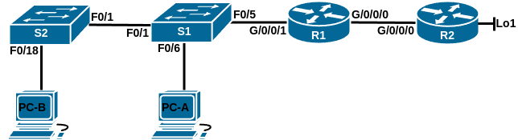
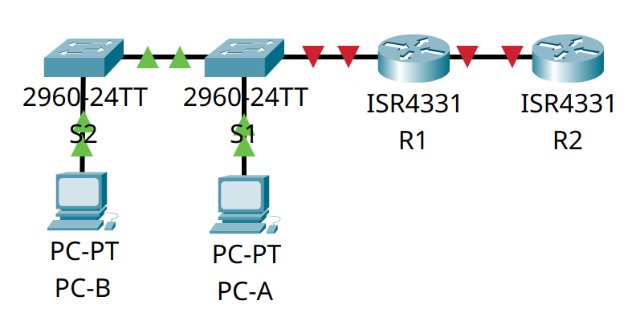
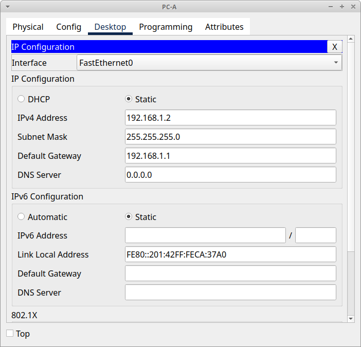

# Домашнее задание №12 «Настройка NAT для IPv4.»

## Топология



## Таблица адресации

| Устройство | Интерфейс | IP-адрес        | Маска подсети   |
| ---------- | --------- | --------------- | --------------- |
| R1         | G0/0/0    | 209.165.200.230 | 255.255.255.248 |
|            | G0/0/1    | 192.168.1.1     | 255.255.255.0   |
| R2         | G0/0/0    | 209.165.200.225 | 255.255.255.248 |
|            | Lo1       | 209.165.200.1   | 255.255.255.224 |
| S1         | VLAN 1    | 192.168.1.11    | 255.255.255.0   |
| S2         | VLAN 1    | 192.168.1.12    | 255.255.255.0   |
| PC-A       | NIC       | 192.168.1.2     | 255.255.255.0   |
| PC-B       | NIC       | 192.168.1.3     | 255.255.255.0   |

## Задачи

* [Часть 1. Создание сети и настройка основных параметров устройства.](#часть-1-создание-сети-и-настройка-основных-параметров-устройства)
* [Часть 2. Настройка и проверка NAT для IPv4.](#часть-2-настройка-и-проверка-nat-для-ipv4)
* [Часть 3. Настройка и проверка PAT для IPv4.](#часть-3-настройка-и-проверка-pat-для-ipv4)
* [Часть 4. Настройка и проверка статического NAT для IPv4.](#часть-4-настройка-и-проверка-статического-nat-для-ipv4)

## Общие сведения/сценарий

Преобразование (NAT) — это процесс, при котором сетевое устройство, например
маршрутизатор Cisco, назначает публичный адрес узлам в пределах частной сети. NAT
используют для сокращения количества публичных IP-адресов, используемых
организацией, поскольку количество доступных публичных IPv4-адресов ограничено.

Интернет-провайдер выделил компании общедоступное пространство IP-адресов
209.165.200.224/29. Эта сеть используется для обращения к каналу между
маршрутизатором ISP (**R2**) и шлюзом компании (**R1**). Первый адрес
(209.165.200.225) назначается интерфейсу g0/0/0 на **R2**, а последний адрес
(209.165.200.230) назначается интерфейсу g0/0/0 на **R1**. Остальные адреса
(209.165.200.226-209.165.200.229) будут использоваться для предоставления доступа
в Интернет хостам компании. Маршрут по умолчанию используется от **R1** до **R2**.
Подключение интернет-провайдера к Интернету смоделировано loopback-адресом на
маршрутизаторе интернет-провайдера.

В этой лабораторной работе мы будем настраивать различные типы NAT. Мы выполним
тестирование, отображение и проверку осуществления всех преобразований и
проанализируем статистику NAT/PAT для контроля процесса.

**Примечание:** маршрутизаторы, используемые в практических лабораторных работах
CCNA, - это Cisco 4221 с Cisco IOS XE Release 16.9.3 (образ universalk9). В
лабораторных работах используются коммутаторы Cisco Catalyst 2960 с Cisco IOS
версии 15.0(2) (образ lanbasek9). Можно использовать другие маршрутизаторы,
коммутаторы и версии Cisco IOS. В зависимости от модели устройства и версии Cisco
IOS доступные команды и результаты их выполнения могут отличаться от тех, которые
показаны в лабораторных работах. Правильные идентификаторы интерфейса см. в
сводной таблице по интерфейсам маршрутизаторов в конце лабораторной работы.

**Примечание:** убедитесь, что у всех маршрутизаторов и коммутаторов была
удалена начальная конфигурация. Если вы не уверены, обратитесь к инструктору.

## Часть 1. Создание сети и настройка основных параметров устройства

Для моделирования сети будем использовать ПО Cisco Packet Tracer 8.1.1. Создадим
новую конфигурацию, используя следующие ресурсы:

* 2 маршрутизатора (Cisco 4221 с универсальным образом Cisco IOS XE версии
  16.9.3 или аналогичным);
* 2 коммутатора (Cisco 2960 с операционной системой Cisco IOS 15.2(2) (образ
  lanbasek9) или аналогичная модель);
* 2 ПК (ОС Windows с программой эмуляции терминалов, например Tera Term);
* консольные кабели для настройки устройств Cisco IOS через консольные порты;
* кабели Ethernet, расположенные в соответствии с топологией.

В первой части лабораторной работы создадим топологию сети и настроим базовые
параметры для узлов ПК и коммутаторов.

### Шаг 1. Создание сети

Подключим устройства, как показано в топологии, и подсоединим необходимые кабели.



Установим адреса ПК **PC-A** и **PC-B** согласно таблице адресации.




### Шаг 2. Настройка маршрутизаторов

Настроим базовые параметры маршрутизаторов **R1** и **R2**.

#### a. Установка имени устройства

Подключимся к маршрутизатору с помощью консольного подключения, активируем
привилегированный режим и сменим имя:

```text
Router>en
Router#conf t
Enter configuration commands, one per line.  End with CNTL/Z.
Router(config)#host R1
R1(config)#
```

#### b. Отключение поиска DNS

Чтобы предотвратить попытки маршрутизатора неверно преобразовывать введённые
команды таким образом, как будто они являются именами узлов, отключим поиск DNS:

```text
R1(config)#no ip domain-lookup
R1(config)#
```

#### c. Установка пароля привилегированного режима

Назначим **class** в качестве зашифрованного пароля привилегированного режима EXEC:

```text
R1(config)#enable secret class
R1(config)#
```

#### d. Установка пароля консоли

Назначим **cisco** в качестве пароля консоли и включим вход в систему
по паролю:

```text
R1(config)#line con 0
R1(config-line)#password cisco
R1(config-line)#login
R1(config-line)#exit
R1(config)#
```

#### e. Установка пароля VTY

Назначим **cisco** в качестве пароля VTY каналов и включим вход в систему
по паролю:

```text
R1(config)#line vty 0 15
R1(config-line)#password cisco
R1(config-line)#login
R1(config-line)#exit
R1(config)#
```

#### f. Включение шифрования паролей

Зашифруем открытые пароли в файле конфигурации:

```text
R1(config)#service password-encryption
R1(config)#
```

#### g. Создание баннера

Для предупреждения пользователей о запрете несанкционированного доступа, настроим
баннерное сообщение дня (MOTD):

```text
R1(config)#banner motd # ATTENTION! Unauthorized access is strictly prohibited. #
R1(config)#
```

#### h. Настройка IP-адресов

Установим IP-адреса интерфейсов маршрутизаторов согласно таблице адресации.

Маршрутизатор **R1**:

```text
R1(config)#int g0/0/0
R1(config-if)#ip add 209.165.200.230 255.255.255.248
R1(config-if)#no shut

R1(config-if)#
%LINK-5-CHANGED: Interface GigabitEthernet0/0/0, changed state to up

R1(config-if)#exit
R1(config)#int g0/0/1
R1(config-if)#ip add 192.168.1.1 255.255.255.0
R1(config-if)#no shut

R1(config-if)#
%LINK-5-CHANGED: Interface GigabitEthernet0/0/1, changed state to up

%LINEPROTO-5-UPDOWN: Line protocol on Interface GigabitEthernet0/0/1, changed state to up

R1(config-if)#exit
R1(config)#
```

Маршрутизатор **R2**:

```text
R2(config)#int g0/0/0
R2(config-if)#ip add 209.165.200.225 255.255.255.248
R2(config-if)#no shut

R2(config-if)#
%LINK-5-CHANGED: Interface GigabitEthernet0/0/0, changed state to up

%LINEPROTO-5-UPDOWN: Line protocol on Interface GigabitEthernet0/0/0, changed state to up

R2(config-if)#exit
R2(config)#int Lo1

R2(config-if)#
%LINK-5-CHANGED: Interface Loopback1, changed state to up

%LINEPROTO-5-UPDOWN: Line protocol on Interface Loopback1, changed state to up

R2(config-if)#ip add 209.165.200.1 255.255.255.224
R2(config-if)#exit
R2(config)#
```

#### i. Настройка маршрута по умолчанию

Настроим маршрут по умолчанию от **R1** до **R2**.

```text
R1(config)#ip route 0.0.0.0 0.0.0.0 209.165.200.225
R1(config)#
```

#### j. Сохранение конфигурации

Скопируем текущую конфигурацию в файл загрузочной конфигурации.

```text
R1(config)#exit
R1#copy run start
Destination filename [startup-config]? 
Building configuration...
[OK]
R1#
```

<details>
<summary>R1# show run</summary>

```text
R1#show run
Building configuration...

Current configuration : 956 bytes
!
version 15.4
no service timestamps log datetime msec
no service timestamps debug datetime msec
service password-encryption
!
hostname R1
!
!
!
enable secret 5 $1$mERr$9cTjUIEqNGurQiFU.ZeCi1
!
!
!
!
!
!
ip cef
no ipv6 cef
!
!
!
!
!
!
!
!
!
!
no ip domain-lookup
!
!
spanning-tree mode pvst
!
!
!
!
!
!
interface GigabitEthernet0/0/0
 ip address 209.165.200.230 255.255.255.248
 duplex auto
 speed auto
!
interface GigabitEthernet0/0/1
 ip address 192.168.1.1 255.255.255.0
 duplex auto
 speed auto
!
interface GigabitEthernet0/0/2
 no ip address
 duplex auto
 speed auto
 shutdown
!
interface Vlan1
 no ip address
 shutdown
!
ip classless
ip route 0.0.0.0 0.0.0.0 209.165.200.225 
!
ip flow-export version 9
!
!
!
banner motd ^C ATTENTION! Unauthorized access is strictly prohibited. ^C
!
!
!
!
!
line con 0
 password 7 0822455D0A16
 login
!
line aux 0
!
line vty 0 4
 password 7 0822455D0A16
 login
line vty 5 15
 password 7 0822455D0A16
 login
!
!
!
end


R1#
```

</details>

<details>
<summary>R2# show run</summary>

```text
R2#show run
Building configuration...

Current configuration : 965 bytes
!
version 15.4
no service timestamps log datetime msec
no service timestamps debug datetime msec
service password-encryption
!
hostname R2
!
!
!
enable secret 5 $1$mERr$9cTjUIEqNGurQiFU.ZeCi1
!
!
!
!
!
!
ip cef
no ipv6 cef
!
!
!
!
!
!
!
!
!
!
no ip domain-lookup
!
!
spanning-tree mode pvst
!
!
!
!
!
!
interface Loopback1
 ip address 209.165.200.1 255.255.255.224
!
interface GigabitEthernet0/0/0
 ip address 209.165.200.225 255.255.255.248
 duplex auto
 speed auto
!
interface GigabitEthernet0/0/1
 no ip address
 duplex auto
 speed auto
 shutdown
!
interface GigabitEthernet0/0/2
 no ip address
 duplex auto
 speed auto
 shutdown
!
interface Vlan1
 no ip address
 shutdown
!
ip classless
!
ip flow-export version 9
!
!
!
banner motd ^C ATTENTION! Unauthorized access is strictly prohibited. ^C
!
!
!
!
!
line con 0
 password 7 0822455D0A16
 login
!
line aux 0
!
line vty 0 4
 password 7 0822455D0A16
 login
line vty 5 15
 password 7 0822455D0A16
 login
!
!
!
end


R2#
```

</details>

### Шаг 3. Настройка коммутаторов

Настроим основные параметры коммутаторов **S1** и **S2**.

#### a. Установка имени устройства

Подключимся к коммутатору с помощью консольного подключения, активируем
привилегированный режим и сменим имя:

```text
Switch>en
Switch#conf t
Enter configuration commands, one per line.  End with CNTL/Z.
Switch(config)#host S1
S1(config)#
```

#### b. Отключение поиска DNS

Чтобы предотвратить попытки коммутатора неверно преобразовывать введённые
команды таким образом, как будто они являются именами узлов, отключим поиск DNS:

```text
S1(config)#no ip domain-lookup
S1(config)#
```

#### c. Установка пароля привилегированного режима

Назначим **class** в качестве зашифрованного пароля привилегированного режима EXEC:

```text
S1(config)#enable secret class
S1(config)#
```

#### d. Установка пароля консоли

Назначим **cisco** в качестве пароля консоли и включим вход в систему
по паролю:

```text
S1(config)#line con 0
S1(config-line)#password cisco
S1(config-line)#login
S1(config-line)#exit
S1(config)#
```

#### e. Установка пароля VTY

Назначим **cisco** в качестве пароля VTY каналов и включим вход в систему
по паролю:

```text
S1(config)#line vty 0 15
S1(config-line)#password cisco
S1(config-line)#login
S1(config-line)#exit
S1(config)#
```

#### f. Включение шифрования паролей

Зашифруем открытые пароли в файле конфигурации:

```text
S1(config)#service password-encryption
S1(config)#
```

#### g. Создание баннера

Для предупреждения пользователей о запрете несанкционированного доступа, настроим
баннерное сообщение дня (MOTD):

```text
S1(config)#banner motd # ATTENTION! Unauthorized access is strictly prohibited. #
S1(config)#
```

#### h. Отключение интерфейсов

Выключим все неиспользуемые интерфейсы.

Коммутатор **S1** (сообщения о деактивации интерфейса опущены для краткости):

```text
S1(config)#int r f0/2-4
S1(config-if-range)#shut
S1(config-if-range)#exit
S1(config)#int r f0/7-24
S1(config-if-range)#shut
S1(config-if-range)#exit
S1(config)#S1(config)#int r g0/1-2
S1(config-if-range)#shut
S1(config-if-range)#exit
S1(config)#
```

Коммутатор **S2** (сообщения о деактивации интерфейса опущены для краткости):

```text
S2(config)#int r f0/2-17
S2(config-if-range)#shut
S2(config-if-range)#exit
S2(config)#int r f0/19-24
S2(config-if-range)#shut
S2(config-if-range)#exit
S2(config)#int r g0/1-2
S2(config-if-range)#shut
S2(config-if-range)#exit
S2(config)#
```

#### i. Настройка IP-адресов

Установим IP-адреса интерфейсов коммутаторов согласно таблице адресации.

Коммутатор **S1**:

```text
S1(config)#int vlan1
S1(config-if)#ip add 192.168.1.11 255.255.255.0
S1(config-if)#no shut

S1(config-if)#
%LINK-5-CHANGED: Interface Vlan1, changed state to up

%LINEPROTO-5-UPDOWN: Line protocol on Interface Vlan1, changed state to up

S1(config-if)#exit
S1(config)#ip default-gateway 192.168.1.1
S1(config)#
```

Коммутатор **S2**:

```text
S2(config)#int vlan1
S2(config-if)#ip add 192.168.1.12 255.255.255.0
S2(config-if)#no shut

S2(config-if)#
%LINK-5-CHANGED: Interface Vlan1, changed state to up

%LINEPROTO-5-UPDOWN: Line protocol on Interface Vlan1, changed state to up

S2(config-if)#exit
S2(config)#ip default-gateway 192.168.1.1
S2(config)#
```

#### j. Сохранение конфигурации

Скопируем текущую конфигурацию в файл загрузочной конфигурации.

```text
S1(config)#exit
S1#copy run start
Destination filename [startup-config]? 
Building configuration...
[OK]
S1#
```

<details>
<summary>S1# show run</summary>

```text
S1#show run
Building configuration...

Current configuration : 1572 bytes
!
version 15.0
no service timestamps log datetime msec
no service timestamps debug datetime msec
service password-encryption
!
hostname S1
!
enable secret 5 $1$mERr$9cTjUIEqNGurQiFU.ZeCi1
!
!
!
no ip domain-lookup
!
!
!
spanning-tree mode pvst
spanning-tree extend system-id
!
interface FastEthernet0/1
!
interface FastEthernet0/2
 shutdown
!
interface FastEthernet0/3
 shutdown
!
interface FastEthernet0/4
 shutdown
!
interface FastEthernet0/5
!
interface FastEthernet0/6
!
interface FastEthernet0/7
 shutdown
!
interface FastEthernet0/8
 shutdown
!
interface FastEthernet0/9
 shutdown
!
interface FastEthernet0/10
 shutdown
!
interface FastEthernet0/11
 shutdown
!
interface FastEthernet0/12
 shutdown
!
interface FastEthernet0/13
 shutdown
!
interface FastEthernet0/14
 shutdown
!
interface FastEthernet0/15
 shutdown
!
interface FastEthernet0/16
 shutdown
!
interface FastEthernet0/17
 shutdown
!
interface FastEthernet0/18
 shutdown
!
interface FastEthernet0/19
 shutdown
!
interface FastEthernet0/20
 shutdown
!
interface FastEthernet0/21
 shutdown
!
interface FastEthernet0/22
 shutdown
!
interface FastEthernet0/23
 shutdown
!
interface FastEthernet0/24
 shutdown
!
interface GigabitEthernet0/1
 shutdown
!
interface GigabitEthernet0/2
 shutdown
!
interface Vlan1
 ip address 192.168.1.11 255.255.255.0
!
ip default-gateway 192.168.1.1
!
banner motd ^C ATTENTION! Unauthorized access is strictly prohibited. ^C
!
!
!
line con 0
 password 7 0822455D0A16
 login
!
line vty 0 4
 password 7 0822455D0A16
 login
line vty 5 15
 password 7 0822455D0A16
 login
!
!
!
!
end


S1#
```

</details>

<details>
<summary>S2# show run</summary>

```text
S2#show run
Building configuration...

Current configuration : 1582 bytes
!
version 15.0
no service timestamps log datetime msec
no service timestamps debug datetime msec
service password-encryption
!
hostname S2
!
enable secret 5 $1$mERr$9cTjUIEqNGurQiFU.ZeCi1
!
!
!
no ip domain-lookup
!
!
!
spanning-tree mode pvst
spanning-tree extend system-id
!
interface FastEthernet0/1
!
interface FastEthernet0/2
 shutdown
!
interface FastEthernet0/3
 shutdown
!
interface FastEthernet0/4
 shutdown
!
interface FastEthernet0/5
 shutdown
!
interface FastEthernet0/6
 shutdown
!
interface FastEthernet0/7
 shutdown
!
interface FastEthernet0/8
 shutdown
!
interface FastEthernet0/9
 shutdown
!
interface FastEthernet0/10
 shutdown
!
interface FastEthernet0/11
 shutdown
!
interface FastEthernet0/12
 shutdown
!
interface FastEthernet0/13
 shutdown
!
interface FastEthernet0/14
 shutdown
!
interface FastEthernet0/15
 shutdown
!
interface FastEthernet0/16
 shutdown
!
interface FastEthernet0/17
 shutdown
!
interface FastEthernet0/18
!
interface FastEthernet0/19
 shutdown
!
interface FastEthernet0/20
 shutdown
!
interface FastEthernet0/21
 shutdown
!
interface FastEthernet0/22
 shutdown
!
interface FastEthernet0/23
 shutdown
!
interface FastEthernet0/24
 shutdown
!
interface GigabitEthernet0/1
 shutdown
!
interface GigabitEthernet0/2
 shutdown
!
interface Vlan1
 ip address 192.168.1.12 255.255.255.0
!
ip default-gateway 192.168.1.1
!
banner motd ^C ATTENTION! Unauthorized access is strictly prohibited. ^C
!
!
!
line con 0
 password 7 0822455D0A16
 login
!
line vty 0 4
 password 7 0822455D0A16
 login
line vty 5 15
 password 7 0822455D0A16
 login
!
!
!
!
end


S2#
```

</details>

## Часть 2. Настройка и проверка NAT для IPv4

Выполним настройку NAT для IPv4 и проверим его работу.

### Шаг 1. Настройка NAT на **R1**

Настроим NAT на **R1**, используя пул из трех адресов 209.165.200.226-209.165.200.228.

#### a. Настройка списка доступа

Настроим простой список доступа, который определит, какие хосты будут разрешены
для трансляции. В этом случае все устройства в локальной сети **R1** будут иметь
право на трансляцию.

```text
R1(config)#access-list 1 permit 192.168.1.0 0.0.0.255
R1(config)#
```

#### b. Создание пула NAT

Создадим пул NAT и укажем ему имя и диапазон используемых адресов.

```text
R1(config)#ip nat pool PUBLIC_ACCESS 209.165.200.226 209.165.200.228 netmask 255.255.255.248
R1(config)#
```

**Примечание:** параметр маски сети не является разделителем IP-адресов. Это должна
быть правильная маска подсети для назначенных адресов, даже если мы используем не
все адреса подсети в пуле.

#### c. Настройка трансляции

Настроим трансляцию, связав ACL и пул с процессом преобразования.

```text
R1(config)#ip nat inside source list 1 pool PUBLIC_ACCESS
R1(config)#
```

**Примечание:** три очень важных момента. Во-первых, слово «inside» имеет решающее
значение для работы такого рода NAT. Если мы опустим его, NAT не будет работать.
Во-вторых, номер списка — это номер ACL, настроенный на предыдущем шаге. В-третьих,
имя пула чувствительно к регистру.

#### d. Определение внутреннего интерфейса

Зададим внутренний (inside) интерфейс.

```text
R1(config)#int g0/0/1
R1(config-if)#ip nat inside
R1(config-if)#exit
R1(config)#
```

#### e. Определение внешнего интерфейса

Определим внешний (outside) интерфейс.

```text
R1(config)#int g0/0/0
R1(config-if)#ip nat outside
R1(config-if)#exit
R1(config)#
```

### Шаг 2. Проверка конфигурации

Проверим правильность настроек и работу NAT.

#### a. Эхо-запрос от PC-B к R2

С **PC-B**, запустим эхо-запрос интерфейса Lo1 (209.165.200.1) на **R2**. Если
эхо-запрос не прошёл, выполним процесс поиска и устранения неполадок (в нашем
случае потребовалось добавить шлюз по умолчанию в настройки ПК и коммутаторов
(чтобы ping шёл и с них)). На **R1** отобразим таблицу NAT с помощью команды
**show ip nat translations**.

**PC-B**:

```text
C:\>ping 209.165.200.1

Pinging 209.165.200.1 with 32 bytes of data:

Reply from 209.165.200.1: bytes=32 time<1ms TTL=254
Reply from 209.165.200.1: bytes=32 time<1ms TTL=254
Reply from 209.165.200.1: bytes=32 time=1ms TTL=254
Reply from 209.165.200.1: bytes=32 time<1ms TTL=254

Ping statistics for 209.165.200.1:
    Packets: Sent = 4, Received = 4, Lost = 0 (0% loss),
Approximate round trip times in milli-seconds:
    Minimum = 0ms, Maximum = 1ms, Average = 0ms

C:\>
```

**R1**:

```text
R1#show ip nat translations
Pro  Inside global     Inside local       Outside local      Outside global
icmp 209.165.200.227:42192.168.1.3:42     209.165.200.1:42   209.165.200.1:42
icmp 209.165.200.227:43192.168.1.3:43     209.165.200.1:43   209.165.200.1:43
icmp 209.165.200.227:44192.168.1.3:44     209.165.200.1:44   209.165.200.1:44
icmp 209.165.200.227:45192.168.1.3:45     209.165.200.1:45   209.165.200.1:45

R1#
```

**Вопрос:** во что был транслирован внутренний локальный адрес PC-B?

**Ответ:** 209.165.200.227

**Вопрос:** какой тип адреса NAT является переведённым адресом?

**Ответ:** динамический NAT

#### b. Эхо-запрос от PC-A к R2

С **PC-A**, запустим  эхо-запрос интерфейса Lo1 (209.165.200.1) на **R2**. Если
эхо-запрос не прошёл, выполним отладку. На **R1** отобразим таблицу NAT на **R1**
с помощью команды **show ip nat translations**.

**PC-A**:

```text
C:\>ping 209.165.200.1

Pinging 209.165.200.1 with 32 bytes of data:

Reply from 209.165.200.1: bytes=32 time<1ms TTL=254
Reply from 209.165.200.1: bytes=32 time=9ms TTL=254
Reply from 209.165.200.1: bytes=32 time<1ms TTL=254
Reply from 209.165.200.1: bytes=32 time<1ms TTL=254

Ping statistics for 209.165.200.1:
    Packets: Sent = 4, Received = 4, Lost = 0 (0% loss),
Approximate round trip times in milli-seconds:
    Minimum = 0ms, Maximum = 9ms, Average = 2ms

C:\>
```

**R1**:

```text
R1#show ip nat translations
Pro  Inside global     Inside local       Outside local      Outside global
icmp 209.165.200.227:46192.168.1.3:46     209.165.200.1:46   209.165.200.1:46
icmp 209.165.200.227:47192.168.1.3:47     209.165.200.1:47   209.165.200.1:47
icmp 209.165.200.227:48192.168.1.3:48     209.165.200.1:48   209.165.200.1:48
icmp 209.165.200.227:49192.168.1.3:49     209.165.200.1:49   209.165.200.1:49
icmp 209.165.200.228:13192.168.1.2:13     209.165.200.1:13   209.165.200.1:13
icmp 209.165.200.228:14192.168.1.2:14     209.165.200.1:14   209.165.200.1:14
icmp 209.165.200.228:15192.168.1.2:15     209.165.200.1:15   209.165.200.1:15
icmp 209.165.200.228:16192.168.1.2:16     209.165.200.1:16   209.165.200.1:16

R1#
```

#### c. Эхо-запрос от S1 к R2

Обратим внимание, что предыдущая трансляция для **PC-B** всё ещё находится в
таблице. Запустим из **S1** эхо-запрос интерфейса Lo1 (209.165.200.1) на **R2**.
Если эхо-запрос не прошёл, выполним отладку. На **R1** отобразим таблицу NAT на
**R1** с помощью команды **show ip nat translations**.

**S1**:

```text
S1#ping 209.165.200.1

Type escape sequence to abort.
Sending 5, 100-byte ICMP Echos to 209.165.200.1, timeout is 2 seconds:
!!!!!
Success rate is 100 percent (5/5), round-trip min/avg/max = 0/0/0 ms

S1#
```

**PC-A**:

```text
R1#show ip nat translations
Pro  Inside global     Inside local       Outside local      Outside global
icmp 209.165.200.226:17192.168.1.2:17     209.165.200.1:17   209.165.200.1:17
icmp 209.165.200.226:18192.168.1.2:18     209.165.200.1:18   209.165.200.1:18
icmp 209.165.200.226:19192.168.1.2:19     209.165.200.1:19   209.165.200.1:19
icmp 209.165.200.226:20192.168.1.2:20     209.165.200.1:20   209.165.200.1:20
icmp 209.165.200.227:26192.168.1.11:26    209.165.200.1:26   209.165.200.1:26
icmp 209.165.200.227:27192.168.1.11:27    209.165.200.1:27   209.165.200.1:27
icmp 209.165.200.227:28192.168.1.11:28    209.165.200.1:28   209.165.200.1:28
icmp 209.165.200.227:29192.168.1.11:29    209.165.200.1:29   209.165.200.1:29
icmp 209.165.200.227:30192.168.1.11:30    209.165.200.1:30   209.165.200.1:30
icmp 209.165.200.228:50192.168.1.3:50     209.165.200.1:50   209.165.200.1:50
icmp 209.165.200.228:51192.168.1.3:51     209.165.200.1:51   209.165.200.1:51
icmp 209.165.200.228:52192.168.1.3:52     209.165.200.1:52   209.165.200.1:52
icmp 209.165.200.228:53192.168.1.3:53     209.165.200.1:53   209.165.200.1:53

R1#
```

#### d. Эхо-запрос от S2 к R2

Теперь запустим пинг **R2** Lo1 из **S2**. На этот раз перевод должен завершиться
неудачей и появлением следующих сообщений (или аналогичных) на консоли **R1**:

```text
Sep 23 15:43:55.562: %IOSXE-6-PLATFORM: R0/0: cpp_cp: QFP:0.0 Thread:000 TS:00000001473688385900 %NAT-6-ADDR_ALLOC_FAILURE: Address allocation failed; pool 1 may be exhausted [2]
```

На практике же, в Cisco Packet Tracer таких сообщений не появляется, трансляции
не происходит, пинг блокируется. Также, для того, чтобы достичь такого эффекта
приходится явным образом занять все 3 адреса из пула (указав флаг -t для ping c
ПК и постоянно пингуя с **S1**).

**S2**:

```text
S2#ping 209.165.200.1

Type escape sequence to abort.
Sending 5, 100-byte ICMP Echos to 209.165.200.1, timeout is 2 seconds:
.....
Success rate is 0 percent (0/5)

S2#
```

#### e. Просмотр информации о трансляции

Это ожидаемый результат, потому что выделено только 3 адреса, и мы попытались
ping Lo1 с четырех устройств. Напомним, что NAT — это трансляция «один-в-один».
Как много выделено трансляций? Введём команду **show ip nat translations verbose**,
и мы увидим, что ответ будет 24 часа.

```text
R1# show ip nat translations verbose 
Pro Inside global Inside local Outside local Outside global
--- 209.165.200.226 192.168.1.3 --- ---
create: 09/23/19 15:35:27, use: 09/23/19 15:35:27, timeout: 23:56:42
Map-Id(In): 1
<output omitted>
```

В Cisco Packet Tracer эта команда не поддерживается. О занятости пула можно судить
по выводу команды **show ip nat statistics**:

```text
R1#show ip nat statistics 
Total translations: 140 (0 static, 140 dynamic, 140 extended)
Outside Interfaces: GigabitEthernet0/0/0
Inside Interfaces: GigabitEthernet0/0/1
Hits: 6869  Misses: 6900
Expired translations: 6725
Dynamic mappings:
-- Inside Source
access-list 1 pool PUBLIC_ACCESS refCount 140
 pool PUBLIC_ACCESS: netmask 255.255.255.248
       start 209.165.200.226 end 209.165.200.228
       type generic, total addresses 3 , allocated 3 (100%), misses 27
R1#
```

Видно, что все 3 адреса пула выделены, также видим количество сбоев трансляции
**misses 27**.

#### f. Очистка пула NAT

Учитывая, что пул ограничен тремя адресами, NAT для пула адресов недостаточно
для нашего приложения. Очистим преобразование NAT и статистику, и перейдем к PAT.

```text
R1#clear ip nat translation *
R1#
```

## Часть 3. Настройка и проверка PAT для IPv4

В части 3 настроим замену NAT на PAT в пуле адресов, а затем на PAT с помощью интерфейса.

### Шаг 1. Удаление трансляции на R1

Компоненты конфигурации преобразования адресов в основном одинаковы; что-то
(список доступа) для идентификации адресов, пригодных для перевода, дополнительно
настроенный пул адресов для их преобразования и команды, необходимые для
идентификации внутреннего и внешнего интерфейсов. Из части 1 наш список доступа
(список доступа 1) по-прежнему корректен для сетевого сценария, поэтому нет
необходимости воссоздавать его. Мы будем использовать один и тот же пул адресов,
поэтому нет необходимости воссоздавать эту конфигурацию. Кроме того, внутренний и
внешний интерфейсы не меняются. Чтобы начать работу в части 3, удалим команду,
связывающую ACL и пул вместе.

```text
R1(config)#no ip nat inside source list 1 pool PUBLIC_ACCESS
R1(config)#
```

### Шаг 2. Настройка PAT на R1

Теперь настроим преобразование PAT в пул адресов (помним, что ACL и Pool уже
настроены, так что это единственная команда, которую нам нужно изменить с NAT на
PAT).

```text
R1(config)#ip nat inside source list 1 pool PUBLIC_ACCESS overload 
R1(config)#
```

### Шаг 3. Проверка настроек

#### a. Эхо-запрос от PC-B к R2

Проверим, что PAT работает. С **PC-B**, запустим эхо-запрос интерфейса Lo1
(209.165.200.1) на **R2**. Если эхо-запрос не прошёл, выполним отладку. На **R1**
отобразим таблицу NAT на **R1** с помощью команды **show ip nat translations**.

**PC-B**:

```text
C:\>ping 209.165.200.1

Pinging 209.165.200.1 with 32 bytes of data:

Reply from 209.165.200.1: bytes=32 time<1ms TTL=254
Reply from 209.165.200.1: bytes=32 time<1ms TTL=254
Reply from 209.165.200.1: bytes=32 time=4ms TTL=254
Reply from 209.165.200.1: bytes=32 time<1ms TTL=254

Ping statistics for 209.165.200.1:
    Packets: Sent = 4, Received = 4, Lost = 0 (0% loss),
Approximate round trip times in milli-seconds:
    Minimum = 0ms, Maximum = 4ms, Average = 1ms

C:\>
```

**R1**:

```text
R1#show ip nat translations 
Pro  Inside global      Inside local       Outside local      Outside global
icmp 209.165.200.228:3836 192.168.1.3:3836   209.165.200.1:3836 209.165.200.1:3836
icmp 209.165.200.228:3837 192.168.1.3:3837   209.165.200.1:3837 209.165.200.1:3837
icmp 209.165.200.228:3838 192.168.1.3:3838   209.165.200.1:3838 209.165.200.1:3838
icmp 209.165.200.228:3839 192.168.1.3:3839   209.165.200.1:3839 209.165.200.1:3839

R1#
```

**Вопрос:** во что был транслирован внутренний локальный адрес **PC-B**?

**Ответ:** 209.165.200.228

**Вопрос:** какой тип адреса NAT является переведённым адресом?

**Ответ:** PAT

**Вопрос:** чем отличаются выходные данные команды **show ip nat translations**
из упражнения NAT?

**Ответ:** ничем, хотя возможно это из-за ограничений Cisco Packet Tracer

#### b. Эхо-запрос от PC-A к R2

С **PC-A**, запустим эхо-запрос интерфейса Lo1 (209.165.200.1) на **R2**. Если
эхо-запрос не прошёл, выполним отладку. На **R1** отобразим таблицу NAT на **R1**
с помощью команды **show ip nat translations**.

**PC-A**:

```text
C:\>ping 209.165.200.1

Pinging 209.165.200.1 with 32 bytes of data:

Reply from 209.165.200.1: bytes=32 time<1ms TTL=254
Reply from 209.165.200.1: bytes=32 time<1ms TTL=254
Reply from 209.165.200.1: bytes=32 time<1ms TTL=254
Reply from 209.165.200.1: bytes=32 time<1ms TTL=254

Ping statistics for 209.165.200.1:
    Packets: Sent = 4, Received = 4, Lost = 0 (0% loss),
Approximate round trip times in milli-seconds:
    Minimum = 0ms, Maximum = 0ms, Average = 0ms

C:\>
```

**R1**:

```text
R1#show ip nat translations 
Pro  Inside global     Inside local       Outside local      Outside global
icmp 209.165.200.228:3777192.168.1.2:3777   209.165.200.1:3777 209.165.200.1:3777
icmp 209.165.200.228:3778192.168.1.2:3778   209.165.200.1:3778 209.165.200.1:3778
icmp 209.165.200.228:3779192.168.1.2:3779   209.165.200.1:3779 209.165.200.1:3779
icmp 209.165.200.228:3780192.168.1.2:3780   209.165.200.1:3780 209.165.200.1:3780

R1#
```

Обратим внимание, что есть только одна трансляция. Отправим ping еще раз, и
быстро вернёмся к маршрутизатору и введём команду **show ip nat translations verbose**, и мы увидим, что произошло.

```text
R1# show ip nat translations verbose 
Pro Inside global Inside local Outside local Outside global
icmp 209.165.200.226:1 192.168.1.2:1 209.165.200.1:1 209.165.200.1:1 
create: 09/23/19 16:57:22, use: 09/23/19 16:57:25, timeout: 00:01:00
<output omitted>
```

Как мы можем видеть, время ожидания перевода было отменено с 24 часов до 1 минуты.

В Cisco Packet Tracer повторный пинг добавляет трансляции в таблицу:

```text
R1#show ip nat translations 
Pro  Inside global      Inside local       Outside local      Outside global
icmp 209.165.200.228:3781 192.168.1.2:3781   209.165.200.1:3781 209.165.200.1:3781
icmp 209.165.200.228:3782 192.168.1.2:3782   209.165.200.1:3782 209.165.200.1:3782
icmp 209.165.200.228:3783 192.168.1.2:3783   209.165.200.1:3783 209.165.200.1:3783
icmp 209.165.200.228:3784 192.168.1.2:3784   209.165.200.1:3784 209.165.200.1:3784
icmp 209.165.200.228:3785 192.168.1.2:3785   209.165.200.1:3785 209.165.200.1:3785
icmp 209.165.200.228:3786 192.168.1.2:3786   209.165.200.1:3786 209.165.200.1:3786
icmp 209.165.200.228:3787 192.168.1.2:3787   209.165.200.1:3787 209.165.200.1:3787
icmp 209.165.200.228:3788 192.168.1.2:3788   209.165.200.1:3788 209.165.200.1:3788

R1#
```

#### c. Эхо-запросы с нескольких устройств

Сгенерируем трафик с нескольких устройств для наблюдения PAT. На **PC-A** и
**PC-B** используем параметр -t с командой ping, чтобы отправить безостановочный
ping на интерфейс Lo1 **R2** (ping -t 209.165.200.1), затем вернёмся к **R1** и выполним команду ***show ip nat translations**:

<details>
<summary><strong>R1</strong></summary>

```text
R1#show ip nat translations 
Pro  Inside global     Inside local       Outside local      Outside global
icmp 209.165.200.228:3783192.168.1.2:3783   209.165.200.1:3783 209.165.200.1:3783
icmp 209.165.200.228:3784192.168.1.2:3784   209.165.200.1:3784 209.165.200.1:3784
icmp 209.165.200.228:3785192.168.1.2:3785   209.165.200.1:3785 209.165.200.1:3785
icmp 209.165.200.228:3786192.168.1.2:3786   209.165.200.1:3786 209.165.200.1:3786
icmp 209.165.200.228:3787192.168.1.2:3787   209.165.200.1:3787 209.165.200.1:3787
icmp 209.165.200.228:3788192.168.1.2:3788   209.165.200.1:3788 209.165.200.1:3788
icmp 209.165.200.228:3789192.168.1.2:3789   209.165.200.1:3789 209.165.200.1:3789
icmp 209.165.200.228:3790192.168.1.2:3790   209.165.200.1:3790 209.165.200.1:3790
icmp 209.165.200.228:3791192.168.1.2:3791   209.165.200.1:3791 209.165.200.1:3791
icmp 209.165.200.228:3792192.168.1.2:3792   209.165.200.1:3792 209.165.200.1:3792
icmp 209.165.200.228:3793192.168.1.2:3793   209.165.200.1:3793 209.165.200.1:3793
icmp 209.165.200.228:3794192.168.1.2:3794   209.165.200.1:3794 209.165.200.1:3794
icmp 209.165.200.228:3795192.168.1.2:3795   209.165.200.1:3795 209.165.200.1:3795
icmp 209.165.200.228:3796192.168.1.2:3796   209.165.200.1:3796 209.165.200.1:3796
icmp 209.165.200.228:3797192.168.1.2:3797   209.165.200.1:3797 209.165.200.1:3797
icmp 209.165.200.228:3798192.168.1.2:3798   209.165.200.1:3798 209.165.200.1:3798
icmp 209.165.200.228:3799192.168.1.2:3799   209.165.200.1:3799 209.165.200.1:3799
icmp 209.165.200.228:3800192.168.1.2:3800   209.165.200.1:3800 209.165.200.1:3800
icmp 209.165.200.228:3801192.168.1.2:3801   209.165.200.1:3801 209.165.200.1:3801
icmp 209.165.200.228:3840192.168.1.3:3840   209.165.200.1:3840 209.165.200.1:3840
icmp 209.165.200.228:3841192.168.1.3:3841   209.165.200.1:3841 209.165.200.1:3841
icmp 209.165.200.228:3842192.168.1.3:3842   209.165.200.1:3842 209.165.200.1:3842
icmp 209.165.200.228:3843192.168.1.3:3843   209.165.200.1:3843 209.165.200.1:3843
icmp 209.165.200.228:3844192.168.1.3:3844   209.165.200.1:3844 209.165.200.1:3844
icmp 209.165.200.228:3845192.168.1.3:3845   209.165.200.1:3845 209.165.200.1:3845
icmp 209.165.200.228:3846192.168.1.3:3846   209.165.200.1:3846 209.165.200.1:3846
icmp 209.165.200.228:3847192.168.1.3:3847   209.165.200.1:3847 209.165.200.1:3847
icmp 209.165.200.228:3848192.168.1.3:3848   209.165.200.1:3848 209.165.200.1:3848
icmp 209.165.200.228:3849192.168.1.3:3849   209.165.200.1:3849 209.165.200.1:3849
icmp 209.165.200.228:3850192.168.1.3:3850   209.165.200.1:3850 209.165.200.1:3850
icmp 209.165.200.228:3851192.168.1.3:3851   209.165.200.1:3851 209.165.200.1:3851
icmp 209.165.200.228:3852192.168.1.3:3852   209.165.200.1:3852 209.165.200.1:3852
icmp 209.165.200.228:3853192.168.1.3:3853   209.165.200.1:3853 209.165.200.1:3853
icmp 209.165.200.228:3854192.168.1.3:3854   209.165.200.1:3854 209.165.200.1:3854

R1#
```

</details>

Обратим внимание, что внутренний глобальный адрес одинаков для обоих сеансов.

**Вопрос:** как маршрутизатор отслеживает, куда идут ответы?

**Ответ:** по номеру порта (по записи в таблице трансляции).

#### d. Удаление трансляции

PAT в пул является очень эффективным решением для малых и средних организаций.
Тем не менее есть неиспользуемые адреса IPv4, задействованные в этом сценарии.
Мы перейдём к PAT с перегрузкой интерфейса, чтобы устранить эту трату IPv4
адресов. Остановим ping на **PC-A** и **PC-B** с помощью комбинации клавиш
Control-C, затем очистим трансляции и статистику:

```text
R1# clear ip nat translations * 
R1# clear ip nat statistics 
```

### Шаг 4. Удаление пула на R1

Опять же, наш список доступа (список доступа 1) по-прежнему корректен для сетевого
сценария, поэтому нет необходимости воссоздавать его. Кроме того, внутренний
внешний интерфейсы не меняются. Чтобы начать работу с PAT к интерфейсу, очистим
конфигурацию, удалив пул NAT и команду, связывающую ACL и пул вместе.

```text
R1(config)#no ip nat inside source list 1 pool PUBLIC_ACCESS overload
R1(config)#no ip nat pool PUBLIC_ACCESS
R1(config)#
```

### Шаг 5. Настройка PAT overload

Добавим команду PAT, которая вызовет перегрузку внешнего интерфейса.

```text
R1(config)#ip nat inside source list 1 interface g0/0/0 overload 
R1(config)#
```

### Шаг 6. Проверка настроек

#### a. Эхо-запрос от PC-B к R2

Проверим PAT, чтобы интерфейс работал. С **PC-B**, запустим эхо-запрос интерфейса
Lo1 (209.165.200.1) на **R2**. Если эхо-запрос не прошёл, выполним отладку. На
**R1** отобразим таблицу NAT на **R1** с помощью команды **show ip nat translations**.

**PC-B**:

```text
C:\>ping 209.165.200.1

Pinging 209.165.200.1 with 32 bytes of data:

Reply from 209.165.200.1: bytes=32 time<1ms TTL=254
Reply from 209.165.200.1: bytes=32 time<1ms TTL=254
Reply from 209.165.200.1: bytes=32 time<1ms TTL=254
Reply from 209.165.200.1: bytes=32 time<1ms TTL=254

Ping statistics for 209.165.200.1:
    Packets: Sent = 4, Received = 4, Lost = 0 (0% loss),
Approximate round trip times in milli-seconds:
    Minimum = 0ms, Maximum = 0ms, Average = 0ms

C:\>
```

**R1**:

```text
R1#show ip nat translations 
Pro  Inside global      Inside local       Outside local      Outside global
icmp 209.165.200.230:4283 192.168.1.3:4283   209.165.200.1:4283 209.165.200.1:4283
icmp 209.165.200.230:4284 192.168.1.3:4284   209.165.200.1:4284 209.165.200.1:4284
icmp 209.165.200.230:4285 192.168.1.3:4285   209.165.200.1:4285 209.165.200.1:4285
icmp 209.165.200.230:4286 192.168.1.3:4286   209.165.200.1:4286 209.165.200.1:4286

R1#
```

#### b. Эхо-запросы с нескольких устройств

Создадим трафик с нескольких устройств для наблюдения PAT. На **PC-A** и **PC-B**
используем параметр -t с командой ping для отправки безостановочного ping на
интерфейс Lo1 **R2** (ping -t 209.165.200.1). На **S1** и **S2** выполним
привилегированную команду **exec ping 209.165.200.1** повторить 2000. Затем
вернёмся к **R1** и выполним команду **show ip nat translations**.

<details>
<summary>R1#show ip nat translations</summary>

```text
R1#show ip nat translations 
Pro  Inside global     Inside local       Outside local      Outside global
icmp 209.165.200.230:111192.168.1.11:111   209.165.200.1:111  209.165.200.1:111
icmp 209.165.200.230:112192.168.1.11:112   209.165.200.1:112  209.165.200.1:112
icmp 209.165.200.230:113192.168.1.11:113   209.165.200.1:113  209.165.200.1:113
icmp 209.165.200.230:114192.168.1.11:114   209.165.200.1:114  209.165.200.1:114
icmp 209.165.200.230:115192.168.1.11:115   209.165.200.1:115  209.165.200.1:115
icmp 209.165.200.230:116192.168.1.11:116   209.165.200.1:116  209.165.200.1:116
icmp 209.165.200.230:117192.168.1.11:117   209.165.200.1:117  209.165.200.1:117
icmp 209.165.200.230:118192.168.1.11:118   209.165.200.1:118  209.165.200.1:118
icmp 209.165.200.230:119192.168.1.11:119   209.165.200.1:119  209.165.200.1:119
icmp 209.165.200.230:120192.168.1.11:120   209.165.200.1:120  209.165.200.1:120
icmp 209.165.200.230:186192.168.1.12:186   209.165.200.1:186  209.165.200.1:186
icmp 209.165.200.230:187192.168.1.12:187   209.165.200.1:187  209.165.200.1:187
icmp 209.165.200.230:188192.168.1.12:188   209.165.200.1:188  209.165.200.1:188
icmp 209.165.200.230:189192.168.1.12:189   209.165.200.1:189  209.165.200.1:189
icmp 209.165.200.230:190192.168.1.12:190   209.165.200.1:190  209.165.200.1:190
icmp 209.165.200.230:191192.168.1.12:191   209.165.200.1:191  209.165.200.1:191
icmp 209.165.200.230:192192.168.1.12:192   209.165.200.1:192  209.165.200.1:192
icmp 209.165.200.230:193192.168.1.12:193   209.165.200.1:193  209.165.200.1:193
icmp 209.165.200.230:194192.168.1.12:194   209.165.200.1:194  209.165.200.1:194
icmp 209.165.200.230:195192.168.1.12:195   209.165.200.1:195  209.165.200.1:195
icmp 209.165.200.230:4229192.168.1.2:4229   209.165.200.1:4229 209.165.200.1:4229
icmp 209.165.200.230:4230192.168.1.2:4230   209.165.200.1:4230 209.165.200.1:4230
icmp 209.165.200.230:4231192.168.1.2:4231   209.165.200.1:4231 209.165.200.1:4231
icmp 209.165.200.230:4232192.168.1.2:4232   209.165.200.1:4232 209.165.200.1:4232
icmp 209.165.200.230:4233192.168.1.2:4233   209.165.200.1:4233 209.165.200.1:4233
icmp 209.165.200.230:4234192.168.1.2:4234   209.165.200.1:4234 209.165.200.1:4234
icmp 209.165.200.230:4235192.168.1.2:4235   209.165.200.1:4235 209.165.200.1:4235
icmp 209.165.200.230:4236192.168.1.2:4236   209.165.200.1:4236 209.165.200.1:4236
icmp 209.165.200.230:4237192.168.1.2:4237   209.165.200.1:4237 209.165.200.1:4237
icmp 209.165.200.230:4238192.168.1.2:4238   209.165.200.1:4238 209.165.200.1:4238
icmp 209.165.200.230:4239192.168.1.2:4239   209.165.200.1:4239 209.165.200.1:4239
icmp 209.165.200.230:4240192.168.1.2:4240   209.165.200.1:4240 209.165.200.1:4240
icmp 209.165.200.230:4241192.168.1.2:4241   209.165.200.1:4241 209.165.200.1:4241
icmp 209.165.200.230:4242192.168.1.2:4242   209.165.200.1:4242 209.165.200.1:4242
icmp 209.165.200.230:4243192.168.1.2:4243   209.165.200.1:4243 209.165.200.1:4243
icmp 209.165.200.230:4244192.168.1.2:4244   209.165.200.1:4244 209.165.200.1:4244
icmp 209.165.200.230:4245192.168.1.2:4245   209.165.200.1:4245 209.165.200.1:4245
icmp 209.165.200.230:4246192.168.1.2:4246   209.165.200.1:4246 209.165.200.1:4246
icmp 209.165.200.230:4247192.168.1.2:4247   209.165.200.1:4247 209.165.200.1:4247
icmp 209.165.200.230:4248192.168.1.2:4248   209.165.200.1:4248 209.165.200.1:4248
icmp 209.165.200.230:4249192.168.1.2:4249   209.165.200.1:4249 209.165.200.1:4249
icmp 209.165.200.230:4250192.168.1.2:4250   209.165.200.1:4250 209.165.200.1:4250
icmp 209.165.200.230:4251192.168.1.2:4251   209.165.200.1:4251 209.165.200.1:4251
icmp 209.165.200.230:4252192.168.1.2:4252   209.165.200.1:4252 209.165.200.1:4252
icmp 209.165.200.230:4253192.168.1.2:4253   209.165.200.1:4253 209.165.200.1:4253
icmp 209.165.200.230:4254192.168.1.2:4254   209.165.200.1:4254 209.165.200.1:4254
icmp 209.165.200.230:4255192.168.1.2:4255   209.165.200.1:4255 209.165.200.1:4255
icmp 209.165.200.230:4256192.168.1.2:4256   209.165.200.1:4256 209.165.200.1:4256
icmp 209.165.200.230:4257192.168.1.2:4257   209.165.200.1:4257 209.165.200.1:4257
icmp 209.165.200.230:4258192.168.1.2:4258   209.165.200.1:4258 209.165.200.1:4258
icmp 209.165.200.230:4259192.168.1.2:4259   209.165.200.1:4259 209.165.200.1:4259
icmp 209.165.200.230:4260192.168.1.2:4260   209.165.200.1:4260 209.165.200.1:4260
icmp 209.165.200.230:4261192.168.1.2:4261   209.165.200.1:4261 209.165.200.1:4261
icmp 209.165.200.230:4262192.168.1.2:4262   209.165.200.1:4262 209.165.200.1:4262
icmp 209.165.200.230:4263192.168.1.2:4263   209.165.200.1:4263 209.165.200.1:4263
icmp 209.165.200.230:4264192.168.1.2:4264   209.165.200.1:4264 209.165.200.1:4264
icmp 209.165.200.230:4265192.168.1.2:4265   209.165.200.1:4265 209.165.200.1:4265
icmp 209.165.200.230:4266192.168.1.2:4266   209.165.200.1:4266 209.165.200.1:4266
icmp 209.165.200.230:4267192.168.1.2:4267   209.165.200.1:4267 209.165.200.1:4267
icmp 209.165.200.230:4268192.168.1.2:4268   209.165.200.1:4268 209.165.200.1:4268
icmp 209.165.200.230:4269192.168.1.2:4269   209.165.200.1:4269 209.165.200.1:4269
icmp 209.165.200.230:4270192.168.1.2:4270   209.165.200.1:4270 209.165.200.1:4270
icmp 209.165.200.230:4271192.168.1.2:4271   209.165.200.1:4271 209.165.200.1:4271
icmp 209.165.200.230:4272192.168.1.2:4272   209.165.200.1:4272 209.165.200.1:4272
icmp 209.165.200.230:4273192.168.1.2:4273   209.165.200.1:4273 209.165.200.1:4273
icmp 209.165.200.230:4274192.168.1.2:4274   209.165.200.1:4274 209.165.200.1:4274
icmp 209.165.200.230:4275192.168.1.2:4275   209.165.200.1:4275 209.165.200.1:4275
icmp 209.165.200.230:4276192.168.1.2:4276   209.165.200.1:4276 209.165.200.1:4276
icmp 209.165.200.230:4287192.168.1.3:4287   209.165.200.1:4287 209.165.200.1:4287
icmp 209.165.200.230:4288192.168.1.3:4288   209.165.200.1:4288 209.165.200.1:4288
icmp 209.165.200.230:4289192.168.1.3:4289   209.165.200.1:4289 209.165.200.1:4289
icmp 209.165.200.230:4290192.168.1.3:4290   209.165.200.1:4290 209.165.200.1:4290
icmp 209.165.200.230:4291192.168.1.3:4291   209.165.200.1:4291 209.165.200.1:4291
icmp 209.165.200.230:4292192.168.1.3:4292   209.165.200.1:4292 209.165.200.1:4292
icmp 209.165.200.230:4293192.168.1.3:4293   209.165.200.1:4293 209.165.200.1:4293
icmp 209.165.200.230:4294192.168.1.3:4294   209.165.200.1:4294 209.165.200.1:4294
icmp 209.165.200.230:4295192.168.1.3:4295   209.165.200.1:4295 209.165.200.1:4295
icmp 209.165.200.230:4296192.168.1.3:4296   209.165.200.1:4296 209.165.200.1:4296
icmp 209.165.200.230:4297192.168.1.3:4297   209.165.200.1:4297 209.165.200.1:4297
icmp 209.165.200.230:4298192.168.1.3:4298   209.165.200.1:4298 209.165.200.1:4298
icmp 209.165.200.230:4299192.168.1.3:4299   209.165.200.1:4299 209.165.200.1:4299
icmp 209.165.200.230:4300192.168.1.3:4300   209.165.200.1:4300 209.165.200.1:4300
icmp 209.165.200.230:4301192.168.1.3:4301   209.165.200.1:4301 209.165.200.1:4301
icmp 209.165.200.230:4302192.168.1.3:4302   209.165.200.1:4302 209.165.200.1:4302
icmp 209.165.200.230:4303192.168.1.3:4303   209.165.200.1:4303 209.165.200.1:4303
icmp 209.165.200.230:4304192.168.1.3:4304   209.165.200.1:4304 209.165.200.1:4304
icmp 209.165.200.230:4305192.168.1.3:4305   209.165.200.1:4305 209.165.200.1:4305
icmp 209.165.200.230:4306192.168.1.3:4306   209.165.200.1:4306 209.165.200.1:4306
icmp 209.165.200.230:4307192.168.1.3:4307   209.165.200.1:4307 209.165.200.1:4307
icmp 209.165.200.230:4308192.168.1.3:4308   209.165.200.1:4308 209.165.200.1:4308
icmp 209.165.200.230:4309192.168.1.3:4309   209.165.200.1:4309 209.165.200.1:4309
icmp 209.165.200.230:4310192.168.1.3:4310   209.165.200.1:4310 209.165.200.1:4310
icmp 209.165.200.230:4311192.168.1.3:4311   209.165.200.1:4311 209.165.200.1:4311
icmp 209.165.200.230:4312192.168.1.3:4312   209.165.200.1:4312 209.165.200.1:4312
icmp 209.165.200.230:4313192.168.1.3:4313   209.165.200.1:4313 209.165.200.1:4313
icmp 209.165.200.230:4314192.168.1.3:4314   209.165.200.1:4314 209.165.200.1:4314
icmp 209.165.200.230:4315192.168.1.3:4315   209.165.200.1:4315 209.165.200.1:4315
icmp 209.165.200.230:4316192.168.1.3:4316   209.165.200.1:4316 209.165.200.1:4316
icmp 209.165.200.230:4317192.168.1.3:4317   209.165.200.1:4317 209.165.200.1:4317
icmp 209.165.200.230:4318192.168.1.3:4318   209.165.200.1:4318 209.165.200.1:4318
icmp 209.165.200.230:4319192.168.1.3:4319   209.165.200.1:4319 209.165.200.1:4319
icmp 209.165.200.230:4320192.168.1.3:4320   209.165.200.1:4320 209.165.200.1:4320
icmp 209.165.200.230:4321192.168.1.3:4321   209.165.200.1:4321 209.165.200.1:4321
icmp 209.165.200.230:4322192.168.1.3:4322   209.165.200.1:4322 209.165.200.1:4322
icmp 209.165.200.230:4323192.168.1.3:4323   209.165.200.1:4323 209.165.200.1:4323
icmp 209.165.200.230:4324192.168.1.3:4324   209.165.200.1:4324 209.165.200.1:4324
icmp 209.165.200.230:4325192.168.1.3:4325   209.165.200.1:4325 209.165.200.1:4325
icmp 209.165.200.230:4326192.168.1.3:4326   209.165.200.1:4326 209.165.200.1:4326
icmp 209.165.200.230:4327192.168.1.3:4327   209.165.200.1:4327 209.165.200.1:4327
icmp 209.165.200.230:4328192.168.1.3:4328   209.165.200.1:4328 209.165.200.1:4328
icmp 209.165.200.230:4329192.168.1.3:4329   209.165.200.1:4329 209.165.200.1:4329
icmp 209.165.200.230:4330192.168.1.3:4330   209.165.200.1:4330 209.165.200.1:4330
icmp 209.165.200.230:4331192.168.1.3:4331   209.165.200.1:4331 209.165.200.1:4331
icmp 209.165.200.230:4332192.168.1.3:4332   209.165.200.1:4332 209.165.200.1:4332
icmp 209.165.200.230:4333192.168.1.3:4333   209.165.200.1:4333 209.165.200.1:4333
icmp 209.165.200.230:4334192.168.1.3:4334   209.165.200.1:4334 209.165.200.1:4334
icmp 209.165.200.230:4335192.168.1.3:4335   209.165.200.1:4335 209.165.200.1:4335
icmp 209.165.200.230:4336192.168.1.3:4336   209.165.200.1:4336 209.165.200.1:4336
icmp 209.165.200.230:4337192.168.1.3:4337   209.165.200.1:4337 209.165.200.1:4337
icmp 209.165.200.230:4338192.168.1.3:4338   209.165.200.1:4338 209.165.200.1:4338
icmp 209.165.200.230:4339192.168.1.3:4339   209.165.200.1:4339 209.165.200.1:4339
icmp 209.165.200.230:4340192.168.1.3:4340   209.165.200.1:4340 209.165.200.1:4340
icmp 209.165.200.230:4341192.168.1.3:4341   209.165.200.1:4341 209.165.200.1:4341
icmp 209.165.200.230:4342192.168.1.3:4342   209.165.200.1:4342 209.165.200.1:4342
icmp 209.165.200.230:4343192.168.1.3:4343   209.165.200.1:4343 209.165.200.1:4343
```

</details>

Теперь все внутренние глобальные адреса сопоставляются с IP-адресом интерфейса
g0/0/0.

Остановим все пинги. На **PC-A** и **PC-B**, используя комбинацию клавиш CTRL-C.

## Часть 4. Настройка и проверка статического NAT для IPv4

В части 4 настроим статический NAT таким образом, чтобы **PC-A** был доступен
напрямую из Интернета. **PC-A** будет доступен из **R2** по адресу 209.165.200.229.

**Примечание:** конфигурация, которую мы собираемся завершить, не соответствует
рекомендуемым практикам для шлюзов, подключённых к Интернету. Эта лаборатория
полностью опускает стандартные методы безопасности, чтобы сосредоточиться на
успешной конфигурации статического NAT. В производственной среде решающее значение
для удовлетворения этого требования будет иметь тщательная координация между
сетевой инфраструктурой и группами безопасности.

### Шаг 1. Удаление трансляции

На R1 очистим текущие трансляции и статистику.

```text
R1# clear ip nat translations * 
R1# clear ip nat statistics 
```

### Шаг 2. Настройка NAT на R1

На **R1** настроим команду NAT, необходимую для статического сопоставления
внутреннего адреса с внешним адресом.

Для этого шага настроим статическое сопоставление между 192.168.1.2 и
209.165.200.229 с помощью следующей команды:

```text
R1(config)#ip nat inside source static 192.168.1.2 209.165.200.229
R1(config)#
```

### Шаг 3. Проверка настроек

#### a. Просмотр таблицы трансляции

Проверим, что статический NAT работает. На **R1** отобразим таблицу NAT на **R1**
с помощью команды **show ip nat translations**, мы увидим статическое сопоставление.

```text
R1#show ip nat translations 
Pro  Inside global     Inside local       Outside local      Outside global
---  209.165.200.229   192.168.1.2        ---                ---

R1#
```

#### b. Эхо-запрос с R2

Таблица перевода показывает, что статическое преобразование действует. Проверим
это, запустив ping с R2 на 209.165.200.229. Пинги должны работать.

***Примечание:** возможно, вам придётся отключить брандмауэр ПК для работы pings.

```text
R2#ping 209.165.200.229

Type escape sequence to abort.
Sending 5, 100-byte ICMP Echos to 209.165.200.229, timeout is 2 seconds:
.!!!!
Success rate is 80 percent (4/5), round-trip min/avg/max = 0/0/0 ms

R2#
```

#### c. Просмотр таблицы трансляции

На **R1** отобразим таблицу NAT на **R1** с помощью команды
**show ip nat translations**, и мы увидимм статическое сопоставление и
преобразование на уровне порта для входящих pings.

```text
R1#show ip nat translations 
Pro  Inside global     Inside local       Outside local      Outside global
icmp 209.165.200.229:2 192.168.1.2:2      209.165.200.225:2  209.165.200.225:2
icmp 209.165.200.229:3 192.168.1.2:3      209.165.200.225:3  209.165.200.225:3
icmp 209.165.200.229:4 192.168.1.2:4      209.165.200.225:4  209.165.200.225:4
icmp 209.165.200.229:5 192.168.1.2:5      209.165.200.225:5  209.165.200.225:5
---  209.165.200.229   192.168.1.2        ---                ---

R1#
```

Это подтверждает, что статический NAT работает.

## Сводная таблица по интерфейсам маршрутизаторов

| Модель маршрутизатора | Интерфейс Ethernet №1           | Интерфейс Ethernet №2           | Последовательный интерфейс №1 | Последовательный интерфейс №2 |
| --------------------- | ------------------------------- | ------------------------------- | ----------------------------- | ----------------------------- |
| 1800                  | Fast Ethernet 0/0 (F0/0)        | Fast Ethernet 0/1 (F0/1)        | Serial 0/0/0 (S0/0/0)         | Serial 0/0/1 (S0/0/1)         |
| 1900                  | Gigabit Ethernet 0/0 (G0/0)     | Gigabit Ethernet 0/1 (G0/1)     | Serial 0/0/0 (S0/0/0)         | Serial 0/0/1 (S0/0/1)         |
| 2801                  | Fast Ethernet 0/0 (F0/0)        | Fast Ethernet 0/1 (F0/1)        | Serial 0/1/0 (S0/1/0)         | Serial 0/1/1 (S0/1/1)         |
| 2811                  | Fast Ethernet 0/0 (F0/0)        | Fast Ethernet 0/1 (F0/1)        | Serial 0/0/0 (S0/0/0)         | Serial 0/0/1 (S0/0/1)         |
| 2900                  | Gigabit Ethernet 0/0 (G0/0)     | Gigabit Ethernet 0/1 (G0/1)     | Serial 0/0/0 (S0/0/0)         | Serial 0/0/1 (S0/0/1)         |
| 4221                  | Gigabit Ethernet 0/0/0 (G0/0/0) | Gigabit Ethernet 0/0/1 (G0/0/1) | Serial 0/1/0 (S0/1/0)         | Serial 0/1/1 (S0/1/1)         |
| 4300                  | Gigabit Ethernet 0/0/0 (G0/0/0) | Gigabit Ethernet 0/0/1 (G0/0/1) | Serial 0/1/0 (S0/1/0)         | Serial 0/1/1 (S0/1/1)         |

**Примечание:** чтобы определить конфигурацию маршрутизатора, можно посмотреть
на интерфейсы и установить тип маршрутизатора и количество его интерфейсов.
Перечислить все комбинации конфигураций для каждого класса маршрутизаторов
невозможно. Эта таблица содержит идентификаторы для возможных комбинаций
интерфейсов Ethernet и последовательных интерфейсов на устройстве. Другие типы
интерфейсов в таблице не представлены, хотя они могут присутствовать в данном
конкретном маршрутизаторе. В качестве примера можно привести интерфейс ISDN BRI.
Строка в скобках — это официальное сокращение, которое можно использовать в
командах Cisco IOS для обозначения интерфейса.
