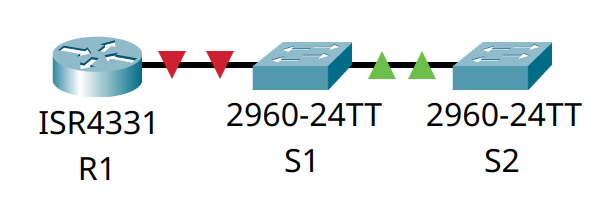

# Домашнее задание №13 «Настройка протоколов CDP, LLDP и NTP.»

## Топология


## Таблица адресации

| Устройство | Интерфейс  | IP-адрес   | Маска подсети | Шлюз по умолчанию |
| ---------- | ---------- | ---------- | ------------- | ----------------- |
| R1         | Loopback1  | 172.16.1.1 | 255.255.255.0 | —                 |
|            | G0/0/1     | 10.22.0.1  | 255.255.255.0 |                   |
| S1         | SVI VLAN 1 | 10.22.0.2  | 255.255.255.0 | 10.22.0.1         |
| S2         | SVI VLAN 1 | 10.22.0.3  | 255.255.255.0 | 10.22.0.1         |

## Задачи

* [Часть 1. Создание сети и настройка основных параметров устройства.](#часть-1-создание-сети-и-настройка-основных-параметров-устройства)
* [Часть 2. Обнаружение сетевых ресурсов с помощью протокола CDP.](#часть-2-обнаружение-сетевых-ресурсов-с-помощью-протокола-cdp)
* [Часть 3. Обнаружение сетевых ресурсов с помощью протокола LLDP.](#часть-3-обнаружение-сетевых-ресурсов-с-помощью-протокола-lldp)
* [Часть 4. Настройка и проверка NTP.](#часть-4-настройка-и-проверка-ntp)

## Общие сведения/сценарий

Протокол Cisco Discovery Protocol (CDP) — собственный протокол Cisco для
обнаружения сетевых ресурсов, функционирующий на канальном уровне. Он служит для
обмена информацией, например именами устройств и версиями ПО IOS, с другими
физически подключёнными устройствами Cisco. Протокол Link Layer Discovery
Protocol (LLDP) — это не зависящий от производителя протокол для обнаружения
сетевых ресурсов, функционирующий на канальном уровне. В основном он используется
сетевыми устройствами в локальной сети (LAN). Сетевые устройства сообщают соседям
такие данные о себе, как идентификаторы и сведения о функциональных возможностях.

Протокол сетевого времени (NTP) служит для синхронизации времени между распределёнными
серверами времени и клиентами. В качестве транспортного протокола NTP использует
протокол UDP. Все операции обмена данными по протоколу NTP выполняются по времени
в формате UTC.

Сервер NTP обычно получает данные о времени из достоверного источника, такого
как атомные часы, к которым подключён сервер. Затем он распределяет это время по
сети. Протокол NTP чрезвычайно эффективен; для синхронизации времени на двух
компьютерах с временной разницей в пределах миллисекунды требуется отправлять не
более одного пакета в минуту.

В этой лабораторной работе нам предстоит задокументировать порты, которые
используются для подключения к другим коммутаторам по протоколам CDP и LLDP.
Полученные результаты следует указать в диаграмме сетевой топологии.

**Примечание:** маршрутизаторы, используемые в практических лабораторных работах
CCNA, - это Cisco 4221 с Cisco IOS XE Release 16.9.3 (образ universalk9). В
лабораторных работах используются коммутаторы Cisco Catalyst 2960 с Cisco IOS
версии 15.0(2) (образ lanbasek9). Можно использовать другие маршрутизаторы,
коммутаторы и версии Cisco IOS. В зависимости от модели устройства и версии Cisco
IOS доступные команды и результаты их выполнения могут отличаться от тех, которые
показаны в лабораторных работах. Правильные идентификаторы интерфейса см. в
сводной таблице по интерфейсам маршрутизаторов в конце лабораторной работы.

**Примечание:** убедитесь, что у всех маршрутизаторов и коммутаторов была
удалена начальная конфигурация. Если вы не уверены, обратитесь к инструктору.

## Часть 1. Создание сети и настройка основных параметров устройства

Для моделирования сети будем использовать ПО Cisco Packet Tracer 8.1.1. Создадим
новую конфигурацию, используя следующие ресурсы:

* 1 маршрутизатор (Cisco 4221 с универсальным образом Cisco IOS XE версии
  16.9.3 или аналогичным);
* 2 коммутатора (Cisco 2960 с операционной системой Cisco IOS 15.2(2) (образ
  lanbasek9) или аналогичная модель);
* консольные кабели для настройки устройств Cisco IOS через консольные порты;
* кабели Ethernet, расположенные в соответствии с топологией.

В первой части лабораторной работы создадим топологию сети и настроим базовые
параметры для узлов ПК и коммутаторов.

### Шаг 1. Создание сети

Подключим устройства, как показано в топологии, и подсоединим необходимые кабели.



### Шаг 2. Настройка маршрутизатора

Настроим базовые параметры маршрутизатора **R1**.

#### a. Установка имени устройства

Подключимся к маршрутизатору с помощью консольного подключения, активируем
привилегированный режим и сменим имя:

```text
Router>en
Router#conf t
Enter configuration commands, one per line.  End with CNTL/Z.
Router(config)#host R1
R1(config)#
```

#### b. Отключение поиска DNS

Чтобы предотвратить попытки маршрутизатора неверно преобразовывать введённые
команды таким образом, как будто они являются именами узлов, отключим поиск DNS:

```text
R1(config)#no ip domain-lookup
R1(config)#
```

#### c. Установка пароля привилегированного режима

Назначим **class** в качестве зашифрованного пароля привилегированного режима EXEC:

```text
R1(config)#enable secret class
R1(config)#
```

#### d. Установка пароля консоли

Назначим **cisco** в качестве пароля консоли и включим вход в систему
по паролю:

```text
R1(config)#line con 0
R1(config-line)#password cisco
R1(config-line)#login
R1(config-line)#exit
R1(config)#
```

#### e. Установка пароля VTY

Назначим **cisco** в качестве пароля VTY каналов и включим вход в систему
по паролю:

```text
R1(config)#line vty 0 15
R1(config-line)#password cisco
R1(config-line)#login
R1(config-line)#exit
R1(config)#
```

#### f. Включение шифрования паролей

Зашифруем открытые пароли в файле конфигурации:

```text
R1(config)#service password-encryption
R1(config)#
```

#### g. Создание баннера

Для предупреждения пользователей о запрете несанкционированного доступа, настроим
баннерное сообщение дня (MOTD):

```text
R1(config)#banner motd # ATTENTION! Unauthorized access is strictly prohibited. #
R1(config)#
```

#### h. Настройка IP-адресов

Установим IP-адреса интерфейсов маршрутизатора согласно таблице адресации.

```text
R1(config)#int Loopback1

R1(config-if)#
%LINK-5-CHANGED: Interface Loopback1, changed state to up

%LINEPROTO-5-UPDOWN: Line protocol on Interface Loopback1, changed state to up

R1(config-if)#ip add 172.16.1.1 255.255.255.0
R1(config-if)#exit
R1(config)#int g0/0/1
R1(config-if)#ip add 10.22.0.1 255.255.255.0
R1(config-if)#no shut

R1(config-if)#
%LINK-5-CHANGED: Interface GigabitEthernet0/0/1, changed state to up

%LINEPROTO-5-UPDOWN: Line protocol on Interface GigabitEthernet0/0/1, changed state to up

R1(config-if)#exit
R1(config)#
```

#### i. Сохранение конфигурации

Скопируем текущую конфигурацию в файл загрузочной конфигурации.

```text
R1(config)#exit
R1#copy run start
Destination filename [startup-config]? 
Building configuration...
[OK]
R1#
```

<details>
<summary>R1# show run</summary>

```text
R1#show run
Building configuration...

Current configuration : 954 bytes
!
version 16.6.4
no service timestamps log datetime msec
no service timestamps debug datetime msec
service password-encryption
!
hostname R1
!
!
!
enable secret 5 $1$mERr$9cTjUIEqNGurQiFU.ZeCi1
!
!
!
!
!
!
ip cef
no ipv6 cef
!
!
!
!
!
!
!
!
!
!
no ip domain-lookup
!
!
spanning-tree mode pvst
!
!
!
!
!
!
interface Loopback1
 ip address 172.16.1.1 255.255.255.0
!
interface GigabitEthernet0/0/0
 no ip address
 duplex auto
 speed auto
 shutdown
!
interface GigabitEthernet0/0/1
 ip address 10.22.0.1 255.255.255.0
 duplex auto
 speed auto
!
interface GigabitEthernet0/0/2
 no ip address
 duplex auto
 speed auto
 shutdown
!
interface Vlan1
 no ip address
 shutdown
!
ip classless
!
ip flow-export version 9
!
!
!
banner motd ^C ATTENTION! Unauthorized access is strictly prohibited. ^C
!
!
!
!
!
line con 0
 password 7 0822455D0A16
 login
!
line aux 0
!
line vty 0 4
 password 7 0822455D0A16
 login
line vty 5 15
 password 7 0822455D0A16
 login
!
!
!
end


R1#
```

</details>

### Шаг 3. Настройка коммутаторов

Настроим основные параметры коммутаторов **S1** и **S2**.

#### a. Установка имени устройства

Подключимся к коммутатору с помощью консольного подключения, активируем
привилегированный режим и сменим имя:

```text
Switch>en
Switch#conf t
Enter configuration commands, one per line.  End with CNTL/Z.
Switch(config)#host S1
S1(config)#
```

#### b. Отключение поиска DNS

Чтобы предотвратить попытки коммутатора неверно преобразовывать введённые
команды таким образом, как будто они являются именами узлов, отключим поиск DNS:

```text
S1(config)#no ip domain-lookup
S1(config)#
```

#### c. Установка пароля привилегированного режима

Назначим **class** в качестве зашифрованного пароля привилегированного режима EXEC:

```text
S1(config)#enable secret class
S1(config)#
```

#### d. Установка пароля консоли

Назначим **cisco** в качестве пароля консоли и включим вход в систему
по паролю:

```text
S1(config)#line con 0
S1(config-line)#password cisco
S1(config-line)#login
S1(config-line)#exit
S1(config)#
```

#### e. Установка пароля VTY

Назначим **cisco** в качестве пароля VTY каналов и включим вход в систему
по паролю:

```text
S1(config)#line vty 0 15
S1(config-line)#password cisco
S1(config-line)#login
S1(config-line)#exit
S1(config)#
```

#### f. Включение шифрования паролей

Зашифруем открытые пароли в файле конфигурации:

```text
S1(config)#service password-encryption
S1(config)#
```

#### g. Создание баннера

Для предупреждения пользователей о запрете несанкционированного доступа, настроим
баннерное сообщение дня (MOTD):

```text
S1(config)#banner motd # ATTENTION! Unauthorized access is strictly prohibited. #
S1(config)#
```

#### h. Отключение интерфейсов

Выключим все неиспользуемые интерфейсы.

Коммутатор **S1** (сообщения о деактивации интерфейса опущены для краткости):

```text
S1(config)#int r f0/2-4
S1(config-if-range)#shut
S1(config-if-range)#exit
S1(config)#int r f0/6-24
S1(config-if-range)#shut
S1(config-if-range)#exit
S1(config)#int r g0/1-2
S1(config-if-range)#shut
S1(config-if-range)#exit
S1(config)#
```

Коммутатор **S2** (сообщения о деактивации интерфейса опущены для краткости):

```text
S2(config)#int r f0/2-24
S2(config-if-range)#shut
S2(config-if-range)#exit
S2(config)#int r g0/1-2
S2(config-if-range)#shut
S2(config-if-range)#exit
S2(config)#
```

#### i. Сохранение конфигурации

Скопируем текущую конфигурацию в файл загрузочной конфигурации.

```text
S1(config)#exit
S1#copy run start
Destination filename [startup-config]? 
Building configuration...
[OK]
S1#
```

<details>
<summary>S1# show run</summary>

```text
S1#show run
Building configuration...

Current configuration : 1535 bytes
!
version 15.0
no service timestamps log datetime msec
no service timestamps debug datetime msec
service password-encryption
!
hostname S1
!
enable secret 5 $1$mERr$9cTjUIEqNGurQiFU.ZeCi1
!
!
!
no ip domain-lookup
!
!
!
spanning-tree mode pvst
spanning-tree extend system-id
!
interface FastEthernet0/1
!
interface FastEthernet0/2
 shutdown
!
interface FastEthernet0/3
 shutdown
!
interface FastEthernet0/4
 shutdown
!
interface FastEthernet0/5
!
interface FastEthernet0/6
 shutdown
!
interface FastEthernet0/7
 shutdown
!
interface FastEthernet0/8
 shutdown
!
interface FastEthernet0/9
 shutdown
!
interface FastEthernet0/10
 shutdown
!
interface FastEthernet0/11
 shutdown
!
interface FastEthernet0/12
 shutdown
!
interface FastEthernet0/13
 shutdown
!
interface FastEthernet0/14
 shutdown
!
interface FastEthernet0/15
 shutdown
!
interface FastEthernet0/16
 shutdown
!
interface FastEthernet0/17
 shutdown
!
interface FastEthernet0/18
 shutdown
!
interface FastEthernet0/19
 shutdown
!
interface FastEthernet0/20
 shutdown
!
interface FastEthernet0/21
 shutdown
!
interface FastEthernet0/22
 shutdown
!
interface FastEthernet0/23
 shutdown
!
interface FastEthernet0/24
 shutdown
!
interface GigabitEthernet0/1
 shutdown
!
interface GigabitEthernet0/2
 shutdown
!
interface Vlan1
 no ip address
 shutdown
!
banner motd ^C ATTENTION! Unauthorized access is strictly prohibited. ^C
!
!
!
line con 0
 password 7 0822455D0A16
 login
!
line vty 0 4
 password 7 0822455D0A16
 login
line vty 5 15
 password 7 0822455D0A16
 login
!
!
!
!
end


S1#
```

</details>

<details>
<summary>S2# show run</summary>

```text
S2#show run
Building configuration...

Current configuration : 1545 bytes
!
version 15.0
no service timestamps log datetime msec
no service timestamps debug datetime msec
service password-encryption
!
hostname S2
!
enable secret 5 $1$mERr$9cTjUIEqNGurQiFU.ZeCi1
!
!
!
no ip domain-lookup
!
!
!
spanning-tree mode pvst
spanning-tree extend system-id
!
interface FastEthernet0/1
!
interface FastEthernet0/2
 shutdown
!
interface FastEthernet0/3
 shutdown
!
interface FastEthernet0/4
 shutdown
!
interface FastEthernet0/5
 shutdown
!
interface FastEthernet0/6
 shutdown
!
interface FastEthernet0/7
 shutdown
!
interface FastEthernet0/8
 shutdown
!
interface FastEthernet0/9
 shutdown
!
interface FastEthernet0/10
 shutdown
!
interface FastEthernet0/11
 shutdown
!
interface FastEthernet0/12
 shutdown
!
interface FastEthernet0/13
 shutdown
!
interface FastEthernet0/14
 shutdown
!
interface FastEthernet0/15
 shutdown
!
interface FastEthernet0/16
 shutdown
!
interface FastEthernet0/17
 shutdown
!
interface FastEthernet0/18
 shutdown
!
interface FastEthernet0/19
 shutdown
!
interface FastEthernet0/20
 shutdown
!
interface FastEthernet0/21
 shutdown
!
interface FastEthernet0/22
 shutdown
!
interface FastEthernet0/23
 shutdown
!
interface FastEthernet0/24
 shutdown
!
interface GigabitEthernet0/1
 shutdown
!
interface GigabitEthernet0/2
 shutdown
!
interface Vlan1
 no ip address
 shutdown
!
banner motd ^C ATTENTION! Unauthorized access is strictly prohibited. ^C
!
!
!
line con 0
 password 7 0822455D0A16
 login
!
line vty 0 4
 password 7 0822455D0A16
 login
line vty 5 15
 password 7 0822455D0A16
 login
!
!
!
!
end


S2#
```

</details>

## Часть 2. Обнаружение сетевых ресурсов с помощью протокола CDP

На устройствах Cisco протокол CDP включён по умолчанию. Воспользуемся CDP,
чтобы обнаружить порты, к которым подключены кабели.

### a. Просмотр информации CDP на R1

На **R1** используем соответствующую команду **show cdp interface**, чтобы
определить, на скольки интерфейсах включено CDP, сколько из них включено и
сколько отключено.

```text
R1#show cdp interface 
Vlan1 is administratively down, line protocol is down
  Sending CDP packets every 60 seconds
  Holdtime is 180 seconds
GigabitEthernet0/0/0 is administratively down, line protocol is down
  Sending CDP packets every 60 seconds
  Holdtime is 180 seconds
GigabitEthernet0/0/1 is up, line protocol is up
  Sending CDP packets every 60 seconds
  Holdtime is 180 seconds
GigabitEthernet0/0/2 is administratively down, line protocol is down
  Sending CDP packets every 60 seconds
  Holdtime is 180 seconds
R1#
```

**Вопрос:** сколько интерфейсов участвует в объявлениях CDP? Какие из них активны?

**Ответ:** 4 интерфейса участвуют в объявлениях, активен 1 - g0/0/1

### b. Просмотр информации CDP об S1

На **R1** используем соответствующую команду **show cdp**, чтобы определить
версию IOS, используемую на **S1**.

```text
R1#show cdp entry S1

Device ID: S1
Entry address(es): 
Platform: cisco 2960, Capabilities: Switch
Interface: GigabitEthernet0/0/1, Port ID (outgoing port): FastEthernet0/5
Holdtime: 148

Version :
Cisco IOS Software, C2960 Software (C2960-LANBASEK9-M), Version 15.0(2)SE4, RELEASE SOFTWARE (fc1)
Technical Support: http://www.cisco.com/techsupport
Copyright (c) 1986-2013 by Cisco Systems, Inc.
Compiled Wed 26-Jun-13 02:49 by mnguyen

advertisement version: 2
Duplex: full

R1#
```

**Вопрос:** какая версия IOS используется на  **S1**?

**Ответ:** IOS v. 15.0(2)SE4

### c. Просмотр информации о траффике

На **S1** используем соответствующую команду **show cdp traffic**, чтобы
определить, сколько пакетов CDP было выданных.

В Cisco Packet Tracer 8.1.1 данная команда не поддерживается, поэтому приведён
вывод из методички.

```text
S1# show cdp traffic
CDP counters : 
        Total packets output: 179, Input: 148 
        Hdr syntax: 0, Chksum error: 0, Encaps failed: 0 
        No memory: 0, Invalid packet: 0, 
        CDP version 1 advertisements output: 0, Input: 0 
        CDP version 2 advertisements output: 179, Input: 148
```

**Вопрос:** сколько пакетов имеет выход CDP с момента последнего сброса счетчика?

**Ответ:** 179

### d. Настройка SVI

Настроим SVI для VLAN 1 на **S1** и **S2**, используя IP-адреса, указанные в
таблице адресации выше. Настроим шлюз по умолчанию для каждого коммутатора на
основе таблицы адресов.

```text
S1(config)#int vlan1
S1(config-if)#ip add 10.22.0.2 255.255.255.0
S1(config-if)#no shut

S1(config-if)#
%LINK-5-CHANGED: Interface Vlan1, changed state to up

%LINEPROTO-5-UPDOWN: Line protocol on Interface Vlan1, changed state to up

S1(config-if)#exit
S1(config)#ip default-gateway 10.22.0.1
S1(config)#
```

```text
S2(config)#int vlan1
S2(config-if)#ip add 10.22.0.3 255.255.255.0
S2(config-if)#no shut

S2(config-if)#
%LINK-5-CHANGED: Interface Vlan1, changed state to up

%LINEPROTO-5-UPDOWN: Line protocol on Interface Vlan1, changed state to up

S2(config-if)#exit
S2(config)#ip default-gateway 10.22.0.1
S2(config)#
```

### e. Просмотр информации CDP об S1

На **R1** повторно выполним команду **show cdp entry S1**:

```text
R1#show cdp entry S1

Device ID: S1
Entry address(es): 
  IP address : 10.22.0.2
Platform: cisco 2960, Capabilities: Switch
Interface: GigabitEthernet0/0/1, Port ID (outgoing port): FastEthernet0/5
Holdtime: 120

Version :
Cisco IOS Software, C2960 Software (C2960-LANBASEK9-M), Version 15.0(2)SE4, RELEASE SOFTWARE (fc1)
Technical Support: http://www.cisco.com/techsupport
Copyright (c) 1986-2013 by Cisco Systems, Inc.
Compiled Wed 26-Jun-13 02:49 by mnguyen

advertisement version: 2
Duplex: full

R1#
```

**Вопрос:** какие дополнительные сведения доступны теперь?

**Ответ:** появился IP-адрес SVI **S1**.

### f. Отключение CDP

Выключим CDP глобально на всех устройствах.

```text
R1(config)#no cdp run
R1(config)#
```

## Часть 3. Обнаружение сетевых ресурсов с помощью протокола LLDP

На устройствах Cisco протокол LLDP может быть включён по умолчанию.
Воспользуемся LLDP, чтобы обнаружить порты, к которым подключены кабели.

### a. Включение LLDP

Введём соответствующую команду **lldp**, чтобы включить LLDP на всех устройствах в топологии.

```text
R1(config)#lldp run
R1(config)#
```

### b.

На S1 выполним соответствующую команду **lldp**, чтобы предоставить подробную
информацию о **S2**.

```text
S1# show lldp entry S2

Capability codes:
    (R) Router, (B) Bridge, (T) Telephone, (C) DOCSIS Cable Device
    (W) WLAN Access Point, (P) Repeater, (S) Station, (O) Other
------------------------------------------------
Local Intf: Fa0/1  
Chassis id: c025.5cd7.ef00 
Port id: Fa0/1 
Port Description: FastEthernet0/1
System Name: S2

System Description:
Cisco IOS Software, C2960 Software (C2960-LANBASEK9-M), Version 15.2(4)E8, RELEASE SOFTWARE (fc3) 
Technical Support: http://www.cisco.com/techsupport
Copyright (c) 1986-2019 by Cisco Systems, Inc.
Compiled Fri 15-Mar-19 17:28 by prod_rel_team 

Time remaining: 109 seconds 
System Capabilities: B
Enabled Capabilities: B
Management Addresses:
    IP: 10.22.0.3 
Auto Negotiation - supported, enabled
Physical media capabilities:
    100base-TX(FD)
    100base-TX(HD)
    10base-T(FD)
    10base-T(HD)
Media Attachment Unit type: 16
Vlan ID: 1


Total entries displayed: 1
```

В Cisco Packet Tracer 8.1.1 команда **show lldp entry** не поддерживается. Похожую
информацию можно получить в выводе команды **show lldp neighbors detail**:

```text
S1#show lldp neighbors detail 
------------------------------------------------
Chassis id: 0002.1708.E401
Port id: Fa0/1
Port Description: FastEthernet0/1
System Name: S2
System Description:
Cisco IOS Software, C2960 Software (C2960-LANBASEK9-M), Version 15.0(2)SE4, RELEASE SOFTWARE (fc1)
Technical Support: http://www.cisco.com/techsupport
Copyright (c) 1986-2013 by Cisco Systems, Inc.
Compiled Wed 26-Jun-13 02:49 by mnguyen
Time remaining: 90 seconds
System Capabilities: B
Enabled Capabilities: B
Management Addresses - not advertised
Auto Negotiation - supported, enabled
Physical media capabilities:
    100baseT(FD)
    100baseT(HD)
    1000baseT(HD)
Media Attachment Unit type: 10
Vlan ID: 1
```

**Вопрос:** что такое chassis ID  для коммутатора S2?

**Ответ:** для коммутатора **S2** поле Chassis id содержит MAC-адрес интерфейса f0/1.

```text
S2#show interfaces  f0/1
FastEthernet0/1 is up, line protocol is up (connected)
  Hardware is Lance, address is 0002.1708.e401 (bia 0002.1708.e401)
 BW 100000 Kbit, DLY 1000 usec,
     reliability 255/255, txload 1/255, rxload 1/255
  Encapsulation ARPA, loopback not set
  Keepalive set (10 sec)
  Full-duplex, 100Mb/s
  input flow-control is off, output flow-control is off
  ARP type: ARPA, ARP Timeout 04:00:00
  Last input 00:00:08, output 00:00:05, output hang never
  Last clearing of "show interface" counters never
  Input queue: 0/75/0/0 (size/max/drops/flushes); Total output drops: 0
  Queueing strategy: fifo
  Output queue :0/40 (size/max)
  5 minute input rate 0 bits/sec, 0 packets/sec
  5 minute output rate 0 bits/sec, 0 packets/sec
     956 packets input, 193351 bytes, 0 no buffer
     Received 956 broadcasts, 0 runts, 0 giants, 0 throttles
     0 input errors, 0 CRC, 0 frame, 0 overrun, 0 ignored, 0 abort
     0 watchdog, 0 multicast, 0 pause input
     0 input packets with dribble condition detected
     2357 packets output, 263570 bytes, 0 underruns
     0 output errors, 0 collisions, 10 interface resets
     0 babbles, 0 late collision, 0 deferred
     0 lost carrier, 0 no carrier
     0 output buffer failures, 0 output buffers swapped out

S2#
```

### c. Просмотр информации о топологии

Соединимся через консоль на всех устройствах и используем команды LLDP,
необходимые для отображения топологии физической сети только из выходных данных
команды show.

```text
R1#show lldp neighbors 
Capability codes:
    (R) Router, (B) Bridge, (T) Telephone, (C) DOCSIS Cable Device
    (W) WLAN Access Point, (P) Repeater, (S) Station, (O) Other
Device ID           Local Intf     Hold-time  Capability      Port ID
S1                  Gig0/0/1       120        B               Fa0/5

Total entries displayed: 1
R1#
```

```text
S1#show lldp neighbors
Capability codes:
    (R) Router, (B) Bridge, (T) Telephone, (C) DOCSIS Cable Device
    (W) WLAN Access Point, (P) Repeater, (S) Station, (O) Other
Device ID           Local Intf     Hold-time  Capability      Port ID
S2                  Fa0/1          120        B               Fa0/1
R1                  Fa0/5          120        R               Gig0/0/1

Total entries displayed: 2
S1#
```

```text
S2#show lldp neighbors
Capability codes:
    (R) Router, (B) Bridge, (T) Telephone, (C) DOCSIS Cable Device
    (W) WLAN Access Point, (P) Repeater, (S) Station, (O) Other
Device ID           Local Intf     Hold-time  Capability      Port ID
S1                  Fa0/1          120        B               Fa0/1

Total entries displayed: 1
S2#
```

## Часть 4. Настройка и проверка NTP

В части 4 настроим маршрутизатор **R1** в качестве сервера NTP, а коммутаторы в
качестве клиентов NTP маршрутизатора **R1**. Необходимо будет выполнить
синхронизацию времени для Syslog и отладочных функций. Если время не
синхронизировано, сложно определить, какое сетевое событие стало причиной данного
сообщения.

### Шаг 1. Просмотр текущего времени

Введём команду **show clock** для отображения текущего времени на **R1**. Запишем
отображаемые сведения о текущем времени в следующей таблице.

| Дата       | Время      | Часовой пояс | Источник времени  |
| ---------- | ---------- | ------------ | ----------------- |
| Mar 1 1993 | 4:22:23.42 | UTC          | hardware calendar |

```text
R1#show clock detail 
*4:22:23.42 UTC Mon Mar 1 1993
Time source is hardware calendar
R1#
```

### Шаг 2. Установка времени

С помощью команды **clock set** установим время на маршрутизаторе R1. Введённое
время должно быть в формате UTC.

```text
R1#clock set 22:25 09 Feb 2025
R1#
```

### Шаг 3. Настройка сервера NTP

Настроим **R1** в качестве хозяина NTP с уровнем слоя 4.

```text
R1(config)#ntp master 4
R1(config)#
```

### Шаг 4. Настройка клиентов NTP

#### a. Просмотр времени

Выполните соответствующую команду на **S1** и **S2**, чтобы просмотреть
настроенное время. Запишем текущее время, в следующей таблице.

| Дата       | Время       | Часовой пояс |
| ---------- | ----------- | ------------ |
| Mar 1 1993 | 4:51:47.732 | UTC          |
| Mar 1 1993 | 4:51:47.225 | UTC          |

```text
S1#show clock
*4:51:47.732 UTC Mon Mar 1 1993
S1#
```

```text
S2#show clock
*4:51:47.225 UTC Mon Mar 1 1993
S2#
```

#### b. Настройка клиентов

Настроим **S1** и **S2** в качестве клиентов NTP. Используем соответствующие
команды NTP для получения времени от интерфейса G0/0/1 **R1**, а также для
периодического обновления календаря или аппаратных часов коммутатора.

```text
S1(config)#ntp server 10.22.0.1
S1(config)#
```

```text
S2(config)#ntp server 10.22.0.1
S2(config)#
```

### Шаг 5. Проверка настроек NTP

#### a. Проверка синхронизации

Используем соответствующую команду **show**, чтобы убедиться, что **S1** и **S2**
синхронизированы с **R1**.

**Примечание:** синхронизация метки времени на коммутаторе **S2** с меткой
времени на коммутаторе **S1** может занять несколько минут.

```text
S1#show ntp status
Clock is synchronized, stratum 5, reference is 10.22.0.1
nominal freq is 250.0000 Hz, actual freq is 249.9990 Hz, precision is 2**24
reference time is FFFFFFFFEB2981CC.00000083 (22:59:24.131 UTC Sun Feb 9 2025)
clock offset is 0.00 msec, root delay is 0.00  msec
root dispersion is 10.00 msec, peer dispersion is 0.12 msec.
loopfilter state is 'CTRL' (Normal Controlled Loop), drift is - 0.000001193 s/s system poll interval is 4, last update was 4 sec ago.
S1#
```

```text
S2#show ntp status
Clock is synchronized, stratum 5, reference is 10.22.0.1
nominal freq is 250.0000 Hz, actual freq is 249.9990 Hz, precision is 2**24
reference time is FFFFFFFFEB29824E.00000220 (23:1:34.544 UTC Sun Feb 9 2025)
clock offset is 0.00 msec, root delay is 0.00  msec
root dispersion is 10.05 msec, peer dispersion is 0.12 msec.
loopfilter state is 'CTRL' (Normal Controlled Loop), drift is - 0.000001193 s/s system poll interval is 5, last update was 7 sec ago.
S2#
```

#### b. Просмотр времени

Выполним соответствующую команду на **S1** и **S2**, чтобы просмотреть
настроенное время и сравнить ранее записанное время.

```text
S1#show clock
23:3:3.352 UTC Sun Feb 9 2025
S1#
```

```text
S2#show clock
23:3:4.607 UTC Sun Feb 9 2025
S2#
```

## Вопрос для повторения

**Вопрос:** для каких интерфейсов в пределах сети не следует использовать
протоколы обнаружения сетевых ресурсов? Поясните ответ.

**Ответ:** стоит отключать протоколы обнаружения сетевых ресурсов на интерфейсах
в сторонние сети (которые мы не контролируем, например сеть провайдера) - в целях
безопасности (чтобы не раскрывать информацию о топологии нашей сети, IP-адресах,
версиях ОС, моделях "железа" и т.д.).

## Сводная таблица по интерфейсам маршрутизаторов

| Модель маршрутизатора | Интерфейс Ethernet №1           | Интерфейс Ethernet №2           | Последовательный интерфейс №1 | Последовательный интерфейс №2 |
| --------------------- | ------------------------------- | ------------------------------- | ----------------------------- | ----------------------------- |
| 1800                  | Fast Ethernet 0/0 (F0/0)        | Fast Ethernet 0/1 (F0/1)        | Serial 0/0/0 (S0/0/0)         | Serial 0/0/1 (S0/0/1)         |
| 1900                  | Gigabit Ethernet 0/0 (G0/0)     | Gigabit Ethernet 0/1 (G0/1)     | Serial 0/0/0 (S0/0/0)         | Serial 0/0/1 (S0/0/1)         |
| 2801                  | Fast Ethernet 0/0 (F0/0)        | Fast Ethernet 0/1 (F0/1)        | Serial 0/1/0 (S0/1/0)         | Serial 0/1/1 (S0/1/1)         |
| 2811                  | Fast Ethernet 0/0 (F0/0)        | Fast Ethernet 0/1 (F0/1)        | Serial 0/0/0 (S0/0/0)         | Serial 0/0/1 (S0/0/1)         |
| 2900                  | Gigabit Ethernet 0/0 (G0/0)     | Gigabit Ethernet 0/1 (G0/1)     | Serial 0/0/0 (S0/0/0)         | Serial 0/0/1 (S0/0/1)         |
| 4221                  | Gigabit Ethernet 0/0/0 (G0/0/0) | Gigabit Ethernet 0/0/1 (G0/0/1) | Serial 0/1/0 (S0/1/0)         | Serial 0/1/1 (S0/1/1)         |
| 4300                  | Gigabit Ethernet 0/0/0 (G0/0/0) | Gigabit Ethernet 0/0/1 (G0/0/1) | Serial 0/1/0 (S0/1/0)         | Serial 0/1/1 (S0/1/1)         |

**Примечание:** чтобы определить конфигурацию маршрутизатора, можно посмотреть
на интерфейсы и установить тип маршрутизатора и количество его интерфейсов.
Перечислить все комбинации конфигураций для каждого класса маршрутизаторов
невозможно. Эта таблица содержит идентификаторы для возможных комбинаций
интерфейсов Ethernet и последовательных интерфейсов на устройстве. Другие типы
интерфейсов в таблице не представлены, хотя они могут присутствовать в данном
конкретном маршрутизаторе. В качестве примера можно привести интерфейс ISDN BRI.
Строка в скобках — это официальное сокращение, которое можно использовать в
командах Cisco IOS для обозначения интерфейса.
